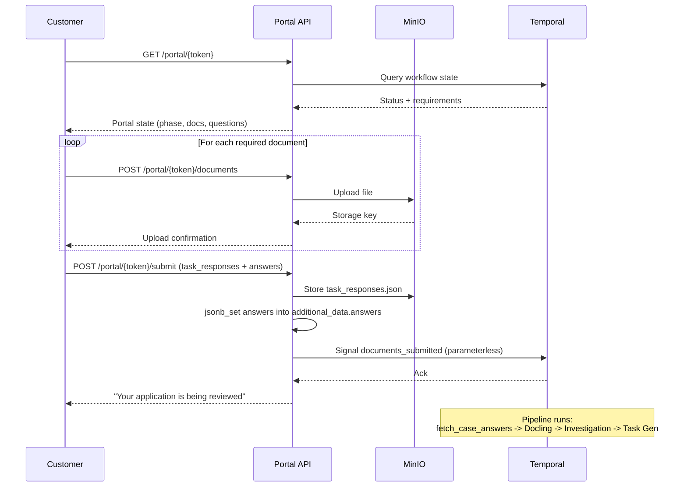

# Customer Portal API

Customer-facing endpoints accessed via branded portal URLs. These endpoints are authenticated by the `portal_token` embedded in the URL path -- no API key or session cookie is required.

Each compliance case generates a unique portal URL of the form:

```
https://portal.example.com/portal/{portal_token}
```

The portal token is a cryptographically random string (e.g., `pt_1a2b3c4d5e6f7g8h`) that serves as both the URL identifier and the authentication credential.

## Endpoints Summary

| Method | Path | Purpose |
|---|---|---|
| `GET` | `/api/portal/{token}` | Get portal state |
| `POST` | `/api/portal/{token}/documents` | Upload a document |
| `POST` | `/api/portal/{token}/submit` | Submit documents and responses |

---

## Get Portal State

```
GET /api/portal/{token}
```

Returns the current state of the customer portal, including required documents, questions, follow-up tasks, and upload status. This is the primary endpoint that drives the portal UI.

The response adapts based on the workflow phase:

| Phase | Description |
|---|---|
| `initial_collection` | First document collection (no follow-up tasks) |
| `follow_up` | Officer requested additional information |
| `under_review` | Documents are being processed or awaiting officer decision |
| `terminal` | Case is approved, rejected, or failed |

**Response** `200`

```json
{
  "case_id": "case_a1b2c3d4e5f6",
  "status": "AWAITING_DOCUMENTS",
  "phase": "initial_collection",
  "company_name": "Acme Trading BVBA",
  "brand": {
    "name": "Trust Relay",
    "primary_color": "#2563eb",
    "logo_url": "/logo.svg"
  },
  "document_requirements": [
    {
      "id": "certificate_of_incorporation",
      "name": "Certificate of Incorporation",
      "description": "Official registration document from company registry",
      "required": true,
      "accepted_formats": ["pdf", "docx", "png", "jpg"],
      "uploaded": false,
      "uploaded_file": null
    }
  ],
  "questions": [
    {
      "id": "business_description",
      "text": "Describe your primary business activities",
      "type": "text",
      "options": null,
      "required": true,
      "answer": null
    }
  ],
  "follow_up_tasks": [],
  "follow_up_reason": null,
  "iteration": 1
}
```

**Key behaviors:**

- **Auto-retrievable documents are filtered out.** For Belgian companies (`country=BE`), documents like `certificate_of_incorporation` and `ubo_declaration` are marked as auto-retrievable and will not appear in the requirements list.
- **Follow-up tasks are sanitized.** Internal fields like `justification` (containing investigation reasoning) are stripped before being sent to the customer. Document request descriptions are replaced with neutral, customer-friendly messages.
- **Upload status is tracked per requirement.** The `uploaded` boolean and `uploaded_file` object reflect real-time MinIO state for the current iteration.

**Error** `404`: Invalid or expired portal token.

---

## Upload Document

```
POST /api/portal/{token}/documents
```

Uploads a single document file for a specific requirement. Files are stored in MinIO under a structured path:

```
{case_id}/iteration-{n}/req_{requirement_id}/{filename}
```

**Request**: `multipart/form-data`

| Field | Type | Required | Description |
|---|---|---|---|
| `requirement_id` | string | Yes | The document requirement ID (e.g., `certificate_of_incorporation`) or follow-up task ID (e.g., `followup_addr_proof`) |
| `file` | file | Yes | The document file |

**Constraints:**

- Maximum file size: **20 MB**
- Accepted formats depend on the requirement:
  - Standard requirements: as defined in the template (typically PDF, DOCX, PNG, JPG)
  - Follow-up uploads (`followup_*` prefix): PDF, DOCX, PNG, JPG

**Response** `201`

```json
{
  "document_id": "doc_x1y2z3a4b5c6",
  "filename": "certificate_of_incorporation.pdf",
  "requirement_id": "certificate_of_incorporation",
  "minio_key": "case_abc/iteration-1/req_certificate_of_incorporation/certificate_of_incorporation.pdf",
  "file_size": 245760,
  "uploaded_at": "2026-02-24T10:35:00Z"
}
```

**Errors:**

| Code | Condition |
|---|---|
| `400` | Empty file |
| `413` | File exceeds 20 MB |
| `422` | File MIME type not accepted for the requirement |
| `404` | Invalid portal token |

:::info Iteration Targeting
The upload always targets the **next** iteration (current workflow iteration + 1). This is because the workflow increments the iteration counter after receiving the `documents_submitted` signal, so uploads must be stored in the upcoming iteration's folder.
:::

---

## Submit Documents

```
POST /api/portal/{token}/submit
```

Signals the Temporal workflow that the customer has finished uploading documents. This triggers the document processing pipeline (Docling conversion, OSINT investigation, task generation).

**Request Body** (optional)

```json
{
  "task_responses": {
    "followup_addr_confirm": "Yes, the registered address is correct as of January 2026.",
    "followup_explain_discrepancy": "The previous address was our warehouse location."
  },
  "answers": {
    "date_of_birth": "1985-04-12",
    "nationality": "BE",
    "national_register_number": "85041212345",
    "iban": "BE68539007547034"
  }
}
```

| Field | Type | Required | Description |
|---|---|---|---|
| `task_responses` | object | No | Key-value map of follow-up task IDs to customer responses. Stored in MinIO as `task_responses.json` for audit trail. |
| `answers` | object | No | Key-value map of question IDs to customer answers. Used for KYC field validation (NRN, date of birth, nationality, IBAN). |

**Answer persistence**: The backend merges submitted answers into the case's `additional_data.answers` column using `jsonb_set`. This is a merge operation — existing answers are preserved and new values are added or overridden per key. After the `signal_documents_submitted` signal is sent to the Temporal workflow, the `fetch_case_answers` activity reads the updated answers from PostgreSQL, making them available to the KYC investigation pipeline.

:::info KYC Answer Flow
For KYC cases (`template_id = "kyc_natural_person"`), answers provided here are the primary input for field validation (Belgian NRN mod97 check, Dutch BSN 11-proof, IBAN ISO 13616) and screening (date of birth, nationality for sanctions/PEP lookup). The signal itself remains parameterless for Temporal determinism — answers travel through the database, not the signal payload.
:::

**Response** `200`

```json
{
  "status": "DOCUMENTS_RECEIVED",
  "message": "Documents submitted successfully. Your application is now being reviewed."
}
```

**Error** `400`: Failed to signal the Temporal workflow (e.g., workflow already terminated).

## Sequence Diagram

The following diagram shows the typical portal interaction flow:


