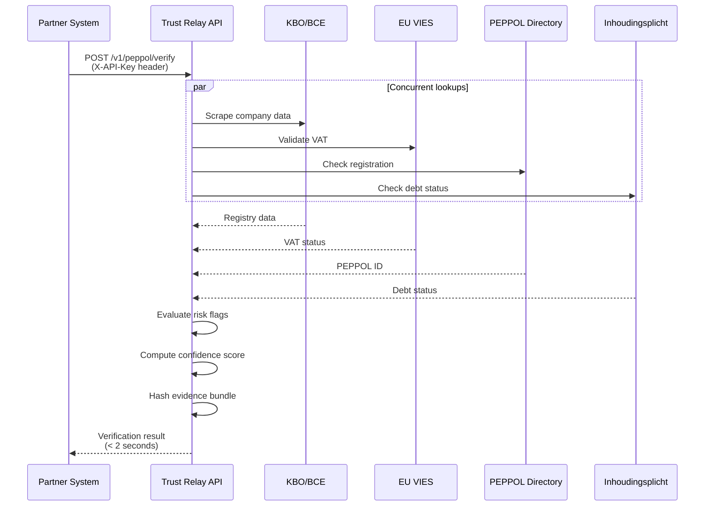

# PEPPOL and External APIs

These endpoints are designed for external partner integration. They use API key authentication (separate from the case management and portal auth models) and follow a versioned URL scheme.

## Authentication

All PEPPOL endpoints require an `X-API-Key` header:

```bash
curl -H "X-API-Key: your-api-key" \
     -H "Content-Type: application/json" \
     https://api.example.com/v1/peppol/verify
```

API keys are configured server-side and mapped to a `requestor_id` that is logged with every verification for audit purposes.

## Endpoints Summary

| Method | Path | Auth | Purpose |
|---|---|---|---|
| `POST` | `/v1/peppol/verify` | API key | Run PEPPOL enterprise verification |
| `GET` | `/v1/peppol/evidence/{verification_id}` | API key | Retrieve evidence bundle |
| `GET` | `/v1/peppol/case-verification/{workflow_id}` | None | Get case-linked verification (dashboard) |
| `GET` | `/api/config/features` | None | Feature flags |

---

## PEPPOL Verify

```
POST /v1/peppol/verify
```

Runs a comprehensive identity verification for a Belgian enterprise against four authoritative sources concurrently:

1. **KBO/BCE** -- Company registry (status, name, address, directors)
2. **EU VIES** -- VAT validation
3. **PEPPOL Directory** -- e-invoicing registration
4. **Inhoudingsplicht** -- Tax/social debt status

The entire pipeline is deterministic -- no LLM involvement. All data points are sourced from official registries and cited with evidence hashes.

### Synchronous Mode (default)

Returns the full verification result in the response body. Target response time: under 2 seconds.

### Webhook Mode

If `callback_url` is provided, returns `202 Accepted` immediately and delivers the result via HTTP POST to the callback URL. Retries up to 3 times with exponential backoff on delivery failure.

**Request Body**

```json
{
  "enterprise_number": "0456789012",
  "requestor_id": "psp-acme-corp",
  "callback_url": null,
  "workflow_id": null
}
```

| Field | Type | Required | Description |
|---|---|---|---|
| `enterprise_number` | string | No | 10-digit Belgian enterprise number (starting with 0 or 1). At least one of `enterprise_number` or `vat_number` is required. |
| `vat_number` | string | No | Belgian VAT number in format `BE` + 10 digits (e.g., `BE0456789012`). |
| `requestor_id` | string | Yes | Identifier of the requesting party (for audit trail). |
| `callback_url` | string | No | If provided, switches to webhook delivery mode (returns 202). URL must not target private/internal addresses (SSRF protection). |
| `workflow_id` | string | No | If provided, links the verification to a compliance case and enriches the case's company profile. |

**Validation rules:**

- At least one of `enterprise_number` or `vat_number` must be provided
- `enterprise_number` must be 10 digits starting with 0 or 1
- `vat_number` must match `BE` + 10 digits
- If both are provided, they must be consistent (`vat_number` = `BE` + `enterprise_number`)

**Response** `200` (synchronous mode)

```json
{
  "verification_id": "pv_abc123def456",
  "timestamp": "2026-02-24T10:30:00Z",
  "input": {
    "enterprise_number": "0456789012",
    "vat_number": "BE0456789012"
  },
  "result": {
    "status": "PASS",
    "confidence": 0.95,
    "risk_flags": []
  },
  "checks": {
    "kbo_registry": {
      "status": "active",
      "legal_name": "Acme Trading BVBA",
      "legal_form": "Besloten vennootschap met beperkte aansprakelijkheid",
      "registered_address": {
        "street": "Rue de la Loi 1",
        "postal_code": "1000",
        "city": "Bruxelles",
        "country": "BE"
      },
      "start_date": "2015-03-15",
      "bankruptcy": false,
      "activities": [
        { "code": "47.11", "description": "Retail sale in non-specialised stores" }
      ],
      "directors": ["Jan Peeters", "Marie Dubois"],
      "source": "KBO/BCE Public Search",
      "evidence_hash": "sha256:a1b2c3..."
    },
    "vies_validation": {
      "valid": true,
      "name": "ACME TRADING",
      "address": "RUE DE LA LOI 1, 1000 BRUXELLES",
      "source": "EU VIES",
      "evidence_hash": "sha256:d4e5f6..."
    },
    "entity_status": {
      "active": true,
      "bankruptcy": false,
      "dissolution": false,
      "source": "KBO/BCE status flags"
    },
    "peppol_directory": {
      "registered": true,
      "peppol_id": "0208:0456789012",
      "document_types": ["urn:oasis:names:specification:ubl:schema:xsd:Invoice-2"],
      "source": "Peppol Directory"
    },
    "name_consistency": {
      "kbo_name": "Acme Trading BVBA",
      "vies_name": "ACME TRADING",
      "match_score": 0.89,
      "flag": null
    },
    "inhoudingsplicht": {
      "debt_free_social": true,
      "debt_free_tax": true,
      "source": "checkinhoudingsplicht.be"
    }
  },
  "eui_coverage": {
    "legal_identifier": "VERIFIED",
    "legal_name": "VERIFIED",
    "legal_address": "VERIFIED",
    "peppol_identifiers": "VERIFIED",
    "send_receive_capability": "VERIFIED",
    "contact_information": "NOT_IN_SCOPE",
    "proof_of_ownership": "NOT_IN_SCOPE",
    "intermediary_info": "NOT_IN_SCOPE"
  },
  "evidence_bundle_hash": "sha256:...",
  "valid_until": "2026-03-24T10:30:00Z"
}
```

**Response** `202` (webhook mode)

```json
{
  "status": "accepted",
  "message": "Result will be delivered via webhook"
}
```

### Verification Statuses

| Status | Meaning |
|---|---|
| `PASS` | All checks passed, no risk flags |
| `FLAG` | Checks passed but risk flags were raised (e.g., recent incorporation) |
| `FAIL` | Critical issues detected (e.g., bankruptcy, VAT invalid, debt detected) |

### Risk Flag Types

| Flag | Severity | Description |
|---|---|---|
| `ENTITY_INACTIVE` | FAIL | Enterprise is no longer active in KBO |
| `BANKRUPTCY_DETECTED` | FAIL | Bankruptcy proceedings in KBO |
| `VAT_INVALID` | FAIL | VIES reports VAT number as invalid |
| `NAME_MISMATCH` | FLAG | KBO and VIES names differ significantly |
| `ADDRESS_MISMATCH` | FLAG | KBO and VIES addresses differ significantly |
| `NO_PEPPOL_REGISTRATION` | FLAG | Not found in PEPPOL Directory |
| `RECENT_INCORPORATION` | FLAG | Company incorporated less than 1 year ago |
| `DISSOLUTION_PENDING` | FLAG | Dissolution proceedings underway |
| `SOCIAL_DEBT_DETECTED` | FAIL | Social security debt detected (inhoudingsplicht) |
| `TAX_DEBT_DETECTED` | FAIL | Tax debt detected (inhoudingsplicht) |

**Errors:**

| Code | Condition |
|---|---|
| `400` | Invalid identifiers or callback URL |
| `422` | Validation error (missing required fields) |
| `429` | Rate limit exceeded |
| `503` | Upstream source (KBO, VIES, etc.) unavailable |

---

## Get Evidence Bundle

```
GET /v1/peppol/evidence/{verification_id}
```

Retrieves the evidence bundle for a completed verification. Available in JSON or PDF format.

**Query Parameters**

| Parameter | Type | Default | Description |
|---|---|---|---|
| `format` | string | `json` | `json` or `pdf` |

**Response** `200` (JSON format)

Returns the raw evidence data from MinIO, including all source responses and hashes.

**Response** `200` (PDF format)

Returns a PDF document (`application/pdf`) with a formatted verification report suitable for compliance file retention.

---

## Get Case Verification

```
GET /v1/peppol/case-verification/{workflow_id}
```

Retrieves the latest PEPPOL verification result linked to a specific compliance case. This endpoint is used by the officer dashboard and does not require API key authentication.

**Response** `200`

Same shape as the PEPPOL Verify response (verification_id, input, result, checks, eui_coverage).

**Response** `200` (empty): Returns `null` if no PEPPOL verification exists for this case.

---

## Feature Flags

```
GET /api/config/features
```

Returns the current feature flag configuration. Used by the frontend to conditionally render features.

**Response** `200`

```json
{
  "peppol_enabled": true,
  "belgian_mock_mode": false,
  "brightdata_mock_mode": true,
  "northdata_scrape_enabled": true
}
```

:::info
This endpoint requires no authentication and is intended for frontend feature gating. Do not expose sensitive configuration through this endpoint.
:::

---

## Integration Guide

### Typical PEPPOL Integration Flow



### Webhook Integration

For systems that prefer asynchronous processing:

1. Send `POST /v1/peppol/verify` with a `callback_url` field
2. Receive `202 Accepted` immediately
3. Trust Relay runs the verification in the background
4. Result is POST'd to your `callback_url` as JSON
5. If delivery fails, retries up to 3 times with exponential backoff (2s, 4s, 8s)

The callback payload has the same shape as the synchronous 200 response.

:::warning SSRF Protection
The `callback_url` is validated to prevent Server-Side Request Forgery. URLs targeting private IP ranges, loopback addresses, and link-local addresses are rejected.
:::
