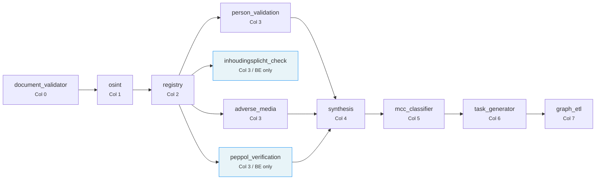
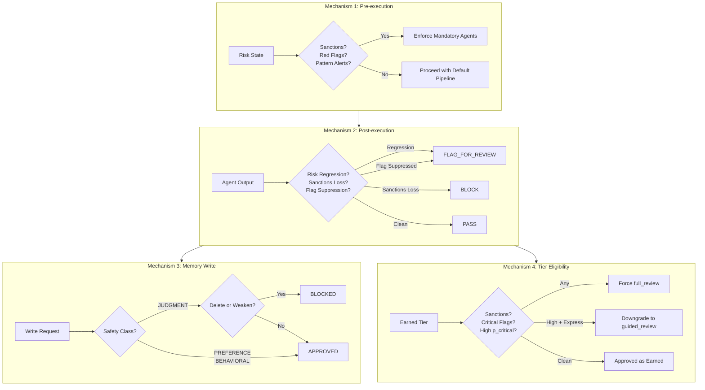

# Agentic OS Foundation (Pillar 3.5)

The Agentic OS is Trust Relay's control plane for governing, observing, and optimizing AI agent behavior. It answers four fundamental questions that every regulated AI system must be able to answer at audit time:

1. **Which agents exist, and what can they do?** -- Agent Registry
2. **What external tools did they invoke, and what happened?** -- Tool Audit Layer
3. **Did any agent suppress a risk signal or weaken a safety invariant?** -- Governance Engine
4. **What did the system learn from past investigations?** -- Episodic Memory

These components operate independently but reinforce each other. The Tool Audit Layer feeds cost data to the EVOI engine. The Governance Engine consumes risk state produced by the pipeline agents. The Episodic Memory stores outcomes that inform future investigation depth. Together, they form the infrastructure layer that makes Trust Relay auditable under the EU AI Act.

---

## Agent Registry

The Agent Registry operates at two levels: a **pipeline topology** that defines the DAG of agents executed during each compliance investigation, and a **manifest registry** that declares formal capabilities for each agent.

### Pipeline Topology (11 Agents)

The investigation pipeline is defined in `agent_progress_service.py` as a directed acyclic graph (DAG) with 8 columns representing execution phases. Each agent declares its dependencies, and the orchestrator respects these constraints during execution.



The full pipeline agent definitions:

| Agent | Display Name | Column | Depends On | Country Filter |
|-------|-------------|--------|------------|----------------|
| `document_validator` | Document Validator | 0 | -- | -- |
| `osint` | OSINT Investigation | 1 | `document_validator` | -- |
| `registry` | Company Registry | 2 | `osint` | -- |
| `peppol_verification` | PEPPOL Verification | 3 | `registry` | BE only |
| `inhoudingsplicht_check` | Inhoudingsplicht Check | 3 | `registry` | BE only |
| `person_validation` | Director Verification | 3 | `registry` | -- |
| `adverse_media` | Compliance Screening | 3 | `registry` | -- |
| `synthesis` | Risk Assessment | 4 | `person_validation`, `adverse_media`, `peppol_verification` | -- |
| `mcc_classifier` | MCC Classifier | 5 | `synthesis` | -- |
| `task_generator` | Task Generator | 6 | `mcc_classifier` | -- |
| `graph_etl` | Knowledge Graph | 7 | `task_generator` | -- |

Each agent also carries an `icon` identifier (Lucide icon name) and a human-readable `description`, both used by the frontend to render the live pipeline visualization.

### Pipeline Lifecycle

When a compliance investigation begins, the orchestrator calls `init_pipeline()`, which creates one `AgentExecution` row per applicable agent in the database:

```python
async def init_pipeline(case_id: str, iteration: int, country: str | None = None) -> None:
    for agent in PIPELINE_AGENTS:
        agent_country = agent.get("country")
        if agent_country and (country is None or agent_country != country):
            continue  # Skip agents not applicable to this country
        # Upsert with on_conflict_do_update to handle re-runs
        stmt = pg_insert(AgentExecution).values(
            case_id=case_id, iteration=iteration,
            agent_name=agent["agent_name"],
            display_name=agent["display_name"], status="pending",
        )
```

Country-filtered agents (`peppol_verification`, `inhoudingsplicht_check`) are only initialized when the case's country matches. A Belgian case gets all 11 agents; a German case gets 9.

As each agent executes, it calls `update_status()` with one of five statuses:

- **`pending`** -- Initialized, waiting for dependencies
- **`running`** -- Currently executing (sets `started_at`)
- **`success`** -- Completed successfully (sets `completed_at`, computes `duration_ms`)
- **`failed`** -- Encountered an error (stores `error_message`)
- **`reused`** -- Results from a previous iteration were reused (OSINT cache)

The pipeline-level status is computed deterministically from individual agent statuses:

```python
def compute_pipeline_status(statuses: list[str]) -> str:
    if all(s in ("success", "reused", "skipped") for s in statuses):
        return "complete"
    if any(s == "failed" for s in statuses):
        return "failed"
    if any(s == "running" for s in statuses):
        return "running"
    if any(s == "pending" for s in statuses):
        return "pending"
    return "idle"
```

### Agent Manifests (14 Agents)

Beyond the pipeline topology, 14 agents are formally registered in the Agent Registry (`agent_manifests.py`) with structured capability declarations. Each manifest is an `AgentManifest` Pydantic model:

```python
class AgentManifest(BaseModel):
    name: str                          # Unique agent identifier
    version: str                       # Semantic version
    description: str                   # Human-readable purpose
    agent_type: AgentType              # INVESTIGATION | CLASSIFICATION | SYNTHESIS | PORTAL | SCAN
    jurisdiction: list[str]            # Country codes or ["*"] for universal
    risk_domains: list[str]            # Which risk areas this agent covers
    required_tools: list[str]          # External tools this agent needs
    input_schema: str                  # Python path to input model
    output_schema: str                 # Python path to output model
    estimated_cost_tokens: int         # Expected token consumption
    estimated_cost_api_eur: float      # Expected API cost per invocation
    average_latency_seconds: float     # Expected execution time
    information_gain_domains: list[str] # Domains for EVOI matching
    can_run_in_parallel: bool          # Whether parallel execution is safe
    mock_mode_flag: str | None         # Feature flag for mock mode
```

The `information_gain_domains` field is the key link to the EVOI engine. When the EVOI engine evaluates whether an additional investigation step is worth its cost, it matches the step's risk domains against available agent capabilities to estimate expected information gain.

The registry supports three query patterns:

| Method | Purpose |
|--------|---------|
| `get_agents_for_jurisdiction(country_code)` | All agents covering a country or declaring universal (`*`) jurisdiction |
| `get_agents_for_domain(risk_domain)` | All agents whose information gain domains include a specific risk area |
| `get_investigation_team(country_code, risk_domains)` | Intersection of jurisdiction and domain -- the core query for assembling case-specific agent teams |

The 14 registered agents:

| Agent | Type | Jurisdiction | Key Risk Domains | Required Tools |
|-------|------|-------------|------------------|----------------|
| `registry_agent` | Investigation | Universal | identity, ownership, corporate_structure | northdata:lookup_company, northdata:lookup_person |
| `belgian_agent` | Investigation | BE | identity, ownership, financial_health, regulatory | kbo:search, gazette:search, nbb:financials |
| `person_validation_agent` | Investigation | Universal | identity, pep | brightdata:linkedin_search |
| `adverse_media_agent` | Investigation | Universal | sanctions, pep, adverse_media | tavily:search |
| `synthesis_agent` | Synthesis | Universal | identity, ownership, sanctions, financial_health | -- |
| `document_validator` | Classification | Universal | document_integrity | -- |
| `mcc_classifier` | Classification | Universal | business_activity | -- |
| `task_generator` | Synthesis | Universal | -- | -- |
| `dashboard_agent` | Portal | Universal | -- | -- |
| `dashboard_stats_agent` | Portal | Universal | -- | -- |
| `memory_admin_agent` | Portal | Universal | -- | -- |
| `scan_agent` | Scan | Universal | identity, sanctions | northdata:lookup_company |
| `sanctions_resolver_agent` | Investigation | Universal | sanctions | tavily:search |
| `scan_synthesis_agent` | Synthesis | Universal | -- | -- |

**Source files:** `app/services/agent_progress_service.py`, `app/services/agent_registry.py`, `app/services/agent_manifests.py`, `app/models/agent_manifest.py`

---

## Tool Audit Layer

Every external tool invocation in Trust Relay -- API calls, LLM inferences, web scrapes, database lookups -- is logged through the `@audited_tool` decorator. This provides the automatic logging required by the EU AI Act without coupling audit concerns to business logic.

### Context Variables

The audit layer uses Python's `contextvars` module to propagate case context through deeply nested call stacks without parameter passing:

```python
_case_id_var: ContextVar[str | None] = ContextVar("tool_audit_case_id", default=None)
_agent_name_var: ContextVar[str | None] = ContextVar("tool_audit_agent_name", default=None)
_iteration_var: ContextVar[int | None] = ContextVar("tool_audit_iteration", default=None)
```

At the start of each Temporal activity, the context is set once:

```python
set_tool_audit_context(case_id="case-123", agent_name="registry_agent", iteration=1)
```

Every `@audited_tool`-decorated function called within that activity automatically inherits the context. No parameters need to be threaded through intermediate layers.

### The @audited_tool Decorator

The decorator wraps async functions and captures a structured invocation record:

```python
@audited_tool(tool_name="kbo:search", cost_category="api")
async def search_kbo(enterprise_number: str) -> KBOResult:
    ...
```

Each invocation record contains:

| Field | Description |
|-------|-------------|
| `tool_name` | Canonical identifier (e.g., `"kbo:search"`, `"openai:gpt-4o"`, `"tavily:search"`) |
| `cost_category` | One of `"api"`, `"llm"`, `"scrape"`, `"db"` |
| `case_id` | From context variable |
| `agent_name` | From context variable |
| `iteration` | From context variable |
| `duration_ms` | Measured via monotonic clock (immune to system clock adjustments) |
| `success` | Boolean: did the function return without raising? |
| `input_hash` | SHA-256 of `str(kwargs)`, truncated to 16 characters |
| `output_hash` | SHA-256 of `str(result)`, truncated to 16 characters |
| `error_type` | Exception class name on failure (e.g., `"TimeoutError"`, `"HTTPStatusError"`) |
| `cost_eur` | Optional: actual monetary cost of this invocation |
| `tokens_used` | Optional: LLM token consumption |
| `tenant_id` | Multi-tenant isolation |

**PII protection by design:** Only SHA-256 hashes of inputs and outputs are stored, never the raw data. This satisfies data minimization requirements (GDPR Art. 25) while preserving the ability to detect whether the same inputs produced different outputs (reproducibility auditing).

### Guard-and-Swallow Pattern

The decorator follows the guard-and-swallow pattern throughout: if audit logging fails for any reason (database unavailable, serialization error, constraint violation), the failure is silently logged at DEBUG level and the decorated function continues unaffected. Audit infrastructure must never break business operations.

```python
try:
    await _log_invocation(tool_name, cost_category, ctx, duration_ms, True, ...)
except Exception:
    pass  # Guard-and-swallow: audit failures are non-critical
```

This pattern is applied consistently in three places:
1. Input hash computation
2. Output hash computation
3. Database persistence

### Feature Flag

The entire audit layer is controlled by `settings.tool_audit_enabled`. When disabled, the decorator becomes a transparent passthrough with zero overhead:

```python
if not settings.tool_audit_enabled:
    return await func(*args, **kwargs)
```

### Query Interface (EVOI Integration)

The `ToolAuditService` class provides a query interface that the EVOI engine uses to calibrate investigation cost estimates with real data:

```python
class ToolAuditService:
    async def get_actual_step_cost(self, agent_name: str) -> dict[str, float] | None:
        """Rolling 30-day average cost from actual tool invocations."""
        # Returns: {"avg_api_cost": 0.023, "avg_tokens": 8500, "avg_latency_ms": 12340}
```

This closes the feedback loop: estimated costs in agent manifests are initially used by EVOI, but as real invocation data accumulates, the system switches to empirical cost data from the last 30 days.

A second method, `get_invocations_for_case(case_id)`, returns the full tool invocation timeline for a specific case, used by the case detail UI and audit export.

### Storage Schema

Invocations are persisted to the `tool_invocations` table with tenant-level isolation via Row-Level Security:

```sql
CREATE TABLE tool_invocations (
    id            SERIAL PRIMARY KEY,
    case_id       VARCHAR,
    agent_name    VARCHAR,
    iteration     INTEGER,
    tool_name     VARCHAR NOT NULL,
    cost_category VARCHAR NOT NULL,
    started_at    TIMESTAMP DEFAULT NOW(),
    duration_ms   INTEGER,
    success       BOOLEAN NOT NULL,
    error_type    VARCHAR,
    input_hash    VARCHAR(16),
    output_hash   VARCHAR(16),
    cost_eur      NUMERIC,
    tokens_used   INTEGER,
    tenant_id     UUID NOT NULL,
    created_at    TIMESTAMP DEFAULT NOW()
);
```

**Source file:** `app/services/tool_audit_service.py`

---

## Governance Engine

The Governance Engine is Trust Relay's deterministic safety layer. It uses **no LLM inference** -- every decision is pure computation with deterministic rules. This is a deliberate architectural choice: the safety layer that governs AI agents must itself be fully predictable and auditable.

The engine implements four mechanisms, each addressing a different phase of the agent lifecycle.



### Mechanism 1: Pre-execution Check

```python
def pre_execution_check(self, check: PreExecutionCheck) -> PreExecutionResult
```

Pre-execution checks always approve (they never block an investigation from starting). Their purpose is to **enforce mandatory agents** based on the current risk state of the case.

**Input model (`PreExecutionCheck`):**

| Field | Type | Purpose |
|-------|------|---------|
| `case_id` | `str` | Case identifier |
| `agent_name` | `str` | Agent being evaluated |
| `iteration` | `int` | Current investigation iteration |
| `active_red_flags` | `list[str]` | Currently active red flag descriptions |
| `active_pattern_alerts` | `list[str]` | Cross-case pattern alerts |
| `prior_sanctions_hits` | `int` | Number of prior sanctions matches |
| `mandatory_agents` | `list[str]` | Already-mandated agents from prior checks |

**Enforcement rules (additive -- each rule can only add agents, never remove them):**

1. **Sanctions history** (`prior_sanctions_hits > 0`): Forces `adverse_media_agent` and `sanctions_resolver_agent`. Rationale: any entity with a sanctions history must be continuously screened.

2. **High-severity red flags** (any flag contains "require_edd", "critical", or "high"): Forces full pipeline -- `registry_agent`, `person_validation_agent`, `adverse_media_agent`, `synthesis_agent`. Rationale: enhanced due diligence requires all available intelligence sources.

3. **Pattern alerts** (any alert contains "high" or "critical"): Forces `adverse_media_agent` and `person_validation_agent`. Rationale: cross-case patterns flagged at HIGH+ severity indicate potential network-level risk.

**Output model (`PreExecutionResult`):**

| Field | Type | Purpose |
|-------|------|---------|
| `approved` | `bool` | Always `True` |
| `mandatory_agents_enforced` | `list[str]` | Complete list of agents that must run |
| `governance_event_id` | `str` | UUID for audit trail correlation |

### Mechanism 2: Post-execution Check

```python
def post_execution_check(self, check: PostExecutionCheck) -> PostExecutionResult
```

Post-execution checks validate that agent outputs have not suppressed risk signals. This is the core safety invariant: **the system can ADD scrutiny but NEVER suppress risk signals.**

**Three validation rules:**

**Rule 1 -- Risk Score Regression:**

If the current risk score dropped below the prior risk score minus a configurable tolerance band (`governance_risk_tolerance_band`), the check returns `FLAG_FOR_REVIEW`. Small fluctuations within the tolerance band are expected; significant drops require human review.

```python
if current_risk_score < prior_risk_score - settings.governance_risk_tolerance_band:
    action = GovernanceAction.FLAG_FOR_REVIEW
```

**Rule 2 -- Sanctions Signal Loss (ZERO TOLERANCE):**

If the current number of sanctions hits is lower than the prior count, the check returns `BLOCK`. This is the strictest rule in the system. Sanctions matches can only increase or stay the same; they can never decrease without explicit human override. A decrease would indicate that the AI attempted to clear a sanctions match, which is never permitted.

```python
if current_sanctions_hits < prior_sanctions_hits:
    action = GovernanceAction.BLOCK
```

**Rule 3 -- Red Flag Suppression:**

If any red flags from the prior state have disappeared in the current state without an explicit officer override, the check returns `FLAG_FOR_REVIEW`. Red flags represent investigative findings that require human disposition.

```python
missing_flags = [f for f in prior_red_flags if f not in current_red_flags]
if missing_flags:
    action = GovernanceAction.FLAG_FOR_REVIEW
```

**Action precedence:** `BLOCK` > `FLAG_FOR_REVIEW` > `PASS`. If multiple rules trigger, the most restrictive action wins.

### Mechanism 3: Memory Write Check

```python
def memory_write_check(self, check: MemoryWriteCheck) -> MemoryWriteResult
```

Memory write checks protect the integrity of officer decisions stored in episodic memory. Signals are classified into three safety classes, each with different governance rules.

**JUDGMENT class** (officer decisions, risk assessments, mandatory check lists):

The strictest protections apply. Three operations are validated:

| Operation | Validation | Result if Violated |
|-----------|-----------|-------------------|
| `delete` | Always blocked | `"JUDGMENT-class rules cannot be deleted -- only superseded by stricter rules"` |
| `update` with fewer `mandatory_checks` | Compared by list length | `"Cannot weaken JUDGMENT rule: fewer mandatory checks"` |
| `update` with lower `risk_threshold` | Numeric comparison | `"Cannot weaken JUDGMENT rule: risk threshold lowered from X to Y"` |

The design principle is one-directional: JUDGMENT signals can be made stricter but never weaker. An officer who sets a high-risk threshold for a particular entity type creates a floor that no AI agent or subsequent officer action can lower without creating a new, stricter rule.

**PREFERENCE class** (UI preferences, display settings): Always approved.

**BEHAVIORAL class** (usage patterns, workflow preferences): Always approved.

**Input model (`MemoryWriteCheck`):**

| Field | Type | Purpose |
|-------|------|---------|
| `officer_id` | `str` | Officer performing the write |
| `memory_block` | `str` | Target memory block identifier |
| `signal_category` | `str` | Category of the signal |
| `safety_class` | `str` | `"JUDGMENT"`, `"PREFERENCE"`, or `"BEHAVIORAL"` |
| `operation` | `str` | `"create"`, `"update"`, or `"delete"` |
| `current_value` | `dict` or `None` | Existing value (for update/delete) |
| `proposed_value` | `dict` | New value being written |

### Mechanism 4: Tier Eligibility Check

```python
def check_tier_eligibility(self, check: TierCheck) -> TierCheckResult
```

The tier eligibility check determines whether a case's earned automation tier (from the Supervised Autonomy system) should be overridden based on current risk signals. This is the bridge between Pillar 4 (Supervised Autonomy) and the governance safety net.

**Four override rules (first match wins):**

| Priority | Condition | Result |
|----------|-----------|--------|
| 1 | `sanctions_hits > 0` | Force `full_review` |
| 2 | Any red flag with severity `"critical"` | Force `full_review` |
| 3 | `p_critical > 0.15` | Force `full_review` |
| 4 | Any red flag with severity `"high"` AND earned tier is `express_approval` | Downgrade to `guided_review` |

If no rule matches, the earned tier is approved as-is. This means the Governance Engine acts as a safety net: it respects the Supervised Autonomy system's tier assignment except when concrete risk signals demand higher scrutiny.

### Governance Actions

The `GovernanceAction` enum defines three possible outcomes:

| Action | Meaning | Effect |
|--------|---------|--------|
| `PASS` | No governance concerns | Processing continues normally |
| `FLAG_FOR_REVIEW` | Potential concern detected | Case is flagged for officer attention; processing may continue |
| `BLOCK` | Critical safety violation | Processing is halted; requires officer intervention |

### Audit Trail

Every governance check -- regardless of outcome -- is persisted to the `governance_events` table:

```sql
CREATE TABLE governance_events (
    id            SERIAL PRIMARY KEY,
    case_id       VARCHAR,
    event_type    VARCHAR NOT NULL,   -- 'pre_execution', 'post_execution', 'memory_write', 'tier_override'
    mechanism     VARCHAR NOT NULL,   -- 'pre', 'post', 'memory', 'sanctions_check', etc.
    agent_name    VARCHAR,
    check_input   JSONB,              -- Full input serialized as JSON
    check_result  JSONB,              -- Full result serialized as JSON
    approved      BOOLEAN,
    action        VARCHAR,            -- 'pass', 'flag_for_review', 'block'
    violations    JSONB,              -- Array of GovernanceViolation objects
    tenant_id     UUID NOT NULL,
    created_at    TIMESTAMP DEFAULT NOW()
);
```

The audit trail uses the guard-and-swallow pattern: if database persistence fails, the governance check itself still returns its result. The check logic is never blocked by infrastructure failures.

Event persistence is handled asynchronously via `loop.create_task()` to avoid blocking the synchronous governance check methods.

**Source files:** `app/services/governance_engine.py`, `app/models/governance.py`

---

## Episodic Memory

The Episodic Memory Service converts completed compliance investigations into structured `InvestigationEpisode` records. These records capture everything about an investigation: the input data, which agents ran, what they found, the confidence scores, the officer's decision, and the elapsed time.

Episodes are stored in Letta archival memory (a self-hosted vector database) and retrieved by the EVOI engine when evaluating new cases. The retrieval is semantic: when evaluating a Belgian manufacturing company, the system retrieves past episodes involving similar entities to compute Bayesian priors for the BeliefState.

The service builds episodes by gathering data from multiple sources:

- Case metadata and status from PostgreSQL
- Investigation results and confidence scores
- Red flag evaluations and tool invocations from the audit trail
- Officer decision and reasoning

Each episode generates an `embedding_text` optimized for vector similarity search, enabling the EVOI engine to find relevant precedents across thousands of past investigations.

The service is gated by two feature flags: `episodic_memory_enabled` and `letta_enabled`. When either is disabled, all public methods return `None` or empty lists, ensuring callers never need conditional logic.

**Source file:** `app/services/episodic_memory_service.py`

---

## EU AI Act Compliance Mapping

Each Agentic OS component directly addresses specific requirements of the EU AI Act (Regulation 2024/1689). Trust Relay is classified as a high-risk AI system under Annex III (creditworthiness assessment and risk evaluation in financial services).

| Component | EU AI Act Article | How It Satisfies the Requirement |
|-----------|------------------|----------------------------------|
| Tool Audit (`@audited_tool`) | **Art. 12 -- Automatic Logging** | Every external tool invocation is logged with SHA-256 input/output hashes, monotonic timestamps, duration, success/failure status, and cost data. Logs are immutable and tenant-isolated. |
| Agent Manifests | **Art. 11 -- Technical Documentation** | Formal capability declarations including version, jurisdiction, risk domains, required tools, expected costs, and information gain domains. Version-controlled in the codebase. |
| Governance Engine (Pre-execution) | **Art. 14 -- Human Oversight** | Mandatory agent enforcement ensures that risk-relevant agents cannot be skipped when sanctions history, red flags, or pattern alerts are present. The system structurally prevents under-investigation. |
| Governance Engine (Post-execution) | **Art. 15 -- Accuracy & Robustness** | Risk regression monitoring, sanctions signal loss prevention, and red flag suppression detection ensure that AI outputs do not degrade the system's risk assessment accuracy over time. |
| Memory Write Guards | **Art. 14 -- Human Oversight** | JUDGMENT-class signals (officer decisions, risk thresholds, mandatory check lists) are structurally protected. AI agents cannot weaken officer decisions; they can only add scrutiny. |
| Tier Override | **Art. 14 -- Human Oversight** | The Governance Engine forces human review when sanctions hits, critical red flags, or high critical probability are detected, regardless of the automation tier assignment. |
| Governance Event Log | **Art. 12 -- Automatic Logging** | Complete audit trail of all governance decisions with full JSON serialization of inputs and outputs, enabling post-hoc reconstruction of every safety decision. |
| PII Hash Protection | **Art. 25 -- Data Protection by Design** (via GDPR) | Tool audit captures only SHA-256 hashes of inputs/outputs, never raw data. Satisfies data minimization while preserving auditability. |
| Episodic Memory | **Art. 9 -- Risk Management System** | Systematic learning from past investigations enables continuous improvement of risk assessment accuracy, as required by the risk management system obligation. |

### Structural Safety Guarantee

The Governance Engine enforces a fundamental asymmetry: **the system can ADD scrutiny but NEVER suppress risk signals.** This is not a configuration option or a policy preference -- it is a structural constraint enforced by deterministic code paths:

- Pre-execution can only add agents to the mandatory list, never remove them
- Post-execution blocks when sanctions counts decrease
- Memory writes block when JUDGMENT rules would be weakened
- Tier overrides can only increase scrutiny level, never decrease it

This asymmetry ensures that even if an AI agent produces an incorrect risk assessment, the error always results in more investigation, never less. In the context of compliance, a false positive (over-investigation) is recoverable; a false negative (missed risk signal) may violate regulatory obligations.

---

## Configuration

All Agentic OS components are controlled by feature flags in `app/config.py`:

| Flag | Default | Purpose |
|------|---------|---------|
| `governance_enabled` | `True` | Enable/disable governance checks |
| `tool_audit_enabled` | `True` | Enable/disable tool invocation logging |
| `episodic_memory_enabled` | `True` | Enable/disable investigation episode storage |
| `governance_risk_tolerance_band` | `5` | Allowed risk score fluctuation before flagging |
| `governance_block_on_sanctions_loss` | `True` | Whether sanctions loss triggers BLOCK (vs. FLAG_FOR_REVIEW) |
| `governance_block_on_judgment_weakening` | `True` | Whether JUDGMENT weakening triggers BLOCK |

### Database Migrations

| Migration | Table | Purpose |
|-----------|-------|---------|
| `009_tool_invocations` | `tool_invocations` | Tool audit trail |
| `010_governance_checks` | `governance_events` | Governance decision log |
| `011_evoi_decisions` | `evoi_decisions` | EVOI optimization records |
