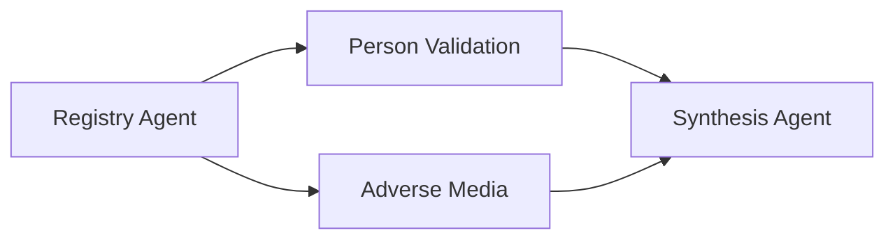

# AI Agent Architecture

The AI agent layer is one of the strongest parts of the system. All 13 agents follow a consistent pattern built on PydanticAI, producing structured Pydantic model outputs that integrate cleanly with the rest of the codebase.

## Agent Inventory

| # | Agent | File | Purpose | Model | Tools |
|---|-------|------|---------|-------|-------|
| 1 | Registry Agent | `registry_agent.py` | Corporate registry lookup via NorthData | GPT-5.2 | NorthData MCP (Stdio) |
| 2 | Belgian Agent | `belgian_agent.py` | Belgian 4-source investigation | GPT-5.2 | None (tools via services) |
| 3 | Belgian Scraping Agent | `belgian_scraping_agent.py` | Gazette web scraping | GPT-4.1-mini | crawl4ai |
| 4 | Person Validation Agent | `person_validation_agent.py` | LinkedIn profile validation | GPT-5.2 | BrightData MCP (SSE) |
| 5 | Adverse Media Agent | `adverse_media_agent.py` | Sanctions, fraud, PEP screening | GPT-5.2 | Tavily MCP (StreamableHTTP) |
| 6 | Synthesis Agent | `synthesis_agent.py` | Risk assessment synthesis | GPT-5.2 | None (reasoning only) |
| 7 | Document Validator | `document_validator.py` | Document-to-requirement validation | GPT-5.2 | None |
| 8 | MCC Classifier | `mcc_classifier.py` | Merchant Category Code assignment | GPT-5.2 | NACE-to-MCC lookup (local) |
| 9 | Task Generator | `task_generator.py` | Follow-up task suggestion | GPT-5.2 | None |
| 10 | Dashboard Agent | `dashboard_agent.py` | CopilotKit AI assistant | GPT-5.2 | Case search, data retrieval |
| 11 | Dashboard Stats Agent | `dashboard_stats_agent.py` | Analytics question answering | GPT-5.2 | None |
| 12 | OSINT Orchestrator | `osint_agent.py` | Pipeline coordination | N/A | Coordinates agents 1-6 |
| 13 | Website Scraper | (in activities.py) | Company website content extraction | N/A | crawl4ai |

## PydanticAI Agent Pattern

Every agent follows the same structure:

```python
from pydantic_ai import Agent
from app.config import get_agent_model

# 1. Define structured output model
class AgentOutput(BaseModel):
    risk_score: float
    findings: list[Finding]
    summary: str

# 2. Build prompt with case context
def build_prompt(company_name: str, ...) -> str:
    return f"""You are a specialist investigator...
    COMPANY: {company_name}
    ..."""

# 3. Create agent with model, output type, and optional tools
async def run_agent(company_name: str, ...) -> AgentOutput:
    agent = Agent(
        get_agent_model("agent_name_model"),
        output_type=AgentOutput,
        instructions=build_prompt(company_name, ...),
        toolsets=[mcp_server],  # optional
    )
    async with agent:
        result = await agent.run(
            f"Investigate {company_name}...",
            usage_limits=UsageLimits(request_limit=150),
        )
    return result.output
```

### Key Design Decisions

- **Structured outputs** -- Every agent returns a typed Pydantic model, not free-form text. This makes downstream processing reliable.
- **Per-agent model configuration** -- Each agent reads its model string from `config.py`, allowing different models for different tasks (e.g., GPT-4.1-mini for scraping, GPT-5.2 for synthesis).
- **Graceful degradation** -- Every agent runner wraps execution in try/except and returns a safe fallback output on failure, with an error finding included.
- **Usage limits** -- Agents have explicit `request_limit` caps to prevent runaway token consumption.

## MCP Tool Integration

Three MCP (Model Context Protocol) transports are used:

| Transport | Provider | Used By | Connection |
|-----------|----------|---------|------------|
| `MCPServerStdio` | NorthData | Registry Agent | Local subprocess |
| `MCPServerSSE` | BrightData | Person Validation, Crunchbase enrichment | Remote SSE endpoint |
| `MCPServerStreamableHTTP` | Tavily | Adverse Media | Remote HTTP endpoint |

```python
# Stdio (local process)
mcp_server = MCPServerStdio(
    sys.executable,
    args=[server_path],
    env={"NORTHDATA_API_KEY": settings.northdata_api_key},
)

# SSE (remote)
mcp_server = MCPServerSSE(
    url=f"https://mcp.brightdata.com/sse?token={settings.brightdata_api_token}"
)

# Streamable HTTP (remote)
mcp_server = MCPServerStreamableHTTP(
    url=f"https://mcp.tavily.com/mcp?tavilyApiKey={settings.tavily_api_key}"
)
```

## Mock Mode System

Every agent has a corresponding mock mode flag in the configuration. When mock mode is enabled (default in development), agents use PydanticAI's `TestModel` which returns deterministic outputs matching the output schema without making real LLM calls.

```python
def get_agent_model(model_field: str, mock_flag: str | None = None) -> str:
    if mock_flag and get_mock_flag(mock_flag):
        return "test"           # PydanticAI TestModel
    if not settings.llm_api_key:
        return "test"           # No API key = test mode
    return getattr(settings, model_field)  # Real model string
```

| Mock Flag | Controls |
|-----------|----------|
| `osint_mock_mode` | Registry, Person Validation, Adverse Media, Synthesis |
| `task_generator_mock_mode` | Task Generator |
| `mcc_mock_mode` | MCC Classifier |
| `doc_validation_mock_mode` | Document Validator |
| `belgian_mock_mode` | Belgian Agent + scraping |
| `brightdata_mock_mode` | BrightData MCP tools |
| `tavily_mock_mode` | Tavily search tools |

Mock modes can be toggled at runtime via `PATCH /api/test/mock-modes` (PoC mode only), with overrides persisted to a shared file that both the backend and worker processes read.

## Country Routing

The OSINT orchestrator dispatches to different registry agents based on the case's country:

```python
async def _dispatch_registry_agent(country: str, ...) -> RegistryAgentOutput:
    if country.upper() == "BE":
        return await run_belgian_agent(...)
    return await run_registry_agent(...)  # NorthData (DACH, NL, etc.)
```

The Belgian agent queries four official data sources (KBO, Gazette, NBB, Inhoudingsplicht) and produces the same `RegistryAgentOutput` schema as the NorthData agent, making the downstream pipeline country-agnostic.

## OSINT Pipeline Coordination

The OSINT orchestrator (`osint_agent.py`) coordinates the four investigation agents in a DAG pattern:



1. **Registry Agent** runs first (must complete to provide director/UBO names)
2. **Person Validation** and **Adverse Media** run in parallel via `asyncio.gather`
3. **Synthesis Agent** runs last, combining all three outputs

Each agent reports its status (pending, running, success, failed, reused) to the `agent_executions` table for real-time pipeline visualization in the dashboard.

See [OSINT Pipeline](/docs/architecture/osint-pipeline) for complete details including the Belgian investigation flow and evidence chain.

## Agent Testing

All agents are tested with PydanticAI's `TestModel`:

```python
# Environment variable prevents accidental real API calls
os.environ["ALLOW_MODEL_REQUESTS"] = "False"

# TestModel returns deterministic outputs matching the Pydantic schema
agent = Agent("test", output_type=RegistryAgentOutput, ...)
```

External API dependencies (BrightData, Tavily, NorthData) are mocked at the HTTP boundary using `respx`, never at the agent level. This ensures the agent's prompt engineering and output parsing logic is exercised in tests.

## CompanyProfile Enrichment

After the registry agent completes, its results are used to enrich the `CompanyProfile` model:

```python
# Extract facts from registry agent output
facts = {}
if registry_output.company_status:
    facts["company_status"] = registry_output.company_status
if registry_output.directors:
    facts["directors"] = ", ".join(registry_output.directors)
if registry_output.financial_health_report:
    evidence_hash = hash_response(registry_output.financial_health_report)
    profile_svc.add_evidence_ref(company_profile, source=source_label, ...)

profile_svc.save(company_profile)
```

The CompanyProfile is a cross-source fact aggregation model stored in MinIO. It detects discrepancies when facts from different sources conflict (e.g., different addresses from KBO vs VIES).
