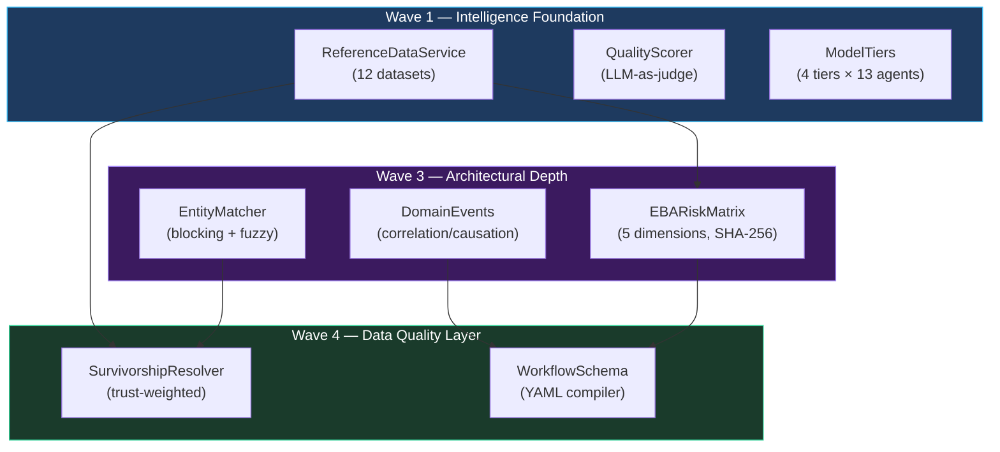
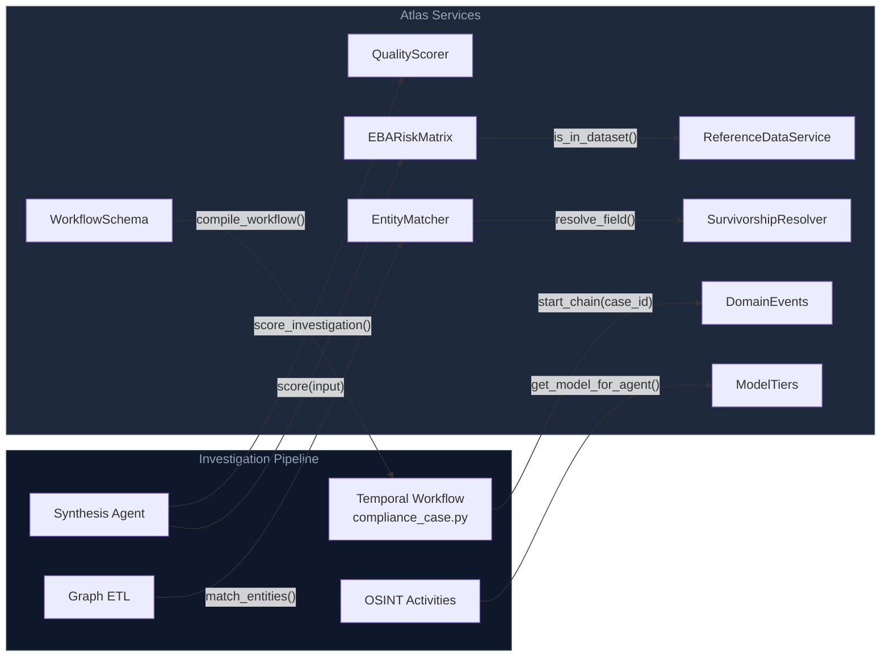

# Atlas Adoption

This page documents the 8 services adopted from a co-founder's parallel Atlas codebase into Trust Relay. Each service was analysed, extracted, and reimplemented in Trust Relay's tech stack (PydanticAI, SQLAlchemy, Alembic, Next.js/shadcn) — no foreign code was introduced. The source analysis is at `docs/research/atlas-extraction/` and the design specification is at `docs/plans/2026-03-31-atlas-adoption-roadmap-design.md`.

---

## Design Principle

**Adopt the pattern, not the code.** Atlas uses LangChain/LangGraph, Flyway, asyncpg, and Blueprint.js. Trust Relay uses PydanticAI, Alembic, SQLAlchemy, and Next.js. Every item is a reimplementation following existing Trust Relay conventions, not a port.

---

## Architecture Overview — 4 Waves

The 8 services are organised into 4 dependency-ordered waves. Later waves depend on earlier ones: the EBA risk matrix (Wave 3) performs country risk lookups against the reference data loaded in Wave 1, and the survivorship resolver (Wave 4) consumes entity matches produced in Wave 3.



| Wave | Goal | Services |
|------|------|----------|
| Wave 1 | Structured reference data, quality measurement, cost-optimised models | ReferenceDataService, QualityScorer, ModelTiers |
| Wave 2 | Regulatory citations in prompts, segment-specific severity | Prompt templates (not standalone services — see `app/prompts/`) |
| Wave 3 | Regulatory-grade risk scoring, auditable event chains, entity deduplication | EBARiskMatrix, DomainEvents, EntityMatcher |
| Wave 4 | Provable data quality, declarative workflow types | SurvivorshipResolver, WorkflowSchema |

---

## Wave 1 Services

### ReferenceDataService

`backend/app/services/reference_data_service.py`

A singleton that loads 12 JSON compliance datasets at startup from `backend/config/reference_data/`. Every subsequent service that needs a country risk score, PEP tier, or industry classification calls this service rather than embedding hardcoded lists.

**12 datasets:**

| Dataset | Records | Purpose |
|---------|---------|---------|
| `fatf_grey_list` | 22 countries | FATF increased monitoring |
| `fatf_black_list` | 3 countries | FATF high-risk (IR, KP, MM) |
| `eu_high_risk_third_countries` | 27 countries | EU delegated regulation |
| `eu_tax_blacklist` | 10 jurisdictions | EU non-cooperative tax jurisdictions |
| `secrecy_jurisdictions` | 12 jurisdictions | Tax Justice Network FSI |
| `cpi_below_40` | 44 countries | Corruption Perception Index < 40 |
| `pep_tiers` | 8 levels with scores | PEP classification hierarchy |
| `industry_risk_classification` | 15 sectors with scores | ML/TF industry risk |
| `product_risk_taxonomy` | 11 categories with scores | Product/service risk scoring |
| `sanctions_defaults` | 4 lists + match weights | Sanctions configuration |
| `ubo_thresholds` | Per-jurisdiction % | UBO identification thresholds |
| `dataset_types` | Schema definitions | JSON Schema per dataset type |

**Key methods:**

- `get_dataset(name)` — returns the full dataset (list or dict)
- `is_in_dataset(dataset_name, value)` — membership check for list and dict datasets
- `get_risk_score(dataset_name, key)` — returns a numeric risk score, handling three payload shapes: direct numeric, `{"score": N}`, and `{"risk_score": N}`
- `get_all_datasets()` — sorted list of all loaded dataset names
- `get_reference_data()` — module-level factory returning the singleton

**Each JSON file uses a standard envelope:**

```json
{
  "list_key": "fatf_grey_list",
  "type_id": "country_risk_list",
  "source": "FATF Public Statement",
  "source_url": "https://www.fatf-gafi.org/en/topics/grey-list.html",
  "source_date": "2026-02-21",
  "data": ["AF", "KH", "KG", ...]
}
```

**Integration:** The EBARiskMatrix calls `get_reference_data()` to check `fatf_grey_list`, `eu_high_risk_third_countries`, and `cpi_below_40` during geographic scoring. The ARIA risk matrix service was previously hardcoding these lists inline.

**API endpoint:** `GET /api/reference-data/{dataset}` — exposes all 12 datasets to the frontend. As of 2026-03-31 the reference data browser is integrated into the **Risk Configuration** admin page (`/admin/risk-configuration`, Reference Datasets tab) rather than the standalone `/admin/reference-data` page, which now redirects. The backing endpoint `app/api/reference_data.py` has been superseded by `app/api/risk_config.py`.

---

### QualityScorer

`backend/app/services/quality_scorer.py`

An LLM-as-judge evaluator that runs after every investigation, before the `REVIEW_PENDING` transition. It scores the synthesis report on 4 dimensions and stores the result in `additional_data.quality_scores`.

**QualityScore dimensions:**

| Dimension | Scale | Criterion |
|-----------|-------|-----------|
| Completeness | 1–10 | All required verification domains covered with substantive content? No obvious gaps? |
| Accuracy | 1–10 | Facts properly attributed to specific sources? No sign of hallucinated or unverified information? |
| Formatting | 1–10 | Professional structure? Findings clearly separated with severity levels? No placeholder text? |
| Actionability | 1–10 | Clear risk assessment? Recommendations specific and decision-ready for a compliance officer? |

`overall` is the mean of the four dimensions, rounded to one decimal place.

**Key functions:**

- `score_investigation(report_text)` — async entry point; calls `_call_judge()` and returns a `QualityScore`
- `_call_judge(report_text)` — calls GPT-4.1-mini (cost-efficient judge model), truncates at 12,000 characters, parses JSON response
- `QualityScore.to_dict()` — serialises to dict for JSON storage

**Threshold:** A score below 5.0 triggers automatic re-investigation (the Temporal activity signals the workflow to retry synthesis before transitioning to `REVIEW_PENDING`).

**Integration:** Called as a Temporal activity in `activities.py` after `run_osint_investigation`. Scores appear as a small badge on the case detail page ("Quality: 8.2/10").

**Why it exists:** Establishes a quality baseline before prompt changes are made in Wave 2. Measures regression when switching model tiers.

---

### ModelTiers

`backend/app/services/model_tiers.py`

Maps each agent to a cost tier, and each tier to a specific model. Environment variables override the defaults, enabling deployment-time model swaps without code changes.

**4 tiers:**

| Tier | Criterion | Default Model |
|------|-----------|---------------|
| `premium` | Accuracy critical (sanctions, synthesis) | `openai:gpt-5.2` |
| `mid` | Moderate judgment (adverse media, scan synthesis) | `openai:gpt-5.2` |
| `value` | Structured extraction (registry, person validation) | `openai:gpt-4.1-mini` |
| `budget` | Simple tasks (task generator, MCC classifier) | `openai:gpt-4.1-mini` |

**13 agent-to-tier assignments:**

| Agent | Tier |
|-------|------|
| `sanctions_resolver` | premium |
| `synthesis` | premium |
| `adverse_media` | mid |
| `scan_synthesis` | mid |
| `case_intelligence` | mid |
| `precious_metals_risk` | mid |
| `registry_investigation` | value |
| `belgian_investigation` | value |
| `person_validation` | value |
| `task_generator` | budget |
| `document_validator` | budget |
| `mcc_classifier` | budget |
| `document_extraction` | budget |

**Key functions:**

- `get_model_for_agent(agent_name)` — resolves agent → tier → model, with fallback to `DEFAULT_TIER` (`mid`)
- `get_agent_tier(agent_name)` — returns the tier string for a given agent
- `get_tier_config()` — returns the current tier-to-model mapping (used by health endpoint)
- `_reload_config()` — re-reads environment variables (called by tests to reset state)

**Env var overrides:** `MODEL_TIER_PREMIUM`, `MODEL_TIER_MID`, `MODEL_TIER_VALUE`, `MODEL_TIER_BUDGET`

**Estimated cost impact:** Dropping registry, person validation, task generation, and MCC classification from premium to value/budget models reduces per-investigation LLM cost by approximately 60–80%.

---

## Wave 3 Services

### EBARiskMatrix

`backend/app/services/eba_risk_matrix.py`

Implements EBA/GL/2021/02 (Guidelines on risk factors) as a scored 5-dimension matrix with SHA-256 determinism proof. This is intended to replace ARIA's 4-dimension weighted-average scoring as the default risk scoring engine.

**5 dimensions and 15 factors:**

| Dimension | Weight | Factors |
|-----------|--------|---------|
| Customer | 0.30 | `ownership_complexity`, `pep_exposure`, `sanctions_exposure`, `adverse_media`, `business_profile` |
| Geographic | 0.25 | `jurisdiction_risk`, `operational_geography`, `ubo_geography` |
| Product/Service | 0.20 | `product_complexity`, `regulatory_status` |
| Delivery Channel | 0.10 | `non_face_to_face`, `digital_presence` |
| Transaction | 0.15 | `financial_profile`, `transaction_patterns` |

**Aggregation — `weighted_max`:** The overall score is a weighted average of dimension scores, with a floor boost applied when any single dimension exceeds 80. This means a very high-risk dimension dominates the result rather than being averaged away — consistent with EBA guidance that a single critical risk factor can elevate the overall assessment.

**5 risk levels:**

| Level | Score Range |
|-------|-------------|
| Critical | 90+ |
| High | 70–89 |
| Medium | 40–69 |
| Low | 20–39 |
| Clear | 0–19 |

**SHA-256 audit trail:** `EBARiskResult` carries two hashes:

- `input_hash` — SHA-256 of the canonical (sort_keys=True) JSON representation of `EBARiskInput`
- `output_hash` — SHA-256 of the dimension and factor scores

These hashes allow an auditor to verify that a stored result was produced from a specific input without re-running the scorer. The matrix version (`eba_standard_v1`) is captured in every result, satisfying immutable audit requirements under AML 5-year retention rules.

**Key functions:**

- `score(input: EBARiskInput) -> EBARiskResult` — entry point; runs all 5 dimensions, applies weighted_max, hashes input and output
- `map_risk_level(score) -> str` — converts 0-100 score to level string
- `_hash_canonical(obj) -> str` — SHA-256 of JSON-serialised dict with sorted keys

**Reference data integration:** Geographic dimension calls `get_reference_data()` for `fatf_black_list`, `fatf_grey_list`, `eu_high_risk_third_countries`, `eu_tax_blacklist`, `secrecy_jurisdictions`, and `cpi_below_40`. Customer dimension uses `pep_tiers` and `product_risk_taxonomy`.

**Production status:** As of 2026-03-31 `EBARiskMatrix` is the **only** active risk scoring engine. The ARIA risk matrix and the `EBA_RISK_MATRIX_ENABLED` feature flag have been removed. Risk configuration is now managed via the versioned `risk_configurations` table (see [Risk Assessment](/docs/architecture/risk-assessment)).

---

### DomainEvents

`backend/app/services/domain_events.py`

Adds correlation/causation chain semantics to the audit log. Every significant action emits a `DomainEvent`. Events from the same investigation share a `correlation_id`; each event records the `causation_id` of the event that triggered it.

**Why this matters:** The flat `audit_events` table records what happened and when. Domain event chains record *why* — "the sanctions match on officer X caused the escalation which caused the 60-day extension which caused the MLRO notification." This chain reconstruction is required for SAR filing and regulatory examination responses.

**Data classes:**

```
DomainEvent
  event_id:       UUID (auto)
  event_type:     str
  data:           dict
  timestamp:      datetime (UTC)
  correlation_id: UUID | None   — groups all events in one investigation
  causation_id:   UUID | None   — points to the triggering event
  actor_id:       str | None    — user or agent ID
  actor_type:     str | None    — "system" | "user" | "agent"
  source_service: str | None    — originating service name
```

**EventChain class:**

- `EventChain.start(context)` — creates a new chain with a fresh `correlation_id`
- `chain.emit(event_type, data, caused_by, ...)` — emits an event linked to `caused_by`
- `chain.get_chain()` — returns all events sorted by timestamp
- `chain.get_caused_by(event)` — returns all events directly caused by a specific event

**Factory function:** `create_investigation_chain(case_id)` — creates a chain scoped to one investigation; used by Temporal activities so all activities within the same workflow run share a `correlation_id`.

**Integration:** Temporal activities call `create_investigation_chain()` at the start of each investigation workflow run. The chain is passed through activity parameters and used to emit events at each stage (documents submitted, OSINT started, finding discovered, decision made). The `correlation_id` and `causation_id` columns are added to the `audit_events` table via an Alembic migration.

---

### EntityMatcher

`backend/app/services/entity_matcher.py`

Algorithmic entity matching for cross-investigation deduplication. When two investigations reference the same company or person under slightly different names or registration number formats, this service detects and links them.

**Matching pipeline:**

1. **Blocking key** — `{jurisdiction}:{first_3_chars_of_stripped_normalised_name}`. Entities with different blocking keys are never compared, reducing the comparison space from O(n²) to O(n).
2. **Registration number comparison** — exact match after stripping country and court prefixes (CHE, BE, DE, FR9201., etc.). Match → 0.99 confidence.
3. **Legal suffix removal** — 25 patterns: Ltd, GmbH, BV, NV, SA, SAS, SARL, SRL, LLC, PLC, Inc, Corp, AG, SE, AB, AS, OY, eG, KG, OHG, GbR, and others.
4. **NFKD normalisation** — strips diacritics (Bolloré → Bollore, Société → Societe).
5. **Name similarity** — `SequenceMatcher` on normalised strings after suffix removal.
6. **Person matching** — parts sorted alphabetically before comparison, so "Jean-Pierre Dupont" matches "Dupont Jean-Pierre".

**Match thresholds:**

| Confidence | Decision |
|------------|----------|
| > 0.85 | Auto-match |
| 0.70 – 0.85 | Review queue |
| < 0.70 | Distinct entities |

**Key functions:**

- `match_entities(entity_a, entity_b) -> MatchResult` — primary entry point; accepts dicts with `type`, `name`, `registration_number`, `jurisdiction`
- `compute_blocking_key(jurisdiction, name) -> str` — generates the blocking key
- `normalize_company_name(name)`, `normalize_person_name(name)` — normalisation utilities
- `strip_legal_suffix(name)`, `strip_country_prefix(reg_number)` — cleaning utilities

**Integration:** Runs after graph ETL on newly created entity nodes. Detected potential matches are stored in a review queue. Confirmed matches feed into the SurvivorshipResolver (Wave 4) for field-level conflict resolution.

---

## Wave 4 Services

### SurvivorshipResolver

`backend/app/services/survivorship.py`

When the EntityMatcher links two records as the same entity, their field values may conflict. The SurvivorshipResolver selects the winning value using per-source trust scores, logs all conflicts, and protects sensitive fields from lower-trust overrides.

**Trust hierarchy (representative scores):**

| Source | Trust Score | Category |
|--------|-------------|----------|
| `kbo` | 0.98 | Government registry |
| `gleif` | 0.97 | Government registry |
| `nbb` | 0.95 | Government registry |
| `vies` | 0.93 | EU VAT validation |
| `eori` | 0.93 | EU customs validation |
| `peppol` | 0.90 | Official e-invoicing |
| `sanctions_resolver` | 0.96 | Authoritative sanctions source |
| `northdata` | 0.85 | Structured third-party API |
| `opencorporates` | 0.84 | Structured third-party API |
| `brightdata` | 0.72 | Web scraping |
| `crawl4ai` | 0.70 | Web scraping |
| `llm_extraction` | 0.75 | AI-extracted data |

**Protected fields:** Certain fields can only be set by authorised sources regardless of trust score.

| Field | Authorised Sources |
|-------|--------------------|
| `is_sanctioned` | `sanctions_resolver`, `kbo`, `gleif` |
| `is_pep` | `pep_resolver`, `kbo` |
| `sanctions_details` | `sanctions_resolver` |
| `pep_details` | `pep_resolver` |

**Conflict detection:** When two sources provide different values for the same field and their trust scores differ by less than `TRUST_CONFLICT_DELTA` (0.02), both values are preserved as a `ConflictRecord` for human review rather than silently picking a winner.

**Key methods:**

- `SurvivorshipResolver.resolve_field(field_name, candidates) -> FieldProvenance` — selects the winning value
- `resolver.conflicts` — list of `ConflictRecord` instances accumulated during a resolution session

**Audit compliance:** Every resolution decision is logged with the winning value, source, trust score, timestamp, and the reason for the decision. This satisfies EU AI Act Art. 12 (automatic logging) and AML 5-year retention requirements for data provenance.

**Integration:** Called from graph ETL during entity upsert when the EntityMatcher has flagged two records as the same entity. The `ConflictRecord` list is written to `additional_data.survivorship_conflicts` on the case for display in the Conflicts Panel (Wave 5 UI).

---

### WorkflowSchema

`backend/app/services/workflow_schema.py`

A declarative YAML schema and compiler for compliance workflows. Defines the 5 phase types, validates schemas via Pydantic, and compiles them to dependency-ordered `ExecutionPlan` instances via Kahn's topological sort algorithm.

**5 phase types:**

| Type | Purpose |
|------|---------|
| `portal` | Customer-facing data collection (forms + documents) |
| `investigation` | Automated due diligence modules (OSINT agents) |
| `rule_evaluation` | EBA risk matrix scoring |
| `review` | Human or auto decision with conditional routing |
| `action` | Post-decision steps (activation, notification, scheduling) |

**Schema structure:**

```
WorkflowSchema
  schema_id:              str
  name:                   str
  version:                int
  phases:                 list[WorkflowPhase]
  description:            str | None
  category:               str | None   — kyb, periodic_review, vendor_dd, etc.
  inputs:                 list[dict] | None
  subject_entity_types:   list[str] | None
  audit:                  dict | None  — retention, hashing config

WorkflowPhase
  id:           str                     — unique within the workflow
  type:         PhaseType
  config:       dict                    — phase-specific configuration
  depends_on:   list[str] | None        — phases that must complete first
  name:         str | None
  condition:    dict | None             — conditional execution for action phases
  escalation:   dict | None
```

**Compilation:** `compile_workflow(schema) -> ExecutionPlan` runs Kahn's algorithm to produce a topologically sorted list of `ExecutionStep` instances. Phases that have no unsatisfied dependencies at the same point in the sort are grouped into `parallel_groups` — these can execute as concurrent Temporal child workflows.

**Key functions:**

- `validate_workflow(schema) -> list[str]` — structural validation; returns error messages (empty = valid). Checks for empty schema_id, duplicate phase IDs, unknown `depends_on` references, and cyclic dependencies.
- `compile_workflow(schema) -> ExecutionPlan` — runs validation then topological sort; returns `ExecutionPlan` with `has_errors=True` and populated `errors` if validation fails.
- `load_workflow_yaml(yaml_text) -> WorkflowSchema` — parses YAML, constructs Pydantic model.

**Migration path:** The existing hardcoded `compliance_case.py` Temporal workflow becomes the first YAML template (`kyb_onboarding.yaml`). New workflow types — periodic review, vendor due diligence — are created as YAML files without requiring code changes.

**Integration:** The compiled `ExecutionPlan` is consumed by a dynamic Temporal workflow that iterates through the ordered steps. This is architecturally planned but not yet wired to the live Temporal execution engine — the schema compiler is fully functional and tested; the Temporal execution layer is Wave 4's implementation work.

---

## Integration Map

Where each service connects to the existing Trust Relay pipeline:



| Service | Called From | Returns |
|---------|-------------|---------|
| `ReferenceDataService` | `EBARiskMatrix`, risk engine | Risk scores, membership checks |
| `QualityScorer` | Temporal `score_investigation` activity | `QualityScore` dict → `additional_data.quality_scores` |
| `ModelTiers` | All agent invocations via `get_model_for_agent()` | Model name string for PydanticAI |
| `EBARiskMatrix` | Temporal `compute_eba_risk` activity | `EBARiskResult` with SHA-256 hashes |
| `DomainEvents` | All Temporal activities | `DomainEvent` → `audit_events` table |
| `EntityMatcher` | Post-ETL deduplication pass | `MatchResult` with confidence score |
| `SurvivorshipResolver` | Graph ETL entity upsert | Resolved field values + `ConflictRecord` list |
| `WorkflowSchema` | Workflow template compiler | `ExecutionPlan` → Temporal dynamic workflow |

---

## Competitive Context

These services address areas where the Atlas co-founder's codebase had architectural depth that Trust Relay's first implementation lacked.

**Before adoption:** Risk scoring used a custom 4-dimension weighted-average (ARIA). Entity conflicts were silently resolved with no provenance. Investigation quality was not measured. All agents used the same model. Event chains were flat and uncorrelated.

**After adoption:**

- Risk scoring follows EBA/GL/2021/02 with a published SHA-256 determinism proof — auditors can verify any stored result
- Entity conflicts are resolved transparently by a trust hierarchy, with protected fields that cannot be overwritten by lower-trust sources
- Every investigation receives a quality score on 4 dimensions before officer review
- LLM cost per investigation is reduced approximately 60–80% through tiered model assignments
- Every audit event carries a `correlation_id` and `causation_id`, enabling full chain reconstruction ("everything that happened because of this sanctions hit")
- New compliance workflow types are created from YAML without code changes

None of these capabilities require changes to the core investigaton loop, the Temporal workflow state machine, or the customer portal. They integrate as services that the existing pipeline calls.

**Trust Relay's architectural strengths that Atlas does not have** — multi-tenancy, customer portal, Belgian regulatory depth (5 sources), EVOI decision theory, GovernanceEngine, supervised autonomy, compliance memory (Letta), and the Network Intelligence Hub — are preserved and unaffected by the adoption.
