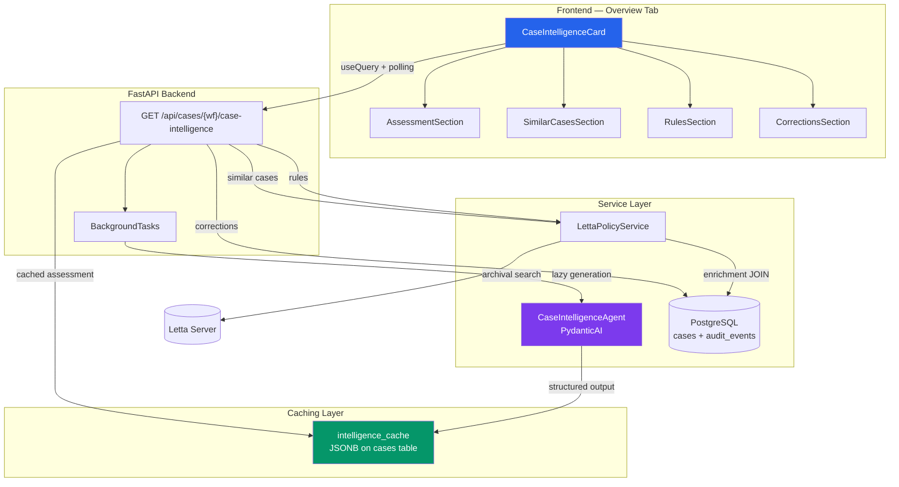
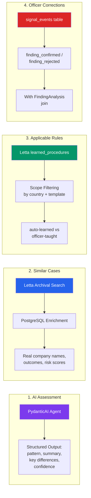
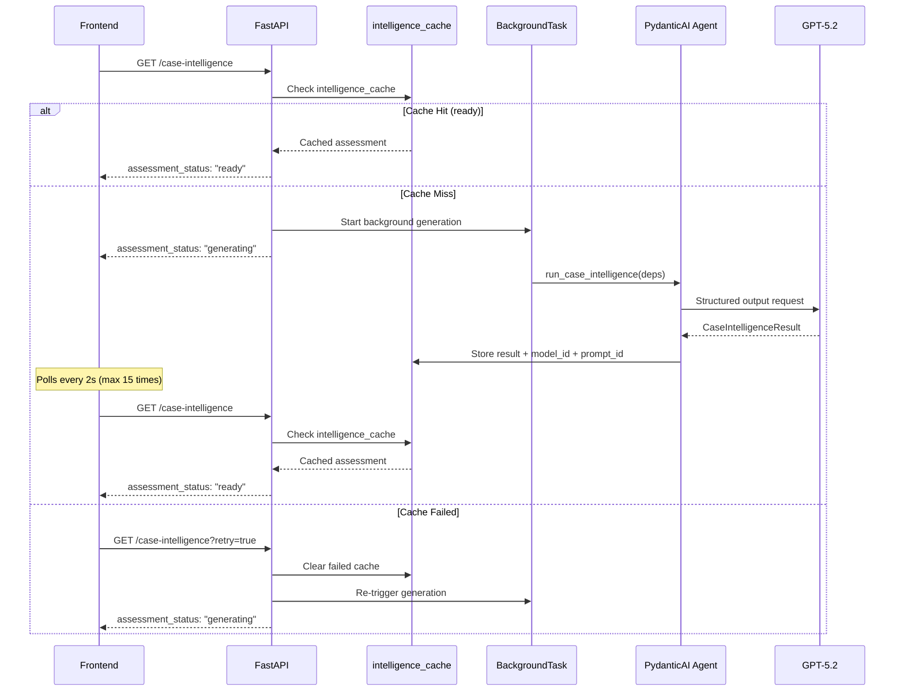
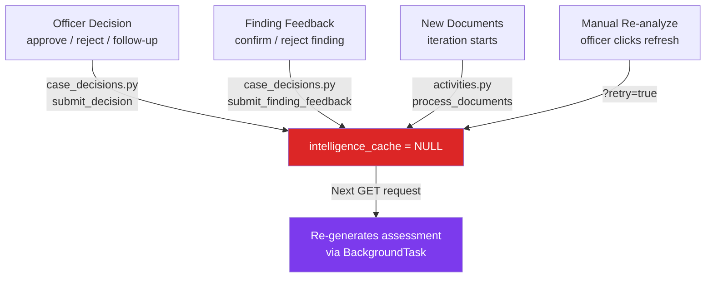
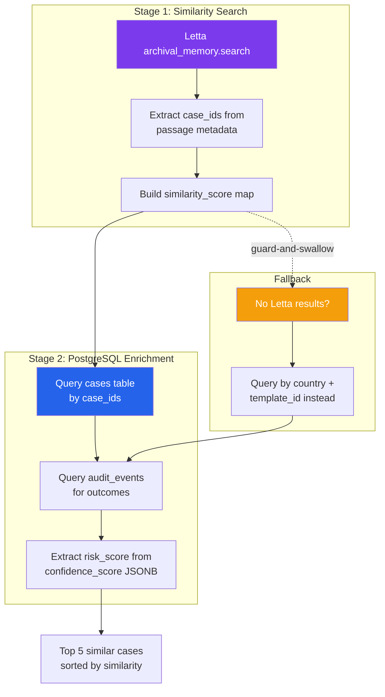

# Case Intelligence

The Case Intelligence system provides **AI-driven decision support** on the Overview tab of every compliance case. It replaces raw memory data with a synthesized assessment that compares the current case against organizational precedent.

## Architecture Overview



## Four Information Streams

The endpoint aggregates four distinct information streams into a single response:



## Lazy Assessment Generation

The AI assessment uses a **lazy generation** pattern to avoid blocking the API response:



## Cache Invalidation

The intelligence cache is automatically cleared when new data arrives that could change the assessment:



## Similar Cases Enrichment

The similar cases pipeline uses a two-stage approach — Letta for semantic similarity, PostgreSQL for enrichment:



## Structured Output

The PydanticAI agent produces a validated structured output:

```python
class CaseIntelligenceResult(BaseModel):
    summary: str           # 2-4 sentence assessment
    pattern: Literal["approved", "rejected", "mixed", "insufficient"]
    key_differences: list[str]  # Max 3
    assessment_confidence: float  # 0-1
    similar_count: int
    approved_count: int
```

**Key constraint:** The agent is instructed to **never recommend a decision** — it only surfaces evidence and patterns. This satisfies EU AI Act Article 14 (human oversight for high-risk AI systems).

## EU AI Act Compliance (Art. 12)

Every cached assessment includes traceability metadata:

| Field | Purpose |
|-------|---------|
| `model_id` | Which LLM produced the assessment (e.g., `openai:gpt-5.2`) |
| `prompt_id` | Which prompt version was used (e.g., `case_intelligence_v1`) |
| `generated_at` | ISO timestamp of generation |

This ensures every AI-driven assessment is fully traceable, retrievable, and auditable — a non-negotiable architectural constraint.

## Frontend Component

The `CaseIntelligenceCard` uses **progressive disclosure** — collapsed by default with a summary line:

```
🧠 Case Intelligence · 4 similar cases · 3 approved · AI learning (85%)
```

When expanded, four sections render sequentially:

1. **AI Assessment** — pattern badge, summary prose, key differences, refresh button
2. **Similar Cases** — clickable rows with company name, outcome badge, deep links
3. **Rules Applied** — collapsible rules with auto-learned vs officer-taught distinction
4. **Your Corrections** — finding confirmations/rejections (hidden when empty)

## API Endpoint

```
GET /api/cases/{workflow_id}/case-intelligence
GET /api/cases/{workflow_id}/case-intelligence?retry=true
```

See [Case Intelligence API](/docs/api/case-intelligence) for the full response schema.
