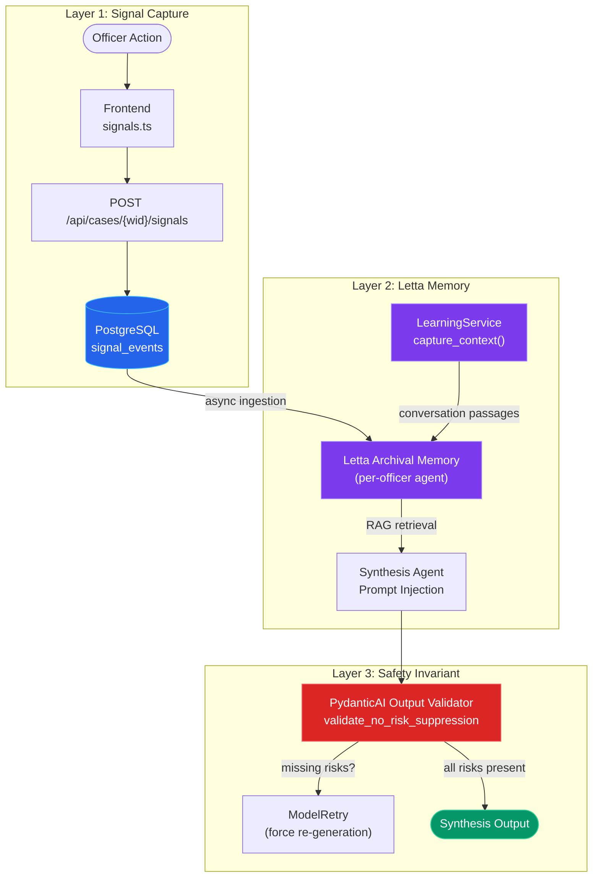
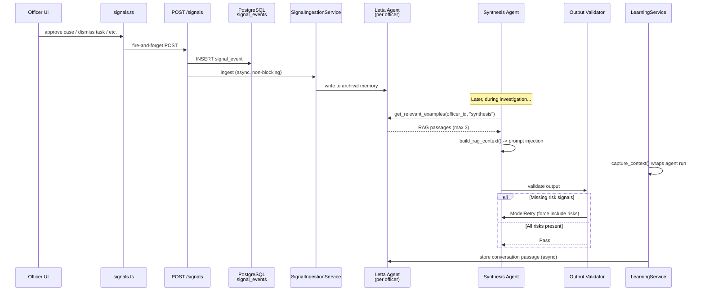
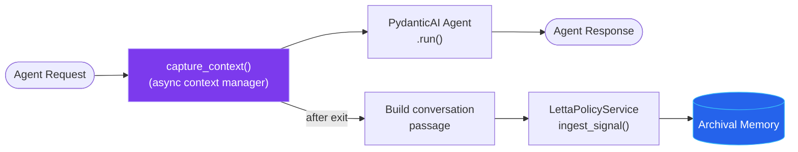
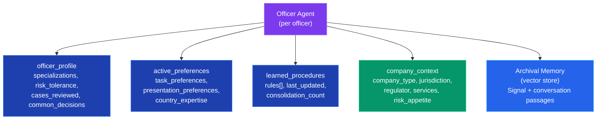
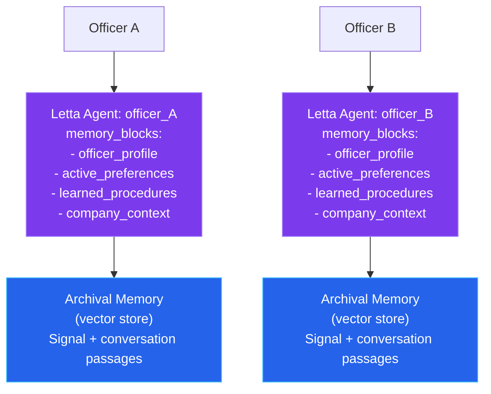

# Compliance Memory System

The compliance memory system lets the platform learn from officer interactions. Every pipeline agent adapts to officer preferences, organizational policies, and accumulated compliance knowledge -- without ever suppressing risk signals.

The system was built in five phases:

1. **Foundation** -- Signal capture, Letta deployment, frontend instrumentation
2. **RAG Synthesis** -- Archival ingestion, RAG in synthesis agent, safety validator
3. **Learning Service** -- Conversation capture, per-case threads, agent I/O logging
4. **Memory Control UI** -- Admin page, block inspection, passage CRUD, confidence meter
5. **Teaching Mode** -- `remember_this` tool, maturity-aware prompts, welcome sequence, conversational onboarding

---

## Three-Layer Architecture

The system is composed of three layers, each with a distinct responsibility. The layers are designed to degrade gracefully: if Letta is unavailable, signal capture still works. If signal capture is disabled, the pipeline runs identically to a system without memory.



### Layer 1: Signal Capture (PostgreSQL Staging)

Deterministic classification of officer actions into three categories. Every signal is persisted to the `signal_events` table with its classification before any downstream processing occurs.

**Source:** `app/services/signal_capture_service.py`

### Layer 2: Letta Memory (Optional RAG)

Officer signals are asynchronously ingested into Letta's archival memory (one agent per officer). Pipeline agents query this memory at runtime via semantic search (RAG) to retrieve relevant precedents and preferences. Conversation capture via `LearningService` adds a second ingestion path.

**Source:** `app/services/letta_policy_service.py`, `app/services/signal_ingestion.py`, `app/services/learning_service.py`

### Layer 3: Safety Invariant

A PydanticAI output validator on the synthesis agent ensures that high/critical risk signals from OSINT data are never dropped from the output, regardless of what the RAG context suggests. If the LLM omits a risk signal, `ModelRetry` forces re-generation.

**Source:** `app/agents/synthesis_agent.py` -- `validate_no_risk_suppression()`

---

## Signal Classification

Signal classification is fully deterministic (no LLM involved). Each signal type maps to exactly one category and one safety class.

### Categories

| Category | Safety Class | Description |
|---|---|---|
| **Judgment** | `non_suppressible` | Compliance decisions that must always be reflected in agent output |
| **Preference** | `preference_only` | How the officer interacts with AI suggestions -- used to personalize but never override risk |
| **Behavioral** | `preference_only` | UI interactions (time spent, sections viewed) -- lowest-priority learning signal |

### Signal Types

| Signal Type | Category | Safety Class | Trigger |
|---|---|---|---|
| `suggestion_dismissed` | Judgment | non_suppressible | Officer dismisses an AI-suggested follow-up task |
| `case_approved` | Judgment | non_suppressible | Officer approves a case |
| `case_rejected` | Judgment | non_suppressible | Officer rejects a case |
| `case_escalated` | Judgment | non_suppressible | Officer escalates a case |
| `followup_requested` | Judgment | non_suppressible | Officer requests follow-up iteration |
| `finding_overridden` | Judgment | non_suppressible | Officer overrides an OSINT finding |
| `risk_level_changed` | Judgment | non_suppressible | Officer changes the risk level assessment |
| `suggestion_accepted` | Preference | preference_only | Officer accepts an AI-suggested task |
| `suggestion_modified` | Preference | preference_only | Officer modifies an AI-suggested task before accepting |
| `custom_task_added` | Preference | preference_only | Officer creates a custom follow-up task |
| `chat_correction` | Preference | preference_only | Officer corrects AI assistant in chat |
| `chat_positive_feedback` | Preference | preference_only | Officer gives positive feedback to AI assistant |
| `template_customized` | Preference | preference_only | Officer customizes a workflow template |
| `section_time_spent` | Behavioral | preference_only | Time spent viewing a report section |
| `report_section_expanded` | Behavioral | preference_only | Officer expands a report section for detail |
| `evidence_downloaded` | Behavioral | preference_only | Officer downloads evidence artifacts |
| `chat_question` | Behavioral | preference_only | Officer asks a question in AI assistant chat |

Unknown signal types default to `("behavioral", "preference_only")`.

**Source:** `app/services/signal_capture_service.py` -- `JUDGMENT_SIGNALS`, `PREFERENCE_SIGNALS`, `BEHAVIORAL_SIGNALS`

---

## Data Flow



### Frontend Signal Capture

The frontend captures signals via the `captureSignal()` helper in `frontend/src/lib/signals.ts`. This function is fire-and-forget: it posts to the backend and silently swallows any errors so officer workflow is never disrupted.

Three UI touchpoints emit signals:
1. **DecisionActions** -- `case_approved`, `case_rejected`, `case_escalated`, `followup_requested`
2. **FollowUpTasks** -- `suggestion_accepted`, `suggestion_dismissed`, `suggestion_modified`, `custom_task_added`
3. **AI Assistant Chat** -- `chat_correction`, `chat_positive_feedback`, `chat_question`

**Source:** `frontend/src/lib/signals.ts`

### Backend Signal Processing

1. `POST /api/cases/{workflow_id}/signals` receives the signal and resolves `workflow_id` to `case_id`
2. `SignalCaptureService.capture()` classifies and persists to `signal_events`
3. `SignalIngestionService.ingest()` writes to Letta archival memory (non-blocking, best-effort)

All three steps are guarded by feature flags and swallow errors silently.

**Source:** `app/api/signal_capture.py`, `app/services/signal_capture_service.py`, `app/services/signal_ingestion.py`

---

## Safety Invariant

The cardinal rule of compliance memory:

> **The system may learn to ADD scrutiny but NEVER SUPPRESS risk signals.**

This is enforced by a PydanticAI output validator registered on the synthesis agent. The validator runs after every LLM generation and checks that all high/critical risk signals from OSINT data appear in the synthesis output.

### How It Works

1. The validator collects all findings with `severity` of `high` or `critical` from adverse media and person validation data
2. It extracts the `category` (or `type`) of each risk finding
3. It checks that each risk category appears in the synthesis output's `findings` list
4. If any risk category is missing, it raises `ModelRetry` with a message instructing the LLM to include the missing risks

```python
@synthesis_agent.output_validator
async def validate_no_risk_suppression(
    ctx: RunContext[SynthesisDeps], output: OsintAgentOutput
) -> OsintAgentOutput:
    """Safety invariant: learned preferences must not suppress risk signals."""
    osint_risks: list[dict[str, Any]] = []
    for source_data in [ctx.deps.adverse_media_data, ctx.deps.person_validation_data]:
        for finding in source_data.get("findings", []):
            if finding.get("severity") in ("high", "critical"):
                risk_type = finding.get("category", finding.get("type", ""))
                if risk_type:
                    osint_risks.append({"type": risk_type, "severity": finding["severity"]})

    if not osint_risks:
        return output

    output_categories = {f.category for f in output.findings if hasattr(f, "category")}
    missing = check_risk_suppression(osint_risks, output_categories)

    if missing:
        from pydantic_ai import ModelRetry
        raise ModelRetry(
            f"Risk signals must appear in output: {[m['type'] for m in missing]}. "
            f"Add officer context but do not remove risk flags."
        )
    return output
```

The validator is unconditional. It runs whether Letta is enabled or not, whether RAG context was injected or not. This makes the safety guarantee independent of all feature flags.

**Source:** `app/agents/synthesis_agent.py` -- `validate_no_risk_suppression()`, `check_risk_suppression()`

---

## RAG Integration

When the synthesis agent runs, it queries the officer's Letta archival memory for relevant precedents and injects them into the LLM prompt.

### Retrieval

```python
letta = get_letta_policy_service()
examples = letta.get_relevant_examples(
    officer_id=officer_id,
    agent_type="synthesis",
    case_context={},
)
rag_context = build_rag_context(examples)
```

The `get_relevant_examples()` method searches the officer's archival memory using a semantic query built from the agent type and case context (template, country, risk level). It returns up to 5 passages, of which the top 3 are used for prompt injection.

### Prompt Injection

The `build_rag_context()` function formats retrieved passages into a numbered precedent list with a safety reminder:

```
Based on this officer's previous decisions on similar cases:

  Precedent 1: Officer approved case demo-001 (BE, psp_merchant_onboarding).
               Reason: Clean investigation across all sources.
  Precedent 2: Officer dismissed AI-generated task 'Request UBO declaration'
               for case demo-005. Reason: Not needed for low-risk Belgian PSP.
  Precedent 3: Officer rejected case demo-003 (NL). Reason: Sanctions match.

Use these precedents to inform presentation style and task prioritization,
but NEVER suppress or downplay any risk signals.
```

This context is prepended to the synthesis prompt, giving the LLM awareness of the officer's patterns without overriding risk signals.

**Source:** `app/agents/synthesis_agent.py` -- `build_rag_context()`

---

## Learning Service & Conversation Capture

The `LearningService` wraps PydanticAI agent calls to capture input/output conversations and store them as Letta archival passages. It replaces the `agentic-learning` SDK, which was incompatible due to a pinned `letta-client` alpha dependency.

### Architecture



### CaptureResult Dataclass

The context manager yields a `CaptureResult` that the caller populates during the agent run:

```python
@dataclass
class CaptureResult:
    agent_name: str = ""
    user_message: str = ""
    assistant_response: str = ""
    duration_ms: float = 0.0
    metadata: dict[str, Any] = field(default_factory=dict)
```

### Usage Pattern

```python
from app.services.learning_service import get_learning_service

learning = get_learning_service()
async with learning.capture_context(
    "synthesis",
    officer_id="default",
    case_id=workflow_id,
) as capture:
    result = await synthesis_agent.run(prompt, deps=deps)
    capture.user_message = prompt
    capture.assistant_response = str(result.output)
```

After the context manager exits, the conversation is formatted as a narrative passage and stored to Letta with tags `category:conversation` and `agent:{agent_name}`. When `letta_enabled=False`, the context manager is a silent pass-through with zero overhead.

### Dashboard Agent Wrapper

The dashboard agent is wrapped in `_run_dashboard_agent()` in `app/api/agent.py`. This helper checks if `LearningService` is enabled and wraps the AG-UI request handler with conversation capture:

```python
async def _run_dashboard_agent(workflow_id: str, request: Request) -> Response:
    deps = await _build_dashboard_deps(workflow_id)
    officer_id = "default"

    learning = get_learning_service()
    if learning.enabled:
        async with learning.capture_context(
            "dashboard", officer_id=officer_id, case_id=workflow_id,
        ):
            return await handle_ag_ui_request(dashboard_agent, request, deps=deps)

    return await handle_ag_ui_request(dashboard_agent, request, deps=deps)
```

### Per-Case Conversation Threads

The `LettaPolicyService` supports per-case conversation threads via `get_or_create_conversation(officer_id, case_id)`. One Letta agent per officer can maintain multiple conversations (one per case), sharing memory blocks while maintaining independent context windows.

```python
async def get_or_create_conversation(
    self, officer_id: str, case_id: str
) -> str | None:
    cache_key = (officer_id, case_id)
    if cache_key in self._conversation_cache:
        return self._conversation_cache[cache_key]

    agent_id = await self._get_or_create_officer_agent(officer_id)
    conv = await self._letta.conversations.create(agent_id=agent_id)
    self._conversation_cache[cache_key] = conv.id
    return conv.id
```

**Source:** `app/services/learning_service.py`, `app/api/agent.py` -- `_run_dashboard_agent()`

---

## Officer Profile & Memory Blocks

Each officer's Letta agent is provisioned with four memory blocks. These blocks are injected into every LLM call and updated as the system learns.

### Memory Block Layout



### Block Details

| Block | Scope | Purpose | Initial Value |
|---|---|---|---|
| `officer_profile` | Per-officer | Identity, specializations, risk tolerance, cases reviewed | Empty profile with `risk_tolerance: "unknown"` |
| `active_preferences` | Per-officer | Task preferences, presentation style, country expertise | Empty preferences |
| `learned_procedures` | Per-officer | Rules taught by the officer or consolidated from signals | `{rules: [], last_updated: "", consolidation_count: 0}` |
| `company_context` | Shared (org-wide) | Company type, jurisdiction, regulator, services, risk appetite | `{status: "not_configured", ...}` |

### Agent Provisioning

Agents are lazily created on first interaction. The `_get_or_create_officer_agent()` method in `LettaPolicyService` searches for an existing agent by name (`officer_{id}`), and creates one with all four memory blocks if not found:

```python
agent = await self._letta.agents.create(
    name=f"officer_{officer_id}",
    model=settings.letta_default_model,
    embedding=settings.letta_default_embedding,
    memory_blocks=[
        {"label": "officer_profile", "value": officer_profile},
        {"label": "active_preferences", "value": active_preferences},
        {"label": "learned_procedures", "value": learned_procedures},
        {"label": "company_context", "value": company_context},
    ],
    include_base_tools=True,
    enable_sleeptime=settings.letta_sleeptime_enabled,
)
```

Agent IDs are cached in-memory (`_agent_cache` dict) to avoid repeated API lookups. Conversation IDs are similarly cached in `_conversation_cache`.

**Source:** `app/services/letta_policy_service.py` -- `_get_or_create_officer_agent()`

---

## Teaching Mode

Officers can teach the AI rules and preferences directly through the dashboard chat. The `remember_this` tool on the dashboard agent saves rules to the `learned_procedures` memory block.

### How It Works

When the officer says something like "remember that Belgian BVs always need gazette verification," the dashboard agent invokes the `remember_this` tool:

```python
@dashboard_agent.tool
async def remember_this(ctx: RunContext[DashboardAgentDeps], rule: str) -> str:
    """Save a compliance rule the officer wants the AI to remember."""
    letta = get_letta_policy_service()

    block = await letta.get_block(deps.officer_id, "learned_procedures")
    if block is None:
        block = {"rules": [], "last_updated": "", "consolidation_count": 0}

    rules = block.get("rules", [])
    if rule in rules:
        return f'I already have that rule saved: "{rule}"'

    rules.append(rule)
    block["rules"] = rules
    block["last_updated"] = datetime.now(timezone.utc).isoformat()

    success = await letta.update_block(deps.officer_id, "learned_procedures", block)
    if success:
        return f'Got it -- I\'ll remember: "{rule}". I now have {len(rules)} learned rule(s).'
    return "I couldn't save that rule right now. Please try again."
```

### Recall Tool

The `recall_my_preferences` tool lets officers ask what the AI has learned:

```python
@dashboard_agent.tool
async def recall_my_preferences(ctx: RunContext[DashboardAgentDeps]) -> str:
    """Retrieve the officer's saved rules and preferences."""
    block = await letta.get_block(deps.officer_id, "learned_procedures")
    if not block or not block.get("rules"):
        return "I haven't learned any specific rules yet. You can teach me by saying 'remember that...'."

    rules = block["rules"]
    lines = [f"I have {len(rules)} learned rule(s):"]
    for i, r in enumerate(rules, 1):
        lines.append(f"  {i}. {r}")
    return "\n".join(lines)
```

### Teaching Trigger Phrases

The agent recognizes teaching intent from natural language. No special syntax is required:

- "Remember that..."
- "Always do..."
- "Next time make sure..."
- "Keep in mind that..."
- "Learn this rule: ..."

**Source:** `app/agents/dashboard_agent.py` -- `remember_this()`, `recall_my_preferences()`

---

## Maturity-Aware UI

The system adapts its behavior based on the officer's accumulated knowledge. Confidence scoring drives UI adaptations, prompt style, and suggestion content.

### Confidence Scoring

The confidence score is a 0-100 value computed from two factors:

| Factor | Weight | Max Contribution | Calculation |
|---|---|---|---|
| Learned rules | 40% | 40 points | `min(rules_count * 10, 40)` -- 4 rules = max |
| Relevant passages | 60% | 60 points | `min(relevant_passages * 3, 60)` -- 20 passages = max |

### Maturity Levels

| Level | Score Range | Agent Behavior |
|---|---|---|
| **Novice** | 0--29 | Detailed explanations of compliance concepts. Explains finding severity. Suggests next steps proactively. |
| **Learning** | 30--69 | Moderate detail. Explains unusual findings but skips basics. Highlights case differences. |
| **Experienced** | 70--100 | Concise and analytical. Skips basic explanations. Focuses on anomalies and decision-relevant details only. |

### Dynamic System Prompt

The dashboard agent has a `@system_prompt` function that injects maturity context and RAG precedents at runtime:

```python
@dashboard_agent.system_prompt
async def _memory_context(ctx: RunContext[DashboardAgentDeps]) -> str:
    letta = get_letta_policy_service()
    if not letta.enabled:
        return ""

    # Confidence level determines prompt verbosity
    confidence = await letta.calculate_confidence(
        deps.officer_id,
        template_id=deps.template_id,
        country=deps.country,
    )
    level = confidence.get("level", "novice")

    if level == "novice":
        parts.append("Provide detailed explanations...")
    elif level == "learning":
        parts.append("Explain unusual findings but skip basics...")
    else:
        parts.append("Be concise and analytical...")

    # Append RAG precedents from archival memory
    examples = await letta.get_relevant_examples(
        deps.officer_id,
        _agent_type="dashboard",
        case_context=case_context,
    )
    if examples:
        rag = build_rag_context(examples)
        parts.append(rag)

    return "\n\n".join(parts)
```

### Confidence Meter UI

The Memory Admin page displays a confidence indicator with color-coded status:

| Level | Color | Display |
|---|---|---|
| Novice | Gray | "I'm still learning about this type of case." |
| Learning | Amber | "I'm building experience with this type of case." |
| Experienced | Green | "I've seen similar cases before." |

**Source:** `app/services/letta_policy_service.py` -- `calculate_confidence()`, `app/agents/dashboard_agent.py` -- `_memory_context()`

---

## Memory Control UI

The Memory Admin page at `/dashboard/memory` provides full visibility into and control over the compliance memory system.

### Page Layout

```
+------------------------------------------------------------------+
| [<- Dashboard]    Memory Admin                    [Refresh] [Reset]|
+------------------------------------------------------------------+
| [Letta: Connected] [Signals: 42] [Passages: 18] [Confidence: 65%]|
+------------------------------------------------------------------+
| [Recent Signals] [Memory Blocks] [Archival Memory]                |
|                                                                    |
|  (Tab content based on selection)                                  |
+------------------------------------------------------------------+
| CopilotPopup: Memory Assistant                                     |
+------------------------------------------------------------------+
```

### Status Cards

Four cards at the top provide a snapshot of the memory system:

1. **Letta Connection** -- Green check or red X based on `letta.connected`
2. **Total Signals** -- Count from `signal_events` table
3. **Archival Passages** -- Count from Letta archival memory
4. **Confidence** -- Score with maturity level indicator (color dot)

### Tabs

| Tab | Content | Data Source |
|---|---|---|
| **Recent Signals** | Category breakdown badges + last 10 signals with safety class, type, source, timestamp | `GET /api/memory/status` |
| **Memory Blocks** | JSON content of `officer_profile`, `active_preferences`, `learned_procedures` | `GET /api/memory/blocks/{officer_id}/{label}` |
| **Archival Memory** | Searchable passage list with tags, delete button (hover) | `GET /api/memory/passages/{officer_id}`, `POST /api/memory/passages/{officer_id}/search` |

### Memory Admin Chatbot

A `CopilotPopup` on the memory page uses the `memory_admin` agent to explain how the memory system works. The agent has tools for:

- `get_memory_system_status` -- Current Letta connection, signal counts, confidence
- `get_memory_blocks_info` -- Which blocks are active
- `get_recent_signals` -- Latest learning signals
- `explain_signal_safety_classes` -- Educational explanation of JUDGMENT/PREFERENCE/BEHAVIORAL

The agent's system prompt contains a comprehensive explanation of the memory system architecture, making it useful for officer onboarding.

**Source:** `frontend/src/app/dashboard/memory/page.tsx`, `app/agents/memory_admin_agent.py`

---

## Conversational Onboarding

When the `company_context` memory block is empty (status: `not_configured`), the Memory Admin agent initiates a conversational onboarding flow to gather organizational context.

### What Gets Populated

The `company_context` block captures structured company data:

```json
{
  "status": "configured",
  "company_type": "Payment Service Provider",
  "jurisdiction": "Belgium",
  "primary_regulator": "NBB (National Bank of Belgium)",
  "services": ["merchant acquiring", "payment processing"],
  "regulatory_framework": "PSD2, AML6",
  "customer_segments": ["e-commerce merchants", "SaaS platforms"],
  "risk_appetite": "moderate",
  "prohibited_jurisdictions": ["DPRK", "Iran", "Syria"],
  "additional_notes": ""
}
```

### Onboarding Flow

The agent asks natural-language questions about:

1. Company type and primary business
2. Jurisdiction and primary regulator
3. Services offered
4. Regulatory framework
5. Customer segments
6. Risk appetite
7. Prohibited jurisdictions

The agent updates the `company_context` block via `LettaPolicyService.update_company_context()` after each confirmation. The Company Context Card on the Memory Admin page shows structured data in real-time.

### Backend Methods

```python
# Convenience methods on LettaPolicyService
async def get_company_context(self, officer_id: str) -> dict[str, Any] | None:
    return await self.get_block(officer_id, "company_context")

async def update_company_context(
    self, officer_id: str, context: dict[str, Any]
) -> bool:
    return await self.update_block(officer_id, "company_context", context)
```

**Source:** `app/services/letta_policy_service.py` -- `get_company_context()`, `update_company_context()`

---

## Case Memory Panel

Each case has a dedicated memory panel (accessible via `GET /api/memory/case/{workflow_id}`) that shows:

- **Signals**: All signal events for the case with counts and category breakdown
- **AI Context**: Rules applied, passages matched, synthesis summary, model used
- **Learned**: Total captured signals, synced vs pending, per-category breakdown

This endpoint cross-references the `signal_events` table, `agent_executions` table, and Letta archival memory to build a complete memory story for a single case.

**Source:** `app/api/memory.py` -- `case_memory()`

---

## Letta Architecture

Letta runs as a self-hosted Docker container (profile: `memory`). Each compliance officer gets a dedicated Letta agent with archival memory. The agent's archival memory stores signal passages as embeddings, enabling semantic search at retrieval time.

### Per-Officer Agent Model



### Agent Lifecycle

1. **Lazy creation:** The first signal or block read for an officer triggers agent creation
2. **Caching:** Agent IDs are cached in-memory (`_agent_cache` dict) to avoid repeated API lookups
3. **Memory blocks:** Each agent is initialized with four blocks: `officer_profile`, `active_preferences`, `learned_procedures`, `company_context`
4. **Archival writes:** Signals are formatted via `format_signal_for_archival()` into searchable narrative text + structural tags
5. **Archival reads:** `get_relevant_examples()` performs semantic search with a query built from agent type + case context
6. **Conversation threads:** `get_or_create_conversation()` creates per-case conversation threads with shared memory

### Signal Formatting

Each signal is formatted as a human-readable narrative passage for archival storage (optimized for semantic search):

```
Officer approved case demo-001 (BE, psp_merchant_onboarding).
Reason: Clean investigation across all sources. Company active 5+ years.
Risk score: low. Iteration: 1.
```

Structural metadata is stored as tags for filtering:

```python
tags = [
    "signal:case_approved",
    "category:judgment",
    "safety:non_suppressible",
    "country:BE",
    "template:psp_merchant_onboarding",
]
```

**Source:** `app/services/letta_policy_service.py` -- `format_signal_for_archival()`, `_build_narrative()`

---

## Sleep-Time Consolidation

When `letta_sleeptime_enabled=True`, Letta creates a background agent that shares the primary agent's memory blocks. Every N steps (configured via `letta_sleeptime_frequency`, default 5), the sleep-time agent:

1. Reviews recent conversation history across all conversations
2. Identifies new policy rules, corrections, or patterns
3. Updates the `learned_procedures` block with distilled rules
4. Consolidates fragmented memories, deduplicates, and prunes stale entries

:::note
Sleep-time consolidation is disabled by default (`letta_sleeptime_enabled=False`). Enable it when the officer has accumulated enough signals for meaningful consolidation.
:::

**Source:** `app/config.py` -- `letta_sleeptime_enabled`, `letta_sleeptime_frequency`

---

## Graceful Degradation

The memory system is designed for zero-impact degradation. Each layer is independently gated by feature flags, and all operations use the guard-and-swallow pattern (errors are logged but never propagated).

| Configuration | Signal Capture | Letta RAG | Conversation Capture | Safety Validator | Behavior |
|---|---|---|---|---|---|
| `signal_capture=True`, `letta=True` | Active | Active | Active | Active | Full memory system |
| `signal_capture=True`, `letta=False` | Active | Disabled | Disabled | Active | Signals captured to PostgreSQL; no RAG |
| `signal_capture=False`, `letta=False` | Disabled | Disabled | Disabled | Active | Pre-memory behavior |
| Any combination | -- | -- | -- | **Always active** | Safety validator runs unconditionally |

### Default Configuration

By default, `signal_capture_enabled=True` and `letta_enabled=False`. This means the system captures all officer signals to PostgreSQL but does not use them for RAG injection. This is the recommended starting configuration: accumulate signal data first, enable Letta when ready.

---

## Feature Flags

| Flag | Type | Default | Description |
|---|---|---|---|
| `signal_capture_enabled` | bool | `True` | Enable/disable signal capture to PostgreSQL |
| `letta_enabled` | bool | `False` | Enable/disable Letta archival memory and RAG |
| `letta_base_url` | str | `http://localhost:8283` | Letta server base URL |
| `letta_default_model` | str | `openai/gpt-4o` | LLM model for Letta agents |
| `letta_default_embedding` | str | `openai/text-embedding-3-small` | Embedding model for archival memory |
| `letta_sleeptime_enabled` | bool | `False` | Enable/disable background memory consolidation |
| `letta_sleeptime_model` | str | `openai/gpt-4o-mini` | LLM model for sleep-time agent |
| `letta_sleeptime_frequency` | int | `5` | Steps between sleep-time consolidation runs |

All flags are configured via environment variables or `.env` file and loaded via `pydantic-settings`.

**Source:** `app/config.py`

---

## Database Schema

The `signal_events` table stores all captured signals. It is linked to the `cases` table via a foreign key on `case_id`.

```sql
CREATE TABLE signal_events (
    id UUID PRIMARY KEY DEFAULT gen_random_uuid(),
    case_id VARCHAR(255) NOT NULL REFERENCES cases(case_id),
    signal_type VARCHAR(50) NOT NULL,
    signal_category VARCHAR(20) NOT NULL,
    safety_class VARCHAR(30) NOT NULL,
    source_component VARCHAR(100) NOT NULL,
    iteration INTEGER NOT NULL DEFAULT 1,
    officer_id VARCHAR(255) DEFAULT '',
    context_data JSONB DEFAULT '{}',
    letta_synced BOOLEAN DEFAULT FALSE,
    created_at TIMESTAMPTZ NOT NULL DEFAULT NOW()
);
```

:::tip
The `letta_synced` column tracks whether a signal has been ingested into Letta archival memory. The case memory endpoint uses this to report sync status.
:::

### Indexes

| Index | Columns | Purpose |
|---|---|---|
| `idx_signal_events_case` | `case_id` | Filter signals by case |
| `idx_signal_events_type` | `signal_type` | Filter by signal type |
| `idx_signal_events_created` | `created_at` | Order by recency (status endpoint) |
| `idx_signal_events_officer` | `officer_id` | Filter signals by officer |

**Source:** `app/db/models.py` -- `SignalEvent`

---

## Demo & Seed Data

The seed script at `backend/scripts/seed_letta_memory.py` populates Letta archival memory with 8 sample investigation signals for the `default` officer. These represent a realistic mix of officer decisions:

| Signal | Type | Country | Description |
|---|---|---|---|
| demo-001 | `case_approved` | BE | Clean investigation, low risk |
| demo-002 | `case_approved` | BE | Minor gaps resolved in iteration 2 |
| demo-003 | `case_rejected` | NL | Sanctions match on UBO |
| demo-004 | `case_escalated` | GB | Complex multi-jurisdictional structure |
| demo-005 | `suggestion_dismissed` | BE | UBO declaration not needed for low-risk Belgian PSP |
| demo-006 | `followup_requested` | BE | Address discrepancy |
| demo-007 | `suggestion_accepted` | -- | LinkedIn cross-reference task |
| demo-008 | `custom_task_added` | NL | Manual website activity check |

### Running the Seed Script

```bash
# Requires LETTA_ENABLED=true and running Letta server
cd backend && python -m scripts.seed_letta_memory
```

After seeding, these memories appear in RAG context when the synthesis agent processes new investigations, demonstrating learned behavior.

**Source:** `backend/scripts/seed_letta_memory.py`

---

## Key Files

| Component | File Path | Purpose |
|---|---|---|
| Signal capture service | `app/services/signal_capture_service.py` | Classification + PostgreSQL persistence |
| Signal capture API | `app/api/signal_capture.py` | `POST /cases/{wid}/signals` endpoint |
| Letta policy service | `app/services/letta_policy_service.py` | Per-officer agent management, RAG, blocks, passages, confidence |
| Learning service | `app/services/learning_service.py` | Conversation capture via async context manager |
| Signal ingestion | `app/services/signal_ingestion.py` | PostgreSQL-to-Letta bridge |
| Memory API | `app/api/memory.py` | Status, reset, blocks, passages, confidence, case memory endpoints |
| Dashboard agent | `app/agents/dashboard_agent.py` | `remember_this`, `recall_my_preferences`, dynamic system prompt |
| Memory admin agent | `app/agents/memory_admin_agent.py` | Memory system explainer + onboarding chatbot |
| Safety validator | `app/agents/synthesis_agent.py` | `validate_no_risk_suppression()` output validator |
| RAG context builder | `app/agents/synthesis_agent.py` | `build_rag_context()` prompt helper |
| Frontend signals | `frontend/src/lib/signals.ts` | `captureSignal()` fire-and-forget helper |
| Memory Admin page | `frontend/src/app/dashboard/memory/page.tsx` | Admin UI with tabs, search, delete, confidence meter |
| DB model | `app/db/models.py` | `SignalEvent` ORM model |
| Config flags | `app/config.py` | Feature flags for memory system |
| DI getters | `app/api/deps/services.py` | `get_signal_capture_service()`, `get_letta_policy_service()` |
| Seed script | `scripts/seed_letta_memory.py` | Demo data population |

---

## EU-First Data Sovereignty

All memory data stays within the deployment infrastructure:

- **PostgreSQL** stores signal events (same database as cases and audit events)
- **Letta** runs self-hosted in docker-compose (no external API calls for memory operations)
- **Embeddings** are computed by Letta using the configured embedding model (can be self-hosted)
- **No signal data is sent to external services** -- Letta's archival memory is local vector storage
- **No Claude models** -- OpenAI for PoC, Mistral (EU-hosted) for production

This design satisfies EU data residency requirements (GDPR + EU AI Act): officer behavior data never leaves the infrastructure boundary.
