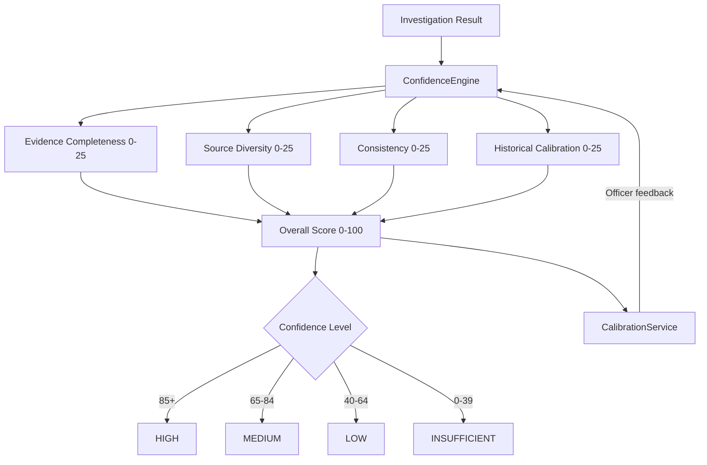

# Investigation Confidence Scoring (Pillar 1)

Quantified certainty for every compliance investigation — replacing binary pass/fail with a 4-dimension confidence framework.

## Business Value

Compliance officers need to understand not just *what* the AI found, but *how certain* it is. Confidence Scoring provides a 0-100 score decomposed into four independently measurable dimensions, enabling evidence-based decision-making.

## Architecture

## Confidence Dimensions

| Dimension | Range | Measures |
|-----------|-------|----------|
| Evidence Completeness | 0-25 | Coverage of required document categories |
| Source Diversity | 0-25 | Number and variety of independent sources |
| Consistency | 0-25 | Agreement between sources on key facts |
| Historical Calibration | 0-25 | Accuracy of similar past predictions |

## Confidence Levels

| Level | Score Range | Action |
|-------|-----------|--------|
| HIGH | 85-100 | Automated approval eligible |
| MEDIUM | 65-84 | Standard review |
| LOW | 40-64 | Enhanced review recommended |
| INSUFFICIENT | 0-39 | Additional investigation required |

## Key Components

- **`confidence_engine.py`** — Core scoring engine with dimensional computation
- **`calibration_service.py`** — Feedback loop: officer decisions calibrate future scores
- **`ConfidenceScoreCard.tsx`** — Visual breakdown in case detail view

## API Endpoints

| Method | Path | Description |
|--------|------|-------------|
| GET | `/api/confidence/scores/{case_id}` | Get confidence breakdown for a case |
| GET | `/api/confidence/calibration` | Get calibration statistics |
| POST | `/api/confidence/feedback` | Submit officer feedback for calibration |

## Configuration

- `confidence_scoring_enabled` — Feature flag (default: `true`)
- Alembic migration: `006_calibration_data`
