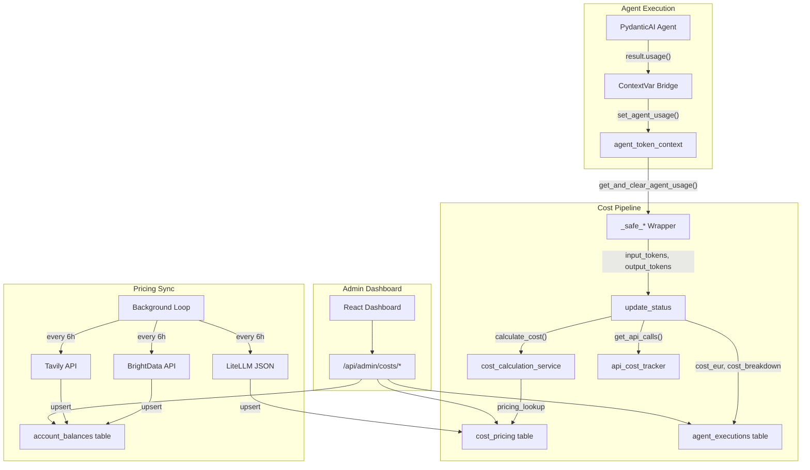

# Investigation Cost Monitoring

Per-agent, per-case, per-tenant cost tracking with automatic LLM pricing sync and an admin dashboard -- making every investigation's cost fully transparent and auditable.

## Business Value

Compliance investigations consume LLM tokens (PydanticAI agents), external API credits (BrightData scraping, Tavily search, NorthData), and compute resources. Without cost visibility, pricing decisions are guesswork -- you cannot optimize what you cannot measure.

Cost monitoring solves this by recording the exact token consumption and external API calls for every agent in every investigation. Admins see total cost per case, cost trends over time, and per-provider balance depletion. This enables:

- **Pricing accuracy**: know the true cost of each investigation to set customer pricing
- **Budget control**: monitor BrightData/Tavily credit balances with automatic refresh
- **Optimization signals**: identify which agents or countries cost the most
- **EU AI Act compliance**: token-level audit trail for every AI decision (Art. 12 logging)

## Architecture



## Data Model

### agent_executions (enriched columns)

Four columns added to the existing `agent_executions` table:

| Column | Type | Description |
|--------|------|-------------|
| `input_tokens` | INTEGER | Prompt tokens consumed |
| `output_tokens` | INTEGER | Completion tokens generated |
| `cost_eur` | NUMERIC(10,6) | Total cost in EUR |
| `cost_breakdown` | JSONB | Detailed breakdown (LLM + API costs) |

### cost_pricing

Unit prices for LLM models and external APIs, synced from LiteLLM daily:

| Column | Type | Description |
|--------|------|-------------|
| `service_name` | VARCHAR(100) | e.g., `openai/gpt-4.1-mini`, `brightdata:linkedin` |
| `input_price_eur` | NUMERIC(12,8) | Price per 1M input tokens or per request |
| `output_price_eur` | NUMERIC(12,8) | Price per 1M output tokens (NULL for APIs) |
| `unit` | VARCHAR(30) | `per_1m_tokens` or `per_request` |
| `source` | VARCHAR(20) | `litellm` (auto-synced) or `manual` (admin override) |
| `tenant_id` | UUID | NULL = global, non-NULL = tenant-specific override |

RLS enforced. Partial unique index `uq_cost_pricing_global` handles NULL tenant_id uniqueness.

### account_balances

External API provider credit balances, refreshed every 6 hours:

| Column | Type | Description |
|--------|------|-------------|
| `provider` | VARCHAR(50) | `brightdata` or `tavily` |
| `balance` | NUMERIC(12,4) | Remaining credit balance |
| `pending` | NUMERIC(12,4) | Pending charges |
| `checked_at` | TIMESTAMPTZ | Last balance check timestamp |

## Token Flow Pipeline

The token tracking pipeline bridges PydanticAI's `RunResult.usage()` to the cost database through a ContextVar:

1. **Agent runner** (e.g., `person_validation_agent.py`) calls `result.usage()` after PydanticAI execution
2. **ContextVar bridge** (`agent_token_context.py`) stores usage via `set_agent_usage()`
3. **`_safe_*` wrapper** in `osint_agent.py` reads via `get_and_clear_agent_usage()`, passes `input_tokens`/`output_tokens` to `update_status()`
4. **`update_status()`** in `agent_progress_service.py` calls `calculate_cost()` on terminal statuses
5. **`calculate_cost()`** looks up pricing (5-min cached), computes `llm_eur + api_eur = total_eur`
6. **Result** persisted to `agent_executions.cost_eur` and `cost_breakdown` (JSONB)

Three agents are wired: `person_validation`, `adverse_media`, `social_intelligence`. Non-LLM wrappers (PEPPOL, WHOIS, website scrape) have no token tracking since they don't invoke PydanticAI agents.

## Cost Calculation

```python
# LLM cost: tokens / 1M * price_per_1M
llm_eur = (input_tokens / 1_000_000 * input_price) + (output_tokens / 1_000_000 * output_price)

# API cost: count * per_request_price
api_eur = sum(count * price for service, count in external_api_calls.items())

# Total
total_eur = llm_eur + api_eur
```

Prices are stored in EUR. The pricing cache (`_pricing_cache`) uses a 5-minute TTL with `time.monotonic()` to avoid clock skew issues.

## Pricing Sync

The background sync loop runs in the FastAPI lifespan:

| Cycle | Interval | What |
|-------|----------|------|
| Initial | 10s after startup | LiteLLM pricing sync |
| Recurring | Every 6 hours | BrightData balance, Tavily balance, LiteLLM pricing |

**LiteLLM sync** fetches the [model_prices_and_context_window.json](https://github.com/BerriAI/litellm) from GitHub, parses per-token costs into per-1M-token prices, and upserts with `ON CONFLICT ... WHERE tenant_id IS NULL`. Manual admin overrides (`source = 'manual'`) are never overwritten.

**Balance sync** fetches credit balances from BrightData (`GET /customer/balance`) and Tavily (`GET /usage`) APIs, upserts to `account_balances` table.

## Admin API

Seven endpoints under `/api/admin/costs/`, protected by `require_role("super_admin", "tenant_admin")`:

| Method | Path | Description |
|--------|------|-------------|
| GET | `/case/{workflow_id}` | Per-case cost breakdown by agent |
| GET | `/summary` | Aggregate costs with day/country filters |
| GET | `/trends` | Daily/weekly cost trends for charting |
| GET | `/pricing` | Current pricing table |
| PUT | `/pricing/{id}` | Admin price override (invalidates cache) |
| GET | `/balances` | BrightData + Tavily credit balances |
| POST | `/sync-pricing` | Force immediate LiteLLM sync |

## Admin Dashboard

Three-tab React page at `/admin/costs`:

- **Overview**: stat cards (total cost, avg/case, case count, tokens), recharts AreaChart trend, provider balance cards, top cases table
- **Case Costs**: expandable table with per-agent cost breakdown
- **Pricing**: editable pricing table with source badges (litellm=auto, manual=override), "Sync from LiteLLM" button

## Seed Data

Migration 046 seeds 8 pricing entries (EUR, manual source):

| Service | Input Price | Output Price | Unit |
|---------|-----------|-------------|------|
| openai/gpt-5.2 | 2.30 | 9.20 | per_1m_tokens |
| openai/gpt-4.1-mini | 0.28 | 1.10 | per_1m_tokens |
| anthropic/claude-sonnet-4-5 | 2.76 | 13.80 | per_1m_tokens |
| brightdata:scrape | 0.01 | -- | per_request |
| brightdata:linkedin | 0.02 | -- | per_request |
| brightdata:social | 0.01 | -- | per_request |
| tavily:search | 0.005 | -- | per_request |
| northdata:api | 0.01 | -- | per_request |

These are overwritten by LiteLLM sync for LLM models but preserved for API-based services.

## Known Limitations (PoC)

- **USD/EUR conversion**: LiteLLM prices are stored as-is (USD). For PoC, the ~8% difference is acceptable. Production should apply a configurable FX rate at sync time.
- **API cost attribution**: External API call counts are tracked at case level, not agent level. The aggregate per-case cost is accurate, but per-agent API cost breakdown may include calls from other agents in the same case.
- **Token tracking coverage**: Only 3 of 13 agents currently pass tokens (person_validation, adverse_media, social_intelligence). Remaining agents need wiring as they're upgraded to PydanticAI.
