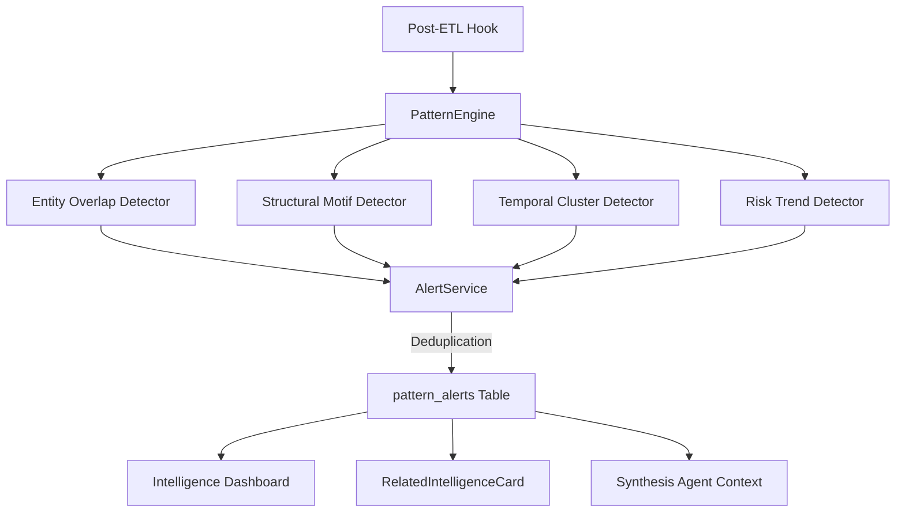

# Cross-Case Pattern Detection (Pillar 3)

Automatic detection of suspicious patterns across compliance cases — entity overlap, structural motifs, temporal clusters, and risk trends.

## Business Value

Individual case review misses systemic risk. Cross-Case Pattern Detection surfaces connections between cases that no single officer would see, identifying shell company networks, money laundering typologies, and coordinated fraud.

## Architecture

## Detectors (All Deterministic)

| Detector | Pattern | Example |
|----------|---------|---------|
| Entity Overlap | Same entity across multiple cases | Director appears in 5 shell companies |
| Structural Motif | Known typology patterns | Phoenix company, circular ownership |
| Temporal Cluster | Suspicious timing | 10 companies registered same week |
| Risk Trend | Risk score trajectories | Sector-wide risk increase |

## Alert Lifecycle

`ACTIVE → ACKNOWLEDGED → DISMISSED (with reason) → RESOLVED`

- **EU AI Act Art. 12 compliant**: Immutable evidence snapshots, mandatory dismiss reasons, full audit trail
- **Deduplication**: Same pattern_type + overlapping entities/cases = merged (not duplicated)

## Key Components

- **`pattern_engine.py`** — 4 detectors with configurable thresholds
- **`alert_service.py`** — CRUD, deduplication, lifecycle management
- **`pattern_alert.py`** — Data model with audit fields
- **`intelligence.py`** — 6 API endpoints
- **`RelatedIntelligenceCard.tsx`** — Case detail integration
- **`intelligence/page.tsx`** — Intelligence Dashboard

## API Endpoints

| Method | Path | Description |
|--------|------|-------------|
| GET | `/api/intelligence/alerts` | List alerts (filterable) |
| GET | `/api/intelligence/alerts/{id}` | Get alert details |
| POST | `/api/intelligence/alerts/{id}/acknowledge` | Acknowledge alert |
| POST | `/api/intelligence/alerts/{id}/dismiss` | Dismiss with reason |
| POST | `/api/intelligence/alerts/{id}/resolve` | Resolve alert |
| GET | `/api/intelligence/dashboard` | Dashboard statistics |

## Configuration

- `cross_case_detection_enabled` — Feature flag (default: `true`)
- Alembic migration: `008_pattern_alerts`
