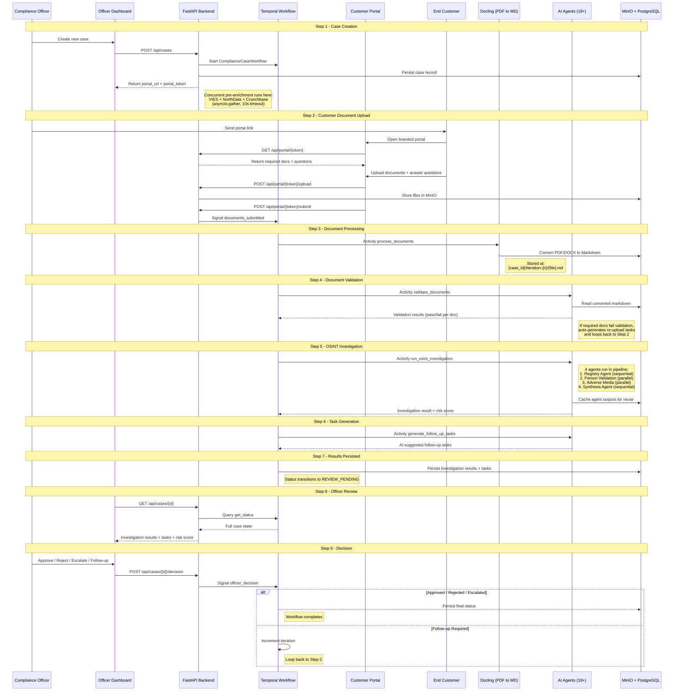

# Data Flow

Trust Relay operates as an iterative compliance loop. A single case may go through multiple iterations, each time collecting new documents or responses from the customer and re-evaluating the investigation findings.

## The 9-Step Compliance Loop



## Step-by-Step Detail

### Step 1: Case Creation

**Endpoint:** `POST /api/cases`

The officer provides company name, registration number, country, and template selection. The backend:

1. Generates a unique `case_id` and cryptographic `portal_token`
2. Persists the case record to PostgreSQL
3. Starts a `ComplianceCaseWorkflow` in Temporal
4. Runs concurrent pre-enrichment (VIES, NorthData, Crunchbase) via `asyncio.gather` with a 10-second timeout
5. Returns the `portal_url` for the customer

### Step 2: Customer Document Upload

**Endpoints:** `GET /api/portal/{token}`, `POST /api/portal/{token}/upload`, `POST /api/portal/{token}/submit`

The customer opens the branded portal, sees the required document list (driven by the workflow template), uploads files, answers questions, and submits. On submit, the backend sends a `documents_submitted` signal to the Temporal workflow.

### Step 3: Document Processing (Docling)

**Activity:** `process_documents`

Downloads uploaded files from MinIO, converts them to Markdown using IBM Docling, and stores the Markdown back to MinIO alongside the originals. This normalizes PDFs, DOCX, and images into a text format that AI agents can process.

### Step 4: Investigation Fork — KYC vs KYB

After document validation, the workflow inspects the `template_id` to determine which investigation pipeline to run. This fork is guarded by the `kyc-v1` version gate (`workflow.patched("kyc-v1")`).

**KYB path** (all templates except `kyc_natural_person`) — the standard flow:

1. `run_osint_investigation` — multi-agent OSINT pipeline (Belgian or international)
2. `run_peppol_verification` — Belgian companies only, best-effort
3. `classify_mcc` — Merchant Category Code classification

**KYC path** (`template_id == "kyc_natural_person"`) — natural person onboarding:

1. `verify_identity` — itsme/eIDAS simulation (production integration planned); extracts identity verification result and findings
2. `validate_fields` — Belgian NRN mod97, Dutch BSN 11-proof, IBAN ISO 13616; each field check produces zero or more findings
3. `run_kyc_screening` — sanctions hit, PEP match, adverse media screening

The activities `populate_knowledge_graph` and `assign_automation_tier` are explicitly **KYB-only** (`if not is_kyc:`). Natural persons do not have company graph data and do not participate in the automation tier system.

See `backend/app/workflows/compliance_case.py` — `_run_kyc_investigation()` and `_run_kyb_investigation()`.

### Step 4b: Answer Pipeline (KYC)

Portal-submitted answers (NRN, date of birth, nationality, IBAN) follow a 4-part data flow:

1. **Frontend submit**: the portal includes `answers` alongside `task_responses` in the `POST /api/portal/{token}/submit` request body
2. **Backend persistence**: the portal endpoint merges answers into `additional_data.answers` via `jsonb_set` in PostgreSQL (not replaced — merged)
3. **Workflow fetch**: after `signal_documents_submitted` is received, the `fetch_case_answers` activity reads the updated answers from the database (guarded by `fetch-answers-v1` version gate)
4. **Workflow merge**: fresh answers are merged into `input.additional_data["answers"]`, making them available to `validate_fields` and `run_kyc_screening`

The signal itself remains parameterless (Temporal determinism requirement). Answers travel through the database, not the signal payload.

### Step 5: OSINT Investigation (KYB)

**Activity:** `run_osint_investigation`

The multi-agent OSINT pipeline runs four agents in a DAG pattern. See [OSINT Pipeline](/docs/architecture/osint-pipeline) for full details. Evidence is collected cumulatively across all iterations.

### Step 6: Task Generation

**Activity:** `generate_follow_up_tasks`

The task generator (PydanticAI agent) analyzes all investigation findings — OSINT results, document validation outcomes, MCC classification, and any prior follow-up history — and suggests specific follow-up actions for the officer.

### Step 7: Results Persisted → REVIEW_PENDING

Investigation results, generated tasks, and supporting evidence are persisted to PostgreSQL and MinIO. The workflow status transitions to `REVIEW_PENDING`, making the case available for officer review in the dashboard.

### Step 8: Officer Review

**Endpoint:** `GET /api/cases/{id}` (triggers Temporal query)

The dashboard displays investigation results, risk score, AI-generated tasks, MCC classification, and the full audit trail. The officer reviews all evidence in a tabbed interface.

### Step 9: Decision

**Endpoint:** `POST /api/cases/{id}/decision`

The officer selects one of four decisions:

| Decision | Effect |
|----------|--------|
| **Approve** | Workflow completes with APPROVED status |
| **Reject** | Workflow completes with REJECTED status |
| **Escalate** | Workflow completes with ESCALATED status (for senior review) |
| **Follow-up** | Workflow loops back to Step 2 with new tasks for the customer |

## Data Organization in MinIO

```
{case_id}/
  iteration-1/
    req_incorporation_cert/
      company_cert.pdf
      company_cert.pdf.md
    req_ubo_declaration/
      ubo_form.pdf
      ubo_form.pdf.md
  iteration-2/
    followup_0/
      additional_doc.pdf
      additional_doc.pdf.md
    task_responses.json
  website_scrape.md
  company_profile.json
  osint_cache/
    registry_output.json
    person_validation_output.json
    adverse_media_output.json
    metadata.json
```

## OSINT Cache Reuse

On iteration 2+, the system checks for cached agent outputs from the previous iteration. If the cache exists and `force_full_investigation` is not set, it skips the three expensive agents (Registry, Person Validation, Adverse Media) and only re-runs Synthesis with the new documents and customer responses. This reduces follow-up investigation time from minutes to seconds.

## Customer Response Threading

When the officer requests follow-up, the customer can respond with text answers alongside document uploads. These responses are stored as `task_responses.json` in the iteration's MinIO prefix. The task generator and synthesis agents both receive prior tasks and customer responses, enabling them to assess whether previously flagged concerns have been addressed.
