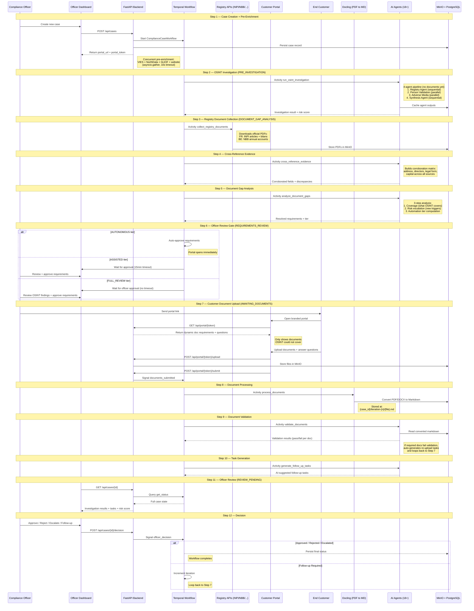

# Data Flow

Trust Relay operates as an investigation-first compliance loop. Unlike traditional KYB platforms that ask for every document upfront, the system runs a full OSINT investigation and downloads official registry documents **before** the customer is ever contacted. The portal then opens with only the documents that OSINT could not cover — typically just a Director ID.

This approach is governed by [ADR-0018](/docs/adr) (Dynamic Document Requirements) and reflects the design principle that the system can add scrutiny but never suppress risk signals.

## The 12-Step Investigation-First Loop



## Step-by-Step Detail

### Step 1: Case Creation + Pre-Enrichment

**Endpoint:** `POST /api/cases`

The officer provides company name, registration number, country, and template selection. The backend:

1. Generates a unique `case_id` and cryptographic `portal_token`
2. Persists the case record to PostgreSQL
3. Starts a `ComplianceCaseWorkflow` in Temporal
4. Runs concurrent pre-enrichment (VIES, NorthData, GLEIF, website scrape) via `asyncio.gather` with a 10-second timeout
5. Returns the `portal_url` for the customer (portal is not yet accessible — it opens after gap analysis)

### Step 2: OSINT Investigation (Pre-Investigation)

**Activity:** `run_osint_investigation` | **Status:** `PRE_INVESTIGATION`

The workflow immediately runs the full OSINT investigation pipeline — **before any customer documents exist**. This is the fundamental inversion from the previous workflow: investigation runs first so the system knows what documents it already has.

The multi-agent pipeline runs four agents in a DAG pattern (see [OSINT Pipeline](/docs/architecture/osint-pipeline) for full details):

1. **Registry Agent** (sequential) — country-specific registry lookups (KBO, INPI, ARES, etc.)
2. **Person Validation** (parallel) — PEP screening, sanctions, director verification
3. **Adverse Media** (parallel) — Tavily, BrightData, crawl4ai news scanning
4. **Synthesis Agent** (sequential) — consolidates all findings into a risk score

The investigation runs with an empty document processing result since no customer documents exist yet. Pre-enrichment data (VIES, NorthData, GLEIF) from Step 1 is available as input.

This step is guarded by the `pre-investigation-v1` Temporal version gate.

### Step 3: Registry Document Collection

**Activity:** `collect_registry_documents` | **Status:** `DOCUMENT_GAP_ANALYSIS`

**Service:** `document_evidence_collector.py`

After OSINT completes, the system downloads official documents directly from government registries. These are authoritative PDFs that replace what customers would otherwise need to upload manually.

| Country | Registry | Documents Downloaded |
|---------|----------|---------------------|
| **France** | INPI (Institut National de la Propriete Industrielle) | Articles of association, annual financial statements (bilans) |
| **Belgium** | NBB (National Bank of Belgium) | Annual accounts |

Each downloaded PDF is stored in MinIO at `{case_id}/registry-documents/{source}/{filename}` and tracked in a `DocumentManifest` that records retrieval timestamps, source URLs, and file sizes.

**Fail-safe design:** if a registry API is unavailable or the download fails, the system falls back to requesting that document from the customer. No requirement is ever silently dropped.

### Step 4: Cross-Reference Evidence

**Activity:** `cross_reference_evidence`

**Service:** `cross_reference_service.py`

All evidence collected so far — OSINT findings, pre-enrichment data, and downloaded registry documents — is compared across sources to build a **corroboration matrix**. For each key data point, the engine collects the value reported by every source, compares them pairwise, and classifies the result.

**Data points cross-referenced:**
- Company name (legal name vs. trading name)
- Registered address (city, street, postal code)
- Directors and UBOs
- Legal form
- Share capital
- Business activity (NACE codes)

**Discrepancy severity classification:**

| Pattern | Severity | Rationale |
|---------|----------|-----------|
| Address in different city/country | HIGH | Shell company indicator |
| Address formatting difference only | LOW | Normalisation artifact |
| Address same city, different street | MEDIUM | Branch vs. HQ |
| Director mismatch | HIGH | Undisclosed governance changes |
| Company name mismatch | MEDIUM | Trading name vs. legal name |
| Capital mismatch | MEDIUM | Outdated filing |
| Legal form mismatch | HIGH | Fundamental identity discrepancy |
| Activity code mismatch | MEDIUM | NACE granularity difference |

The output is a `CrossReferenceResult` containing corroborated fields (with source attribution) and discrepancies (with severity). HIGH discrepancies automatically escalate the case to `FULL_REVIEW` in the next step.

### Step 5: Document Gap Analysis

**Activity:** `analyze_document_gaps`

**Service:** `document_gap_analyzer.py`

The gap analyzer determines exactly which documents the customer must provide. This is a three-step process:

1. **Coverage analysis** — compares the workflow template's required documents against what OSINT and registry downloads have already covered. For example, if INPI returned articles of association, that requirement is marked as covered.

2. **Risk escalation** — risk signals from the investigation can trigger additional document requirements beyond the template. Examples:
   - PEP detection triggers enhanced due diligence documents
   - HIGH discrepancies trigger supporting evidence for the conflicting data point
   - Young company (< 12 months) triggers proof of business activity

3. **Automation tier computation** — determines the review gate behavior:

| Tier | Condition | Behavior |
|------|-----------|----------|
| **AUTONOMOUS** | No HIGH discrepancies, no PEP, no adverse events, low risk score | Portal opens immediately; officer notified asynchronously |
| **ASSISTED** | Minor risk signals (MEDIUM discrepancies, moderate risk) | Officer has 15-minute window to intervene; auto-approves on timeout |
| **FULL_REVIEW** | Any HIGH discrepancy, PEP match, adverse events, or high risk score | Officer must explicitly approve before portal opens |

The output is a `ResolvedDocumentRequirements` containing:
- `covered_by_osint` — requirements already satisfied (with evidence references)
- `required_from_customer` — the minimal set the customer must upload
- `risk_escalated` — additional requirements triggered by risk signals
- `automation_tier` — AUTONOMOUS / ASSISTED / FULL_REVIEW

**Key insight:** document requirements are **dynamically computed per case**, not static templates. A clean French company may only need a Director ID. A high-risk Belgian entity with PEP matches may need enhanced documentation beyond the base template.

### Step 6: Officer Review Gate

**Status:** `REQUIREMENTS_REVIEW`

The automation tier from Step 5 determines whether the officer must approve before the portal opens:

- **AUTONOMOUS:** Requirements are auto-approved. The portal opens immediately after gap analysis. The officer is notified but does not block the flow.
- **ASSISTED:** The workflow waits up to 15 minutes for officer approval. If the officer does not intervene, requirements are auto-approved.
- **FULL_REVIEW:** The workflow blocks indefinitely until the officer explicitly approves the requirements. The officer reviews OSINT findings, cross-reference results, and the computed document requirements before allowing the portal to open.

This step implements EU AI Act Article 14 (human oversight) — the officer always has the ability to override automated decisions before they reach the customer.

### Step 7: Customer Document Upload

**Endpoints:** `GET /api/portal/{token}`, `POST /api/portal/{token}/upload`, `POST /api/portal/{token}/submit`

**Status:** `AWAITING_DOCUMENTS`

The customer opens the branded portal and sees **only the documents that OSINT could not cover**. This is the key customer experience improvement: instead of uploading 5-8 documents, a typical clean case may only require a Director ID.

The portal loads the resolved requirements from `GET /api/portal/{token}`, which returns the `required_from_customer` list computed in Step 5. On submit, the backend sends a `documents_submitted` signal to the Temporal workflow.

### Step 7b: Investigation Fork — KYC vs KYB

The pre-investigation flow (Steps 2-6) applies to **KYB cases only**. KYC (natural person onboarding) follows a separate path, guarded by the `kyc-v1` version gate:

**KYC path** (`template_id == "kyc_natural_person"`):

1. `verify_identity` — itsme/eIDAS simulation (production integration planned)
2. `validate_fields` — Belgian NRN mod97, Dutch BSN 11-proof, IBAN ISO 13616
3. `run_kyc_screening` — sanctions hit, PEP match, adverse media screening

The activities `populate_knowledge_graph` and `assign_automation_tier` are explicitly **KYB-only** (`if not is_kyc:`). Natural persons do not have company graph data and do not participate in the automation tier system.

### Step 7c: Answer Pipeline (KYC)

Portal-submitted answers (NRN, date of birth, nationality, IBAN) follow a 4-part data flow:

1. **Frontend submit**: the portal includes `answers` alongside `task_responses` in the `POST /api/portal/{token}/submit` request body
2. **Backend persistence**: the portal endpoint merges answers into `additional_data.answers` via `jsonb_set` in PostgreSQL (not replaced — merged)
3. **Workflow fetch**: after `signal_documents_submitted` is received, the `fetch_case_answers` activity reads the updated answers from the database (guarded by `fetch-answers-v1` version gate)
4. **Workflow merge**: fresh answers are merged into `input.additional_data["answers"]`, making them available to `validate_fields` and `run_kyc_screening`

The signal itself remains parameterless (Temporal determinism requirement). Answers travel through the database, not the signal payload.

### Step 8: Document Processing (Docling)

**Activity:** `process_documents`

Downloads uploaded files from MinIO, converts them to Markdown using IBM Docling, and stores the Markdown back to MinIO alongside the originals. This normalizes PDFs, DOCX, and images into a text format that AI agents can process.

### Step 9: Document Validation

**Activity:** `validate_documents`

Validates that the customer-uploaded documents meet the requirements. If required documents fail validation, the workflow auto-generates re-upload tasks and loops back to Step 7.

### Step 10: Task Generation

**Activity:** `generate_follow_up_tasks`

The task generator (PydanticAI agent) analyzes all investigation findings — OSINT results, document validation outcomes, cross-reference discrepancies, MCC classification, and any prior follow-up history — and suggests specific follow-up actions for the officer.

### Step 11: Officer Review

**Endpoint:** `GET /api/cases/{id}` (triggers Temporal query)

**Status:** `REVIEW_PENDING`

The dashboard displays investigation results, risk score, AI-generated tasks, cross-reference discrepancies, MCC classification, and the full audit trail. The officer reviews all evidence in a tabbed interface.

### Step 12: Decision

**Endpoint:** `POST /api/cases/{id}/decision`

The officer selects one of four decisions:

| Decision | Effect |
|----------|--------|
| **Approve** | Workflow completes with APPROVED status |
| **Reject** | Workflow completes with REJECTED status |
| **Escalate** | Workflow completes with ESCALATED status (for senior review) |
| **Follow-up** | Workflow loops back to Step 7 with new tasks for the customer |

## Updated State Machine

The pre-investigation phase introduces three new states. The full KYB state flow:

```
CREATED → PRE_INVESTIGATION → DOCUMENT_GAP_ANALYSIS → REQUIREMENTS_REVIEW →
AWAITING_DOCUMENTS → DOCUMENTS_RECEIVED → PROCESSING → VALIDATING_DOCUMENTS →
GENERATING_TASKS → REVIEW_PENDING → {APPROVED | REJECTED | ESCALATED |
FOLLOW_UP_REQUIRED → AWAITING_DOCUMENTS (loop)}
```

See the [State Machine](/docs/architecture/state-machine) page for the full diagram including KYC states and error transitions.

## New Activities and Services

### `collect_registry_documents` Activity

**Service:** `document_evidence_collector.py`

Orchestrates PDF downloads per country. Currently supports France (INPI) and Belgium (NBB), with the country routing pattern making it straightforward to add new registries. Each download is:
- Stored in MinIO with full provenance metadata
- Tracked in a `DocumentManifest` (Pydantic model in `document_resolution.py`)
- Available for cross-referencing and officer review

### `cross_reference_evidence` Activity

**Service:** `cross_reference_service.py`

Builds a corroboration matrix comparing data points across all available sources (OSINT agents, pre-enrichment APIs, downloaded registry documents, and pre-existing case data). Uses normalisation (address abbreviation expansion, Unicode NFKD, case folding) to reduce false-positive discrepancies. Outputs a `CrossReferenceResult` with `CorroboratedField` and `FieldDiscrepancy` entries.

### `analyze_document_gaps` Activity

**Service:** `document_gap_analyzer.py`

The decision engine for dynamic document requirements. Takes the workflow template, document manifest, cross-reference result, and investigation result as input. Produces `ResolvedDocumentRequirements` containing the final list of documents the customer must provide, along with the automation tier that controls the review gate.

Key design rule: documents listed in `_NEVER_COVERED` (e.g., `director_id`) are always requested from the customer regardless of OSINT coverage. Physical identity documents cannot be auto-retrieved.

## Data Organization in MinIO

```
{case_id}/
  registry-documents/
    inpi/
      articles_of_association.pdf
      bilan_2025.pdf
    nbb/
      annual_accounts_2025.pdf
  iteration-1/
    req_director_id/
      passport_scan.pdf
      passport_scan.pdf.md
  iteration-2/
    followup_0/
      additional_doc.pdf
      additional_doc.pdf.md
    task_responses.json
  website_scrape.md
  company_profile.json
  osint_cache/
    registry_output.json
    person_validation_output.json
    adverse_media_output.json
    metadata.json
```

## OSINT Cache Reuse

On iteration 2+, the system checks for cached agent outputs from the previous iteration. If the cache exists and `force_full_investigation` is not set, it skips the three expensive agents (Registry, Person Validation, Adverse Media) and only re-runs Synthesis with the new documents and customer responses. This reduces follow-up investigation time from minutes to seconds.

## Customer Response Threading

When the officer requests follow-up, the customer can respond with text answers alongside document uploads. These responses are stored as `task_responses.json` in the iteration's MinIO prefix. The task generator and synthesis agents both receive prior tasks and customer responses, enabling them to assess whether previously flagged concerns have been addressed.
