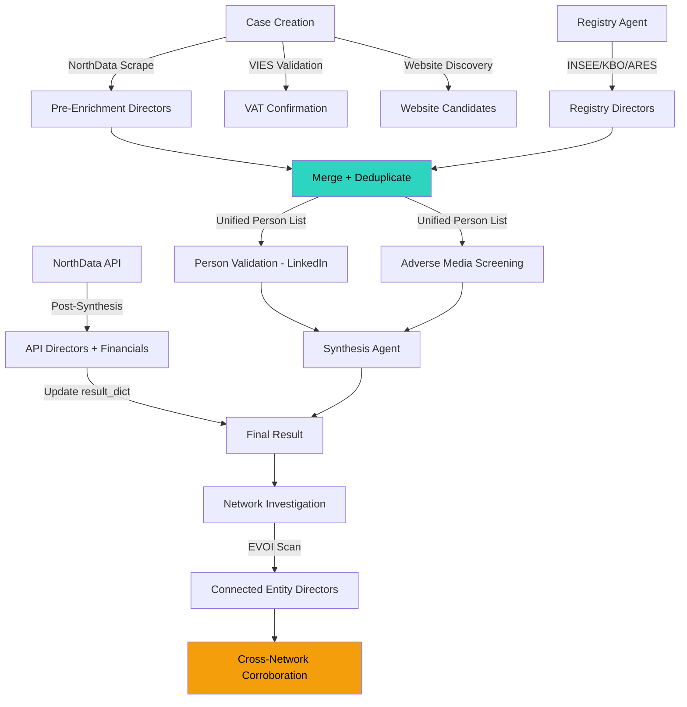
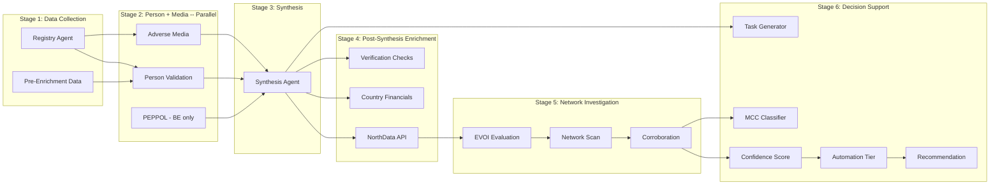

# Data Merge Architecture

The OSINT pipeline collects data from multiple independent sources -- registries, commercial databases, LinkedIn, sanctions databases, document extraction, and more. Each source provides overlapping but incomplete data. This page documents how and when data from different sources is merged, the architectural decisions behind the merge strategy, and known gaps.

## Director/Person Data Flow

Directors and UBOs are the most critical merge target: they appear in registry outputs, NorthData pre-enrichment, NorthData API responses, and customer documents. The pipeline must consolidate all sources before running person validation (LinkedIn) and adverse media screening.



**Key merge point** (teal): The director merge at stage G is where registry agent output is combined with NorthData pre-enrichment data. This merge was introduced to fix a gap where countries without registry-level director data (FR, NL) would run person validation with zero directors, producing false "no LinkedIn presence" findings.

**Post-synthesis enrichment** (amber): NorthData API data arrives after synthesis and is merged directly into `result_dict`. Directors discovered here are NOT re-validated via LinkedIn or adverse media -- they only appear in the final result and feed into network investigation.

## Investigation Pipeline Stages



### Stage Details

| Stage | Agents | Parallelism | Input | Output |
|-------|--------|-------------|-------|--------|
| 1 | Registry Agent | Sequential | Company name, registration number, country | Directors, UBOs, legal form, address, NACE, financials |
| 1 | Pre-Enrichment | Already complete (ran at case creation) | Same | NorthData scrape directors, VIES, Crunchbase, GLEIF |
| 2 | Person Validation + Adverse Media + PEPPOL | `asyncio.gather` (parallel) | Merged director list, company name | LinkedIn validations, sanctions/PEP hits, PEPPOL status |
| 3 | Synthesis Agent | Sequential | All stage 1-2 outputs | Risk score, findings, discrepancies, summary |
| 4 | NorthData API + Country Financials | Sequential (post-synthesis) | Registration number, company name | Financial snapshots, related companies, API directors |
| 5 | Network Investigation | Sequential per entity | Related companies from NorthData | Entity scans, cross-network corroboration |
| 6 | Confidence + MCC + Task Generation | Sequential | All prior outputs | Confidence score, MCC code, follow-up tasks |

## Multi-Source Director Merge -- Design Decision

### Problem

Registry agents in some countries (FR INSEE, NL KvK) don't return directors. The NorthData scraper fallback also sometimes misses directors if the public page is sparse. When person validation ran with zero directors, it produced false "no LinkedIn presence" findings -- making the company appear suspicious when it was simply a data availability issue.

### Solution

Merge directors from ALL available sources before running validation:

1. **Registry agent output** (official, highest trust, may be empty for some countries)
2. **NorthData pre-enrichment from case creation** (commercial, usually populated, stored in `additional_data.northdata_enrichment.directors`)
3. **UBOs from registry agent** (official, appended to director list for screening)
4. **Document extraction** (if documents uploaded -- but see Known Gaps below)

### Deduplication

Case-insensitive name matching preserves the first occurrence:

```python
seen: set[str] = set()
unique_directors: list[str] = []
for d in directors:
    key = d.lower().strip()
    if key not in seen:
        seen.add(key)
        unique_directors.append(d)
```

This handles exact duplicates but does NOT handle diacritics variations (e.g., "Muller" vs "Mueller") or name order differences (e.g., "Jan de Vries" vs "de Vries, Jan"). Fuzzy matching is used in the NorthData scraper for director matching but not yet in the pipeline-level merge.

### Principle

**Collect first, validate second.** Never run validation on partial data. It is better to validate 10 directors (including 2 duplicates the LLM will handle) than to validate 0 directors and produce false negative findings.

## Data Source Priority

When multiple sources provide the same field, the pipeline uses the following priority order:

| Field | Priority 1 | Priority 2 | Priority 3 |
|-------|-----------|-----------|-----------|
| Company name | Registry (official) | NorthData API | Submitted name |
| Directors | Registry + NorthData merged | NorthData API (post-synthesis) | Document extraction |
| Financials | Country-specific API (NBB, ARES, etc.) | NorthData API | Registry agent summary |
| VAT status | VIES validated | Auto-derived from registration | Submitted VAT |
| Company status | Registry (official) | NorthData scraper | NorthData API |
| Address | Registry | NorthData | VIES |
| Legal form | Registry | NorthData scraper | `additional_data` |
| NACE codes | Registry (KBO, ARES) | NorthData scraper | -- |

### Company Name for Screening

The adverse media agent receives `company_name` -- the officer-submitted name, not the registry-confirmed name. This is intentional: the submitted name is what the customer uses commercially and what adverse media articles would reference. The synthesis agent receives both the submitted name and the registry data, allowing it to flag name discrepancies.

## Known Merge Gaps

### Gap 1: NorthData API Directors Arrive Post-Synthesis (Severity: Medium)

**What happens:** The NorthData API call (lines 1584-1654 in `osint_agent.py`) runs AFTER the synthesis agent completes. Directors discovered here are added to `result_dict["directors"]` but are never validated via LinkedIn or screened for adverse media.

**Impact:** If the registry agent and pre-enrichment both missed a director, that director appears in the final result but without LinkedIn validation or sanctions screening. The network investigation may scan their companies, but the person themselves is not screened.

**Mitigation:** The NorthData pre-enrichment (which runs at case creation) uses the same NorthData scraper, so directors are usually already captured. The API call adds directors only as a fallback when `result_dict["directors"]` is empty.

**Fix complexity:** Medium. Would require either (a) moving the NorthData API call before synthesis, or (b) running a targeted person validation pass on newly discovered directors after the API call.

### Gap 2: Document-Extracted UBOs Arrive After OSINT Pipeline (Severity: Low)

**What happens:** UBO document extraction (`extract_document_data`) runs in the Temporal workflow AFTER the OSINT pipeline completes. Extracted UBOs are merged into the investigation result at the workflow level (lines 826-849 in `compliance_case.py`), but they are never fed back into person validation or adverse media screening.

**Impact:** UBOs discovered from customer-uploaded documents (e.g., UBO register extracts) appear in the final result but without LinkedIn validation or sanctions screening. They are included in the graph ETL and confidence scoring, but not in the OSINT agents' analysis.

**Mitigation:** UBOs from the registry agent (KBO, etc.) ARE screened because they are merged into the director list before validation. Only document-extracted UBOs that differ from registry UBOs are affected.

**Fix complexity:** Low-Medium. The workflow could pass extracted UBO names back to the OSINT pipeline for a targeted screening pass, but this would add latency and complexity to the workflow.

### Gap 3: VIES Data Not Directly Consumed by OSINT Agents (Severity: Low)

**What happens:** VIES validation runs at case creation and is stored in `additional_data.vies_enrichment`. The OSINT pipeline does not explicitly extract or use VIES data -- it passes through to the synthesis agent only as part of the opaque `additional_data` dict, not as a named parameter.

**Impact:** The synthesis agent's system prompt does not include a dedicated VIES section. VIES-confirmed company name and address are available in the CompanyProfile but are not cross-referenced against registry data within the synthesis prompt.

**Mitigation:** The synthesis agent has access to `registry_data` which includes address and company name from the registry. VIES data is primarily used for VAT validation rather than entity verification, so the impact on risk assessment is minimal.

**Fix complexity:** Low. Add a `vies_data` parameter to the synthesis agent and include a dedicated VIES cross-reference section in the synthesis prompt.

### Gap 4: Adverse Media Uses Submitted Company Name (Severity: Informational)

**What happens:** The adverse media agent receives the officer-submitted `company_name`, not the registry-confirmed legal name.

**Impact:** This is actually correct behavior for media screening -- commercial names, trading names, and brand names are more likely to appear in news articles than official legal names. However, if the submitted name has a typo or abbreviation, relevant adverse media may be missed.

**Mitigation:** The adverse media agent also screens all directors by name, providing a secondary search vector even if the company name is imprecise.

### Gap 5: Financial Data Not Available to Synthesis Agent (Severity: Medium)

**What happens:** For non-Belgian countries, structured financial data from the NorthData API is extracted AFTER synthesis (lines 1584-1665 in `osint_agent.py`). The synthesis agent only sees `financials_summary` (a text field from the registry agent), not the structured `FinancialHealthReport`.

**Impact:** The synthesis agent cannot perform quantitative financial analysis (solvency ratios, trend analysis, revenue decline detection) for non-Belgian companies. Belgian companies are unaffected because the NBB financial data is included in the registry agent output.

**Mitigation:** The `financials_summary` text field from the registry agent contains a narrative summary of financial data when available. The synthesis prompt includes instructions for financial trend analysis, but these only activate when structured data is in the registry output.

**Fix complexity:** Medium. Would require moving the NorthData API financial extraction before synthesis, or running a second synthesis pass after financial data is available.

### Gap 6: Cached Results Skip Director Merge on Retry (Severity: Low)

**What happens:** When retrying failed agents from cache (lines 734-801 in `osint_agent.py`), the director list is reconstructed from the cached `registry_data` but does NOT include pre-enrichment directors from `additional_data.northdata_enrichment`.

**Impact:** On follow-up iterations where person validation is retried, the retry may use a smaller director list than the original run.

**Mitigation:** Follow-up iterations (iteration > 1) typically reuse all cached data without retrying, so this path is rarely triggered. The cache self-healing retry only activates when a cached agent has error findings.

**Fix complexity:** Low. Apply the same merge logic used in the fresh-run path to the retry path.

## Architectural Principles

1. **Collect first, validate second** -- Never run validation agents on partial data. Merge all available sources before validation.

2. **Graceful degradation over hard failure** -- If a data source is unavailable, continue with whatever data is available. A partial investigation is better than no investigation.

3. **Post-synthesis enrichment is additive only** -- Data added after synthesis (NorthData API, country financials, verification checks) enriches the final result but does not trigger re-analysis. This is a deliberate trade-off between completeness and latency.

4. **Registry data is authoritative** -- When registry data conflicts with commercial data, registry data takes priority. But when registry data is absent, commercial data fills the gap.

5. **Evidence provenance is mandatory** -- Every data source is tracked with its origin (`source` field in directors, findings, evidence bundles). The officer dashboard shows where each piece of data came from.
