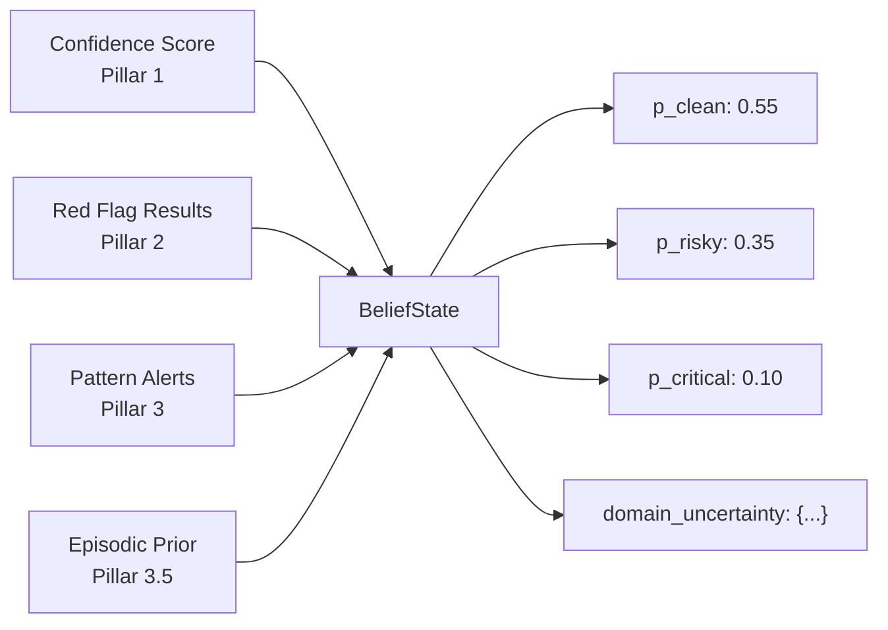
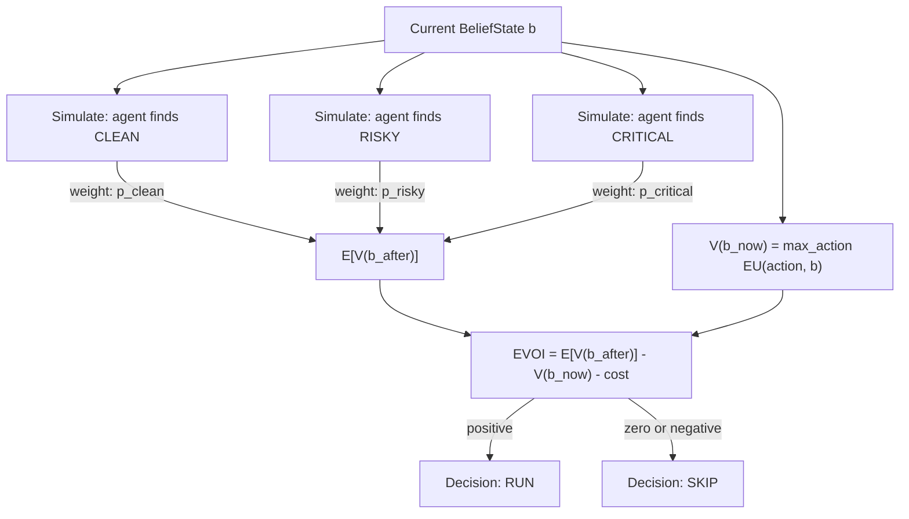
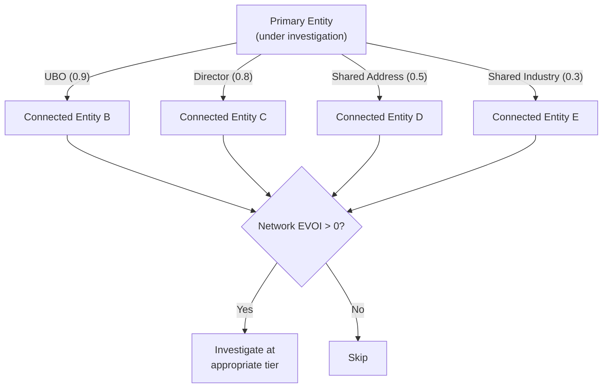
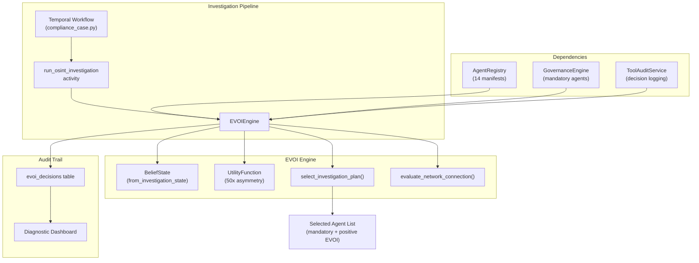

# EVOI Engine

Expected Value of Investigation — a decision-theoretic framework that computes whether running each additional investigation agent has positive expected value, given the current belief state about an entity's risk profile.

## Why This Matters

Traditional compliance platforms run every entity through the same fixed investigation pipeline: same agents, same depth, same cost. This is wasteful for clearly clean entities and dangerously shallow for complex risky ones.

The EVOI Engine applies formal decision theory (Raiffa & Schlaifer, 1961) to dynamically determine investigation depth. Each candidate agent is evaluated against the question: *"Given what we already know, will running this agent change the optimal decision?"* If the answer is no — because the entity is already clearly clean or clearly risky — the agent is skipped.

No competitor in RegTech has formal decision-theoretic investigation depth optimization. This is architecturally novel: instead of heuristic "risk tiers," EVOI provides a mathematically grounded framework with an auditable decision trail.

## Core Concepts

### BeliefState

The foundation of EVOI is a probability distribution over three mutually exclusive risk states:

| State | Meaning |
|-------|---------|
| `p_clean` | Entity is legitimate, no compliance concerns |
| `p_risky` | Entity has moderate risk signals requiring attention |
| `p_critical` | Entity poses serious compliance risk (sanctions, fraud, etc.) |

These probabilities always sum to 1.0 (enforced by a Pydantic model validator that normalizes after construction). The BeliefState is derived **deterministically** from Pillar 1-3 outputs — no LLM inference involved:

- **Confidence score** sets the base distribution (HIGH/MEDIUM/LOW/INSUFFICIENT)
- **Red flags** shift probability toward risky/critical based on severity
- **Pattern alerts** from cross-case detection further adjust the distribution
- **Episodic priors** from similar past investigations provide a subtle initial adjustment
- **Domain uncertainty** tracks which information domains remain unresolved



Defined in `backend/app/models/evoi.py` as `BeliefState.from_investigation_state()`.

### Domain Uncertainty

Each investigation domain starts at uncertainty 1.0 and decreases as agents complete their work. The domain map ties agents to the information domains they resolve:

| Agent | Domains Resolved |
|-------|-----------------|
| `registry_agent` | identity, ownership, corporate_structure |
| `belgian_agent` | identity, ownership, corporate_structure, financial_health |
| `person_validation_agent` | identity, pep |
| `adverse_media_agent` | sanctions, pep, adverse_media |
| `document_validator` | document_integrity |
| `mcc_classifier` | business_activity |

When an agent completes, its domains drop by 0.7 (floored at 0.1). High remaining uncertainty in a domain increases the EVOI of agents that target that domain.

### Utility Function

The `UtilityFunction` encodes the asymmetric cost structure of compliance decisions:

| Parameter | Default | Meaning |
|-----------|---------|---------|
| `reward_correct_approve` | 100 | Value of correctly approving a clean entity |
| `reward_correct_reject` | 50 | Value of correctly rejecting a risky entity |
| `cost_false_negative` | 10,000 | Cost of approving a truly risky entity |
| `cost_false_positive` | 200 | Cost of rejecting a truly clean entity |
| `cost_escalation` | 80 | Cost of escalating (human review overhead) |

The **50x asymmetry** (`cost_false_negative` / `cost_false_positive` = 50) is the regulatory-safe default: it is far more costly to miss a risky entity than to over-investigate a clean one. This asymmetry drives the system toward deeper investigation whenever risk signals are present.

For any given BeliefState, the utility function computes the expected utility of three possible actions — approve, reject, escalate — and selects the one with the highest expected value:

```
EU(approve | b) = p_clean * 100 + p_risky * (-5000) + p_critical * (-10000)
EU(reject  | b) = p_clean * (-200) + p_risky * 50 + p_critical * 50
EU(escalate| b) = p_clean * (-80) + p_risky * 40 + p_critical * 40
```

Approve is only optimal when `p_clean` is very high (roughly &gt;= 0.99), because the penalty for a false negative is so severe.

## How EVOI Is Computed

The core formula:

```
EVOI(agent) = E[V(b_after)] - V(b_now) - cost(agent)
```

Where:
- **V(b_now)** = value of the optimal action under the current belief state
- **E[V(b_after)]** = expected value of the optimal action after running the agent
- **cost(agent)** = estimated API/token cost from the agent's manifest

If EVOI &gt; 0, the agent is worth running. If EVOI &lt;= 0, the information gain does not justify the cost.



### Posterior Simulation

To compute E[V(b_after)], the engine simulates three hypothetical outcomes (clean, risky, critical) weighted by the current belief. For each outcome, it computes the posterior belief by shifting probabilities based on:

1. The agent's `information_gain_domains` — which domains it resolves
2. The current domain uncertainty — higher uncertainty means stronger belief shift
3. A resolution rate (default 0.7, configurable) — how effectively the agent resolves uncertainty

The shift is capped at 30% per finding to prevent any single agent from causing extreme belief swings.

### Investigation Plan Selection

`EVOIEngine.select_investigation_plan()` assembles the ordered list of agents to run:

1. **Mandatory agents** always run (enforced by the GovernanceEngine)
2. **Optional agents** are ranked by EVOI descending
3. Only agents with positive EVOI are included

This means a clearly clean entity might run only the mandatory sanctions check, while a suspicious entity with high domain uncertainty triggers the full pipeline.

## Network EVOI

Single-entity EVOI answers: *"Should we investigate this entity deeper?"* Network EVOI extends this to connected entities discovered via the knowledge graph: *"Should we investigate entity B because of its relationship to entity A?"*



### Connection Weights

Relationship types carry different investigation value:

| Relationship | Weight | Rationale |
|-------------|--------|-----------|
| UBO (ultimate beneficial owner) | 0.9 | Direct control relationship |
| Director | 0.8 | Governance authority |
| Shared address | 0.5 | Operational proximity |
| Shared industry | 0.3 | Sector correlation |

### Network EVOI Formula

```
Network_EVOI = connection_weight * avg_primary_uncertainty * 100 - estimated_cost
```

The computation is bounded by safety limits:

| Setting | Default | Purpose |
|---------|---------|---------|
| `evoi_max_network_depth` | 2 | Maximum hops from primary entity |
| `evoi_min_connection_weight` | 0.3 | Minimum relationship strength to consider |
| `evoi_recent_data_threshold_days` | 30 | Reuse existing data if investigated recently |
| `evoi_network_budget_multiplier` | 3.0 | Budget ceiling relative to primary investigation |

### Scan Tier Assignment

When Network EVOI is positive, the connected entity is assigned to an investigation tier based on connection weight:

| Connection Weight | Tier | Investigation Depth |
|------------------|------|-------------------|
| &gt;= 0.8 | `tier_2` | Full investigation |
| &gt;= 0.5 | `tier_1` | Moderate investigation |
| &lt; 0.5 | `tier_0` | Light scan |

### Data Reuse

If a connected entity was investigated within `evoi_recent_data_threshold_days` (default 30), the engine returns a `"reuse"` decision rather than re-investigating. This prevents redundant work when the same entity appears across multiple cases.

## Architecture



### Key Source Files

| File | Purpose |
|------|---------|
| `backend/app/services/evoi_engine.py` | Core EVOIEngine class with `compute_evoi()`, `select_investigation_plan()`, `evaluate_network_connection()` |
| `backend/app/models/evoi.py` | BeliefState, UtilityFunction, EVOIResult, NetworkEVOIResult |
| `backend/app/models/agent_manifest.py` | AgentManifest with `information_gain_domains` |
| `backend/app/models/investigation_episode.py` | EpisodicPrior for Bayesian adjustment |
| `backend/app/services/agent_registry.py` | Registry of 14 agent manifests |
| `backend/app/services/governance_engine.py` | Safety net enforcing mandatory agents |
| `backend/alembic/versions/011_evoi_decisions.py` | Database migration for the audit table |

### Integration with GovernanceEngine

The GovernanceEngine acts as a safety net over EVOI decisions:

1. **Pre-execution check** determines mandatory agents (e.g., sanctions screening is always required). These agents run regardless of their EVOI score.
2. **Post-execution check** validates that no risk signals were suppressed. If sanctions hits exist, additional agents become mandatory.
3. **Belief-based override** — if `p_critical > 0.15`, the GovernanceEngine forces full investigation depth, overriding any EVOI-based skipping.

The system can ADD scrutiny but NEVER suppress risk signals. EVOI optimizes the happy path (clearly clean entities); governance ensures the critical path is never shortcut.

## Audit Trail

Every EVOI decision is persisted to the `evoi_decisions` table using the guard-and-swallow pattern (logging failures never break the investigation). The table captures:

- Full belief state at decision time (`belief_p_clean`, `belief_p_risky`, `belief_p_critical`)
- Domain uncertainties (JSONB)
- EVOI computation components (`v_now`, `e_v_after`, `step_cost`)
- Decision outcome (`run`, `skip`, `investigate`, `reuse`)
- Network context (connected entity, connection type, weight, depth)
- Governance override flag and event ID

This provides complete traceability for regulatory audits: for any case, you can reconstruct exactly why each agent was run or skipped, what the belief state was at each step, and whether governance overrides were applied.

## Configuration

All EVOI settings are exposed via `pydantic-settings` in `backend/app/config.py`:

| Setting | Default | Description |
|---------|---------|-------------|
| `evoi_enabled` | `true` | Feature flag for the entire EVOI subsystem |
| `evoi_max_network_depth` | `2` | Maximum graph traversal depth for network EVOI |
| `evoi_network_budget_multiplier` | `3.0` | Budget ceiling as multiple of primary investigation cost |
| `evoi_recent_data_threshold_days` | `30` | Days before connected entity data is considered stale |
| `evoi_min_connection_weight` | `0.3` | Minimum relationship weight to trigger network evaluation |
| `evoi_domain_resolution_default` | `0.7` | Default rate at which an agent resolves domain uncertainty |

## Worked Example

Consider a Belgian entity with moderate confidence and one active red flag:

**Step 1: Build BeliefState**

- Confidence score: 72 (MEDIUM) --> base: `p_clean=0.55, p_risky=0.35, p_critical=0.10`
- One "high" severity red flag --> shift: `p_clean=0.45, p_risky=0.40, p_critical=0.15`
- No pattern alerts, no episodic prior
- Agents completed so far: `registry_agent` --> identity, ownership, corporate_structure reduced to 0.3

**Step 2: Compute EVOI for each candidate agent**

| Agent | Domains | Domain Uncertainty | EVOI | Decision |
|-------|---------|-------------------|------|----------|
| `adverse_media_agent` | sanctions, pep, adverse_media | all at 1.0 | +12.4 | **run** |
| `person_validation_agent` | identity, pep | identity=0.3, pep=1.0 | +6.2 | **run** |
| `mcc_classifier` | business_activity | 1.0 | -0.3 | skip |

The `adverse_media_agent` has the highest EVOI because its target domains (sanctions, pep, adverse_media) are all at maximum uncertainty. The `mcc_classifier` has negative EVOI because resolving `business_activity` alone would not change the optimal action given the existing red flag.

**Step 3: GovernanceEngine override**

Because `p_critical=0.15`, governance forces full pipeline execution regardless. The `mcc_classifier` runs despite negative EVOI.

**Step 4: Network EVOI**

The knowledge graph reveals a UBO connection (weight=0.9) to another entity. Network EVOI = `0.9 * avg_uncertainty * 100 - 0.008` = positive. The connected entity is assigned to `tier_2` investigation.
