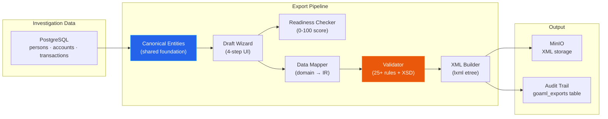
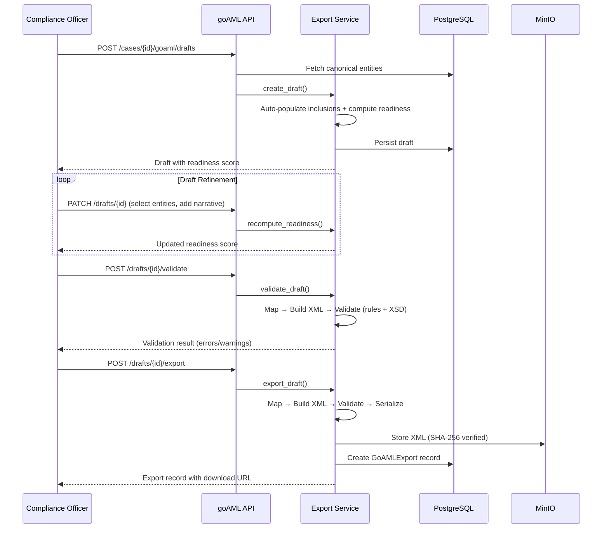

# goAML XML Export

Trust Relay implements a full **goAML XML export pipeline** that transforms investigation data into regulatory filings compliant with the UNODC goAML standard. This enables compliance officers to generate Suspicious Transaction Reports (STRs) directly from completed investigations, ready for submission to national Financial Intelligence Units (FIUs).

---

## What is goAML?

**goAML** (go Anti-Money Laundering) is the United Nations Office on Drugs and Crime (UNODC) standard software platform for FIUs worldwide. Over 60 countries use goAML to receive, process, and analyze suspicious transaction reports from reporting entities (banks, payment providers, crypto exchanges, insurance companies).

Belgium's CTIF-CFI has mandated goAML exclusively since September 2024. The EU Anti-Money Laundering Authority (AMLA) is mandating standardized STR formats from July 2027. Trust Relay's goAML integration positions reporting entities to meet both current national and upcoming EU-wide requirements.

### Supported Report Types (Phase 1)

| Code | Type | Description |
|------|------|-------------|
| STR | Suspicious Transaction Report | Core AML report — the primary filing type |
| SAR | Suspicious Activity Report | Broader activity-based report |

Phase 2 will add CTR (Cash Transaction Report), TFTR/TFAR (Terrorism Financing), and PEPR/PEPTR (PEP Reports).

### Supported Countries (Phase 1)

| Country | FIU | Profile |
|---------|-----|---------|
| Belgium | CTIF-CFI | `profiles/be.toml` |
| Luxembourg | CRF-FIU | `profiles/lu.toml` |

---

## Architecture

The export pipeline follows a five-stage linear flow: canonical entities are assembled from investigation data, enriched through a draft wizard, validated against country-specific rules, serialized to XML, and stored with full audit trail.



### Pipeline Components

| Component | Module | Responsibility |
|-----------|--------|----------------|
| Canonical Entities | `app/models/canonical_entities.py` | Shared data model (persons, accounts, transactions) |
| Country Profiles | `app/goaml/profile_loader.py` | TOML-based FIU configuration with merge hierarchy |
| Indicator Service | `app/goaml/indicator_service.py` | Country-specific indicator codes (predicate offences, suspicion reasons) |
| Data Mapper | `app/goaml/mapper.py` | Transforms canonical entities to goAML IR models |
| XML Builder | `app/goaml/xml_builder.py` | Serializes IR to lxml element tree with `_my_client` tag logic |
| Validator | `app/goaml/validator.py` | 25+ business rules + optional XSD schema validation |
| Readiness Checker | `app/goaml/readiness.py` | Weighted 0-100 score with per-category breakdown |
| Export Service | `app/goaml/export_service.py` | Orchestrates the full pipeline: draft creation through XML generation |

---

## Canonical Entities (Shared Foundation)

The canonical entity model (`app/models/canonical_entities.py`) is the shared data foundation that feeds the goAML export pipeline and will be reused by future products (Shield customs screening, VoP verification). Three entity types mirror the goAML schema structure:

| Entity | Schema | Key Fields |
|--------|--------|------------|
| **PersonSchema** | Natural person or legal entity | `first_name`, `last_name`, `entity_name`, `role`, `date_of_birth`, `nationality`, `identification[]`, `addresses[]`, `pep_status`, `sanctions[]` |
| **AccountSchema** | Bank account | `iban`, `swift_bic`, `institution_name`, `balance`, `currency`, `opened_date`, `closed_date` |
| **TransactionSchema** | Financial transaction | `transaction_number`, `transaction_date`, `amount_local`, `currency_local`, `from_account_id`, `from_person_id`, `to_account_id`, `to_person_id` |

The `CanonicalEntities` container aggregates all three types plus `AccountSignatorySchema` junction records:

```python
class CanonicalEntities(BaseModel):
    persons: list[PersonSchema]
    accounts: list[AccountSchema]
    transactions: list[TransactionSchema]
    signatories: list[AccountSignatorySchema]
```

These entities are persisted in PostgreSQL via 4 ORM tables (`investigation_persons`, `investigation_accounts`, `investigation_account_signatories`, `investigation_transactions`) and populated during the OSINT investigation phase.

---

## Country Profile System

Each FIU has specific requirements for XML structure, mandatory fields, indicator codes, and validation rules. Trust Relay handles this through a TOML-based profile system with a three-layer merge hierarchy:

1. **`_base.toml`** -- sensible defaults shared across all countries
2. **`<country_code>.toml`** -- country-specific overrides (disabled nodes, currency, FIU name)
3. **Tenant configuration** -- runtime overrides (e.g., `rentity_id` assigned by the FIU)

The `GoAMLCountryProfile` is a frozen dataclass that captures:

- **`disabled_nodes`**: XML elements to suppress (e.g., Belgium disables `rentity_branch`)
- **`supported_report_types`**: which report types the FIU accepts
- **`assertions`**: validation parameters (IBAN regex, max transactions, funds code matching)
- **`indicators`**: predicate offence and suspicion reason codes loaded from `indicators/<cc>_indicators.toml`
- **`xsd_path`**: optional XSD schema file for structural validation

---

## Readiness Scoring

Before an officer can export, the readiness checker computes a weighted 0-100 score across five categories. This guides the officer through the draft wizard by highlighting exactly what data is missing.

| Category | Weight | Checks |
|----------|--------|--------|
| **Report Metadata** | 20% | `reason_populated`, `indicators_selected`, `entity_reference` |
| **Persons** | 25% | `has_persons`, `all_have_names`, `all_have_dob`, `all_have_nationality` |
| **Transactions** | 30% | `has_transactions`, `all_have_amount`, `all_have_date`, `all_have_parties` |
| **Accounts** | 15% | `all_have_holder`, `ibans_valid`, `swifts_valid` |
| **Compliance** | 10% | `predicate_offence_present` (required for STR/SAR/TFTR/TFAR) |

The readiness score is recomputed on every draft update (PATCH endpoint) and returned alongside the draft data so the frontend can render progress indicators per wizard step.

---

## Validation Engine

The validator (`GoAMLValidator`) enforces 25+ rules at three levels, producing typed `ValidationIssue` instances partitioned by severity (error, warning, info):

### Report-Level Rules

| Rule | Severity | Description |
|------|----------|-------------|
| R1 | Error | STR/SAR/TFTR/TFAR must have at least one predicate offence indicator (PO-*) |
| R5 | Error | `currency_code_local` must match country profile |
| R10 | Warning | Entity with "trust" in business field should have legal form 273 |
| R14 | Error | Reason/narrative required for applicable report types |
| R15 | Error | `entity_reference` must be present and non-empty |
| TRS-02 | Error | Transaction count must not exceed profile maximum |

### Transaction-Level Rules

| Rule | Severity | Description |
|------|----------|-------------|
| R7 | Error | Transaction date must not be in the future |
| R8 | Error | `amount_local` must be greater than zero |
| TRS-01 | Error | Transaction numbers must be unique within report |
| TRS-03 | Error | Transfer (funds_code Q) requires accounts on both sides |
| TRS-04 | Error | From/to funds codes must match (when profile requires) |

### Person and Account Rules

| Rule | Severity | Description |
|------|----------|-------------|
| R11 | Warning | Client person birthdate should not be blank |
| R12 | Error | Birthdate must not be placeholder 1900-01-01 |
| R13 | Error | Nationality must not be "UNKNOWN" |
| IBAN-01 | Error | IBAN must match profile regex pattern |
| BIC-01 | Error | SWIFT/BIC must match profile regex pattern |
| ACC-01 | Error | When IBAN present, account field must equal IBAN |
| ACC-02 | Error | When IBAN present, SWIFT must be provided |
| R6 | Error | Client account must have at least one signatory |
| R9 | Error | Closed/blocked account requires a closed date |

### XSD Schema Validation

When an XSD file is available for the country profile (`xsd/` directory), the validator additionally runs full XML schema validation via `lxml.etree.XMLSchema`, catching structural issues that business rules cannot express.

---

## XML Builder

The `GoAMLXMLBuilder` serializes the IR model tree (`GoAMLReport`) into an lxml element tree, respecting:

- **Disabled nodes**: elements listed in `profile.disabled_nodes` are silently suppressed
- **`_my_client` tag variants**: goAML uses different XML tag names for "my client" vs. third-party entities (e.g., `t_from_my_client` vs. `t_from`, `from_account_my_client` vs. `from_account`)
- **UTF-8 XML output**: with XML declaration, pretty-printed

The builder output is validated before storage and the raw XML bytes are persisted to MinIO with SHA-256 hash for integrity verification.

---

## API Endpoints

Nine endpoints cover the full regulatory filing workflow:

### Profile & Indicator Discovery

| Method | Path | Description |
|--------|------|-------------|
| GET | `/goaml/profiles` | List available FIU country profiles |
| GET | `/goaml/profiles/{country_code}/indicators` | List indicator codes filtered by report type |

### Draft Lifecycle

| Method | Path | Description |
|--------|------|-------------|
| POST | `/cases/{case_id}/goaml/drafts` | Create a new report draft (auto-populates from investigation data) |
| GET | `/cases/{case_id}/goaml/drafts/active` | Get the currently active draft |
| PATCH | `/cases/{case_id}/goaml/drafts/{draft_id}` | Update draft fields + recompute readiness |

### Validation & Export

| Method | Path | Description |
|--------|------|-------------|
| POST | `/cases/{case_id}/goaml/drafts/{draft_id}/validate` | Dry-run validation (business rules + XSD) |
| POST | `/cases/{case_id}/goaml/drafts/{draft_id}/export` | Generate final XML, store in MinIO, create audit record |

### Export History

| Method | Path | Description |
|--------|------|-------------|
| GET | `/cases/{case_id}/goaml/exports` | List all exports for a case |
| GET | `/goaml/exports/{export_id}/download` | Download the generated XML file |

All endpoints require authentication (`get_current_user`) and tenant context (`get_current_tenant`).

---

## Database Schema

Seven tables support the goAML pipeline (migration 031):

| Table | Purpose |
|-------|---------|
| `investigation_persons` | Canonical persons (natural + legal entities) |
| `investigation_accounts` | Bank accounts with IBAN, SWIFT, balance |
| `investigation_account_signatories` | Person-to-account junction (signatory role) |
| `investigation_transactions` | Financial transactions with from/to parties |
| `goaml_report_drafts` | Draft state: narrative, indicators, selected entities, readiness |
| `goaml_exports` | Immutable export records: XML hash, MinIO key, validation result |
| `goaml_enum_mappings` | Tenant-customizable enum code translations |

---

## Data Flow Summary



---

## Phase 2 Roadmap

- **Additional report types**: CTR, TFTR, TFAR, PEPR, PEPTR
- **Additional country profiles**: Germany (BaFin), Malta (FIAU), Netherlands (FIU-NL), Switzerland (MROS)
- **Multi-party transactions**: supporting transactions with more than two sides
- **Goods/services node**: for trade-based money laundering scenarios
- **Batch export**: bulk generation of reports across multiple cases
