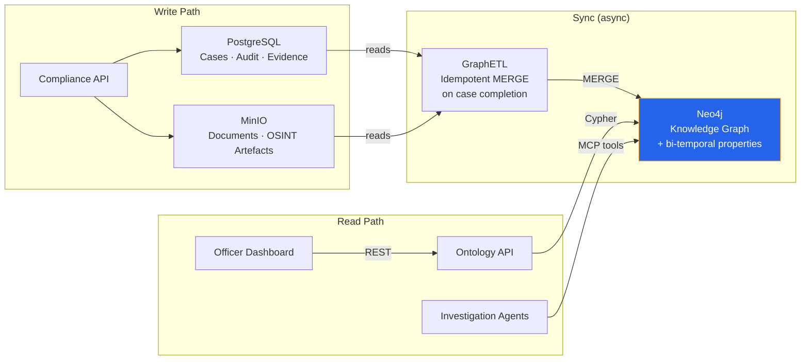
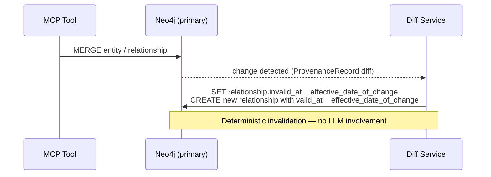
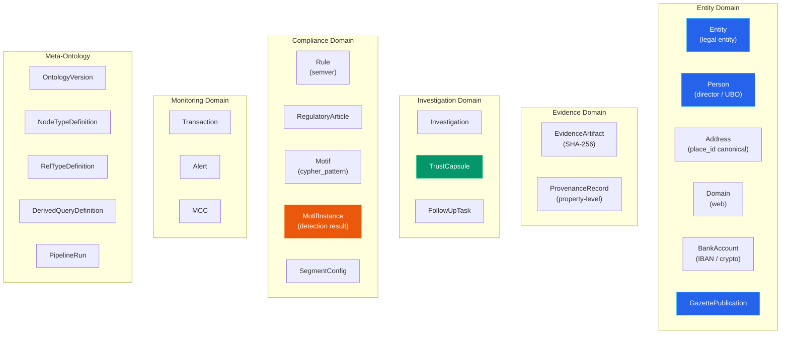

# Knowledge Graph

TrustRelay stores all compliance knowledge in a **Neo4j property graph** with **native bi-temporal properties** on nodes and relationships. This page covers the storage architecture, the primary-facts-only schema principle, the complete constraint/index set, sizing, and the CQRS separation that makes the graph safe to fail independently of the core workflow.

---

## CQRS Architecture

PostgreSQL owns transactional writes. Neo4j owns graph reads. Neither depends on the other being up.



| Concern | Store | Rationale |
|---------|-------|-----------|
| Transactional writes | PostgreSQL + MinIO | ACID, proven schema, existing tooling |
| Analytical reads | Neo4j | Variable-length traversals in O(k) where k = matched subgraph size — independent of total graph size |
| Synchronisation | GraphETL | Cypher `MERGE` on natural keys; processing the same case twice is idempotent |
| Temporal bookkeeping | Native bi-temporal properties | `valid_at`/`invalid_at` (valid-time) and `created_at`/`expired_at` (transaction-time) on relationships; see §Bitemporal Overlay below |

**Fault isolation**: Neo4j availability has zero impact on the core compliance workflow. All graph operations are feature-flagged — when disabled, every method returns neutral values.

---

## GraphETL Pipeline

The `GraphETL` class (`backend/app/services/graph_etl.py`) transforms compliance case data into graph nodes and relationships. It runs **after each OSINT investigation iteration** (not only on final approval) and is fully idempotent via Cypher `MERGE`.

### ETL Steps (12 steps, best-effort isolation)

Each step is wrapped in try/catch — failures are logged and collected but never block subsequent steps.

| Step | Creates | Depends on |
|------|---------|------------|
| 0. Investigation | Investigation node + TARGETS relationship | case_id |
| 1. Company | Company node (MERGE on registration_number) | case_data |
| 2. Directors | Person nodes + HAS_DIRECTOR relationships | registration_number |
| 3. UBOs | Person nodes + HAS_UBO relationships | registration_number |
| 4. Establishments | Establishment nodes + HAS_ESTABLISHMENT | registration_number |
| 5. Findings | Finding nodes + HAS_FINDING relationships | investigation_result |
| 6. Evidence | Evidence nodes + BASED_ON relationships | findings |
| 7. Sanctions | SanctionMatch nodes + SANCTIONED relationships | sanctions_hits |
| 8. Financial Metrics | FinancialMetric nodes + FILED_FINANCIALS | financial_health_report |
| 9. Contagion Detection | CONTAGION_FROM cross-company relationships | shared directors |
| 10. Evidence Links | EVIDENCED_BY: Company → Evidence | evidence list |
| 11. **Provenance Records** | ProvenanceRecord + EvidenceArtifact nodes with PROVED_BY/SOURCE | finding details |
| 12. **Regulatory Linkage** | SUBJECT_TO: Company → RegulatoryArticle | country |

### Provenance Creation (Step 11)

Each finding's `details` dict generates per-property provenance chains:

```
Company ──PROVED_BY──▸ ProvenanceRecord ──SOURCE──▸ EvidenceArtifact
                       (property_name,              (mcp_tool_id,
                        property_value,              artifact_type,
                        captured_at)                 captured_at)
```

Tool ID mapping is automatic: `source` strings like "KBO/BCE public search" map to `kbo_registry_lookup`, "NBB/CBSO filings" maps to `nbb_financial_lookup`, etc.

### Regulatory Linkage (Step 12)

Companies are linked to applicable `RegulatoryArticle` nodes via `SUBJECT_TO` based on country:
- **All EEA companies**: AMLD6
- **BE/NL/LU/DE/FR**: + PSD2
- **BE**: + PEPPOL, VAT

### Backfill Endpoint

For existing cases that were processed before the provenance/compliance ETL was added:

```
POST /api/graph/backfill-etl/{case_id}
```

Re-reads investigation results from the case and runs the full ETL pipeline including provenance and regulatory steps.

### Incremental ETL

The ETL also supports incremental ingestion during the pipeline (before synthesis completes):
- `ingest_registry_data()` — after registry agent: Company, Directors, UBOs, Establishments
- `ingest_media_data()` — after adverse media: Findings, Evidence, Sanctions
- `ingest_synthesis_data()` — after synthesis: Financial Metrics, Contagion, Evidence Links

---

## Primary Facts Only

The graph stores **only primary facts** — data points sourced from an external authority, each traceable to an `EvidenceArtifact`. Derived relationships that can be computed by traversing primary facts at query time are **never stored**.

**Why this matters:**
1. *Audit trail*: every stored relationship has an independent source. A `:IS_DIRECTOR_OF` came from a registry filing or gazette publication. A hypothetical `:SHARES_DIRECTOR_WITH` would come from a background job — it has no source and is not evidence.
2. *Staleness*: derived relationships go stale when underlying facts change; query-time computation is always fresh.
3. *Zero-hallucination*: the graph contains only what was observed.

### Stored relationships (primary facts)

Examples with their source authority:

| Relationship | Source |
|---|---|
| `:IS_DIRECTOR_OF` | Registry filing / gazette publication |
| `:REGISTERED_AT` | Registry / gazette publication |
| `:OWNS_DOMAIN` | WHOIS / imprint extraction |
| `:IS_SUBSIDIARY_OF` | Ownership filing |
| `:SENT` / `:RECEIVED` | Transaction ledger |
| `:PUBLISHED_IN` | Belgisch Staatsblad / Moniteur Belge |

### Not stored — computed at query time

```cypher
// Shared-director discovery (two-hop traversal)
MATCH (target:Entity)<-[r1:IS_DIRECTOR_OF]-(p:Person)-[r2:IS_DIRECTOR_OF]->(other:Entity)
WHERE target.entity_id = $entity_id AND target <> other
  AND (r1.resignation_date IS NULL OR r2.appointment_date <= r1.resignation_date)
  AND (r2.resignation_date IS NULL OR r1.appointment_date <= r2.resignation_date)
RETURN other, p
```

```cypher
// Shared-address discovery (two-hop traversal, canonical place_id deduplication)
MATCH (target:Entity)-[:REGISTERED_AT]->(addr:Address)<-[:REGISTERED_AT]-(other:Entity)
WHERE target.entity_id = $entity_id AND target <> other
RETURN other, addr
```

```cypher
// Transaction summary (aggregation over Transaction nodes)
MATCH (e1:Entity)-[:SENT]->(t:Transaction)-[:RECEIVED]->(e2:Entity)
WHERE e1.entity_id = $entity_id
WITH e2, count(t) AS tx_count, sum(t.amount) AS total_vol,
     min(t.transaction_date) AS first_tx, max(t.transaction_date) AS last_tx
RETURN e2, tx_count, total_vol, first_tx, last_tx
```

On a graph of 200K nodes these are single-digit-millisecond traversals. The derived query performance baseline is benchmarked weekly (P95 target: < 50ms). If a specific computation crosses 200ms P95, a `COMPUTED_`-prefixed materialized cache may be introduced — never before, never without that prefix.

---

## Bitemporal Overlay

TrustRelay implements a two-layer bitemporal model.

**Valid-time** is encoded directly in relationship properties on the primary Neo4j graph:
- `appointment_date` / `resignation_date` on `:IS_DIRECTOR_OF`
- `effective_from` / `effective_until` on `:REGISTERED_AT`
- `incorporation_date` / `dissolution_date` on `Entity`

**Transaction-time** is managed by **native bi-temporal properties** on Neo4j relationships. Each temporal relationship carries four timestamps: `valid_at`, `invalid_at` (valid-time from source data), `created_at`, `expired_at` (transaction-time from our system). Edge invalidation is deterministic and rule-based — e.g., "director not in KBO active list implies `invalid_at` = removal date."



**What native bi-temporal provides**: four-timestamp relationship lifecycle; deterministic invalidation via rule-based logic in `graph_service.py`; point-in-time reconstruction via standard Cypher queries.

**Design principle**: All temporal mutations are rule-based (e.g., "director not in KBO active list implies set `invalid_at`"). No LLM is involved in fact storage or contradiction detection — the diff service determines contradictions from registry data deterministically. This ensures full determinism and auditability for compliance data.

### Point-in-time reconstruction

```cypher
// "What was the UBO structure of entity X as understood on date T?"
MATCH (e:Entity {vat_number: $vat_number})<-[r:IS_UBO_OF]-(p:Person)
WHERE r.valid_at <= $query_date
  AND (r.invalid_at IS NULL OR r.invalid_at > $query_date)
RETURN p.full_name, r.ownership_percentage, r.valid_at, r.invalid_at
```

```cypher
// Temporal shared-director discovery — overlapping tenures, any point in history
MATCH (target:Entity)<-[r1:IS_DIRECTOR_OF]-(p:Person)-[r2:IS_DIRECTOR_OF]->(other:Entity)
WHERE target.entity_id = $entity_id AND target <> other
  AND r1.valid_at <= r2.invalid_at
  AND r2.valid_at <= r1.invalid_at
RETURN other, p,
       r1.valid_at AS target_from, r1.invalid_at AS target_until,
       r2.valid_at AS other_from,  r2.invalid_at AS other_until
```

---

## Node Types

19 node labels across six domains.



---

## Neo4j Constraints

All constraints are created before any data ingestion. TrustRelay requires **Neo4j Enterprise** for node key constraints and existence constraints.

```cypher
// Primary key uniqueness
CREATE CONSTRAINT entity_pk        IF NOT EXISTS FOR (e:Entity)           REQUIRE e.entity_id      IS UNIQUE;
CREATE CONSTRAINT person_pk        IF NOT EXISTS FOR (p:Person)           REQUIRE p.person_id      IS UNIQUE;
CREATE CONSTRAINT address_pk       IF NOT EXISTS FOR (a:Address)          REQUIRE a.address_id     IS UNIQUE;
CREATE CONSTRAINT domain_pk        IF NOT EXISTS FOR (d:Domain)           REQUIRE d.domain_id      IS UNIQUE;
CREATE CONSTRAINT bank_account_pk  IF NOT EXISTS FOR (ba:BankAccount)     REQUIRE ba.account_id    IS UNIQUE;
CREATE CONSTRAINT evidence_pk      IF NOT EXISTS FOR (ea:EvidenceArtifact) REQUIRE ea.artifact_id  IS UNIQUE;
CREATE CONSTRAINT provenance_pk    IF NOT EXISTS FOR (pr:ProvenanceRecord) REQUIRE pr.provenance_id IS UNIQUE;
CREATE CONSTRAINT investigation_pk IF NOT EXISTS FOR (i:Investigation)    REQUIRE i.investigation_id IS UNIQUE;
CREATE CONSTRAINT capsule_pk       IF NOT EXISTS FOR (tc:TrustCapsule)    REQUIRE tc.capsule_id    IS UNIQUE;
CREATE CONSTRAINT followup_pk      IF NOT EXISTS FOR (ft:FollowUpTask)    REQUIRE ft.task_id       IS UNIQUE;
CREATE CONSTRAINT rule_pk          IF NOT EXISTS FOR (r:Rule)             REQUIRE r.rule_id        IS UNIQUE;
CREATE CONSTRAINT motif_pk         IF NOT EXISTS FOR (m:Motif)            REQUIRE m.motif_id       IS UNIQUE;
CREATE CONSTRAINT motif_inst_pk    IF NOT EXISTS FOR (mi:MotifInstance)   REQUIRE mi.instance_id   IS UNIQUE;
CREATE CONSTRAINT transaction_pk   IF NOT EXISTS FOR (t:Transaction)      REQUIRE t.transaction_id IS UNIQUE;
CREATE CONSTRAINT alert_pk         IF NOT EXISTS FOR (a:Alert)            REQUIRE a.alert_id       IS UNIQUE;
CREATE CONSTRAINT reg_article_pk   IF NOT EXISTS FOR (ra:RegulatoryArticle) REQUIRE ra.article_id  IS UNIQUE;
CREATE CONSTRAINT mcc_pk           IF NOT EXISTS FOR (m:MCC)              REQUIRE m.mcc_id         IS UNIQUE;
CREATE CONSTRAINT gazette_pk       IF NOT EXISTS FOR (g:GazettePublication) REQUIRE g.publication_id IS UNIQUE;
CREATE CONSTRAINT pipeline_run_pk  IF NOT EXISTS FOR (pr:PipelineRun)     REQUIRE pr.run_id        IS UNIQUE;

// Business key uniqueness (natural deduplication keys)
CREATE CONSTRAINT entity_vat_unique         IF NOT EXISTS FOR (e:Entity)    REQUIRE e.vat_number       IS UNIQUE;
CREATE CONSTRAINT entity_kbo_unique         IF NOT EXISTS FOR (e:Entity)    REQUIRE e.kbo_number       IS UNIQUE;
CREATE CONSTRAINT entity_kvk_unique         IF NOT EXISTS FOR (e:Entity)    REQUIRE e.kvk_number       IS UNIQUE;
CREATE CONSTRAINT domain_fqdn_unique        IF NOT EXISTS FOR (d:Domain)    REQUIRE d.fqdn             IS UNIQUE;
CREATE CONSTRAINT address_place_id_unique   IF NOT EXISTS FOR (a:Address)   REQUIRE a.place_id         IS UNIQUE;
CREATE CONSTRAINT bank_account_iban_unique  IF NOT EXISTS FOR (ba:BankAccount) REQUIRE ba.iban         IS UNIQUE;
CREATE CONSTRAINT gazette_pub_number_unique IF NOT EXISTS FOR (g:GazettePublication) REQUIRE g.publication_number IS UNIQUE;

// Composite node keys (versioned entities)
CREATE CONSTRAINT rule_version_key   IF NOT EXISTS FOR (r:Rule)  REQUIRE (r.rule_name,  r.rule_version)  IS NODE KEY;
CREATE CONSTRAINT motif_version_key  IF NOT EXISTS FOR (m:Motif) REQUIRE (m.motif_name, m.motif_version) IS NODE KEY;

// Existence constraints (required properties)
CREATE CONSTRAINT entity_name_exists     IF NOT EXISTS FOR (e:Entity)           REQUIRE e.legal_name     IS NOT NULL;
CREATE CONSTRAINT entity_country_exists  IF NOT EXISTS FOR (e:Entity)           REQUIRE e.country_code   IS NOT NULL;
CREATE CONSTRAINT address_place_exists   IF NOT EXISTS FOR (a:Address)          REQUIRE a.place_id       IS NOT NULL;
CREATE CONSTRAINT evidence_hash_exists   IF NOT EXISTS FOR (ea:EvidenceArtifact) REQUIRE ea.content_hash IS NOT NULL;
CREATE CONSTRAINT evidence_src_exists    IF NOT EXISTS FOR (ea:EvidenceArtifact) REQUIRE ea.source_url   IS NOT NULL;
CREATE CONSTRAINT evidence_ts_exists     IF NOT EXISTS FOR (ea:EvidenceArtifact) REQUIRE ea.captured_at  IS NOT NULL;
CREATE CONSTRAINT inv_type_exists        IF NOT EXISTS FOR (i:Investigation)    REQUIRE i.investigation_type IS NOT NULL;
CREATE CONSTRAINT rule_logic_exists      IF NOT EXISTS FOR (r:Rule)             REQUIRE r.rule_logic     IS NOT NULL;
CREATE CONSTRAINT motif_pattern_exists   IF NOT EXISTS FOR (m:Motif)            REQUIRE m.cypher_pattern IS NOT NULL;
CREATE CONSTRAINT gazette_src_exists     IF NOT EXISTS FOR (g:GazettePublication) REQUIRE g.source       IS NOT NULL;
CREATE CONSTRAINT gazette_date_exists    IF NOT EXISTS FOR (g:GazettePublication) REQUIRE g.publication_date IS NOT NULL;
CREATE CONSTRAINT gazette_event_exists   IF NOT EXISTS FOR (g:GazettePublication) REQUIRE g.event_type   IS NOT NULL;
```

---

## Neo4j Indexes

```cypher
// Lookup indexes for high-frequency query patterns
CREATE INDEX entity_country_idx        IF NOT EXISTS FOR (e:Entity)      ON (e.country_code);
CREATE INDEX entity_status_idx         IF NOT EXISTS FOR (e:Entity)      ON (e.status);
CREATE INDEX entity_risk_band_idx      IF NOT EXISTS FOR (e:Entity)      ON (e.risk_band);
CREATE INDEX entity_reg_number_idx     IF NOT EXISTS FOR (e:Entity)      ON (e.registration_number);
CREATE INDEX entity_kbo_idx            IF NOT EXISTS FOR (e:Entity)      ON (e.kbo_number);
CREATE INDEX entity_kvk_idx            IF NOT EXISTS FOR (e:Entity)      ON (e.kvk_number);
CREATE INDEX entity_nace_idx           IF NOT EXISTS FOR (e:Entity)      ON (e.nace_code);
CREATE INDEX entity_incorporation_idx  IF NOT EXISTS FOR (e:Entity)      ON (e.incorporation_date);
CREATE INDEX entity_dissolution_idx    IF NOT EXISTS FOR (e:Entity)      ON (e.dissolution_date);
CREATE INDEX person_name_idx           IF NOT EXISTS FOR (p:Person)      ON (p.full_name);
CREATE INDEX person_nationality_idx    IF NOT EXISTS FOR (p:Person)      ON (p.nationality);
CREATE INDEX address_country_idx       IF NOT EXISTS FOR (a:Address)     ON (a.country_code);
CREATE INDEX address_type_idx          IF NOT EXISTS FOR (a:Address)     ON (a.address_type);
CREATE INDEX address_virtual_idx       IF NOT EXISTS FOR (a:Address)     ON (a.is_virtual_office);
CREATE INDEX address_postal_idx        IF NOT EXISTS FOR (a:Address)     ON (a.postal_code);
CREATE INDEX address_municipality_idx  IF NOT EXISTS FOR (a:Address)     ON (a.city);
CREATE INDEX investigation_status_idx  IF NOT EXISTS FOR (i:Investigation) ON (i.status);
CREATE INDEX investigation_segment_idx IF NOT EXISTS FOR (i:Investigation) ON (i.client_segment);
CREATE INDEX alert_status_idx          IF NOT EXISTS FOR (a:Alert)       ON (a.status);
CREATE INDEX alert_severity_idx        IF NOT EXISTS FOR (a:Alert)       ON (a.severity);
CREATE INDEX transaction_date_idx      IF NOT EXISTS FOR (t:Transaction)  ON (t.transaction_date);
CREATE INDEX transaction_type_idx      IF NOT EXISTS FOR (t:Transaction)  ON (t.transaction_type);
CREATE INDEX evidence_mcp_tool_idx     IF NOT EXISTS FOR (ea:EvidenceArtifact) ON (ea.mcp_tool_id);
CREATE INDEX rule_status_idx           IF NOT EXISTS FOR (r:Rule)        ON (r.status);
CREATE INDEX motif_inst_conf_idx       IF NOT EXISTS FOR (mi:MotifInstance) ON (mi.confidence_score);
CREATE INDEX reg_article_reg_idx       IF NOT EXISTS FOR (ra:RegulatoryArticle) ON (ra.regulation_name);
CREATE INDEX gazette_date_idx          IF NOT EXISTS FOR (g:GazettePublication) ON (g.publication_date);
CREATE INDEX gazette_event_idx         IF NOT EXISTS FOR (g:GazettePublication) ON (g.event_type);
CREATE INDEX gazette_source_idx        IF NOT EXISTS FOR (g:GazettePublication) ON (g.source);
CREATE INDEX pipeline_run_status_idx   IF NOT EXISTS FOR (pr:PipelineRun) ON (pr.status);

// Full-text indexes
CREATE FULLTEXT INDEX entity_search   IF NOT EXISTS FOR (e:Entity)  ON EACH [e.legal_name, e.trade_name];
CREATE FULLTEXT INDEX person_search   IF NOT EXISTS FOR (p:Person)  ON EACH [p.full_name];
CREATE FULLTEXT INDEX address_search  IF NOT EXISTS FOR (a:Address) ON EACH [a.address_line, a.city];
CREATE FULLTEXT INDEX gazette_search  IF NOT EXISTS FOR (g:GazettePublication) ON EACH [g.raw_text];

// Composite indexes for common query combinations
CREATE INDEX investigation_type_status_idx IF NOT EXISTS FOR (i:Investigation) ON (i.investigation_type, i.status);
CREATE INDEX entity_country_risk_idx       IF NOT EXISTS FOR (e:Entity)        ON (e.country_code, e.risk_band);
CREATE INDEX entity_country_status_idx     IF NOT EXISTS FOR (e:Entity)        ON (e.country_code, e.status);
CREATE INDEX transaction_type_date_idx     IF NOT EXISTS FOR (t:Transaction)   ON (t.transaction_type, t.transaction_date);
CREATE INDEX gazette_source_date_idx       IF NOT EXISTS FOR (g:GazettePublication) ON (g.source, g.publication_date);
```

---

## Sizing

| Source | Nodes | Relationships | Notes |
|--------|-------|---------------|-------|
| Atlas investigation (per case) | ~200 + ~600 provenance | ~800 | ~600 ProvenanceRecord nodes per investigation (3 per property × ~200 properties) |
| Bi-temporal relationship updates (per changed fact) | 0 | ~1 | Invalidation of prior relationship + creation of new temporal relationship |
| Belgian Entity Lifecycle Pipeline (per entity) | 5–10 | 10–20 | Entity + Address + Officers + GazettePublications |
| **12-month projection at 500 investigations/month** | **~50K–200K** | **~200K–1M** | Comfortable on single Neo4j instance |
| **Pipeline target (10,000 entities + gazette history)** | **~100K pipeline nodes** | **~200K pipeline rels** | Added to above |

Horizontal read-replica scaling is not warranted below 10K investigations/month. Daily automated backups with 30-day retention are required for compliance audit scenarios.

**Neo4j Enterprise is required.** Community edition lacks existence constraints and node key constraints. Evaluate Neo4j Aura Enterprise (EU region — Frankfurt or Belgium) for managed hosting. No data leaves EU borders.

**APOC plugin** is required for `apoc.coll.toSet` (motif deduplication) and `apoc.periodic.iterate` (batch provenance backfill and bulk KBO CSV processing).

---

## Why Graph vs Relational

The compliance domain is structurally a graph problem. Variable-length traversals over connected entities are the primary query type:

| Query | PostgreSQL | Neo4j |
|-------|------------|-------|
| Director appears in other cases | Scan JSONB across all cases, text-match | `MATCH (p:Person)-[:IS_DIRECTOR_OF]-(e:Entity)` — index-backed O(log n) |
| Fraud ring detection | Not feasible without manual enumeration | Triangle pattern query detects circular ownership automatically |
| Risk contagion path | Recursive CTEs, uncertain depth, expensive | `*1..3` variable-length traversal, milliseconds |
| Shared-address concentration | GROUP BY with JOIN on JSONB-extracted text | `MATCH (addr)<-[:REGISTERED_AT]-(e)` with COUNT |
| Point-in-time entity reconstruction | Reconstruct from audit events across tables | Temporal Cypher on native bi-temporal properties, single query |
| "Who directed this company 3 years ago?" | Not possible without snapshot tables | Bitemporal edge filter on `valid_at` / `invalid_at` |

The key property of Neo4j's Labeled Property Graph model for this use case: traversal time is proportional to the size of the **matched subgraph**, not the total graph size. Co-directorship queries against 200K entities execute in the same time as against 2M entities, provided the matched director network is the same size. This is the structural property that makes query-time computation of derived signals viable and avoids the materialized-cache trap.
