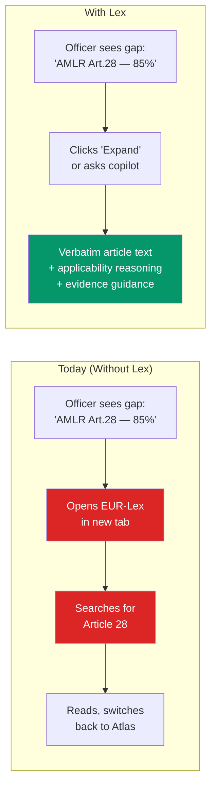
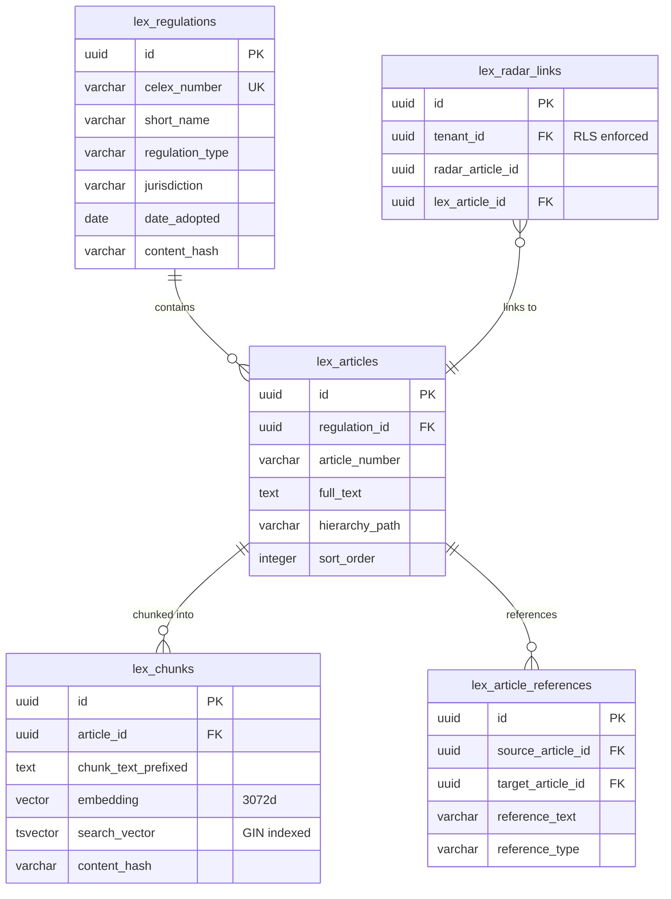

# Lex — Regulatory Knowledge Layer

Lex gives Atlas the **actual text** of 34 EU regulations and national AML laws across 8 jurisdictions. When an officer sees "AMLR Art.28 CDD Coverage — 85%", they can ask the copilot what Article 28 actually requires and receive an answer grounded in verbatim regulation text — with zero hallucinated citations.

## The Problem



## Architecture

```mermaid
graph TB
    subgraph Consumers["Consumer Layer"]
        COP[Copilot<br/>40+ tools]
        CT[Compliance Tab<br/>Gap Analysis]
        RR[Regulatory Radar<br/>34 regs, 67+ articles]
    end

    subgraph Lex["Lex Service Layer"]
        QS[QueryService<br/>fast-path + hybrid search]
        CV[CitationVerifier<br/>deterministic, no LLM]
        IS[IngestionService<br/>orchestrator]
    end

    subgraph Pipeline["Ingestion Pipeline"]
        F[Multi-Source Fetchers<br/>eurlex, riigi_teataja,<br/>bwb, pdf, html]
        P[EURegulationParser<br/>BeautifulSoup]
        C[RegulatoryChunker<br/>hierarchy-aware]
        E[RegulatoryEmbedder<br/>3072 dimensions]
        F -->|FetchedRegulation| P
        P -->|ParsedRegulation| C
        C -->|RegulationChunk[]| E
        E -->|EmbeddedChunk[]| VS
    end

    subgraph Storage["Storage Layer"]
        VS[PgVectorStore<br/>pluggable protocol]
        DB[(PostgreSQL + pgvector)]
        VS --> DB
    end

    COP -->|regulatory_knowledge tool| QS
    CT -->|enriched gaps| QS
    RR -->|article text| QS
    QS --> CV
    QS --> DB
    IS --> F

    subgraph External["External Sources"]
        EUR[EUR-Lex CELLAR<br/>REST API]
        NAT[National Gazettes<br/>Riigi Teataja, BWB,<br/>Gesetze-im-Internet]
        PDF[Authority PDFs<br/>Fin-FSA, Finanstilsynet,<br/>NBB, FAU]
    end

    F --> EUR
    F --> NAT
    F --> PDF

    style QS fill:#7c3aed,color:#fff
    style CV fill:#059669,color:#fff
    style IS fill:#2563eb,color:#fff
    style EUR fill:#f59e0b,color:#fff
```

## Regulatory Corpus

The corpus contains **34 regulations** across 7 ingestion waves, sourced from EUR-Lex CELLAR (EU regulations) and national official gazettes/authority websites (national AML transpositions).

### Wave 1 — Core EU Regulations (8)

| Regulation | CELEX | Priority |
|---|---|---|
| **AMLR** (EU 2024/1624) — AML Regulation | 32024R1624 | Critical |
| **AMLD6** (EU 2024/1640) — 6th AML Directive | 32024L1640 | Critical |
| **EU AI Act** (EU 2024/1689) — AI harmonised rules | 32024R1689 | Critical |
| **GDPR** (EU 2016/679) — Data protection | 32016R0679 | High |
| **DORA** (EU 2022/2554) — Digital operational resilience | 32022R2554 | Medium |
| **MiCA** (EU 2023/1114) — Crypto-assets | 32023R1114 | Medium |
| **EU-IPR** (EU 2024/886) — Instant payments | 32024R0886 | High |
| **PSD2** (EU 2015/2366) — Payment services | 32015L2366 | Medium |

### Wave 2 — Financial Services & Digital Infrastructure (6)

| Regulation | CELEX | Priority |
|---|---|---|
| **NIS2** (EU 2022/2555) — Cybersecurity | 32022L2555 | High |
| **DSA** (EU 2022/2065) — Digital Services Act | 32022R2065 | Medium |
| **MiFID II** (2014/65/EU) — Financial instruments | 32014L0065 | Medium |
| **eIDAS 2** (EU 2024/1183) — Digital identity | 32024R1183 | Medium |
| **CRD IV** (2013/36/EU) — Capital requirements | 32013L0036 | Medium |
| **AMLA Reg** (EU 2024/1620) — AMLA establishment | 32024R1620 | Critical |

### Wave 3 — Sustainability, Travel Rule & Payments (6)

| Regulation | CELEX | Priority |
|---|---|---|
| **TFR** (EU 2023/1113) — Transfer of Funds / Travel Rule | 32023R1113 | High |
| **CSDDD** (EU 2024/1760) — Corporate sustainability due diligence | 32024L1760 | Medium |
| **CSRD** (EU 2022/2464) — Corporate sustainability reporting | 32022L2464 | Medium |
| **Whistleblower** (EU 2019/1937) — Whistleblower protection | 32019L1937 | Medium |
| **EMD2** (2009/110/EC) — Electronic money | 32009L0110 | Medium |
| **SEPA** (EU 260/2012) — Credit transfers & direct debits | 32012R0260 | Medium |

### Wave 4 — Fiscal Representatives & Taxation (4)

| Regulation | CELEX | Priority |
|---|---|---|
| **VAT Directive** (2006/112/EC) — Common VAT system | 32006L0112 | High |
| **DAC** (2011/16/EU) — Administrative cooperation in taxation | 32011L0016 | Medium |
| **DAC7** (EU 2021/514) — Digital platform reporting | 32021L0514 | High |
| **AMLD5** (EU 2018/843) — 5th AML Directive | 32018L0843 | High |

### Wave 5 — Customs & Trade Compliance (3)

The Union Customs Code trilogy — critical for entities acting as importer/exporter or holding AEO status.

| Regulation | CELEX | Priority |
|---|---|---|
| **UCC** (EU 952/2013) — Union Customs Code | 32013R0952 | Critical |
| **UCC-DA** (EU 2015/2446) — UCC Delegated Act | 32015R2446 | High |
| **UCC-IA** (EU 2015/2447) — UCC Implementing Act | 32015R2447 | High |

### Wave 6–7 — National AML Regulations (7)

National transpositions of the EU AML Directives into domestic law. Each uses a jurisdiction-specific fetcher.

| Regulation | Jurisdiction | Fetcher | Source |
|---|---|---|---|
| **EE-AML** — Estonian AML Prevention Act | EE | `riigi_teataja` | Riigi Teataja |
| **FI-AML** — Finnish AML Act (444/2017) | FI | `pdf` | Fin-FSA |
| **NL-Wwft** — Dutch Wwft | NL | `bwb` | wetten.overheid.nl |
| **DK-AML** — Danish Hvidvaskloven | DK | `pdf` | Finanstilsynet |
| **BE-AML** — Belgian AML Law (18 Sept 2017) | BE | `pdf` | NBB |
| **CZ-AML** — Czech Act 253/2008 | CZ | `pdf` | FAU |
| **DE-GwG** — German Geldwaschegesetz | DE | `html` | Gesetze-im-Internet |

## Ingestion Pipeline

Five-stage pipeline with component isolation — each stage has typed I/O contracts and can be replaced independently:

```mermaid
graph LR
    F["1. Fetcher<br/><i>eurlex / riigi_teataja /<br/>bwb / pdf / html</i>"]
    P["2. Parser<br/><i>BeautifulSoup HTML</i>"]
    C["3. Chunker<br/><i>Hierarchy-aware</i>"]
    E["4. Embedder<br/><i>text-embedding-3-large</i>"]
    I["5. Indexer<br/><i>PgVectorStore</i>"]

    F -->|"FetchedRegulation<br/>(raw content + SHA-256)"| P
    P -->|"ParsedRegulation<br/>(articles + hierarchy)"| C
    C -->|"RegulationChunk[]<br/>(context-prefixed)"| E
    E -->|"EmbeddedChunk[]<br/>(3072d vectors)"| I

    style F fill:#f59e0b,color:#000
    style P fill:#2563eb,color:#fff
    style C fill:#7c3aed,color:#fff
    style E fill:#059669,color:#fff
    style I fill:#dc2626,color:#fff
```



### Multi-Source Fetcher Architecture

The ingestion pipeline supports 5 fetcher types, selected per regulation via the `fetcher` field in `corpus_config.py`:

| Fetcher | Source Type | Used By |
|---|---|---|
| `eurlex` | EUR-Lex CELLAR REST API (XHTML, no auth) | All 27 EU regulations |
| `riigi_teataja` | Estonian official gazette HTML | EE-AML |
| `bwb` | Dutch wetten.overheid.nl (Basis Wetten Bestand) | NL-Wwft |
| `pdf` | PDF download + pypdf text extraction | FI-AML, DK-AML, BE-AML, CZ-AML |
| `html` | Direct HTML scraping from official sites | DE-GwG |

All fetchers produce the same `FetchedRegulation` output (raw content + SHA-256 hash), so the downstream parser, chunker, embedder, and indexer stages are source-agnostic.

### Context-Prefixed Chunking

Every chunk includes its structural context as a prefix, so the embedding captures both content and position:

```
[AMLR | EU | TITLE III > CHAPTER 2 > Section 1 > Art. 28 | Enhanced CDD]
1. Member States shall ensure that obliged entities apply enhanced
customer due diligence measures in the cases referred to in Article 27...
```

**Chunking rules:**
1. Primary split at article boundaries (never across articles)
2. Oversized articles (>1500 tokens): split at paragraph boundaries
3. Oversized paragraphs: split at sub-point boundaries ((a), (b), (c))
4. Paragraph-level overlap for cross-reference continuity

## Query Service — Fast-Path + Hybrid Search

```mermaid
graph TD
    Q[Incoming Query]
    FP{Direct article<br/>reference?}
    HS[Hybrid Search]
    DL[Direct Lookup]

    Q --> FP
    FP -->|"'AMLR Article 28'<br/>regex match"| DL
    FP -->|"'What CDD measures<br/>are required?'"| HS

    subgraph Hybrid["Hybrid Search (semantic + keyword)"]
        SEM[Semantic Search<br/>pgvector cosine<br/>weight: 0.7]
        KW[Keyword Search<br/>tsvector GIN<br/>weight: 0.3]
        RRF[Reciprocal Rank<br/>Fusion (k=60)]
        SEM --> RRF
        KW --> RRF
    end

    HS --> SEM
    HS --> KW

    DL -->|"sub-10ms<br/>deterministic"| R[Results + Article Text]
    RRF --> R

    R --> CV[CitationVerifier<br/>deterministic validation]
    CV --> OUT[Verified Response<br/>with inline citations]

    style DL fill:#059669,color:#fff
    style RRF fill:#7c3aed,color:#fff
    style CV fill:#f59e0b,color:#000
```

## Zero-Hallucination Citation Verification

The `CitationVerifier` is **deterministic and uses no LLM**. Every citation passes through 4 checks:

| Check | What It Validates | Failure Mode |
|-------|-------------------|-------------|
| Article exists | Cited article number exists in corpus | Citation rejected |
| Regulation exists | Cited regulation is in scope | Citation rejected |
| Quote accuracy | Quoted text is verbatim substring (>95% SequenceMatcher) | Quote flagged |
| Hierarchy accuracy | Cited hierarchy path matches corpus | Path corrected |

This satisfies SC-5: **zero hallucinated article references** on the evaluation set.

## Data Model



**Tenancy model:** Corpus tables (`lex_regulations`, `lex_articles`, `lex_chunks`, `lex_article_references`) are **shared** — EU regulations are universal truth. Integration tables (`lex_radar_links`, `lex_ingestion_log`) are **tenant-scoped** with RLS.

## Copilot Integration — Citation Cards

```
┌─────────────────────────────────────────────────────┐
│ AMLR Article 28(1)                       ✓ verified │
│                                                     │
│ "Member States shall ensure that obliged entities   │
│ apply enhanced customer due diligence measures [...] │
│ including identifying the source of funds and source │
│ of wealth of the customer and of the beneficial     │
│ owner"                                              │
│                                                     │
│ TITLE III > CHAPTER 2 > Section 1 — Enhanced CDD    │
└─────────────────────────────────────────────────────┘
```

Each card shows: regulation + article number, verification badge, verbatim quoted text, hierarchy path, and a link to open the full article in the side panel.

## Compliance Tab — Two-Level Progressive Disclosure

**Level 1 — Inline Expansion:** Each gap item expands to show verbatim requirement, applicability reasoning, evidence guidance, verification badge.

**Level 2 — Side Panel:** Full article text with highlighted relevant paragraph, hierarchy breadcrumb, cross-references, source link (EUR-Lex, national gazette, or authority PDF), content hash, fetch timestamp.

## VLAIO Alignment

The Lex ingestion pipeline (fetcher → parser → chunker) is the same infrastructure needed for **VLAIO WP1's regulatory document analysis engine**. Building Lex first de-risks the VLAIO project and delivers immediate product value. The hierarchy-aware parser and cross-reference extraction are prerequisites for WP2's Compliance Procedure Intermediate Representation (CPIR).

## VectorStore Protocol

The vector store is pluggable — `PgVectorStore` today, Qdrant or Weaviate when scale demands it:

```python
class VectorStore(Protocol):
    async def upsert(self, chunks: list[EmbeddedChunk]) -> int: ...
    async def search_semantic(self, embedding, top_k, filters) -> list[VectorSearchResult]: ...
    async def search_keyword(self, query, top_k, filters) -> list[VectorSearchResult]: ...
    async def search_hybrid(self, query, embedding, top_k, filters, weights) -> list[VectorSearchResult]: ...
    async def delete_by_regulation(self, regulation_id) -> int: ...
    async def get_stats(self) -> VectorStoreStats: ...
```
