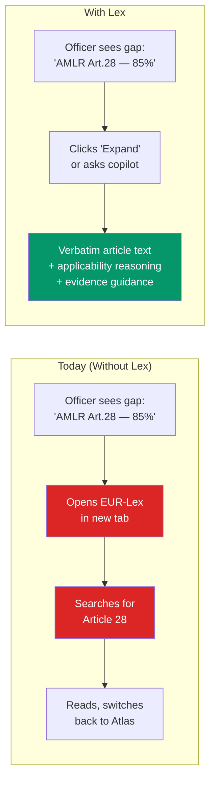
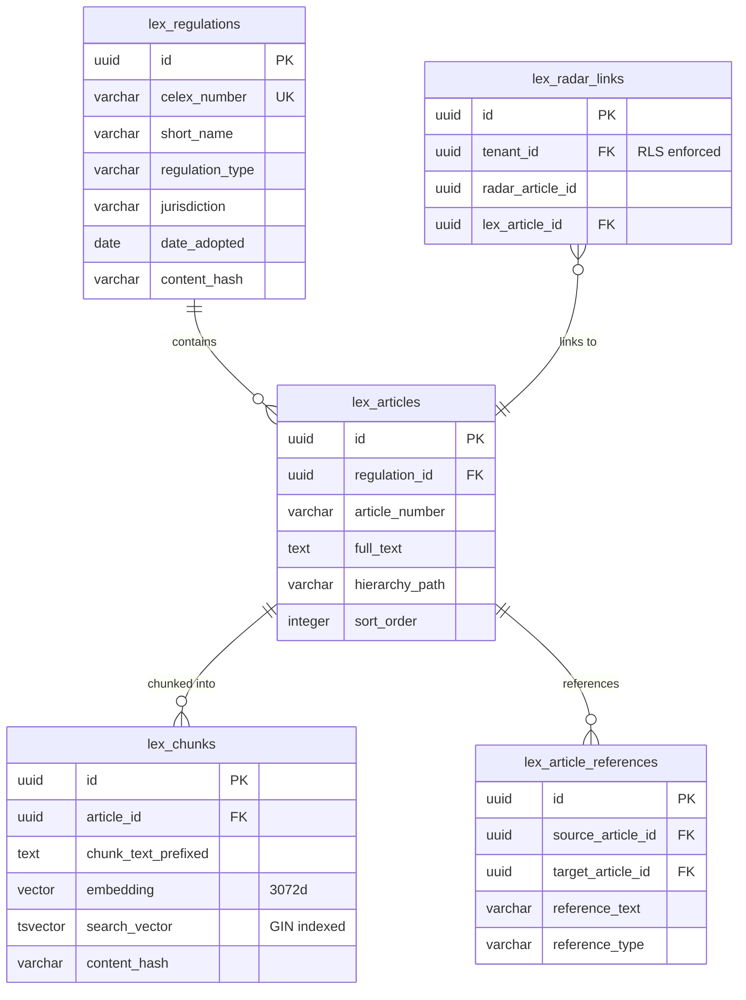

# Lex — Regulatory Knowledge Layer

Lex gives Atlas the **actual text** of EU regulations. When an officer sees "AMLR Art.28 CDD Coverage — 85%", they can ask the copilot what Article 28 actually requires and receive an answer grounded in verbatim regulation text — with zero hallucinated citations.

## The Problem



## Architecture

```mermaid
graph TB
    subgraph Consumers["Consumer Layer"]
        COP[Copilot<br/>40+ tools]
        CT[Compliance Tab<br/>Gap Analysis]
        RR[Regulatory Radar<br/>16 regs, 67 articles]
    end

    subgraph Lex["Lex Service Layer"]
        QS[QueryService<br/>fast-path + hybrid search]
        CV[CitationVerifier<br/>deterministic, no LLM]
        IS[IngestionService<br/>orchestrator]
    end

    subgraph Pipeline["Ingestion Pipeline"]
        F[EURLexFetcher<br/>CELLAR REST API]
        P[EURegulationParser<br/>BeautifulSoup]
        C[RegulatoryChunker<br/>hierarchy-aware]
        E[RegulatoryEmbedder<br/>3072 dimensions]
        F -->|FetchedRegulation| P
        P -->|ParsedRegulation| C
        C -->|RegulationChunk[]| E
        E -->|EmbeddedChunk[]| VS
    end

    subgraph Storage["Storage Layer"]
        VS[PgVectorStore<br/>pluggable protocol]
        DB[(PostgreSQL + pgvector)]
        VS --> DB
    end

    COP -->|regulatory_knowledge tool| QS
    CT -->|enriched gaps| QS
    RR -->|article text| QS
    QS --> CV
    QS --> DB
    IS --> F

    subgraph External["External"]
        EUR[EUR-Lex CELLAR<br/>REST API<br/>no auth required]
    end

    F --> EUR

    style QS fill:#7c3aed,color:#fff
    style CV fill:#059669,color:#fff
    style IS fill:#2563eb,color:#fff
    style EUR fill:#f59e0b,color:#fff
```

## Regulatory Corpus

Phase 1 ingests 8 EU regulations from EUR-Lex CELLAR (no registration, no API key):

| Regulation | CELEX | Key Articles | Priority |
|---|---|---|---|
| **AMLR** (EU 2024/1624) | 32024R1624 | Art. 15-73 (CDD, EDD, beneficial ownership) | Critical |
| **AMLD6** (EU 2024/1640) | 32024L1640 | Art. 1-80 (institutional framework, FIU) | Critical |
| **EU AI Act** (EU 2024/1689) | 32024R1689 | Art. 6-15, 50, Annex III (high-risk) | Critical |
| **GDPR** (EU 2016/679) | 32016R0679 | Art. 5-6, 9, 13-14, 17, 22, 25 | High |
| **DORA** (EU 2022/2554) | 32022R2554 | Art. 5-15 (ICT risk) | Medium |
| **MiCA** (EU 2023/1114) | 32023R1114 | Art. 59-92 (AML for CASPs) | Medium |
| **IPR** (EU 2024/886) | 32024R0886 | Art. 5c-5g (Verification of Payee) | Medium |
| **PSD2** (EU 2015/2366) | 32015L2366 | Art. 97-98 (SCA), Art. 65-67 | Medium |

## Ingestion Pipeline

Five-stage pipeline with component isolation — each stage has typed I/O contracts and can be replaced independently:

```mermaid
graph LR
    F["1. Fetcher<br/><i>CELLAR REST API</i>"]
    P["2. Parser<br/><i>BeautifulSoup HTML</i>"]
    C["3. Chunker<br/><i>Hierarchy-aware</i>"]
    E["4. Embedder<br/><i>text-embedding-3-large</i>"]
    I["5. Indexer<br/><i>PgVectorStore</i>"]

    F -->|"FetchedRegulation<br/>(raw HTML + SHA-256)"| P
    P -->|"ParsedRegulation<br/>(articles + hierarchy)"| C
    C -->|"RegulationChunk[]<br/>(context-prefixed)"| E
    E -->|"EmbeddedChunk[]<br/>(3072d vectors)"| I

    style F fill:#f59e0b,color:#000
    style P fill:#2563eb,color:#fff
    style C fill:#7c3aed,color:#fff
    style E fill:#059669,color:#fff
    style I fill:#dc2626,color:#fff
```



### Context-Prefixed Chunking

Every chunk includes its structural context as a prefix, so the embedding captures both content and position:

```
[AMLR | EU | TITLE III > CHAPTER 2 > Section 1 > Art. 28 | Enhanced CDD]
1. Member States shall ensure that obliged entities apply enhanced
customer due diligence measures in the cases referred to in Article 27...
```

**Chunking rules:**
1. Primary split at article boundaries (never across articles)
2. Oversized articles (>1500 tokens): split at paragraph boundaries
3. Oversized paragraphs: split at sub-point boundaries ((a), (b), (c))
4. Paragraph-level overlap for cross-reference continuity

## Query Service — Fast-Path + Hybrid Search

```mermaid
graph TD
    Q[Incoming Query]
    FP{Direct article<br/>reference?}
    HS[Hybrid Search]
    DL[Direct Lookup]

    Q --> FP
    FP -->|"'AMLR Article 28'<br/>regex match"| DL
    FP -->|"'What CDD measures<br/>are required?'"| HS

    subgraph Hybrid["Hybrid Search (semantic + keyword)"]
        SEM[Semantic Search<br/>pgvector cosine<br/>weight: 0.7]
        KW[Keyword Search<br/>tsvector GIN<br/>weight: 0.3]
        RRF[Reciprocal Rank<br/>Fusion (k=60)]
        SEM --> RRF
        KW --> RRF
    end

    HS --> SEM
    HS --> KW

    DL -->|"sub-10ms<br/>deterministic"| R[Results + Article Text]
    RRF --> R

    R --> CV[CitationVerifier<br/>deterministic validation]
    CV --> OUT[Verified Response<br/>with inline citations]

    style DL fill:#059669,color:#fff
    style RRF fill:#7c3aed,color:#fff
    style CV fill:#f59e0b,color:#000
```

## Zero-Hallucination Citation Verification

The `CitationVerifier` is **deterministic and uses no LLM**. Every citation passes through 4 checks:

| Check | What It Validates | Failure Mode |
|-------|-------------------|-------------|
| Article exists | Cited article number exists in corpus | Citation rejected |
| Regulation exists | Cited regulation is in scope | Citation rejected |
| Quote accuracy | Quoted text is verbatim substring (>95% SequenceMatcher) | Quote flagged |
| Hierarchy accuracy | Cited hierarchy path matches corpus | Path corrected |

This satisfies SC-5: **zero hallucinated article references** on the evaluation set.

## Data Model



**Tenancy model:** Corpus tables (`lex_regulations`, `lex_articles`, `lex_chunks`, `lex_article_references`) are **shared** — EU regulations are universal truth. Integration tables (`lex_radar_links`, `lex_ingestion_log`) are **tenant-scoped** with RLS.

## Copilot Integration — Citation Cards

```
┌─────────────────────────────────────────────────────┐
│ AMLR Article 28(1)                       ✓ verified │
│                                                     │
│ "Member States shall ensure that obliged entities   │
│ apply enhanced customer due diligence measures [...] │
│ including identifying the source of funds and source │
│ of wealth of the customer and of the beneficial     │
│ owner"                                              │
│                                                     │
│ TITLE III > CHAPTER 2 > Section 1 — Enhanced CDD    │
└─────────────────────────────────────────────────────┘
```

Each card shows: regulation + article number, verification badge, verbatim quoted text, hierarchy path, and a link to open the full article in the side panel.

## Compliance Tab — Two-Level Progressive Disclosure

**Level 1 — Inline Expansion:** Each gap item expands to show verbatim requirement, applicability reasoning, evidence guidance, verification badge.

**Level 2 — Side Panel:** Full article text with highlighted relevant paragraph, hierarchy breadcrumb, cross-references, EUR-Lex source link, content hash, fetch timestamp.

## VLAIO Alignment

The Lex ingestion pipeline (fetcher → parser → chunker) is the same infrastructure needed for **VLAIO WP1's regulatory document analysis engine**. Building Lex first de-risks the VLAIO project and delivers immediate product value. The hierarchy-aware parser and cross-reference extraction are prerequisites for WP2's Compliance Procedure Intermediate Representation (CPIR).

## VectorStore Protocol

The vector store is pluggable — `PgVectorStore` today, Qdrant or Weaviate when scale demands it:

```python
class VectorStore(Protocol):
    async def upsert(self, chunks: list[EmbeddedChunk]) -> int: ...
    async def search_semantic(self, embedding, top_k, filters) -> list[VectorSearchResult]: ...
    async def search_keyword(self, query, top_k, filters) -> list[VectorSearchResult]: ...
    async def search_hybrid(self, query, embedding, top_k, filters, weights) -> list[VectorSearchResult]: ...
    async def delete_by_regulation(self, regulation_id) -> int: ...
    async def get_stats(self) -> VectorStoreStats: ...
```
