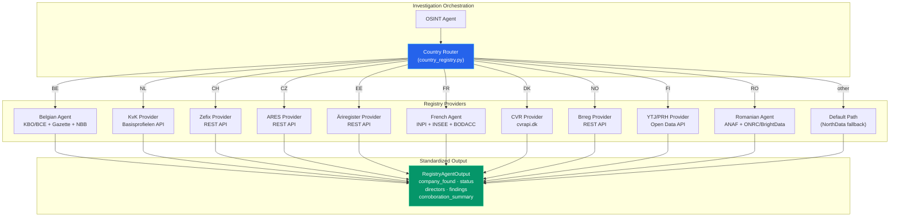
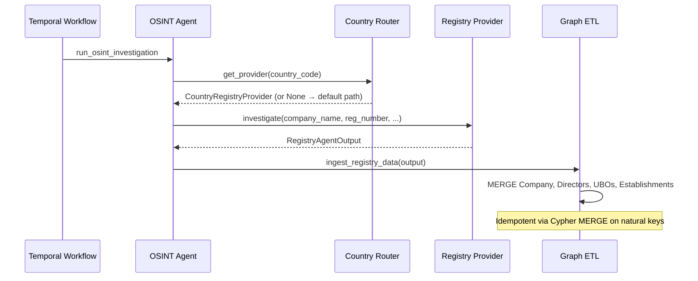

# Multi-Country Registry Services

Trust Relay integrates with **10 official business registries** across Europe to retrieve authoritative company data during OSINT investigations. Each registry provider follows a common interface pattern but implements country-specific API protocols, authentication schemes, and data extraction logic. The country routing system automatically dispatches investigations to the correct provider based on the target company's jurisdiction.

---

## Why Official Registries?

Commercial data aggregators (NorthData, OpenCorporates, Dun & Bradstreet) are useful for broad coverage but insufficient for compliance. Regulatory frameworks (6AMLD, AMLR) require that KYB/KYC decisions be traceable to **authoritative sources** -- the government registries where companies are legally incorporated.

Trust Relay's registry architecture provides:

- **Primary-source evidence**: every company status, director appointment, and address comes directly from the national registry, creating an auditable evidence chain
- **Real-time verification**: data is fetched live from registry APIs, not from stale aggregator snapshots
- **Corroboration scoring**: registry data is cross-referenced with submitted information to detect discrepancies (name mismatches, dissolved companies, missing directors)
- **Graceful degradation**: when a registry is unavailable or credentials are missing, the investigation continues with findings noting the gap

---

## Provider Architecture



---

## Country Router

The country router (`backend/app/agents/country_registry.py`) maps ISO 3166-1 alpha-2 country codes to provider instances. Each provider is a `CountryRegistryProvider` dataclass:

```python
@dataclass(frozen=True)
class CountryRegistryProvider:
    country_codes: tuple[str, ...]       # e.g. ("BE",)
    label: str                           # e.g. "Belgian Registry Agent"
    source_label: str                    # e.g. "KBO/BCE" -- for evidence attribution
    model_key: str                       # config key for LLM model (if applicable)
    source_names: tuple[str, ...]        # e.g. ("kbo", "gazette", "nbb")
    investigate: Callable[..., Awaitable[RegistryAgentOutput]]
    mock_flag: str = ""                  # config flag for mock mode
```

The registry is lazy-initialized on first lookup to avoid circular imports. Countries without a registered provider fall back to the default investigation path (NorthData aggregator).

---

## Standardized Output

Every provider returns a `RegistryAgentOutput` regardless of the underlying API. This guarantees consistent downstream processing:

| Field | Type | Description |
|-------|------|-------------|
| `company_found` | bool | Whether the company was located in the registry |
| `company_status` | str | Normalized status: `active`, `dissolved`, `inactive`, `not_found`, `unknown` |
| `directors` | list[str] | Director/board member names |
| `directors_detailed` | list[dict] | Structured director data: name, role, mandate start date |
| `ubos` | list[str] | Ultimate beneficial owners (where available) |
| `registered_address` | dict | Normalized address (street, postal_code, city, country) |
| `legal_form` | str | Legal form code or description |
| `nace_codes` | list[str] | Activity classification codes |
| `financials_summary` | str | Financial data availability note |
| `findings` | list[Finding] | Structured findings with severity (VERIFIED, HIGH, MEDIUM, LOW) |
| `corroboration_summary` | dict | Counts: `fields_confirmed`, `fields_discrepant`, `fields_unverifiable` |
| `discrepancies` | list | Detected data conflicts |

---

## Registry Coverage

### BE -- Belgium: KBO/BCE

**Provider**: `backend/app/agents/belgian_agent.py` (composite agent)

The Belgian provider is the most comprehensive, combining three data sources through an AI-orchestrated agent:

| Source | Data | Authentication |
|--------|------|----------------|
| KBO/BCE (Crossroads Bank for Enterprises) | Company registration, status, NACE codes, establishments | Public API |
| Belgisch Staatsblad / Moniteur Belge | Gazette publications: director appointments, capital changes, statutes | Web scraping |
| NBB/CBSO (National Bank of Belgium) | Annual financial filings | Public API |

This is the only provider that uses an LLM-orchestrated agent (`model_key: "belgian_agent_model"`) because it synthesizes across multiple sources. All other providers are deterministic HTTP clients.

---

### NL -- Netherlands: KvK (Kamer van Koophandel)

**Provider**: `backend/app/services/registries/nl_kvk_service.py`

| Aspect | Detail |
|--------|--------|
| API | `https://api.kvk.nl/api/v1/basisprofielen/{kvkNummer}` |
| Authentication | API key (`apikey` header) -- register at developers.kvk.nl |
| Identifier | 8-digit KvK number |
| Data returned | Company name, legal form (rechtsvorm), founding date, SBI activity codes, visiting address |
| Directors | Available via `eigenaar` (owner) and `bestuurders` (directors) fields |
| UBOs | Not available -- requires separate KvK UBO registry lookup |

---

### CH -- Switzerland: Zefix (Zentraler Firmenindex)

**Provider**: `backend/app/services/registries/ch_zefix_service.py`

| Aspect | Detail |
|--------|--------|
| API | `https://www.zefix.admin.ch/ZefixREST/api/v1` |
| Authentication | None (public API) |
| Identifier | Swiss UID (CHE-xxx.xxx.xxx) or company name |
| Data returned | Company name, legal seat, status, UID, CHID, purpose, legal form |
| Directors | Available via `/company/{chid}/persons` endpoint |
| Lookup strategy | UID lookup first, fallback to name search |

---

### CZ -- Czech Republic: ARES (Administrative Register of Economic Subjects)

**Provider**: `backend/app/services/registries/cz_ares_service.py`

| Aspect | Detail |
|--------|--------|
| API | `https://ares.gov.cz/ekonomicke-subjekty-v-be/rest/ekonomicke-subjekty/{ico}` |
| Authentication | None (public API) |
| Identifier | ICO (Czech registration number) |
| Data returned | Company name (obchodniJmeno), registered address (sidlo), legal form, founding date, NACE codes |
| Directors | Available via `statutarniOrgan.clenove` -- natural persons or legal entities |

---

### EE -- Estonia: Ariregister (Estonian Business Register)

**Provider**: `backend/app/services/registries/ee_ariregister_service.py`

| Aspect | Detail |
|--------|--------|
| API | `https://ariregister.rik.ee/est/api/autocomplete` + `/est/company/{reg_code}/json` |
| Authentication | None (public API) |
| Identifier | Estonian registration code |
| Data returned | Company name (arinimi), status, address, registration code |
| Directors | Available via `isikud` (persons) array with role and mandate dates |
| Lookup strategy | Direct detail fetch by reg code, fallback to autocomplete search |

---

### FR -- France: INPI RNE + INSEE Sirene + BODACC (3-source)

**Orchestrator**: `backend/app/services/registries/fr_insee_service.py`

The French provider is the second multi-source provider (after Belgium), orchestrating three official data sources in parallel via `asyncio.gather()`. INPI is primary for directors and documents, INSEE for status and legal form, BODACC for lifecycle events. If any source fails, the investigation degrades gracefully and reports the gap.

#### Source 1: INPI RNE (Registre National des Entreprises)

**Service**: `backend/app/services/registries/fr_inpi_service.py`

| Aspect | Detail |
|--------|--------|
| API | `https://registre-national-entreprises.inpi.fr/api/companies/{siren}` |
| Authentication | **Bearer token** -- POST `/api/sso/login` with email/password (free account at [data.inpi.fr](https://data.inpi.fr)) |
| Data returned | Company identity, directors (composition), share capital, corporate purpose (objet social), legal form, establishments |
| Documents | Articles of association (actes), financial statements (bilans) -- downloadable as PDF via `/api/actes/{id}/download` |
| Rate limit | 10,000 requests/day, 10 GB/day transfer |
| License | Licence Ouverte Etalab 2.0 (free, commercial use) |
| Config | `INPI_USERNAME` (email), `INPI_PASSWORD` |

INPI is the primary source for **director data** -- previously unavailable through the public Sirene API without government DataPass authorization. Documents (articles of association, financial statements) are enumerated via `/api/companies/{siren}/attachments` and can be downloaded as PDFs for Docling conversion.

#### Source 2: INSEE Sirene (enhanced)

**Service**: `backend/app/services/registries/fr_insee_service.py` (inline `_fetch_insee`)

| Aspect | Detail |
|--------|--------|
| API | `https://api.insee.fr/api-sirene/3.11/siren/{siren}` |
| Authentication | **API key** -- `X-INSEE-Api-Key-Integration` header (register at [portail-api.insee.fr](https://portail-api.insee.fr)) |
| Data returned | Company name (denomination), administrative status (active/dissolved), legal form code, APE/NACE activity code, creation date, HQ address, employee count bracket |
| Rate limit | 30 requests/minute |
| Special handling | 403 responses indicate confidentiality protection (avis de non-diffusion) |
| Config | `INSEE_API_KEY` |

INSEE remains the authoritative source for **company status** (active vs. dissolved) and **legal form classification**.

#### Source 3: BODACC (Official Legal Announcements)

**Service**: `backend/app/services/registries/fr_bodacc_service.py`

| Aspect | Detail |
|--------|--------|
| API | `https://bodacc-datadila.opendatasoft.com/api/explore/v2.1` (dataset: `annonces-commerciales`) |
| Authentication | **None** -- open data API |
| Data returned | Lifecycle events: company creations, modifications, dissolutions, sales/transfers, collective proceedings (insolvency, liquidation), account filing notices |
| License | Licence Ouverte Etalab 2.0 |
| Config | None required |

BODACC provides **adverse event detection** -- insolvency proceedings, liquidations, and restructurings are flagged as HIGH severity findings. Non-adverse announcements (name changes, address moves) are reported as VERIFIED context.

#### SIREN Identifier Parsing

The agent accepts multiple identifier formats and normalizes to a 9-digit SIREN:

| Input format | Example | Handling |
|---|---|---|
| SIREN (9 digits) | `552032534` | Used directly |
| SIRET (14 digits) | `55203253400024` | Truncated to first 9 digits |
| FR VAT number | `FR40552032534` | Strip `FR` prefix + 2-digit key, yielding 9-digit SIREN |

#### Merge Strategy

| Field | Primary source | Fallback source |
|---|---|---|
| Company name | INPI | INSEE |
| Status (active/dissolved) | INSEE | -- |
| Directors | INPI | -- |
| Legal form code | INSEE | INPI |
| APE/NACE code | INSEE | INPI |
| Creation date | INSEE | INPI |
| Address | INPI | INSEE |
| Capital | INPI | -- |
| Corporate purpose | INPI | -- |
| Lifecycle events | BODACC | -- |
| Documents (articles, bilans) | INPI | -- |

#### Document Auto-Retrieval

France is the first country with **automatic document collection**. During the `collect_registry_documents` Temporal activity, the agent downloads articles of association and financial statement PDFs from INPI and stores them in MinIO at `{case_id}/iteration-{n}/registry-docs/`. These documents feed into the dynamic document requirements system -- for French companies, the compliance officer may only need to request a Director ID from the end customer, since corporate documents are already available from the registry.

---

### DK -- Denmark: CVR (Central Business Register)

**Provider**: `backend/app/services/registries/dk_cvr_service.py`

| Aspect | Detail |
|--------|--------|
| API | `https://cvrapi.dk/api?search={cvr_number}&country=dk` |
| Authentication | None, but **User-Agent header with contact email required** by API terms of service |
| Identifier | CVR number |
| Data returned | Company name, status, address, owners |
| Directors | Available via owners array |

---

### NO -- Norway: Bronnoysundregistrene (Brreg)

**Provider**: `backend/app/services/registries/no_brreg_service.py`

| Aspect | Detail |
|--------|--------|
| API | `https://data.brreg.no/enhetsregisteret/api/enheter/{orgNr}` + `/roller` |
| Authentication | None (public API) |
| Identifier | Norwegian organization number (orgNr) |
| Data returned | Company name, status, business address (forretningsadresse), organization form |
| Directors | Available via separate `/roller` endpoint |

---

### FI -- Finland: YTJ/PRH (Finnish Patent and Registration Office)

**Provider**: `backend/app/services/registries/fi_ytj_service.py`

| Aspect | Detail |
|--------|--------|
| API | `https://avoindata.prh.fi/opendata-ytj-api/v3/companies?businessId={y_tunnus}` |
| Authentication | None (open data API) |
| Identifier | Finnish business ID (Y-tunnus) |
| Data returned | Company name, registered office, status, business line |
| Directors | Not available via open data API -- requires separate PRH portal access |

---

## Authentication Summary

| Pattern | Countries | Mechanism |
|---------|-----------|-----------|
| **Open access** | CH, CZ, EE, DK, NO, FI | No authentication -- public APIs |
| **API key** | NL, FR (INSEE) | `apikey` / `X-INSEE-Api-Key-Integration` header |
| **Bearer token** | FR (INPI) | POST `/api/sso/login` with email/password, token returned in response |
| **No auth** | FR (BODACC) | Open data API -- no credentials required |
| **Composite (mixed)** | BE | KBO public + gazette scraping + NBB public |
| **Multi-source orchestration** | BE, FR | Multiple sources called in parallel, results merged |

---

## Corroboration Pattern

Every provider follows the same corroboration pattern when processing results:

1. **Name matching**: compare the registry's official name against the submitted company name (case-insensitive substring match). Produces a VERIFIED finding on match or a MEDIUM severity finding on mismatch.
2. **Status check**: if the company is dissolved, inactive, or struck off, emit a HIGH severity finding (serious compliance risk).
3. **Registration confirmation**: if found and active, emit a VERIFIED finding with registration date and legal form.
4. **Director extraction**: structured director data (name, role, mandate start) for downstream person validation and graph ETL.
5. **Summary scoring**: `corroboration_summary` counts confirmed fields, discrepant fields, and unverifiable fields (typically UBOs).

---

## Error Handling

All providers implement consistent error handling with graceful degradation:

| Scenario | Behavior |
|----------|----------|
| API timeout | LOW severity finding, `company_status: "unknown"` |
| HTTP error | LOW severity finding with status code |
| Company not found | HIGH severity finding, `company_status: "not_found"` |
| Missing credentials | MEDIUM severity finding with registration instructions |
| Missing identifier | MEDIUM severity finding with format guidance |

The investigation never fails due to a registry being unavailable. Findings document the gap, and the officer sees exactly which verifications could not be completed.

---

## Integration with Investigation Pipeline

Registry providers are invoked during the OSINT investigation phase (Temporal activity `run_osint_investigation`):



Registry data flows into:
- **Investigation findings** for the officer review dashboard
- **Knowledge graph** via GraphETL (Company, Person, Address nodes)
- **Canonical entities** for goAML export (persons, addresses)
- **Risk engine** for automated risk scoring (dissolved company = elevated risk)

---

## VAT Auto-Derivation

For several European countries, the VAT number can be derived deterministically from the company registration number using country-specific algorithms. Trust Relay implements these derivations to populate VAT fields automatically without requiring an additional API call.

| Country | Algorithm | Example |
|---|---|---|
| **FR** (France) | SIREN → VAT: `"FR" + luhn_key(siren) + siren` where luhn_key = `(12 + 3 × (siren % 97)) % 97` | SIREN `123456789` → `FR40123456789` |
| **BE** (Belgium) | Enterprise number → VAT: prepend `"BE0"` after stripping non-digits | `0123456789` → `BE0123456789` |
| **IT** (Italy) | Registration number is already the VAT base; prepend `"IT"` | `12345678901` → `IT12345678901` |
| **ES** (Spain) | NIF/CIF → VAT: prepend `"ES"` | `A12345678` → `ESA12345678` |
| **PT** (Portugal) | NIF → VAT: prepend `"PT"` | `123456789` → `PT123456789` |
| **PL** (Poland) | NIP → VAT: prepend `"PL"` | `1234567890` → `PL1234567890` |

The derived VAT number is validated against the **VIES API** (`https://ec.europa.eu/taxation_customs/vies/rest-api/ms/{country_code}/vat/{vat_number}`) before being stored. A VIES `isValid: false` response generates a MEDIUM severity finding; a validation timeout falls back gracefully without blocking the investigation.

All derivation logic lives in `backend/app/services/vat_derivation.py`. The function signature is `derive_vat_number(country_code: str, registration_number: str) -> str | None`.

---

## Country Financial Scrapers

In addition to company registration data, Trust Relay retrieves financial filing data directly from national registries for four additional countries:

### NO — Norway: Regnskapsregisteret (Brreg)

The `no_brreg_service.py` provider extends its basic company lookup with a call to the Brønnøysund Register Centre's accounting register:

| Aspect | Detail |
|---|---|
| Endpoint | `https://data.brreg.no/regnskapsregisteret/regnskap/{orgNr}` |
| Data returned | Revenue, profit/loss, total assets, equity, employee count (from the most recent filed annual accounts) |
| Authentication | None (public API) |

Financial metrics are extracted from the `regnskapsprinsipper` and `resultatregnskapsprinsipper` fields and mapped to the `FinancialHealthReport` model.

### RO — Romania: ANAF + ONRC

**Provider**: `backend/app/services/registries/ro_onrc_service.py` (composite agent)

Romania is the second multi-source provider (after Belgium), combining three data sources:

| Source | Service File | Data | Authentication |
|--------|-------------|------|----------------|
| ANAF PlatitorTvaRest v9 | `ro_anaf_company_service.py` | Company name, structured address, legal form, CAEN code, registration status, VAT status, fiscal inactivity, e-Factura status | Public API (no auth) |
| ANAF Bilant | `ro_anaf_service.py` | 3-year financial statements (assets, equity, revenue, profit, employees) | Public API (no auth) |
| ONRC via BrightData | `ro_onrc_service.py` | Directors/administrators, shareholders, mandate dates | BrightData MCP scraping of ListaFirme.ro |

All three sources are queried in parallel via `asyncio.gather()`. The ANAF endpoints share a module-level `asyncio.Lock` rate limiter enforcing 1 request/second across all ANAF traffic.

**ANAF PlatitorTvaRest v9** is the primary company identity source:
- Endpoint: `POST https://webservicesp.anaf.ro/api/PlatitorTvaRest/v9/tva`
- Request: `[{"cui": 12345678, "data": "2026-04-05"}]`
- Returns: company name (`denumire`), trade registry number (`nrRegCom`), structured HQ address (`adresa_sediu_social`), legal form code (`forma_juridica` — resolved via `ro_nomenclator.py`), CAEN activity code, VAT registration history, fiscal inactivity status, and e-Invoice registry status
- Legal form codes are mapped to human-readable strings (e.g., `40` → "SRL", `41` → "SA") via a nomenclator lookup table sourced from ANAF's official nomenclator page

**BrightData director scraping** uses the `scrape_as_markdown` MCP tool to extract directors from `listafirme.ro/firma/{cui}`. This is optional — when BrightData is unavailable or in mock mode, the agent returns empty directors and the investigation continues with a gap finding. NorthData provides fallback director data when available.

**Key difference from Belgium**: Romania has no official ONRC API for directors — ONRC requires a paid subscription contract. BrightData scraping of the public ListaFirme.ro aggregator is the pragmatic workaround. This may be replaced by a direct ListaFirme API integration in the future.

### SK — Slovakia: RUZ (Register Účtovných Závierok)

**Provider**: `backend/app/services/registries/sk_ruz_service.py`

| Aspect | Detail |
|---|---|
| API | `https://www.registeruz.sk/cruz-public/api/uctovne-zavierky?ico={ico}` |
| Authentication | None (public API) |
| Identifier | Slovak ICO (Identifikačné číslo organizácie) |
| Data returned | Annual account filings list; detail endpoint returns revenue, assets, equity per year |

The service fetches the latest filing year and extracts key financial metrics for `FinancialHealthReport`.

### NL — Netherlands: KvK Open Dataset

**Provider**: `backend/app/services/registries/nl_kvk_service.py` (extended)

In addition to the authenticated Basisprofielen API, the NL provider queries the KvK Open Dataset for SBI (Standard Industrial Classification) code descriptions and historical name changes. The Open Dataset endpoint does not require authentication and complements the paid API data.

---

## EE Äriregister — Autocomplete Fix

The Estonian Business Register autocomplete endpoint (`/est/api/autocomplete`) was updated to correctly parse responses that arrive with `Content-Type: text/html` despite containing valid JSON. The service now attempts JSON parsing regardless of the declared content type, falling back to HTML parsing only if JSON parsing fails.

Additionally, the autocomplete response structure wraps results in a `{"items": [...]}` envelope rather than returning a bare array. The parser now checks for both formats to remain compatible with future API changes.

---

## NorthData Improvements

Several reliability improvements were made to the NorthData integration (`backend/app/services/northdata_service.py`):

### `_as_list` Helper

NorthData's API inconsistently returns single-item collections as either a bare object or a `{"items": [...]}` wrapped array. The `_as_list` helper now handles all three cases: bare object → `[obj]`, `{"items": [...]}` envelope → inner list, bare array → as-is. This prevents silent data loss when a company has exactly one related company or one financial year.

### `_extract_relation_name` Unwrapping

Relation entries can nest the actual company or person name inside a `company` or `person` sub-key. The `_extract_relation_name` function now unwraps these containers before attempting name extraction, preventing `None` values in the `relatedCompanies` output.

### euId Extraction

The `relatedCompanies` response now includes the NorthData `euId` for each connected entity. This identifier is extracted and passed downstream to the EVOI network scan as the registration ID for subsequent NorthData lookups, significantly improving subsidiary and affiliate match quality (especially for entities with common trade names).

### Global Rate Limiter

A module-level `asyncio.Lock`-based rate limiter enforces a 2-second minimum interval between all NorthData API requests. This rate limiter is shared across all concurrent coroutines — including the recursive network scan — preventing HTTP 429 responses and ensuring the integration remains within NorthData's stated API terms.

---

## Adding a New Country

To add a new country provider:

1. Create `backend/app/services/registries/<cc>_<registry>_service.py` with a `run_<cc>_agent()` function matching the `CountryRegistryProvider.investigate` signature
2. Return a `RegistryAgentOutput` with findings, directors, corroboration summary
3. Register the provider in `backend/app/agents/country_registry.py` inside `_init_registry()`
4. Add any required API credentials to `backend/app/config.py` (pydantic-settings)
5. Add tests in `backend/tests/services/registries/`

The standardized interface means no changes are needed to the OSINT agent, graph ETL, or risk engine -- they consume `RegistryAgentOutput` regardless of which country produced it.
