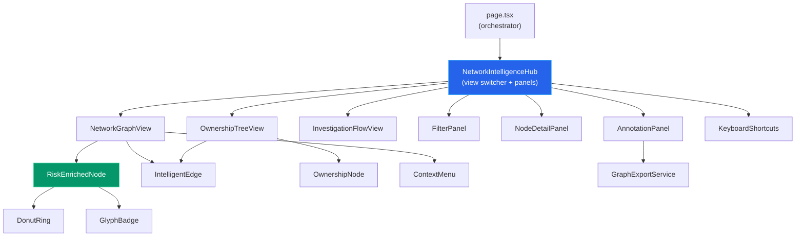
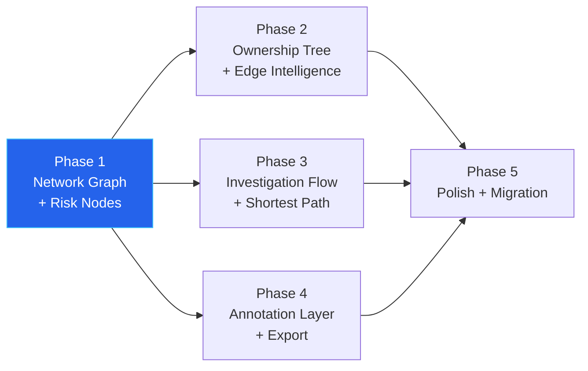

# Network Intelligence Hub

The Network Intelligence Hub is a purpose-built investigation surface at `/dashboard/network` that presents entity relationship data through three switchable views: a force-directed network graph, a hierarchical ownership tree, and a Sankey-inspired investigation flow diagram. It replaces the raw data display of the legacy `/dashboard/graph` page — where nodes showed LEI codes instead of names, risk indicators were generic, and no actionable business context was available.

The hub was designed from a structured competitive analysis of 10 leading compliance and AML platforms (see §Competitive Research Foundation). Fourteen convergent patterns were identified; all are implemented across the five delivery phases.

---

## The Three Views

All three views operate on the same underlying entity data. A perspective toggle at the top of the page switches between them without reloading the page.

### View 1 — Network Graph

The primary investigation surface. A force-directed graph with a dagre hierarchical layout showing entity relationships, cross-case connections, and detected fraud motifs. This view enhances the existing graph explorer with risk-encoded nodes, intelligent edges, right-click context menus, and adaptive zoom.

**Data sources:** `GET /api/graph/explorer/data` for the initial load; `GET /api/graph/entity-network/{reg}` for entity-centric expansion.

### View 2 — Ownership Tree

A strict top-down hierarchical layout showing the full UBO chain for a selected entity. The ultimate parent sits at the top; subsidiaries and UBOs branch below, each displaying degree of separation from the subject and effective ownership percentages. Edge color encodes control threshold: green for minority stakes (< 25%), amber for significant influence (25–50%), and red for controlling stakes (> 50%), enforcing the OFAC 50% Rule visually.

A "Trace to UBO" button in the detail panel highlights the complete path from any company up through ownership layers to the ultimate beneficial owner, computing effective ownership at each step (for example, 68% × 51% = 34.68%).

**Data source:** `GET /api/graph/ownership-tree/{registration_number}` (new endpoint, Phase 2).

### View 3 — Investigation Flow

A fixed three-column Sankey-inspired layout that visualises the investigation process itself — a capability unique among the platforms analysed.

- **Left column:** Data sources that fed the investigation (KBO, NBB, GLEIF, OpenSanctions, Tavily, PEPPOL, uploaded documents), each showing fact count and last-fetched timestamp.
- **Centre:** The subject entity with its ARIA tier, risk score, confidence score, and EVOI belief state rendered as a stacked bar (green p_clean + amber p_risky + red p_critical).
- **Right column:** Investigation outputs — findings by severity and follow-up tasks.

SVG flow lines connect sources to entity to findings. Line width is proportional to evidence contribution; color matches risk category. Clicking a source highlights its connected findings; clicking a finding highlights its contributing sources, providing visual evidence provenance tracing.

This view requires a `case_id`, passed via the `?case_id=` query parameter or pre-filled when navigating from an Entity 360 tab. When no case is selected, the view prompts the officer to choose one.

**Data source:** `GET /api/cases/{case_id}/evidence-flow` (new endpoint, Phase 3).

---

## Component Architecture

The hub follows a multi-view architecture. A thin page orchestrator (~200 lines) at `app/dashboard/network/page.tsx` renders the `NetworkIntelligenceHub` container, which owns the view switcher and shared panels. Each view is an isolated component with its own data-fetching hook.

```
frontend/src/
├── app/dashboard/network/
│   └── page.tsx                      # Thin orchestrator, view routing
├── components/network-intelligence/
│   ├── NetworkIntelligenceHub.tsx    # View switcher + shared panel layout
│   ├── views/
│   │   ├── NetworkGraphView.tsx      # View 1: enhanced force-directed graph
│   │   ├── OwnershipTreeView.tsx     # View 2: hierarchical UBO tree
│   │   └── InvestigationFlowView.tsx # View 3: Sankey-inspired evidence flow
│   ├── nodes/
│   │   ├── RiskEnrichedNode.tsx      # Company/Person with donut ring + glyph badges
│   │   └── OwnershipNode.tsx         # Simplified node for ownership tree
│   ├── edges/
│   │   └── IntelligentEdge.tsx       # Thickness, dashed/solid, animated, ownership %
│   ├── panels/
│   │   ├── FilterPanel.tsx           # Left: perspectives, types, edge presets
│   │   ├── NodeDetailPanel.tsx       # Right: entity detail + actions
│   │   └── AnnotationPanel.tsx       # Annotation overlay → audit trail
│   ├── interactions/
│   │   ├── ContextMenu.tsx           # Right-click context menu
│   │   └── KeyboardShortcuts.tsx     # Global keyboard shortcuts
│   └── shared/
│       ├── DonutRing.tsx             # SVG risk category donut component
│       ├── GlyphBadge.tsx            # Sanctions/PEP/UBO indicator badges
│       ├── PerspectiveToggle.tsx     # Compliance / Ownership / Investigation
│       └── GraphExportService.ts     # Snapshot export for SAR/STR
```

The following components from the existing graph explorer are reused directly:

| Existing component | Reused as |
|---|---|
| `layout/computeLayout.ts` | Dagre layout for Network and Ownership views |
| `layout/mapToReactFlow.ts` | Node/edge mapping to ReactFlow format |
| `types.ts` (color constants, shape mappings) | Base type definitions, extended with risk data |
| Data-fetching logic from `page.tsx` | Extracted into shared hooks |
| `ReactFlowCanvas.tsx` | Reference implementation for Network view canvas setup |



---

## Node Design: RiskEnrichedNode

Every node in the Network Graph and Ownership Tree encodes information through three independent visual layers. Color is never used as the sole signal; each layer pairs color with shape or icon to meet WCAG AA contrast requirements (3:1 minimum on the `#0f172a` dark background).

### Layer 1 — Donut Ring (risk category breakdown)

An SVG ring drawn around the node icon. Segment sizes are proportional to finding counts within each risk category, derived from the entity's `properties` object:

| Segment color | Encoding | Source mapping |
|---|---|---|
| Red | Sanctions + critical findings | `properties.sanctions_matches > 0` OR findings where `severity == "critical"` |
| Amber | Adverse media + PEP + high findings | findings where `severity == "high"` OR `category in ["PEP", "adverse_media"]` |
| Blue | Financial health concerns | findings where `category in ["financial_health", "negative_equity", "ratio_violation"]` |
| Green | Clean evidence | Total evidence count minus red + amber + blue counts |
| Gray outline only | Not yet assessed | Absence of ARIA tier in properties |

An entity with zero findings but a completed ARIA assessment renders a full green ring. An entity not yet assessed renders only a gray outline.

Pattern origin: Chainalysis Exposure Wheel (dual-ring donut) and Cambridge Intelligence donut nodes.

### Layer 2 — Glyph Badges

Small icon badges positioned clockwise from top-right, each triggered by a discrete condition:

| Position | Glyph | Trigger |
|---|---|---|
| Top-right | Red shield | Sanctions match exists |
| Bottom-right | Amber warning | PEP-flagged person |
| Bottom-left | Gold crown | UBO with ownership percentage |
| Top-left | Teal dot | Entity has an active case |
| Overlaid | Note icon | Annotation exists on this node |

Pattern origin: Cambridge Intelligence glyph documentation; Linkurious icon badge design.

### Layer 3 — Label Block

- **Company nodes:** Country flag + full company name (never truncated) + ARIA tier badge (SDD green / CDD amber / EDD red) + formatted registration number + entity status
- **Person nodes:** Country flag + full name + role badges (Director, UBO with percentage, PEP)

### Adaptive Zoom Behavior

Label density adapts to zoom level, following the Neo4j Bloom semantic zoom pattern:

| Zoom level | Visible elements |
|---|---|
| Distant (< 0.4×) | Donut ring + center icon only |
| Medium (0.4×–0.8×) | + entity name + ARIA tier badge |
| Close (> 0.8×) | + role badges, country flag, registration number |

### Risk-Based Node Sizing

Available as an opt-in toggle in the filter panel (off by default):

| ARIA tier | Node diameter |
|---|---|
| SDD | 48 px |
| CDD | 56 px (default) |
| EDD | 68 px |

---

## Edge Design: IntelligentEdge

Each edge in `IntelligentEdge.tsx` encodes relationship metadata through four independent visual channels simultaneously.

| Channel | Encoding | Range |
|---|---|---|
| Thickness | Ownership percentage or evidence weight | 1 px (default) to 6 px (100% ownership) |
| Style | Verified vs. inferred relationship | Solid = registry-confirmed; dashed = algorithmically inferred |
| Color | Relationship category | Teal = ownership, blue = directorship, amber = UBO, red = contagion/sanctions, gray = meta |
| Animation | Pattern-engine-flagged edges | Animated dashed stroke on flagged relationships |

Human-readable labels replace raw relationship type strings:

| Raw type | Displayed as |
|---|---|
| `HAS_DIRECTOR` | "Director" (+ mandate dates on hover) |
| `HAS_UBO` | "UBO 45%" (ownership percentage inline) |
| `IS_SUBSIDIARY_OF` | "Subsidiary (68%)" |
| `CONTAGION_FROM` | "Risk Contagion" (red, animated) |
| `SANCTIONED` | "Sanctions Match" (red, bold) |
| `HAS_FINDING` / `HAS_EVIDENCE` | Hidden in Compliance perspective; visible in Investigation perspective |

When two nodes have three or more edges between them, `IntelligentEdge` collapses them into a single thick edge with a count badge. Clicking the aggregated edge expands back to individual edges. Pattern origin: Linkurious edge aggregation.

---

## Interaction Patterns

### Right-Click Context Menu

The context menu is the primary investigation interaction, matching the standard established by Linkurious and Neo4j Bloom:

| Action | Description | Available on |
|---|---|---|
| Expand Neighbors | Fetch 1-hop neighbors with a relationship type filter (Directors / Ownership / All) | Any node |
| Shortest Path | Highlight the shortest path between two selected nodes (up to 20 hops) | When 2 nodes are selected |
| Pin Node | Lock position during layout recalculation | Any node |
| Hide Node | Remove from current view (not from data); counter shown in filter panel | Any node |
| Annotate | Open text overlay → annotation persisted to audit trail | Any node or edge |
| Open Case | Navigate to `/dashboard/cases/{caseId}` | Nodes with an active case |
| Isolate Subgraph | BFS from node to depth 1–3; dim everything outside the subgraph | Any node |

### Annotation → Audit Trail Flow

Officer annotations on graph nodes and edges are first-class audit evidence under EU AI Act Art. 14 (human oversight). The flow is:

1. Officer right-clicks a node or edge and selects "Annotate"
2. A text input overlay appears near the selected element
3. On submit: `POST /api/graph/annotations` — persisted to the `graph_annotations` table (RLS, tenant-scoped, append-only)
4. A note glyph badge appears on the annotated node
5. Annotations are included in graph exports used for SAR/STR reports
6. Annotations appear in the Entity 360 audit trail view

The `graph_annotations` table is append-only by design. Annotations are audit evidence and may not be modified or deleted.

### Keyboard Shortcuts

| Key | Action |
|---|---|
| `Tab` | Cycle views: Network → Ownership → Flow |
| `Escape` | Deselect all / close open panels |
| `F` | Fit view (zoom to show all nodes) |
| `Delete` | Hide selected node |
| `/` | Focus search input |
| `Ctrl+E` | Export graph snapshot |

### Click and Hover Behavior

Single click on a node selects it, opens the detail panel, highlights connected edges, and dims unrelated nodes to 40% opacity. Double click expands neighbors. Single click on the canvas deselects everything and closes panels.

Hover on a node (200 ms delay) shows a tooltip with entity name, type, ARIA tier, top three risk findings, and connection count. Hover on an edge shows relationship type, connected entities, ownership percentage, mandate dates, and whether the edge is a primary fact (`is_primary_fact` badge).

---

## Backend Endpoints

### New Endpoints (introduced with the Network Intelligence Hub)

| Endpoint | Method | Purpose |
|---|---|---|
| `/api/graph/ownership-tree/{registration_number}` | GET | Full ownership chain with effective ownership percentages, degree of separation, and OFAC 50% Rule coloring thresholds |
| `/api/graph/shortest-path` | GET | Shortest path between two nodes; params: `from`, `to`, `max_hops` (default 20) |
| `/api/cases/{case_id}/evidence-flow` | GET | Pre-computed source→finding mappings, fact counts per source, and EVOI belief state (`p_clean`, `p_risky`, `p_critical`) for the Investigation Flow view |
| `/api/graph/annotations` | POST | Create an officer annotation on a node or edge (persisted to `graph_annotations`) |
| `/api/graph/annotations/{entity_id}` | GET | Retrieve all annotations for a given node or edge |

The `evidence-flow` endpoint pre-computes source→finding mappings server-side. This design choice avoids forcing the frontend to reconstruct provenance chains from raw investigation results, which is O(n × m) for n sources and m findings and would block the main thread on large investigations.

### New Graph Service Methods

`get_ownership_tree(registration_number, tenant_id)` — Cypher traversal of `IS_SUBSIDIARY_OF` edges upward to the ultimate parent and downward through subsidiaries. Computes effective ownership at each level by multiplying percentage along the ownership chain. Returns a structured tree with degree-of-separation labels.

`find_shortest_path(from_id, to_id, tenant_id, max_hops=20)` — Cypher `shortestPath()` with tenant isolation. Returns an ordered list of nodes and edges forming the shortest path.

### Existing Endpoints (unchanged)

| Endpoint | Used by |
|---|---|
| `GET /api/graph/explorer/data` | Network Graph — initial load |
| `GET /api/graph/entity-network/{reg}` | All views — entity-centric data |
| `GET /api/graph/explorer/node/{id}/neighborhood` | Context menu → Expand Neighbors |
| `GET /api/graph/explorer/stats` | Filter panel — type counts |
| `GET /api/graph/explorer/provenance/{id}` | Investigation Flow — evidence chain |
| `GET /api/graph/motifs` | Network Graph — motif detection |
| `GET /api/cases/{case_id}` | Investigation Flow — case data |

### Database: `graph_annotations` Table

Introduced in Alembic migration 026.

| Column | Type | Constraints |
|---|---|---|
| `id` | UUID | PRIMARY KEY |
| `tenant_id` | UUID | NOT NULL (RLS policy) |
| `node_id` | VARCHAR | nullable (`CHECK: node_id OR edge_id IS NOT NULL`) |
| `edge_id` | VARCHAR | nullable |
| `text` | TEXT | NOT NULL |
| `officer_id` | VARCHAR | NOT NULL |
| `created_at` | TIMESTAMPTZ | NOT NULL DEFAULT now() |

RLS policy: `tenant_id = current_setting('app.current_tenant')`. `FORCE ROW LEVEL SECURITY` is enabled, consistent with all 22 other tenant-scoped tables.

---

## Delivery Phases

The hub is built incrementally. The legacy `/dashboard/graph` page remains functional throughout. After Phase 5, the Entity 360 "Entity Network" tab redirects to the new page and the old page displays a deprecation banner.

Phases 2, 3, and 4 can be developed in parallel after Phase 1 completes.



| Phase | Backend changes | Parity achieved |
|---|---|---|
| 1 | None | Linkurious (node styling, expand), Neo4j Bloom (perspectives, adaptive zoom) |
| 2 | `ownership-tree` endpoint + `get_ownership_tree()` | Dow Jones (degree of separation), NICE Actimize (one-click UBO) |
| 3 | `shortest-path` endpoint + `evidence-flow` endpoint | Neo4j Bloom / Linkurious (shortest path); exceeds all (investigation flow is unique) |
| 4 | Alembic 026 (`graph_annotations`), annotation endpoints | Chainalysis Reactor (annotations → evidence), Linkurious (case comments) |
| 5 | None | Full feature set matches or exceeds all 10 analyzed platforms |

---

## Competitive Research Foundation

The design was grounded in a structured analysis of 10 compliance and AML platforms: Lucinity, Chainalysis Reactor, Linkurious, Neo4j Bloom, NICE Actimize, Dow Jones Risk Center, Refinitiv World-Check, Quantexa, ComplyAdvantage Mesh, and Unit21.

Three convergent patterns were identified across all platforms:

1. **Entity type drives visual encoding** (icon + shape + color); risk drives emphasis (borders, halos, size amplification)
2. **Progressive disclosure is the primary UX principle** — platforms that reveal on demand (hover → click → expand) succeed; those that show everything at once fail
3. **Three visualization paradigms are universal**: network graphs for entity relationships, hierarchical trees for ownership chains, and Sankey-style diagrams for fund or evidence flows. Best-in-class platforms offer all three views on the same data.

Fourteen patterns were identified as absent or incomplete in the legacy graph explorer. All fourteen are addressed in the Network Intelligence Hub's five phases.

Patterns adopted directly:

| Pattern | Source platform(s) |
|---|---|
| Donut risk segments on nodes | Chainalysis Exposure Wheel, Cambridge Intelligence |
| Glyph badges (sanctions, PEP, UBO, active case) | Cambridge Intelligence, Linkurious |
| Right-click context menu as primary interaction | Linkurious, Neo4j Bloom, Chainalysis |
| Adaptive semantic zoom | Neo4j Bloom, Linkurious |
| Perspectives toggle (Compliance / Ownership / Investigation) | Neo4j Bloom |
| Ownership tree with degree of separation | Dow Jones Risk Center |
| One-click Trace to UBO | NICE Actimize |
| Edge thickness, animation, dashed vs. solid | Cambridge Intelligence link styles |
| Combo/group nodes | Linkurious, Neo4j Bloom |
| Annotations persisted to audit trail | Chainalysis Reactor, Cambridge Intelligence |
| Graph snapshot export for SAR/STR | Linkurious |
| Shortest path (up to 20 hops) | Neo4j Bloom, Linkurious |

Two capabilities are unique to Trust Relay — no analysed platform implements them:

- **EVOI belief state visualization** — the p_clean / p_risky / p_critical stacked bar on the Investigation Flow view makes the probabilistic investigation depth decision visible to officers
- **Evidence flow diagram** — visualising the full source → entity → findings chain makes investigation provenance navigable rather than hidden in JSON

Full research: `docs/research/2026-03-30-graph-visualization-competitive-analysis.md`

---

## EU AI Act Compliance

The Network Intelligence Hub contributes to two EU AI Act requirements.

### Art. 13 — Transparency (Investigation Flow)

The Investigation Flow view's EVOI belief state stacked bar (`p_clean / p_risky / p_critical`) makes the AI system's investigation depth decision directly visible to compliance officers. An officer can see at a glance how confident the system was in classifying an entity as clean, risky, or critical, and which data sources contributed to that assessment. This is not a supplementary audit log — it is the primary interface for understanding AI-driven investigation decisions.

### Art. 14 — Human Oversight (Annotation Layer)

The annotation system creates a verifiable record of human officer involvement at any point in the investigation graph. Annotations are:

- Persisted to a tenant-scoped, append-only table (`graph_annotations`) — they are audit evidence, not mutable notes
- Linked to the officer ID and timestamp at creation
- Surfaced in the Entity 360 audit trail alongside case events
- Included in graph exports used for SAR/STR regulatory reporting

This satisfies the Art. 14 requirement for documentation of human oversight interventions on high-risk AI outputs. An officer who overrides or supplements an AI-generated risk signal does so through the annotation flow, leaving an immutable record of which element was assessed and why.
