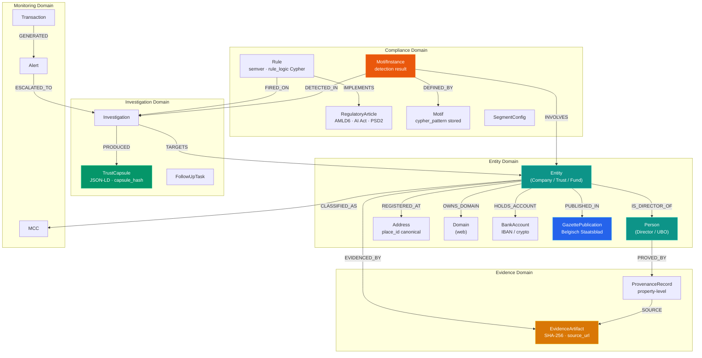
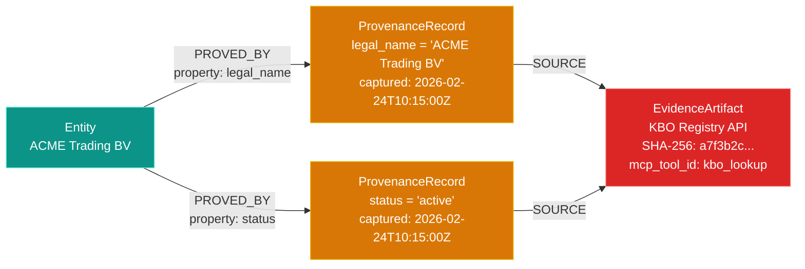
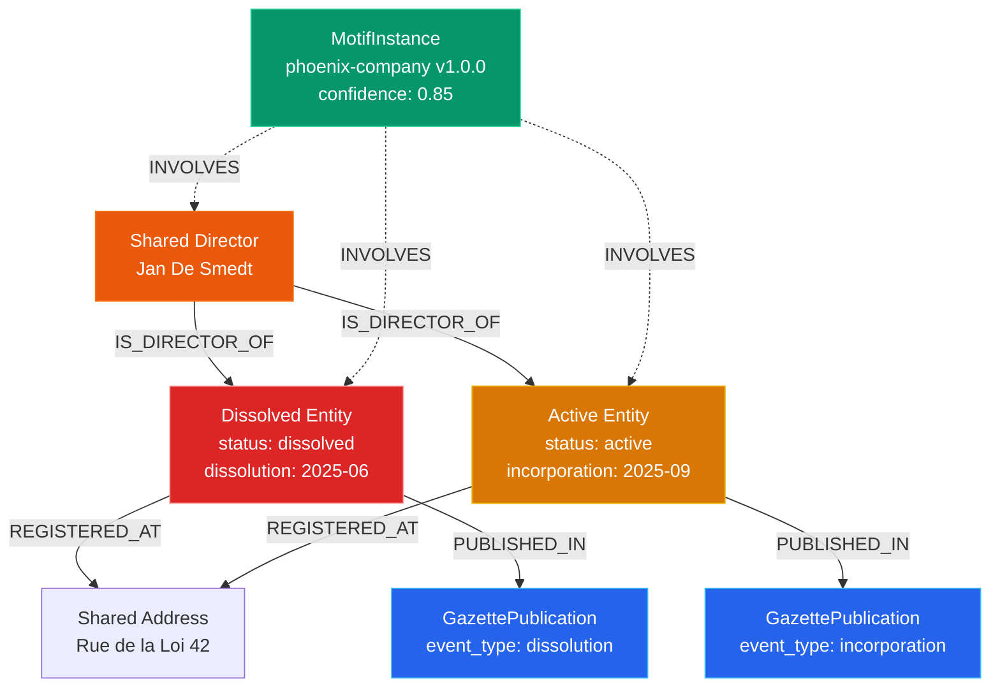
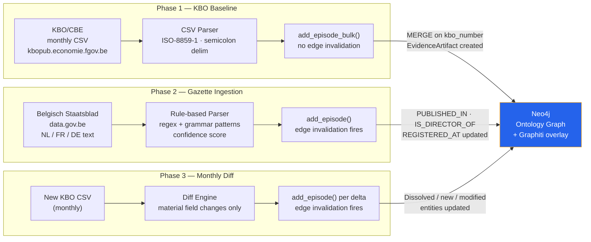
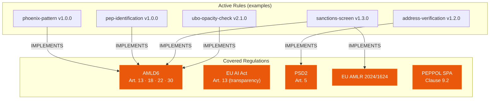
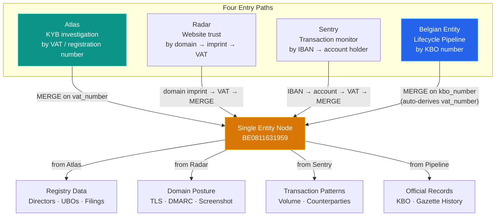

# Ontology Layer

TrustRelay's compliance intelligence rests on a formal, versioned ontology — a canonical schema stored in Neo4j that defines every entity type, relationship, evidence record, fraud pattern, decision rule, and regulatory mapping across all three products (Atlas, Radar, Sentry). This page covers the schema design, motif patterns, property-level provenance, the Belgian Entity Lifecycle Pipeline, regulatory coverage, and the architectural moat.

---

## The Problem This Solves

Without a formal ontology, TrustRelay has five structural problems (and a sixth compounding them):

1. The same company investigated in Atlas and later flagged in Sentry has no guaranteed structural link — the connection depends on application-level identifier matching rather than a shared entity model.
2. Graph motif detection (phoenix, mule, shared-director) is ad-hoc Cypher without formal pattern definitions — impossible to version, test, or explain to regulators.
3. The "zero hallucination" guarantee is enforced at Trust Capsule level but not at the individual property level — we cannot answer "where did this specific data point come from?" without reconstructing the investigation trace.
4. Segment-driven KYC configurations are encoded in agent logic rather than declarative ontology rules — opaque and unauditable.
5. Entity identity is treated as static — property updates overwrite previous values, making historical state reconstruction and temporal fraud patterns (phoenix companies) structurally undetectable.
6. TrustRelay has no mechanism to ingest the full lifecycle of a legal entity from official sources. Belgian entities publish every statutory change in the Belgisch Staatsblad / Moniteur Belge. The KBO/CBE publishes a monthly open-data CSV of all active entities. Neither is currently ingested, meaning the entity graph is a point-in-time snapshot from the moment of investigation — not the entity's actual evolution over years.

The Ontology Layer resolves all six by establishing a formal, versioned, Neo4j-native schema with a Graphiti-powered bitemporal overlay and a three-phase Belgian Entity Lifecycle Pipeline.

---

## Schema Overview



| Domain | Node Types | Purpose |
|--------|-----------|---------|
| Entity | Entity, Person, Address, Domain, BankAccount, GazettePublication | Subjects of investigation and their official publication record |
| Evidence | EvidenceArtifact, ProvenanceRecord | Cryptographic provenance chain to the atomic property level |
| Investigation | Investigation, TrustCapsule, FollowUpTask | Workflow lifecycle and compliance deliverables |
| Compliance | Rule, RegulatoryArticle, Motif, MotifInstance, SegmentConfig | Regulatory logic, fraud patterns, and segment configuration |
| Monitoring | Transaction, Alert, MCC | Sentry AML transaction surveillance |
| Meta-Ontology | OntologyVersion, NodeTypeDefinition, RelTypeDefinition, DerivedQueryDefinition, PipelineRun | Self-describing schema versioning and pipeline audit trail |

---

## Property-Level Provenance

Every individual data point on every node traces to an `EvidenceArtifact` via a `ProvenanceRecord`. This is the "zero hallucination" guarantee at the atomic level.



**Write pattern** — executed inside each MCP tool call, within a single transaction:

```cypher
// Step 1: Create or update the entity
MERGE (e:Entity {vat_number: $vat_number})
SET e.legal_name = $legal_name, e.status = $status

// Step 2: Create the evidence artifact
CREATE (ea:EvidenceArtifact {
  artifact_id: randomUUID(),
  artifact_type: 'api-response',
  source_url: $source_url,
  captured_at: datetime(),
  content_hash: $sha256_hash,
  mcp_tool_id: $tool_id,
  mcp_call_id: $call_id,
  storage_uri: $blob_ref
})

// Step 3: Create provenance records (one per property)
CREATE (pr_name:ProvenanceRecord {
  provenance_id: randomUUID(),
  property_name: 'legal_name',
  property_value: $legal_name,
  captured_at: datetime(),
  content_hash: $sha256_hash
})
CREATE (pr_status:ProvenanceRecord {
  provenance_id: randomUUID(),
  property_name: 'status',
  property_value: $status,
  captured_at: datetime(),
  content_hash: $sha256_hash
})

// Step 4: Link
CREATE (e)-[:EVIDENCED_BY {property_name: 'legal_name', captured_at: datetime()}]->(ea)
CREATE (e)-[:PROVED_BY {property_name: 'legal_name'}]->(pr_name)
CREATE (pr_name)-[:SOURCE]->(ea)
CREATE (e)-[:PROVED_BY {property_name: 'status'}]->(pr_status)
CREATE (pr_status)-[:SOURCE]->(ea)
```

**Audit query:**

```cypher
MATCH (e:Entity {vat_number: 'BE0811631959'})
      -[:PROVED_BY {property_name: 'legal_name'}]->(pr:ProvenanceRecord)
      -[:SOURCE]->(ea:EvidenceArtifact)
RETURN pr.property_value, ea.source_url, ea.captured_at,
       ea.content_hash, ea.mcp_tool_id
ORDER BY ea.captured_at DESC
```

Gazette-sourced facts follow the same pattern with `artifact_type: 'gazette-publication'` and the Staatsblad publication URL as `source_url`.

---

## Versioned Fraud Motif Patterns

Fraud patterns are stored as `Motif` nodes in the graph itself — with the detection Cypher in `cypher_pattern` and a temporal variant in `temporal_cypher_pattern` for patterns that require historical comparison via the Graphiti overlay.

**Motifs are not ad-hoc queries. They are versioned, testable, and directly auditable:**

```cypher
MATCH (m:Motif {status: 'active'})
RETURN m.motif_name, m.motif_version, m.cypher_pattern,
       m.min_confidence, m.description
ORDER BY m.motif_name
```

### Phoenix Company

Dissolved entity sharing a director with a recently incorporated entity — the classic asset-stripping pattern. Temporal variant also checks gazette records.



```cypher
// cypher_pattern (current-state variant)
MATCH (dissolved:Entity {status: 'dissolved'})<-[:IS_DIRECTOR_OF]-(p:Person)
      -[:IS_DIRECTOR_OF]->(active:Entity {status: 'active'})
WHERE active.incorporation_date > dissolved.dissolution_date
  AND duration.between(dissolved.dissolution_date, active.incorporation_date).months < 18
OPTIONAL MATCH (dissolved)-[:REGISTERED_AT]->(addr:Address)<-[:REGISTERED_AT]-(active)
OPTIONAL MATCH (dissolved)-[:PUBLISHED_IN]->(g1:GazettePublication {event_type: 'dissolution'})
OPTIONAL MATCH (active)-[:PUBLISHED_IN]->(g2:GazettePublication {event_type: 'incorporation'})
RETURN dissolved, active, p, addr,
       CASE WHEN addr IS NOT NULL THEN 0.3 ELSE 0 END +
       CASE WHEN dissolved.legal_name CONTAINS active.legal_name THEN 0.2 ELSE 0 END +
       CASE WHEN g1 IS NOT NULL AND g2 IS NOT NULL THEN 0.1 ELSE 0 END +
       0.4 AS confidence
```

```cypher
// temporal_cypher_pattern (queries Graphiti invalidated edges)
MATCH (dissolved:Entity)<-[r1:IS_DIRECTOR_OF]-(p:Person)-[r2:IS_DIRECTOR_OF]->(active:Entity)
WHERE dissolved.status = 'dissolved' AND active.status = 'active'
  AND r1.invalid_at IS NOT NULL
  AND r2.valid_at > r1.invalid_at
  AND duration.between(date(r1.invalid_at), date(r2.valid_at)).months < 18
RETURN dissolved, active, p, r1.invalid_at AS dissolved_tenure_end,
       r2.valid_at AS new_tenure_start
```

### Mule Network

Rapid pass-through of similar amounts through recently incorporated entities within 7 days:

```cypher
MATCH path = (origin:Entity)-[:SENT]->(t1:Transaction)-[:RECEIVED]->(e1:Entity)
             -[:SENT]->(t2:Transaction)-[:RECEIVED]->(e2:Entity)
             -[:SENT]->(t3:Transaction)-[:RECEIVED]->(destination:Entity)
WHERE t1.transaction_date <= t2.transaction_date
  AND t2.transaction_date <= t3.transaction_date
  AND duration.between(t1.transaction_date, t3.transaction_date).days < 7
  AND abs(t1.amount - t3.amount) / t1.amount < 0.15
  AND e1.incorporation_date > date() - duration('P2Y')
  AND e2.incorporation_date > date() - duration('P2Y')
RETURN path, origin, destination, [t1.amount, t2.amount, t3.amount] AS amounts,
       0.7 AS confidence
```

### Circular Invoicing (PEPPOL)

Closed loop of PEPPOL invoices with similar amounts within 90 days — VAT carousel indicator:

```cypher
MATCH cycle = (e1:Entity)-[:SENT]->(t1:Transaction {transaction_type: 'peppol-invoice'})
              -[:RECEIVED]->(e2:Entity)-[:SENT]->(t2:Transaction {transaction_type: 'peppol-invoice'})
              -[:RECEIVED]->(e3:Entity)-[:SENT]->(t3:Transaction {transaction_type: 'peppol-invoice'})
              -[:RECEIVED]->(e1)
WHERE e1 <> e2 AND e2 <> e3 AND e1 <> e3
  AND duration.between(t1.transaction_date, t3.transaction_date).days < 90
  AND abs(t1.amount - t2.amount) / t1.amount < 0.20
  AND abs(t2.amount - t3.amount) / t2.amount < 0.20
RETURN cycle, [t1.amount, t2.amount, t3.amount] AS amounts, 0.6 AS confidence
```

### Shared-Director-at-Maildrop

Single person directing ≥3 entities at a high-co-tenancy virtual address:

```cypher
MATCH (e1:Entity)<-[:IS_DIRECTOR_OF]-(p:Person)-[:IS_DIRECTOR_OF]->(e2:Entity),
      (e1)-[:REGISTERED_AT]->(addr:Address {address_type: 'virtual'})<-[:REGISTERED_AT]-(e2)
WHERE e1 <> e2
WITH p, addr, apoc.coll.toSet(collect(DISTINCT e1) + collect(DISTINCT e2)) AS unique_entities
WHERE size(unique_entities) >= 3
  AND size((addr)<-[:REGISTERED_AT]-()) > 10
RETURN p, addr, unique_entities,
       CASE WHEN size((addr)<-[:REGISTERED_AT]-()) > 50 THEN 0.9
            WHEN size((addr)<-[:REGISTERED_AT]-()) > 20 THEN 0.7
            ELSE 0.5 END AS confidence
```

### Full Motif Catalogue

| Motif | Version | Key Signal | Temporal Variant |
|-------|---------|-----------|-----------------|
| `phoenix-company` | 1.0.0 | Director shared between dissolved + new entity | Yes — queries Graphiti invalidated edges + gazette dissolution/incorporation events |
| `mule-network` | 1.0.0 | 3-hop pass-through < 7 days, amount drift < 15% | No |
| `circular-invoicing` | 1.0.0 | Closed PEPPOL invoice loop < 90 days | No |
| `shared-director-maildrop` | 1.0.0 | ≥3 entities, 1 director, virtual address with > 10 co-tenants | No |
| `dormant-reactivation` | 1.0.0 | No activity > 12 months, sudden new transactions | Yes — checks gazette publication history |
| `change-of-control` | 1.0.0 | UBO change in last 6 months + high-value transactions | Yes — queries Graphiti for UBO tenure changes |
| `trade-based-ml` | 1.0.0 | PEPPOL invoice amounts inconsistent with declared NACE activity | No |
| `circular-ownership` | 1.0.0 | Entity → subsidiary → Entity ownership loop | No |

---

## Belgian Entity Lifecycle Pipeline

Every statutory change to a Belgian legal entity is published in the Belgisch Staatsblad / Moniteur Belge. The KBO/CBE publishes a monthly open-data CSV of all active entities. The pipeline builds the authoritative temporal record of entity evolution from these official sources.



### Phase 1 — KBO Baseline Load

The KBO monthly CSV (free registration at kbopub.economie.fgov.be, no API key) contains enterprise numbers, legal forms, denominations (NL/FR/DE), addresses, officer links, NACE codes, and start dates for all ~1.2M active Belgian entities.

Bulk-loaded via Graphiti's `add_episode_bulk()` with `EpisodeType.json` and `reference_time = extract_date`. Individual `add_episode()` is not used here — edge invalidation is not needed for the initial load of an empty graph.

Belgian VAT number is derived deterministically from the KBO number: `BE` + digits = `BE0811631959` for KBO `0811631959`.

**Acceptance criteria:** 10,000+ Entity nodes created; each has `kbo_number`, `legal_name`, `legal_form`, `status`, `country_code`; addresses resolved to `place_id` (target ≥95% via Nominatim); `EvidenceArtifact` nodes created with `artifact_type='kbo-csv-extract'` and correct `content_hash`.

### Phase 2 — Gazette Ingestion

Individual `add_episode()` calls (not bulk) with `reference_time = effective_date_of_change` (not publication date). Individual calls are required because Graphiti's edge-invalidation logic must fire: a director-resignation publication must mark the prior `:IS_DIRECTOR_OF` edge `invalid_at = resignation_effective_date`.

Three research challenges (WP1 in the VLAIO project):

1. **Temporal grounding**: the director resigned on March 1 but the publication appears March 15 — `reference_time` must be March 1, not March 15.
2. **Role classification**: mapping Dutch/French legal vocabulary (`bestuurder`, `gedelegeerd bestuurder`, `zaakvoerder`, `commissaris`, `nommé administrateur`, `gérant`) to the ontology's `role_type` enum.
3. **Cross-document entity resolution**: "Jan De Smet" in one publication vs "J. De Smet" in another without national register numbers. Name-only matches create `:POSSIBLE_MATCH` edges for HITL review; only KBO number matches trigger auto-merge.

Parser approach: deterministic rule-based (regex + grammar patterns for known legal phrases). Target F1 ≥ 0.85 for director appointment/resignation and address change on manually annotated ground truth of ≥50 publications.

```python
# Gazette parser — Dutch director appointment (abbreviated)
if re.search(r'benoemd tot (bestuurder|zaakvoerder|gedelegeerd bestuurder)', raw_text, re.I):
    facts["event_type"] = "director_appointment"
    facts["confidence"] = 0.9
    name_match = re.search(
        r'(?:de heer|mevrouw|dhr\.|mevr\.)\s+([A-Z][a-zà-ÿ]+(?:\s+[A-Z][a-zà-ÿ]+)+)',
        raw_text
    )
    if name_match:
        facts["person_name"] = name_match.group(1)

# French counterpart
if re.search(r'nommé (administrateur|gérant|administrateur délégué)', raw_text, re.I):
    facts["event_type"] = "director_appointment"
    facts["confidence"] = 0.9
```

### Phase 3 — Monthly Snapshot Diff

Each new KBO monthly dump is compared against the previous. Deltas are classified as:

- **New entities**: creates a new `LegalEntity` node via `add_episode()`
- **Removed entities**: creates a status-change episode triggering edge invalidation (likely dissolved or struck off)
- **Modified entities**: material field changes generate individual episodes. Material fields: `legal_name`, `legal_form`, `status`, registered address, NACE code, officer links. Non-material: formatting differences, encoding variations

**Source precedence model** (hypothesis to be validated during WP1):
- Gazette > KBO for statutory events (director appointment/resignation, address change, capital change, name change, dissolution) — gazette records the legal effective date; KBO may lag
- KBO > gazette for administrative events (automatic National Register address propagation, strike-offs, data corrections) — these may lack gazette publications entirely

---

## Regulatory Article Mapping

Every entity property, relationship type, and Rule node maps to the specific EU regulatory articles it serves. This makes regulatory coverage **inspectable by Cypher query**.



```cypher
// "Which articles does our AMLD6 implementation cover?"
MATCH (r:Rule {status: 'active'})-[:IMPLEMENTS]->(ra:RegulatoryArticle)
WHERE ra.regulation_name = 'AMLD6'
RETURN ra.article_number, ra.article_title,
       collect(r.rule_name) AS implementing_rules
ORDER BY ra.article_number
```

```cypher
// "Which node types serve a given regulation?"
MATCH (n:NodeTypeDefinition)-[:SERVES]->(r:RegulatoryArticle)
WHERE r.regulation_name = 'AMLD6'
RETURN n.label_name, r.article_number
```

When a regulator asks "how do you comply with AMLD6 Article 18?" — the answer is a live query, not a PDF.

---

## Cross-Product Entity Resolution

An entity enters the system through four possible paths. They must all converge to a single canonical node.



```cypher
// Auto-merge — safe because of uniqueness constraints
MERGE (e:Entity {vat_number: $vat_number})
MERGE (e:Entity {kbo_number: $kbo_number})

// Soft match — never auto-merged
CREATE (e1)-[:POSSIBLE_MATCH {
  confidence: $confidence,
  match_method: 'name-similarity',
  detected_at: datetime(),
  reviewed: false
}]->(e2)
```

Only VAT / registration number / KBO number matching triggers automatic merge. Name-based matching **never** triggers automatic merge — only creates `:POSSIBLE_MATCH` for HITL review.

---

## Meta-Ontology

The ontology is self-describing. Four meta-node types make the schema inspectable and versionable at runtime:

| Node | Purpose | Key Properties |
|------|---------|---------------|
| `OntologyVersion` | Singleton per schema version | `version` (semver), `released_at`, `changelog`, `migration_cypher` |
| `NodeTypeDefinition` | One per node label | `label_name`, `required_properties`, `optional_properties`, `regulatory_articles` |
| `RelationshipTypeDefinition` | One per relationship type | `type_name`, `source_label`, `target_label`, `is_primary_fact` (always true for stored rels) |
| `DerivedQueryDefinition` | One per query-time computation | `query_name`, `cypher_template`, `traversal_hops`, `expected_latency_ms` |

The `DerivedQueryDefinition` nodes document every computation that replaces a stored relationship — discoverable and testable as first-class schema citizens. External auditors can retrieve the complete list of what is stored vs what is computed:

```cypher
MATCH (d:DerivedQueryDefinition)
RETURN d.query_name, d.cypher_template, d.traversal_hops, d.expected_latency_ms
```

---

## Competitive Moat

The ontology layer is not a feature — it is an accumulated structural advantage that compounds over time.

**1. Temporal compliance record from official sources.** No compliance platform ingests the Belgian Staatsblad at the gazette-publication level with bitemporal edge tracking. The temporal record of entity evolution — incorporated from official publications, going back years — is a data asset that cannot be reconstructed retroactively by a competitor who starts later. Every month of gazette ingestion widens the gap. This aligns with the temporal knowledge graph architecture described in [Graphiti: A Temporally Dynamic, Factual Graph RAG Approach](https://arxiv.org/abs/2501.13956) (Zep AI, arXiv:2501.13956, January 2025).

**2. Formal OWL/RDF alignment co-authored with PXL-Digital.** The Neo4j schema is maintained in alignment with a formal OWL/RDF ontology specification, co-authored with PXL-Digital under the VLAIO innovation funding program. This alignment document maps every Neo4j node label to an OWL class and every relationship type to an OWL object property. The result: TrustRelay can claim ISO-level formal semantic interoperability — a claim no startup-phase competitor has the academic infrastructure to make. The OWL/RDF alignment does not execute at runtime (no SPARQL, no reasoner); it is a specification-level mapping maintained alongside `OntologyVersion`, updated with each schema release.

**3. Motifs stored as versioned, testable Cypher.** Competitors detect fraud patterns as application code. TrustRelay stores them as versioned Motif nodes with Cypher patterns, test fixtures, and regulatory article mappings. When FATF publishes a new typology or a regulator asks "can your system detect X?", the answer is `CREATE (m:Motif ...)` and a new motif is live in production — no code deployment. The motif catalogue is auditable by Cypher, not by reading source code.

**4. Property-level provenance at EU AI Act Art. 13 fidelity.** EU AI Act Article 13 requires high-risk AI systems to provide traceability of data provenance. TrustRelay's provenance chain goes to the atomic property level: not "we used KBO data" but "this exact property value came from this exact API call at this timestamp with this SHA-256 hash." The `ProvenanceRecord → SOURCE → EvidenceArtifact` chain is the machine-readable compliance artifact required by Art. 13 — rendered as JSON-LD in every Trust Capsule's `evidence_chain` field.

**5. Segment configuration as declarative graph data.** Compliance logic for each client segment (PSP, bank, insurance, marketplace, PEPPOL SP) is stored in `SegmentConfig` nodes linked to `RegulatoryArticle` nodes via `:REQUIRES_COMPLIANCE_WITH`. Adding a new segment or modifying a regulatory requirement is a graph write, not a code change — and the change is immediately auditable by query. Competitors encode this in application logic, making it opaque to regulators and expensive to change.

---

## Frontend Visualization Architecture

The ontology and graph data surfaces through five interconnected views:

### 1. Ontology Page (`/dashboard/ontology`)

Two-tab interface consuming the meta-ontology:
- **Catalog View**: Domain/regulation grouping of all `NodeTypeDefinition` and `RelationshipTypeDefinition` nodes with live instance counts
- **Graph View**: Interactive SVG visualization of node type relationships using d3-force, with a Voyager-style three-panel layout

**Data source**: `GET /api/graph/ontology/schema` → OntologyVersion + NodeTypeDefinition + RelationshipTypeDefinition + DerivedQueryDefinition + live counts

### 2. Graph Explorer (`/dashboard/graph`)

Full 2D/3D graph exploration with filtering, temporal queries, and multiple detail panels:
- `GraphCanvas2D` (react-force-graph-2d) with custom shape rendering per node type
- `GraphCanvas` (Three.js) with WebGL 3D visualization and bloom effects
- Right-sidebar panels: Node Detail, Timeline, Provenance, Ontology, Motif Catalog, Segment Config, Entity Timeline

**Data source**: `GET /api/graph/explorer/data` → up to 300 nodes from Neo4j ordered by degree

### 3. Entity Network Tab (Case Detail)

Four sub-tabs within the case detail page's Entity Network tab:

| Sub-tab | Component | Data Source | Shows |
|---------|-----------|-------------|-------|
| 2D Graph | `SvgEntityGraph` | `GET /api/graph/risk-propagation/{wid}` | Concentric ring layout of company + connected entities |
| 3D Provenance | `ProvenanceGraph` | `GET /api/graph/entity/{reg}/provenance` | WebGL graph with source artifact nodes + per-property provenance |
| Schema Overlay | `SchemaOverlay` | `GET /api/graph/entity/{reg}/schema-overlay` | Node type catalog with regulation filtering and instance counts |
| Compliance Map | `ComplianceMap` | `GET /api/graph/entity/{reg}/compliance-map` | Regulation compliance cards with gap analysis |

**Data flow**: Case → registration_number → Neo4j entity-level queries

### Neo4j Enabled vs Disabled

When `NEO4J_ENABLED=true` (default since v2.x):
- All views query Neo4j directly
- Entity Network shows full graph (Company + Directors + Findings + Evidence + Financial + Investigation)
- Provenance shows per-property source tracking
- Compliance shows regulation coverage with gap analysis

When `NEO4J_ENABLED=false`:
- Graph Explorer and Ontology pages show empty state
- Entity Network falls back to synthetic network from `company_profile.json` in MinIO
- Provenance and Compliance sub-tabs show empty state
