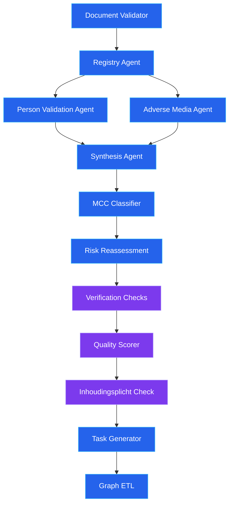
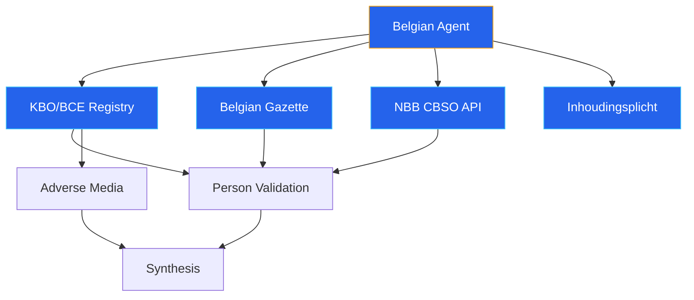

# OSINT Investigation Pipeline

The OSINT (Open Source Intelligence) pipeline is the core automated investigation engine. It coordinates multiple AI agents to cross-reference customer-provided documents against public registries, LinkedIn profiles, adverse media sources, and sanctions databases.

## Pipeline DAG

The pipeline now includes 13 agents. Three agents were added in the 2026-03-31 update: `verification_checks`, `quality_scorer`, and `inhoudingsplicht_check`. MCC classification was moved earlier in the sequence (before risk reassessment, after synthesis).



### Execution Order

1. **Document Validator** (sequential) -- Validates uploaded documents against template requirements
2. **Registry Agent** (sequential) -- Must complete first to extract director and UBO names
3. **Person Validation** + **Adverse Media** (parallel) -- Run concurrently via `asyncio.gather`
4. **Synthesis Agent** (sequential) -- Combines all three agent outputs into a unified risk assessment
5. **MCC Classifier** (sequential) -- Assigns Merchant Category Code based on OSINT findings (moved before risk reassessment as of 2026-03-31, so MCC context is available during EBA scoring)
6. **Risk Reassessment** (sequential) -- Re-runs EBA risk matrix with MCC context
7. **Verification Checks** (sequential) -- Runs `inhoudingsplicht_check` and other verification tools; progress tracked in `agent_executions`
8. **Quality Scorer** (sequential) -- LLM-as-judge scores synthesis report on 4 dimensions; progress tracked in `agent_executions`
9. **Inhoudingsplicht Check** (sequential, BE only) -- Social/tax debt status via PEPPOL (Belgian cases only)
10. **Task Generator** (sequential) -- Suggests follow-up actions based on the investigation
11. **Graph ETL** (sequential, KYB only) -- Syncs investigation results to Neo4j knowledge graph

### Pipeline Strip (Frontend)

The officer dashboard Pipeline Strip shows 8 stages that map to the DAG above:

| Stage | Agents covered |
|-------|----------------|
| Registry | Document Validator + Registry Agent |
| MCC | MCC Classifier |
| Screening | Person Validation + Adverse Media |
| Financial | Risk Reassessment |
| Synthesis | Synthesis Agent |
| Quality | Quality Scorer |
| Tasks | Task Generator |
| Graph | Graph ETL |

## Standard Pipeline (Non-Belgian)

For non-Belgian cases, the registry agent uses NorthData MCP tools:

| Step | Agent | Data Source | Output |
|------|-------|-------------|--------|
| 1 | Registry Agent | NorthData API (DACH, NL coverage) | Company status, directors, UBOs, financials |
| 2a | Person Validation | BrightData LinkedIn MCP | LinkedIn profiles, company-role match, legitimacy scores |
| 2b | Adverse Media | Tavily search MCP | Sanctions matches, PEP flags, adverse news articles |
| 3 | Synthesis | None (reasoning only) | Risk score (0.0-1.0), findings, discrepancies, narrative summary |

## Belgian Pipeline (4 Official Sources)

When `country=BE`, the system routes to the Belgian agent, which queries four official data sources:



### Belgian Data Sources

| Source | Data Retrieved | Tool Used | Why This Tool |
|--------|---------------|-----------|---------------|
| **KBO/BCE** | Company name, legal form, NACE codes, directors (with roles and mandate dates), establishments | Custom HTML scraper (`kbo_service.py`) | Dedicated parser for well-known HTML structure |
| **Belgian Gazette** | Board publications, capital changes, statutory modifications, full publication text, official PDF documents | **crawl4ai** (`crawl4ai_service.py`) | Static HTML, no bot protection, crawl4ai works perfectly. Gazette publications include articles of association and statutory documents with downloadable PDFs |
| **NBB CBSO** | Financial filings, annual accounts CSV, solvency/debt ratios, filing regularity | **Direct REST API** (`nbb_service.py`) via httpx | Public REST API behind the Angular SPA -- no scraping needed |
| **Inhoudingsplicht** | Social debt and tax debt status | **PEPPOL** (primary) or **crawl4ai** (fallback) | PEPPOL inhoudingsplicht check is the primary reliable source |

:::note Scraping Tool Selection
Each Belgian data source uses the tool best suited to its characteristics. The Belgian Gazette provides comprehensive corporate documentation including articles of association, capital changes, and statutory modifications with full-text content and official PDF downloads. See [ADR-0008](/docs/adr/) for the full tool selection rationale.
:::

### NBB Financial Data

The NBB service parses CSV financial accounts and extracts key metrics:

| Rubric Code | Metric | Description |
|-------------|--------|-------------|
| 20/58 | Total Assets | Balance sheet total |
| 10/15 | Equity | Shareholder equity |
| 70 | Revenue | Turnover |
| 9904 | Profit/Loss | Net result |
| 9087 | Employees | Staff count |

Computed ratios:
- **Solvency ratio** = equity / total_assets (below 0.3 = concerning, below 0.1 = critical)
- **Debt ratio** = (total_assets - equity) / total_assets

These metrics feed into the `FinancialHealthReport` model, which is displayed in the dashboard's Financial Health Card.

### Deep Gazette Scraping

The gazette scraper uses a two-phase approach:

1. **Phase 1** -- Search the gazette for the company name, extract publication summaries
2. **Phase 2** -- Follow up to 5 publication URLs to extract full text content

This provides the synthesis agent with complete publication text (capital changes, director appointments, statutory modifications) rather than just titles.

## Evidence Chain

### Belgian Evidence Service

Every Belgian data source response is hashed and persisted:

```
Per-source: SHA-256(json.dumps(data, sort_keys=True))
Bundle:     SHA-256(json.dumps({source: hash, ...}, sort_keys=True))
```

Evidence is stored in two locations:
1. **PostgreSQL** (`belgian_evidence` table) -- source, URL, hash, raw JSON data, timestamp
2. **MinIO** -- Archived JSON for long-term storage

The bundle hash creates a tamper-evident fingerprint of the entire evidence collection for a case iteration.

### PEPPOL Evidence

The PEPPOL verification service uses the same hashing pattern, with results stored in the `peppol_verifications` table and an `evidence_bundle_hash` field.

## Cache and Reuse

On follow-up iterations (iteration > 1), the pipeline checks for cached agent outputs from the previous iteration:

```python
if iteration > 1 and case_id and not force_full_investigation:
    cached = _load_osint_cache(case_id)
    if cached:
        registry_data, person_data, media_data, metadata = cached
        # Skip agents 1-3, only run Synthesis with new documents
```

### What Gets Cached

Cached to MinIO at `{case_id}/osint_cache/`:

| File | Content |
|------|---------|
| `registry_output.json` | Registry agent structured output |
| `person_validation_output.json` | Person validation results |
| `adverse_media_output.json` | Adverse media screening results |
| `metadata.json` | Cache timestamp and source iteration number |

### What Gets Re-Run

The Synthesis agent always re-runs because it needs to incorporate:
- New documents from the latest iteration
- Customer responses to follow-up questions
- The cumulative evidence picture

### Cache Bypass

Set `force_full_investigation: true` in the case's `additional_data` to force a full re-run of all agents, bypassing the cache.

## Pipeline Observability

Each agent reports its status to the `agent_executions` PostgreSQL table:

| Field | Description |
|-------|-------------|
| `agent_name` | e.g., "registry", "person_validation", "synthesis" |
| `status` | "pending", "running", "success", "failed", "reused" |
| `started_at` / `completed_at` | Timestamps for duration calculation |
| `duration_ms` | Execution time in milliseconds |
| `model` | LLM model used (e.g., "openai:gpt-5.2") |
| `findings_count` | Number of findings produced |
| `output_summary` | Human-readable summary (e.g., "Found 3 directors, 1 UBO") |

The frontend displays this data as a real-time pipeline visualization (PipelineDAG, AgentCard, PipelineTimingBar components), showing officers which agents are running, completed, or failed.

## Network Scan Phase

After the Synthesis agent completes its primary investigation, the EVOI engine initiates a network scan phase that evaluates connected entities discovered via NorthData `relatedCompanies`.

### Trigger

The network scan phase is triggered automatically after synthesis when:
- NorthData returned one or more `relatedCompanies` entries for the subject entity
- At least one connected entity has a positive Network EVOI score

### Per-Entity Scan

For each entity with a positive Network EVOI decision, the engine runs three checks in parallel:

| Check | Tool | Output |
|---|---|---|
| Company lookup | NorthData API (euId passed as registration ID) | `company_status`, `directors`, further `relatedCompanies` |
| Sanctions screening | OpenSanctions local database (pg_trgm fuzzy match) | `sanctions_status`, matched entity names |
| Jurisdiction risk | FATF + EU high-risk countries lookup | `jurisdiction_risk` (LOW / MEDIUM / HIGH / CRITICAL) |

The euId extracted from the `relatedCompanies` response is passed as the registration ID for the NorthData lookup. This dramatically improves match quality compared to name-based searches, especially for entities with common names.

### Timing

Scanning 16 entities typically completes in 35–60 seconds. The bottleneck is NorthData, which is rate-limited to a 2-second interval between requests enforced by a global async rate limiter shared across all concurrent network scans.

### Corroboration Analysis

Once all entities are scanned, a cross-network corroboration analysis identifies structural risk patterns:

- **Shared directors** — the same natural person governing multiple network entities
- **Jurisdiction concentration** — multiple entities in high-risk jurisdictions
- **Dissolved entities** — terminated companies in the corporate chain
- **Sanctions hits** — any sanctions match in the network

### Result Propagation

HIGH-severity findings from the network scan cascade to the parent case investigation result. These findings appear in the officer review dashboard alongside primary OSINT findings, clearly attributed to the network scan phase. The OSINT pipeline DAG displays a dedicated "Network Scan" step with real-time progress messages as each entity is evaluated.

---

## Data Merge Points

The OSINT pipeline collects data from multiple independent sources that must be merged at specific points in the pipeline. Director data, financial data, and company identity data each have different merge strategies and timing constraints.

Key merge points:

- **Pre-validation director merge** -- Registry agent directors + NorthData pre-enrichment directors + UBOs are merged and deduplicated before person validation and adverse media screening run in parallel.
- **Post-synthesis financial enrichment** -- NorthData API financials and country-specific financial APIs are fetched after synthesis and added to the result.
- **Post-OSINT UBO merge** -- Document-extracted UBOs are merged into the investigation result at the Temporal workflow level, after the OSINT pipeline completes.

For the full data flow with Mermaid diagrams, merge decision rationale, and documented gaps, see [Data Merge Architecture](/docs/architecture/data-merge-architecture).

---

## Error Handling

The pipeline uses graceful degradation at every level:

1. **Agent failure** -- Each agent wrapper catches exceptions and returns a safe fallback output with an error finding
2. **Pipeline failure** -- The `run_osint_investigation` function catches top-level exceptions and returns a minimal result with a 0.5 risk score and a recommendation for manual review
3. **Temporal retry** -- The activity has a 3-attempt retry policy with exponential backoff

This means a case never gets stuck due to a transient API failure. The worst case is a degraded investigation result that flags the need for manual review.

---

## Social Intelligence Timeout (3-minute cap)

The social intelligence agent (BrightData MCP) is the slowest pipeline component, sometimes exceeding 5 minutes on complex company networks. As of 2026-04-06, it runs with a hard 3-minute `asyncio.wait_for` timeout:

```python
result = await asyncio.wait_for(
    run_social_intelligence_agent(...),
    timeout=180,
)
```

On timeout, the agent is marked as "failed" in `agent_executions` with the message "Timed out (3 min)" and an empty `SocialIntelligenceOutput` is used. The pipeline continues without social intelligence data -- synthesis receives all other agent outputs normally.

**Exception handling note:** The timeout catch uses `except BaseException` to handle `CancelledError` (which `asyncio.wait_for` raises on the inner coroutine in Python 3.12+). This is a known code review finding -- it can inadvertently swallow Temporal activity cancellation signals.

---

## Website Scrape Reuse from Pre-Enrichment

When a website URL is discovered during pre-enrichment (via Tavily search at case creation time), the workflow reuses this URL during the investigation iteration instead of repeating the discovery:

1. **Pre-enrichment** (case creation): `_website_discover()` searches Tavily for the company website, stores result in `additional_data.website_discovery`
2. **Workflow iteration**: `fetch-website-v1` reads the stored `website_url` from the DB via `fetch_company_details` activity, avoiding a redundant Tavily call
3. **Crawl4ai scrape**: Uses the known URL directly, saving 2-5 seconds of discovery time

The website URL from pre-enrichment is auto-selected (first non-directory candidate) and stored in the case's `additional_data.website_url` field.

---

## Agent Error Tracking in Audit Log

As of 2026-04-06, every agent failure is tracked in two places:

1. **`agent_executions` table**: Status set to "failed" with `error_message` field (truncated to 200 chars)
2. **Workflow audit log**: `agent_error` audit event with `agent_name`, `error_type`, and `error_message`

Agent errors include duration tracking -- the `duration_ms` field is populated even on failure, enabling analysis of whether timeouts are the primary failure mode.

---

## PydanticAI ModelRetry Quality Gates

Two pipeline agents use PydanticAI's `ModelRetry` mechanism to enforce output quality:

### Synthesis Agent

The synthesis agent validates its output against 5 structural requirements:
- Must contain all 5 sections (Executive Summary, Key Risk Signals, Verification Status, Recommendation, Next Steps)
- Executive Summary must be 2-3 sentences
- Risk signals must not be empty
- Verified items must not appear in the Unverified section

On validation failure, `ModelRetry` re-runs the LLM with feedback about what was wrong, up to 2 retries. This catches misclassification errors where the LLM puts verified sanctions results under "Unverified" instead of "Verified".

### Document Validator

The document validator uses `ModelRetry` to catch:
- Missing confidence scores
- Generic validation reasons (e.g., "document looks valid")
- Requirement ID mismatches

---

## MCC-Aware License Verification

As of 2026-04-06, the verification checks pipeline includes regulatory license verification that is MCC-aware:

1. **Vertical resolution**: The `resolve_vertical()` function determines the business vertical from either the template ID (e.g., `psp_merchant_onboarding` -> `payments`) or the MCC code (e.g., MCC 6012 -> `payments`)
2. **Registry check**: For payments/banking verticals, the EBA Payment Institutions Register (CSV) is searched by company name and registration number
3. **Country routing**: National supervisory authority checks are routed by country -- FSMA for Belgium, CNB for Czech Republic
4. **Circuit breaker protection**: The EBA register download uses the `eba_register` circuit breaker to prevent cascading failures

License check results are converted to standard `VerificationResult` findings and merged into the investigation output.
