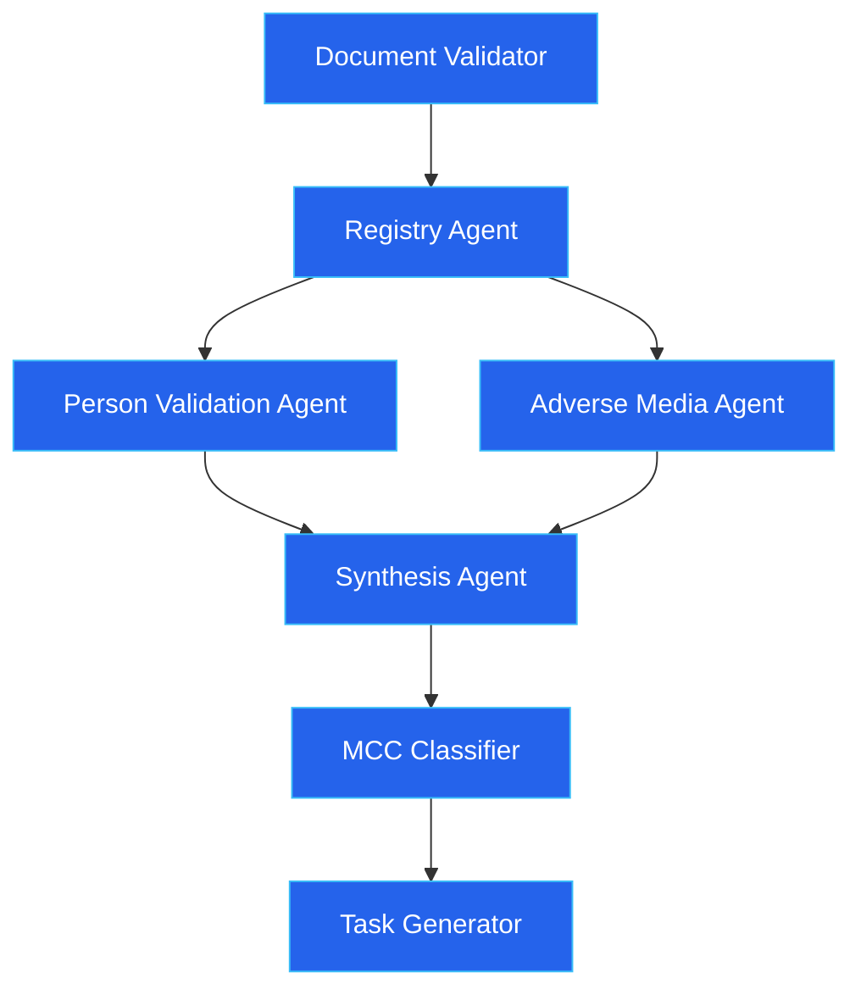
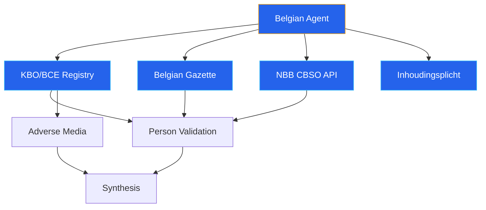

# OSINT Investigation Pipeline

The OSINT (Open Source Intelligence) pipeline is the core automated investigation engine. It coordinates multiple AI agents to cross-reference customer-provided documents against public registries, LinkedIn profiles, adverse media sources, and sanctions databases.

## Pipeline DAG



### Execution Order

1. **Document Validator** (sequential) -- Validates uploaded documents against template requirements
2. **Registry Agent** (sequential) -- Must complete first to extract director and UBO names
3. **Person Validation** + **Adverse Media** (parallel) -- Run concurrently via `asyncio.gather`
4. **Synthesis Agent** (sequential) -- Combines all three agent outputs into a unified risk assessment
5. **MCC Classifier** (sequential) -- Assigns Merchant Category Code based on OSINT findings
6. **Task Generator** (sequential) -- Suggests follow-up actions based on the investigation

## Standard Pipeline (Non-Belgian)

For non-Belgian cases, the registry agent uses NorthData MCP tools:

| Step | Agent | Data Source | Output |
|------|-------|-------------|--------|
| 1 | Registry Agent | NorthData API (DACH, NL coverage) | Company status, directors, UBOs, financials |
| 2a | Person Validation | BrightData LinkedIn MCP | LinkedIn profiles, company-role match, legitimacy scores |
| 2b | Adverse Media | Tavily search MCP | Sanctions matches, PEP flags, adverse news articles |
| 3 | Synthesis | None (reasoning only) | Risk score (0.0-1.0), findings, discrepancies, narrative summary |

## Belgian Pipeline (4 Official Sources)

When `country=BE`, the system routes to the Belgian agent, which queries four official data sources:



### Belgian Data Sources

| Source | Data Retrieved | Tool Used | Why This Tool |
|--------|---------------|-----------|---------------|
| **KBO/BCE** | Company name, legal form, NACE codes, directors (with roles and mandate dates), establishments | Custom HTML scraper (`kbo_service.py`) | Dedicated parser for well-known HTML structure |
| **Belgian Gazette** | Board publications, capital changes, statutory modifications, full publication text, official PDF documents | **crawl4ai** (`crawl4ai_service.py`) | Static HTML, no bot protection, crawl4ai works perfectly. Gazette publications include articles of association and statutory documents with downloadable PDFs |
| **NBB CBSO** | Financial filings, annual accounts CSV, solvency/debt ratios, filing regularity | **Direct REST API** (`nbb_service.py`) via httpx | Public REST API behind the Angular SPA -- no scraping needed |
| **Inhoudingsplicht** | Social debt and tax debt status | **PEPPOL** (primary) or **crawl4ai** (fallback) | PEPPOL inhoudingsplicht check is the primary reliable source |

:::note Scraping Tool Selection
Each Belgian data source uses the tool best suited to its characteristics. The Belgian Gazette provides comprehensive corporate documentation including articles of association, capital changes, and statutory modifications with full-text content and official PDF downloads. See [ADR-0008](/docs/adr/) for the full tool selection rationale.
:::

### NBB Financial Data

The NBB service parses CSV financial accounts and extracts key metrics:

| Rubric Code | Metric | Description |
|-------------|--------|-------------|
| 20/58 | Total Assets | Balance sheet total |
| 10/15 | Equity | Shareholder equity |
| 70 | Revenue | Turnover |
| 9904 | Profit/Loss | Net result |
| 9087 | Employees | Staff count |

Computed ratios:
- **Solvency ratio** = equity / total_assets (below 0.3 = concerning, below 0.1 = critical)
- **Debt ratio** = (total_assets - equity) / total_assets

These metrics feed into the `FinancialHealthReport` model, which is displayed in the dashboard's Financial Health Card.

### Deep Gazette Scraping

The gazette scraper uses a two-phase approach:

1. **Phase 1** -- Search the gazette for the company name, extract publication summaries
2. **Phase 2** -- Follow up to 5 publication URLs to extract full text content

This provides the synthesis agent with complete publication text (capital changes, director appointments, statutory modifications) rather than just titles.

## Evidence Chain

### Belgian Evidence Service

Every Belgian data source response is hashed and persisted:

```
Per-source: SHA-256(json.dumps(data, sort_keys=True))
Bundle:     SHA-256(json.dumps({source: hash, ...}, sort_keys=True))
```

Evidence is stored in two locations:
1. **PostgreSQL** (`belgian_evidence` table) -- source, URL, hash, raw JSON data, timestamp
2. **MinIO** -- Archived JSON for long-term storage

The bundle hash creates a tamper-evident fingerprint of the entire evidence collection for a case iteration.

### PEPPOL Evidence

The PEPPOL verification service uses the same hashing pattern, with results stored in the `peppol_verifications` table and an `evidence_bundle_hash` field.

## Cache and Reuse

On follow-up iterations (iteration > 1), the pipeline checks for cached agent outputs from the previous iteration:

```python
if iteration > 1 and case_id and not force_full_investigation:
    cached = _load_osint_cache(case_id)
    if cached:
        registry_data, person_data, media_data, metadata = cached
        # Skip agents 1-3, only run Synthesis with new documents
```

### What Gets Cached

Cached to MinIO at `{case_id}/osint_cache/`:

| File | Content |
|------|---------|
| `registry_output.json` | Registry agent structured output |
| `person_validation_output.json` | Person validation results |
| `adverse_media_output.json` | Adverse media screening results |
| `metadata.json` | Cache timestamp and source iteration number |

### What Gets Re-Run

The Synthesis agent always re-runs because it needs to incorporate:
- New documents from the latest iteration
- Customer responses to follow-up questions
- The cumulative evidence picture

### Cache Bypass

Set `force_full_investigation: true` in the case's `additional_data` to force a full re-run of all agents, bypassing the cache.

## Pipeline Observability

Each agent reports its status to the `agent_executions` PostgreSQL table:

| Field | Description |
|-------|-------------|
| `agent_name` | e.g., "registry", "person_validation", "synthesis" |
| `status` | "pending", "running", "success", "failed", "reused" |
| `started_at` / `completed_at` | Timestamps for duration calculation |
| `duration_ms` | Execution time in milliseconds |
| `model` | LLM model used (e.g., "openai:gpt-5.2") |
| `findings_count` | Number of findings produced |
| `output_summary` | Human-readable summary (e.g., "Found 3 directors, 1 UBO") |

The frontend displays this data as a real-time pipeline visualization (PipelineDAG, AgentCard, PipelineTimingBar components), showing officers which agents are running, completed, or failed.

## Error Handling

The pipeline uses graceful degradation at every level:

1. **Agent failure** -- Each agent wrapper catches exceptions and returns a safe fallback output with an error finding
2. **Pipeline failure** -- The `run_osint_investigation` function catches top-level exceptions and returns a minimal result with a 0.5 risk score and a recommendation for manual review
3. **Temporal retry** -- The activity has a 3-attempt retry policy with exponential backoff

This means a case never gets stuck due to a transient API failure. The worst case is a degraded investigation result that flags the need for manual review.
