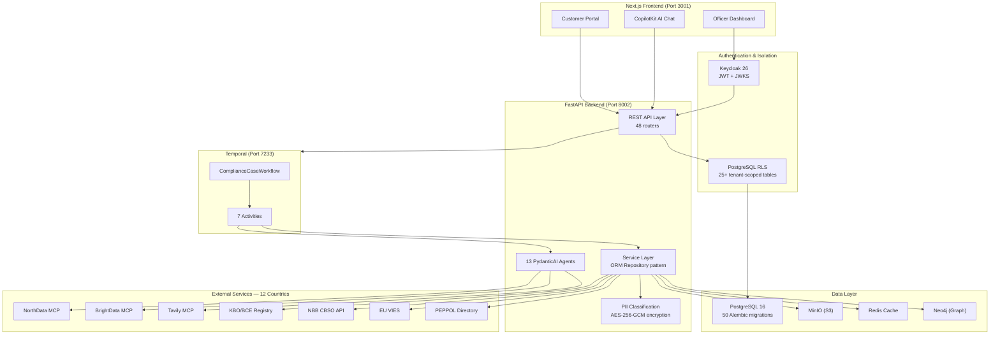

# Architecture Overview

Trust Relay is a KYB/KYC compliance workflow system that automates the "close the loop" process between compliance officers and end customers. Officers create cases, customers upload documents through a branded portal, AI agents cross-reference documents against public registries and adverse media sources, and officers make approve/reject/follow-up decisions in iterative loops.

The system is built as an event-driven workflow application using Temporal for durable execution, FastAPI for the HTTP API layer, and a Next.js frontend for both the officer dashboard and the customer portal.

## High-Level Architecture

## Design Principles

The architecture follows a set of deliberate principles that govern every layer of the system.

### Authentication and Tenant Isolation

All API access is authenticated via **Keycloak 26** with JWT tokens validated against JWKS endpoints. Multi-tenant isolation is enforced at the database level through **PostgreSQL Row-Level Security (RLS)** across 25+ tenant-scoped tables. RLS policies use a `FORCE ROW LEVEL SECURITY` directive so that even the table-owner role is subject to isolation — the system is safe-by-default, returning zero rows when the tenant context is unset.

### PII Protection

20 PII fields are classified across the data model using a typed annotation system (`PII_DIRECT`, `PII_QUASI`, `PII_SENSITIVE`). Six fields containing direct identifiers (national IDs, passport numbers, bank accounts) are encrypted at rest with **AES-256-GCM** via dedicated encrypted columns. PII classification is enforced through 85+ tests covering annotation completeness, encryption round-trips, and migration integrity.

### Data Access

The data layer uses **SQLAlchemy 2.0 ORM models** as the single source of truth, with a generic `BaseRepository[T]` pattern for type-safe CRUD operations. Schema evolution is managed through **50 Alembic migrations** covering the full lifecycle from initial schema through PII encryption. All queries use parameterized ORM access — no string interpolation touches SQL.

### Observability

Structured **JSON logging with correlation IDs** propagates trace context across HTTP requests, Temporal activities, and agent invocations. Every AI-driven decision is captured in an append-only `audit_events` table with full input provenance, model identification, and confidence scoring — meeting EU AI Act Article 12 (automatic logging) and Article 14 (human oversight) requirements.

### Evidence-Based AI Decisions

Every AI output is anchored to verifiable evidence through the **Trust Capsule** cryptographic architecture (ADR-0017). Each capsule contains the source data, model version, prompt template, reasoning chain, and a cryptographic seal that detects post-hoc tampering. The **Evidence Bundle** system (ADR-0021) packages related capsules into auditable units that satisfy GDPR Article 22 (right to explanation of automated decisions) and 6AMLD 5-year retention requirements.

### Modular API Design

The REST API is decomposed into **48 focused routers** organized by domain concern (`case_crud`, `case_decisions`, `case_documents`, `case_analysis`, `case_evidence`, `portal`, `graph`, `lex`, `risk_config`, etc.). Dependencies are injected via FastAPI's `Depends()` pattern with singleton service instances, ensuring testability and clear ownership boundaries.

## Key Architectural Decisions

| Decision | Choice | Rationale |
|----------|--------|-----------|
| Workflow engine | Temporal | Durable execution, built-in retry policies, signal/query pattern fits the iterative compliance loop. See [ADR-0002](../../docs/adr/). |
| AI framework | PydanticAI | Type-safe agent outputs via Pydantic models, native MCP tool support, per-agent model configuration. See [ADR-0001](../../docs/adr/). |
| Authentication | Keycloak 26 | Standards-based OIDC/JWT, JWKS rotation, multi-tenant realm configuration. |
| Tenant isolation | PostgreSQL RLS | Database-enforced isolation — application bugs cannot leak data across tenants. See [ADR-0023](../../docs/adr/). |
| Document conversion | IBM Docling | MIT-licensed, local execution, no data leaves the infrastructure. |
| Object storage | MinIO | S3-compatible API, stores documents organized by case/iteration. |
| Frontend AI | CopilotKit v2 + AG-UI | Embeds AI assistant into the officer dashboard (inline chat, popup, `useCopilotReadable`). See [ADR-0003](../../docs/adr/), [ADR-0013](../../docs/adr/). |
| Knowledge graph | Neo4j (CQRS read layer) | Cross-case analytics, co-directorship detection, fraud pattern matching. PostgreSQL remains the write store. See [ADR-0014](../../docs/adr/). |
| Risk assessment | EBA 5-dimension matrix | Weighted-max aggregation across customer, product, channel, geography, and transaction risk. See [ADR-0020](../../docs/adr/). |
| Country routing | 12-country registry architecture | Dedicated agents per jurisdiction with structured service catalogs. See [ADR-0034](../../docs/adr/). |
| White-label branding | Tenant-scoped WCAG AA | Per-tenant visual identity with enforced accessibility contrast ratios. See [ADR-0028](../../docs/adr/). |

## System Metrics

| Metric | Value |
|--------|-------|
| Architecture Decision Records | 36 |
| PII test coverage | 85+ tests |
| PII fields classified | 20 fields, 6 encrypted at rest (AES-256-GCM) |
| OSINT agents | 13-agent pipeline with circuit breakers |
| Country registries | 12 countries, 21 services |
| RLS-protected tables | 25+ |
| Alembic migrations | 50 |
| ORM models | 61 SQLAlchemy 2.0 models |
| API routers | 48 |
| Prompt templates | 20 Jinja2 templates (DB-first with filesystem fallback) |

## Production Roadmap

| Item | Priority | Path Forward |
|------|----------|-------------|
| Secret management | Medium | Move from `.env` files to a managed secret store (AWS Secrets Manager, HashiCorp Vault). |
| ~~Testcontainers expansion~~ | ~~Low~~ | ~~40 integration tests with testcontainer PostgreSQL, macOS Docker Desktop support.~~ **Done.** |
| Log forwarding | Low | Forward structured JSON logs to centralized aggregation (ELK/Datadog). Logging infrastructure is in place; forwarding pipeline is not yet configured. See [Deployment](/docs/architecture/deployment). |

## Architecture Decision Records

All significant technical decisions are documented as ADRs in `docs/adr/`. The project maintains **36 ADRs** covering every major architectural choice — from workflow orchestration and AI framework selection through cryptographic sealing, regulatory segment compilation, and multi-country registry design.

| ADR | Decision | Status |
|-----|----------|--------|
| ADR-0001 | PydanticAI v1.60+ with AG-UI protocol for AI layer | Accepted |
| ADR-0002 | Temporal Python SDK for workflow orchestration | Accepted |
| ADR-0003 | Mount AGUIAdapter on FastAPI (not standalone) | Accepted |
| ADR-0004 | ~~Pin CopilotKit v1 API~~ | Superseded by ADR-0013 |
| ADR-0005 | STATE_SNAPSHOT over STATE_DELTA for AG-UI events | Accepted |
| ADR-0006 | PEPPOL Verify as REST API (not MCP) | Accepted |
| ADR-0007 | Belgian data layer, country routing, and PEPPOL UI | Implemented |
| ADR-0008 | Raw SQL via SQLAlchemy text() for database access | Accepted |
| ADR-0009 | Minimal error handling with silent recovery for PoC | Accepted |
| ADR-0010 | React useState/useEffect for state management | Accepted (PoC) — effectively superseded by TanStack React Query v5 |
| ADR-0011 | Authentication deliberately deferred for PoC | Accepted (superseded by Pillar 0) |
| ADR-0012 | Hybrid scraping tool selection per data source | Implemented |
| ADR-0013 | CopilotKit v2 migration (supersedes ADR-0004) | Accepted |
| ADR-0014 | Neo4j knowledge graph (CQRS read layer) | Implemented |
| ADR-0015 | React Query for frontend caching | Implemented |
| ADR-0016 | Tiered Scan Agent (portfolio-scale entity screening) | Implemented |
| ADR-0017 | Compliance Memory System | Accepted |
| ADR-0018 | Dynamic document requirements — pre-investigation resolution | Implemented |
| ADR-0019 | Multi-agent OSINT pipeline with country routing | Implemented |
| ADR-0020 | EBA risk matrix with weighted-max aggregation | Implemented |
| ADR-0021 | Evidence bundle system for EU AI Act audit trail | Implemented |
| ADR-0022 | Neo4j knowledge graph with 20-step ETL pipeline | Implemented |
| ADR-0023 | PostgreSQL Row-Level Security for multi-tenant isolation | Implemented |
| ADR-0024 | Entity matching with blocking keys and trust-weighted survivorship | Implemented |
| ADR-0025 | Network Intelligence Hub — ReactFlow three-perspective visualization | Implemented |
| ADR-0026 | Prompt centralization with DB-first registry and filesystem fallback | Implemented |
| ADR-0027 | GoAML export with three-layer pipeline and country profiles | Implemented |
| ADR-0028 | White-label branding with WCAG AA enforcement | Implemented |
| ADR-0029 | Cost-optimized model tiers for agent fleet | Implemented |
| ADR-0030 | Social intelligence via BrightData MCP expansion | Implemented |
| ADR-0031 | Regulatory segment profiles with declarative YAML compiler | Implemented |
| ADR-0032 | Circuit breakers for OSINT pipeline resilience | Implemented |
| ADR-0033 | Document gap analysis engine | Implemented |
| ADR-0034 | Multi-country registry architecture (12 countries, 21 services) | Implemented |
| ADR-0035 | Atlas reference documentation within Docusaurus | Implemented |
| ADR-0036 | Structured JSON logging with correlation IDs | Implemented |

## Architecture Documentation

This overview connects to detailed documentation for each subsystem:

- **[Data Flow](./data-flow)** — 12-step investigation-first compliance loop
- **[Temporal Workflows](./temporal-workflows)** — State machine, signals, queries, and retry policies
- **[OSINT Pipeline](./osint-pipeline)** — 13-agent investigation engine with circuit breakers
- **[AI Agents](./ai-agents)** — PydanticAI agents, CopilotKit integration, AG-UI protocol
- **[Knowledge Graph](./knowledge-graph)** — Neo4j CQRS read layer with 20-step ETL
- **[Security](./security)** — Authentication, RLS, PII classification, Trust Capsules
- **[Deployment](./deployment)** — Docker Compose, CI/CD, health checks
