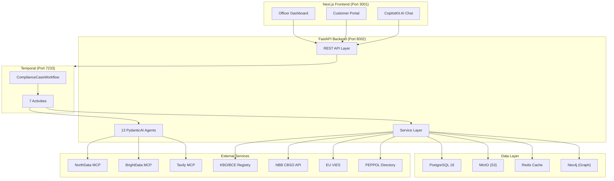

# Architecture Overview

Trust Relay is a KYB/KYC compliance workflow system that automates the "close the loop" process between compliance officers and end customers. Officers create cases, customers upload documents through a branded portal, AI agents cross-reference documents against public registries and adverse media sources, and officers make approve/reject/follow-up decisions in iterative loops.

The system is built as an event-driven workflow application using Temporal for durable execution, FastAPI for the HTTP API layer, and a Next.js frontend for both the officer dashboard and the customer portal.

## High-Level Architecture

## Key Architectural Decisions

| Decision | Choice | Rationale |
|----------|--------|-----------|
| Workflow engine | Temporal | Durable execution, built-in retry policies, signal/query pattern fits the iterative compliance loop. See [ADR-0002](../../docs/adr/). |
| AI framework | PydanticAI | Type-safe agent outputs via Pydantic models, native MCP tool support, per-agent model configuration. See [ADR-0001](../../docs/adr/). |
| Document conversion | IBM Docling | MIT-licensed, local execution, no data leaves the infrastructure. |
| Object storage | MinIO | S3-compatible API, stores documents organized by case/iteration. |
| Frontend AI | CopilotKit v1 + AG-UI | Embeds AI assistant into the officer dashboard. See [ADR-0003](../../docs/adr/), [ADR-0004](../../docs/adr/). |
| Belgian data | 4 official sources | Country-specific routing with dedicated scraping tools per source. See [ADR-0007](../../docs/adr/). |
| Knowledge graph | Neo4j (CQRS read layer) | Cross-case analytics, co-directorship detection, fraud pattern matching. PostgreSQL remains the write store. See [ADR-0013](../../docs/adr/). |

## Maturity Assessment

This table provides an honest assessment of each architectural area. The system has been through a comprehensive technical debt remediation (Phases 1-7), upgrading several areas from weak/needs-work to adequate/strong.

| Area | Rating | Notes |
|------|--------|-------|
| Workflow Layer | **Strong** | Clean Temporal state machine, well-defined signals/queries, proper retry policies, typed workflow state |
| AI Agents | **Strong** | 13 PydanticAI agents with consistent patterns, structured outputs, mock mode system |
| Configuration | **Strong** | pydantic-settings with per-agent model overrides, feature flags, mock mode toggles |
| API Client (Frontend) | **Strong** | Well-typed Axios client, comprehensive endpoint coverage |
| UI Library | **Strong** | 25 shadcn/ui primitives, consistent dark theme |
| API Layer | **Strong** | Split into 5 focused routers + DI via FastAPI `Depends()` pattern |
| Code Organization | **Strong** | Clear separation of concerns, routers decomposed, service layer uses DI |
| Error Handling | Adequate | Custom exception hierarchy (`TrustRelayError` + subtypes), centralized logging, no silent swallows |
| Security | Adequate | JWT auth with JWKS (PoC mode bypasses), portal token expiry (30-day TTL), IP-based rate limiting, dynamic CORS |
| Frontend Architecture | Adequate | Custom hooks extracted, React Query caching, accessibility improvements, 441+ component tests |
| CI/CD | Adequate | GitHub Actions pipeline (4 jobs), health checks, multi-stage Docker builds |
| Database | Adequate | SQLAlchemy ORM models (7 tables), Alembic configured (2 migrations), parameterized queries via `sqlalchemy.text()` |
| Data Models | Adequate | Good Pydantic models for API, typed workflow state via TypedDicts |
| Knowledge Graph | Adequate | Neo4j integration for cross-case analytics (CQRS: PostgreSQL writes, Neo4j reads) |

## Addressed Technical Debt (Phases 1-7)

The following items were identified as technical debt and have been remediated:

| Item | Was | Now | Phase |
|------|-----|-----|-------|
| Monolithic API | `cases.py` with 23 endpoints in 1,500 lines | Split into 5 routers: `case_crud`, `case_decisions`, `case_documents`, `case_analysis`, `case_evidence` | Phase 2 |
| No DI | 52 inline service instantiations | FastAPI `Depends()` pattern via `app/api/deps/services.py` with `lru_cache` singletons | Phase 2 |
| Silent exception swallows | ~70 bare `except: pass` blocks | Exception hierarchy (`TrustRelayError` + subtypes) with structured logging | Phases 1-2 |
| No authentication | Dashboard API fully open | JWT authentication with JWKS validation (PoC mode bypasses, production mode validates) | Phase 4 |
| No token expiry | Portal tokens valid indefinitely | 30-day TTL with `expires_at` column, HTTP 410 on expired tokens | Phase 4 |
| No rate limiting | Vulnerable to abuse | IP-based sliding window (100/min authenticated, 20/min unauthenticated) | Phase 4 |
| Hardcoded CORS | Only `localhost:3001` | Dynamic CORS configuration via `CORS_ORIGINS` environment variable | Phase 4 |
| No CI/CD | Manual testing only | GitHub Actions pipeline with 4 jobs (backend-tests, frontend-tests, lint, build) | Phase 6 |
| No health checks | `depends_on` without conditions | Docker `HEALTHCHECK` directives + health-conditioned dependencies | Phase 6 |
| No multi-stage Docker | Development images everywhere | Multi-stage builds for backend (`python:3.11-slim`) and frontend (build + serve) | Phase 6 |
| God components | Inline state/fetch logic in page components | Custom hooks: `useCaseDetail`, `usePipelineStatus`, `useDecisionSubmit`, `usePeppolVerify` | Phase 5 |
| No caching | Fresh API calls on every navigation | React Query (`@tanstack/react-query`) with `QueryClientProvider` | Phase 5 |
| No custom hooks | Zero custom hooks | `useAsyncData` shared hook + 4 domain-specific hooks | Phase 5 |
| Untyped workflow state | Internal state uses raw `dict` | TypedDicts for workflow state | Phase 2 |
| No ORM models | All queries via `sqlalchemy.text()` | SQLAlchemy ORM models (7 tables) + Alembic migrations (initial schema) | Phase 3 |

## Production Roadmap

The following items are planned for production hardening beyond the current PoC:

| Item | Priority | Path Forward |
|------|----------|-------------|
| ORM query migration | Low | ORM models and Alembic are in place. Most queries migrated; one raw SQL call remains for PostgreSQL sequence operations. |
| Log aggregation | Medium | Structured JSON logging with correlation IDs, forwarded to ELK/Datadog. See [Deployment](/docs/architecture/deployment). |
| PII classification | Medium | PII tags on model fields, encrypted columns for sensitive data, GDPR data subject request handling. |
| Secret management | Low | Move from `.env` files to a managed secret store (AWS Secrets Manager, HashiCorp Vault). |
| Testcontainers expansion | Low | 20 integration tests using Testcontainers for PostgreSQL with macOS Docker Desktop support. CI uses GitHub Actions service containers. |

## Architecture Decision Records

All significant technical decisions are documented as ADRs in `docs/adr/`:

| ADR | Decision | Status |
|-----|----------|--------|
| ADR-0001 | PydanticAI v1.60+ with AG-UI protocol for AI layer | Accepted |
| ADR-0002 | Temporal Python SDK for workflow orchestration | Accepted |
| ADR-0003 | Mount AGUIAdapter on FastAPI (not standalone) | Accepted |
| ADR-0004 | Pin CopilotKit v1 API; migrate to v2 in Tier 2 | Accepted |
| ADR-0005 | STATE_SNAPSHOT over STATE_DELTA for AG-UI events | Accepted |
| ADR-0006 | PEPPOL Verify as REST API (not MCP) | Accepted |
| ADR-0007 | Belgian data layer, country routing, and PEPPOL UI | Implemented |
| ADR-0008 | Scraping tool selection (hybrid approach) | Implemented |
| ADR-0009 | OSINT evidence cache strategy | Implemented |
| ADR-0010 | Pre-enrichment at case creation | Implemented |
| ADR-0011 | Redis caching for inhoudingsplicht | Implemented |
| ADR-0012 | CompanyProfile SourcedFact pattern | Implemented |
| ADR-0013 | Neo4j knowledge graph (CQRS read layer) | Implemented |
| ADR-0014 | React Query for frontend caching | Implemented |
