# PII Classification & Encryption

Field-level PII classification, AES-256-GCM encryption at rest, HMAC search hashes, and GDPR data subject request handling -- making Trust Relay's data model self-describing for compliance auditors and bank security questionnaires.

## Business Value

Regulated customers (banks, fintechs) ask "where is PII stored and how is it protected?" in every security questionnaire. Trust Relay answers this with a machine-generated `pii_manifest.json` -- a GDPR Art. 30 artifact listing every PII field, its classification, encryption status, retention policy, and legal basis. The PII classification system also enables automated GDPR data subject requests (access, erasure, rectification) with proper AML retention handling.

## Architecture

Three-layer design: classification metadata on ORM models, transparent column encryption via SQLAlchemy TypeDecorator, and GDPR DSR endpoints backed by a person resolution index.

```mermaid
graph TD
    subgraph Classification["Layer 1: Classification"]
        PIICategory["PIICategory Enum\n6 categories"]
        PIIField["PIIField Metadata\nretention, legal basis"]
        Registry["PIIRegistry\nScans all ORM models"]
        Manifest["Manifest Generator\ndocs/pii_manifest.json"]
    end

    subgraph Encryption["Layer 2: Encryption"]
        KeyProvider["KeyProvider Interface\nEnvKeyProvider / VaultKeyProvider"]
        EncryptedText["EncryptedText TypeDecorator\nAES-256-GCM transparent"]
        SearchHash["HMAC-SHA256 Search Hashes\nEquality lookups on encrypted columns"]
        JsonbCrypto["JSONB Crypto Service\nNested PII in JSON arrays"]
    end

    subgraph DSR["Layer 3: GDPR DSR"]
        PersonIndex["PersonDataIndex\nCross-case person resolution"]
        DSRService["DSRService\naccess / erase / rectify"]
        DSREndpoints["3 API Endpoints\n/api/data-subject/*"]
        AuditTrail["Audit Events\nDSR_ACCESS / DSR_ERASURE"]
    end

    PIICategory --> PIIField
    PIIField --> Registry
    Registry --> Manifest
    KeyProvider --> EncryptedText
    KeyProvider --> JsonbCrypto
    EncryptedText --> SearchHash
    PersonIndex --> DSRService
    DSRService --> DSREndpoints
    DSREndpoints --> AuditTrail

    style Classification fill:#1e3a5f,stroke:#60a5fa,color:#fff
    style Encryption fill:#3b1a5f,stroke:#a78bfa,color:#fff
    style DSR fill:#065f46,stroke:#34d399,color:#fff
```



## PII Categories

Six classification levels, three requiring encryption:

| Category | Encryption | Examples |
|----------|-----------|----------|
| `DIRECT_IDENTIFIER` | **AES-256-GCM** | National ID, passport number, document number |
| `FINANCIAL` | **AES-256-GCM** | IBAN, account number |
| `CONTACT` | **AES-256-GCM** | Email, phone |
| `QUASI_IDENTIFIER` | RLS only | Name, DOB, address, company name |
| `SENSITIVE` | RLS only | PEP status, sanctions hits |
| `DOCUMENT` | RLS only | Uploaded ID documents (MinIO) |

Categories are declared as `info={"pii": PIIField(category=PIICategory.X)}` on SQLAlchemy columns. The `PIIRegistry` scans all ORM models at runtime and builds an in-memory index of classified fields.

## Encryption Architecture

### EncryptedText TypeDecorator

Transparent AES-256-GCM encryption at the column level. Application code reads and writes plaintext strings -- encryption happens inside SQLAlchemy's type system.

**Wire format:** `key_id (4B) || iv (12B) || ciphertext || tag (16B)`

- `key_id` enables key rotation without re-encrypting existing data
- Random IV per encryption ensures identical values produce different ciphertext
- GCM mode provides authenticated encryption (integrity + confidentiality)

### KeyProvider Interface

```python
class KeyProvider(ABC):
    def get_current_key(self) -> tuple[str, bytes]: ...  # For new encryptions
    def get_key_by_id(self, key_id: str) -> bytes: ...   # For decrypting existing data
```

- **EnvKeyProvider** -- reads `PII_ENCRYPTION_KEY` env var (PoC/staging)
- **VaultKeyProvider** -- HashiCorp Vault integration (production, planned)
- **NullKeyProvider** -- bypass mode for development/testing

### HMAC Search Hashes

Encrypted columns can't be used in `WHERE` clauses. For fields that need equality lookups (email, IBAN), a parallel `_hash` column stores `HMAC-SHA256(normalized_value, pepper)`:

- Deterministic: same value always produces the same hash
- One-way: hash can't be reversed to recover the plaintext
- Pepper: separate secret from the encryption key (`PII_ENCRYPTION_PEPPER`)
- Normalized: lowercase, trimmed before hashing

### JSONB PII Encryption

JSONB columns containing PII arrays (`identification`, `phones`, `emails`) can't use `EncryptedText` because the PII is nested inside JSON structures. The `jsonb_crypto` service encrypts specific fields within each JSON object:

| JSONB Field | PII Key Encrypted | Non-PII Preserved |
|-------------|-------------------|-------------------|
| `emails` | Each email string | -- |
| `phones` | `number` key | `phone_type`, `country_prefix` |
| `identification` | `document_number` key | `document_type`, `issuing_country`, dates |

### Dev/Test Bypass

When `pii_encryption_enabled=False` (default), `EncryptedText` stores plain UTF-8 bytes -- no encryption overhead in development. Set `PII_ENCRYPTION_ENABLED=true` + keys in production.

## PII Manifest

`docs/pii_manifest.json` is the GDPR Art. 30 artifact -- a machine-generated inventory of all PII fields:

```bash
cd backend && python -m app.pii.manifest
```

Outputs:
- Summary: total PII fields, encrypted fields, tables with PII
- Per-table field inventory with category, encryption status, retention, legal basis
- DSR scope: which tables, JSONB paths, MinIO prefixes, and Neo4j nodes contain person data

This file is committed to the repository and serves as the compliance artifact for security questionnaires, ISO 27001 audits, and GDPR Art. 30 records of processing.

## GDPR Data Subject Requests

Three endpoints handle natural person rights under GDPR:

### Subject Access (Art. 15)
```
POST /api/data-subject/access
Body: { "identifier_type": "name_dob", "first_name": "...", "last_name": "...", "date_of_birth": "..." }
```
Returns all PII records for the person across all cases, with retention information per case.

### Erasure (Art. 17)
```
POST /api/data-subject/erase
Body: { "identifier_type": "name_dob", ..., "reason": "..." }
```
Applies AML-aware erasure rules per case:

| Case Status | Action | Legal Basis |
|-------------|--------|-------------|
| Active | **Refuse** | GDPR Art. 17(3)(b) -- legal obligation |
| Closed < 5 years | **Anonymize** -- `[REDACTED-{dsr_id}]` | AML 5-year retention |
| Closed > 5 years | **Full delete** | Retention expired |

Anonymization preserves case structure for AML audits while removing personal data.

### Rectification (Art. 16)
```
POST /api/data-subject/rectify
Body: { "identifier_type": "name_dob", ..., "corrections": {"first_name": "corrected"} }
```
Corrects allowed PII fields across all appearances of the person.

### Person Resolution Index

The `person_data_index` table maps HMAC person hashes to data locations across tables. This enables cross-case person lookup without storing PII in the index itself. A person appearing as a director in 3 different company investigations can be found via a single hash lookup.

### Audit Trail

Every DSR operation creates an `audit_event` with type `DSR_ACCESS`, `DSR_ERASURE`, or `DSR_RECTIFICATION`. These events are exempt from erasure (GDPR Art. 17(3)(e) -- establishment of legal claims).

## Retention Policies

| Context | Duration | Legal Basis |
|---------|----------|-------------|
| AML/KYB records | 5 years from case closure | 6AMLD Art. 40 |
| Audit events | 5 years | 6AMLD + EU AI Act Art. 12 |
| Person data (no active case) | 1 year after last case | GDPR Art. 5(1)(e) |
| DSR audit events | Exempt from erasure | GDPR Art. 17(3)(e) |

## File Structure

```
backend/app/pii/
    categories.py           # PIICategory enum, PIIField dataclass
    encryption.py           # EncryptedText TypeDecorator, AES-256-GCM
    key_providers.py        # KeyProvider ABC, EnvKeyProvider, NullKeyProvider
    hashing.py              # HMAC-SHA256 search hash helpers
    jsonb_crypto.py         # Encrypt/decrypt PII inside JSONB arrays
    registry.py             # PIIRegistry -- scans models, builds field index
    manifest.py             # CLI: generates docs/pii_manifest.json
    person_index.py         # PersonDataIndex service
    dsr_service.py          # GDPR access/erase/rectify logic
    backfill.py             # Encrypt existing plaintext data

backend/app/api/
    data_subject.py         # 3 GDPR DSR endpoints
```

## ADR

ADR-0036: PII Classification Architecture (`docs/adr/ADR-0036-pii-classification-architecture.md`)
