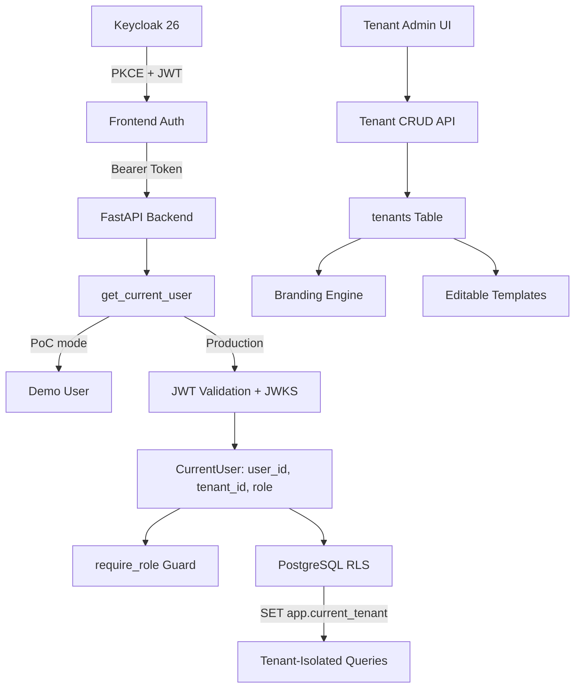
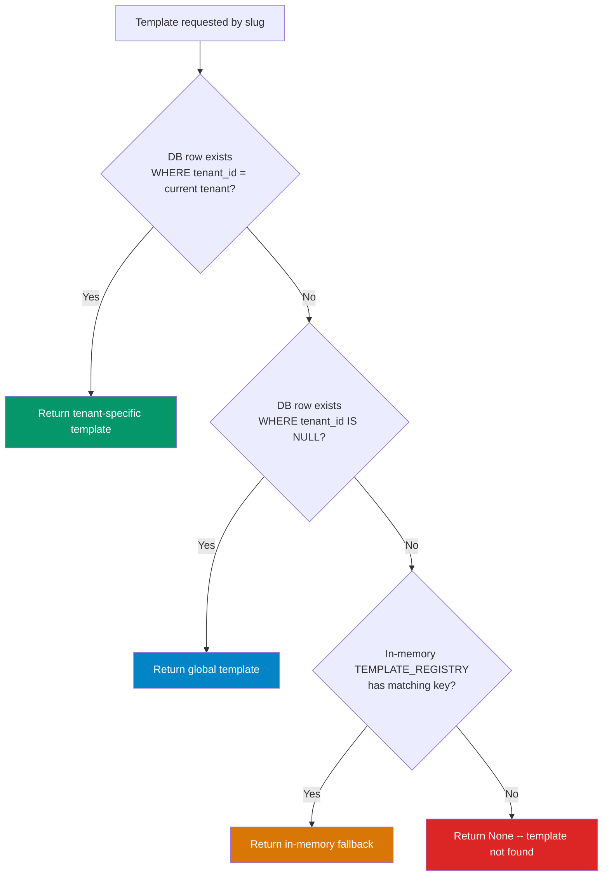
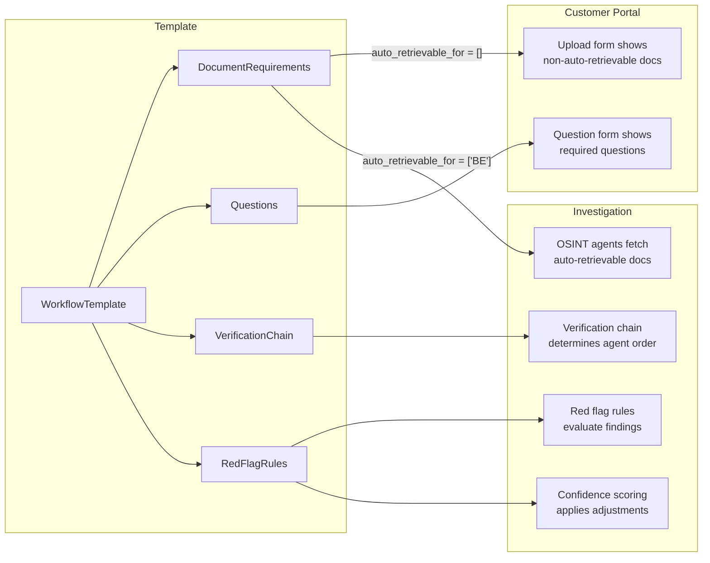
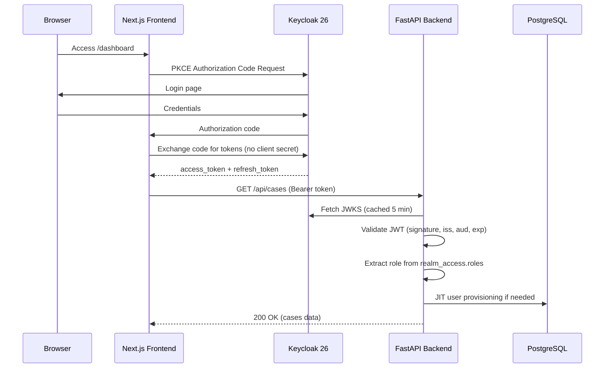
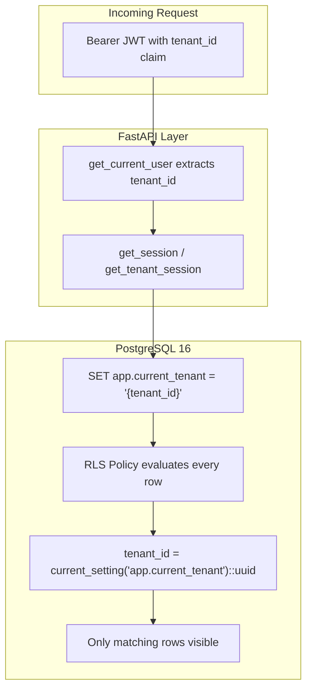
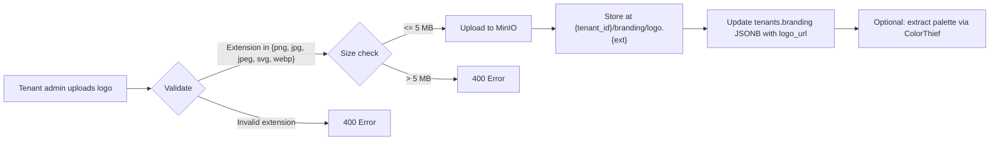

# Platform Foundation (Pillar 0)

Multi-tenancy, authentication, RBAC, white-label branding, and editable workflow templates — the infrastructure layer that makes Trust Relay a deployable SaaS platform.

## Business Value

Without Pillar 0, Trust Relay runs as a single-tenant PoC. Platform Foundation transforms it into a production-ready multi-tenant platform where each compliance team gets isolated data, custom branding, and configurable workflows — all managed through a self-service admin UI.

## Architecture



## Workflow Templates

Workflow templates are the central configuration object in Trust Relay. Every compliance investigation -- from the documents a customer must upload, to the questions they answer, to the OSINT sources the system queries -- is defined by a template. Templates make the platform configurable without code changes and are the foundation for multi-vertical, multi-country compliance operations.

### Data Model

Three Pydantic models define the template structure (source: `backend/app/models/workflow_template.py`):

**`DocumentRequirement`** -- a single document the customer must provide:

| Field | Type | Description |
|-------|------|-------------|
| `id` | `str` | Unique identifier within the template (e.g. `incorporation_cert`) |
| `name` | `str` | Human-readable label shown in the portal |
| `description` | `str` | Help text explaining what to upload |
| `required` | `bool` | Whether the document is mandatory (default: `true`) |
| `accepted_formats` | `list[str]` | Allowed file types (default: `["pdf", "docx", "png", "jpg"]`) |
| `auto_retrievable_for` | `list[str]` | Country codes where the document is auto-retrieved via OSINT (e.g. `["BE"]` for Belgian registry data). When a country matches, this document is hidden from the customer portal -- the system fetches it automatically |

**`Question`** -- a question shown to the customer in the portal:

| Field | Type | Description |
|-------|------|-------------|
| `id` | `str` | Unique identifier (e.g. `business_activity`) |
| `text` | `str` | The question text displayed to the customer |
| `type` | `str` | Input type: `text`, `textarea`, `select`, or `multi_select` |
| `required` | `bool` | Whether the question must be answered (default: `true`) |
| `options` | `list[str]` | Available choices for `select` and `multi_select` types |

**`WorkflowTemplate`** -- the top-level template object:

| Field | Type | Default | Description |
|-------|------|---------|-------------|
| `id` | `str` | -- | Template slug used as primary identifier |
| `name` | `str` | -- | Display name (e.g. "PSP Merchant Onboarding") |
| `description` | `str` | -- | Describes when to use this template |
| `document_requirements` | `list[DocumentRequirement]` | -- | Documents the customer must provide |
| `questions` | `list[Question]` | -- | Questions for the customer portal |
| `default_max_iterations` | `int` | `5` | Maximum follow-up rounds before escalation |
| `default_max_timeline_days` | `int` | `60` | Maximum calendar days for investigation |
| `enable_identity_verification` | `bool` | `false` | Whether to require eID identity verification |

### Seeded System Templates

Three system templates are seeded into the database by Alembic migration `018_editable_templates.py`. Each includes document requirements, customer questions, a verification chain, red flag rules, confidence adjustments, and regulatory framework references.

#### 1. PSP Merchant Onboarding (`psp_merchant_onboarding`)

Standard KYB verification for payment service provider merchant onboarding.

| Setting | Value |
|---------|-------|
| Max iterations | 5 |
| Max timeline | 60 days |
| Regulatory framework | AMLD-VI, Belgian AML Law (18 Sept 2017), PSD2 |

**Documents (5):**
- Certificate of Incorporation -- auto-retrieved for `BE` via KBO registry
- Proof of Business Address -- utility bill or bank statement (less than 3 months old)
- UBO Declaration -- auto-retrieved for `BE` via UBO Register
- Director ID Document -- passport or national ID
- Articles of Association -- statuten / acte constitutif

**Questions (4):**
- Business activity description (`textarea`, optional)
- Business type (`select`: E-commerce, SaaS, Marketplace, Retail, Other)
- Expected monthly transaction volume (`select`: 5 tiers from less than 10k to more than 1M EUR)
- Countries of operation (`multi_select`: 27 EU countries + UK, CH, NO, IS, US, CA, AU, Other)

**Verification chain (9 steps):** KBO Registry, NBB CBSO Financial Health, PEPPOL Registration, UBO Register Cross-Reference, Inhoudingsplicht Check, Gazette Review, Sanctions/PEP Screening, Adverse Media Scan, Document Cross-Reference.

#### 2. Legal Representative Onboarding (`legal_representative_onboarding`)

KYB verification for legal representative and fiscal representative appointments.

| Setting | Value |
|---------|-------|
| Max iterations | 5 |
| Max timeline | 60 days |
| Regulatory framework | AMLD-VI, Belgian AML Law, ITAA Regulations |

**Documents (3):** Proof of Business Address, Manager/Director ID Document, Power of Attorney.

**Questions (2):** Representative role (`select`: Managing Director, Board Member, Authorized Signatory, Legal Counsel, Other), Countries of operation (`multi_select`).

**Verification chain (7 steps):** KBO Registry, ITAA Registration (manual), NBB CBSO Financial Health, Professional Liability Insurance (manual), UBO Register, Sanctions/PEP Screening, Adverse Media Scan.

#### 3. Belgian High-Value Goods Dealer (`hvg_dealer_onboarding`)

KYB verification for dealers in precious metals, stones, art, and luxury goods under AMLR.

| Setting | Value |
|---------|-------|
| Max iterations | 5 |
| Max timeline | **90 days** (extended due to provenance verification complexity) |
| Regulatory framework | AMLR, Belgian AML Law, EU Conflict Minerals Reg. 2017/821 |

**Documents (5):** Incorporation Certificate (auto-retrieved for `BE`), Proof of Business Address, UBO Declaration (auto-retrieved for `BE`), Director ID Document, Source-of-Goods Documentation (supplier invoices, import declarations, provenance certificates).

**Questions (3):** Goods type (`select`: Precious Metals, Precious Stones, Art, Luxury Vehicles, Other), Annual turnover (`select`: 4 tiers), Supplier countries (`multi_select`).

**Verification chain (11 steps):** KBO Registry (NACE 46.72/47.77), NBB CBSO Financial Health, Gazette Corporate Governance, PEPPOL Trade Verification, UBO Register, eID UBO Verification (manual), Source-of-Goods Verification (manual), Inhoudingsplicht Check, Sanctions/PEP Screening, Adverse Media Investigation, Document Cross-Reference.

### Template Resolution Chain

When the system needs a template (e.g. when creating a case or loading the customer portal), resolution follows a strict priority chain:



The SQL query uses `ORDER BY tenant_id DESC NULLS LAST LIMIT 1`, which means a tenant-specific override always wins over a global template with the same slug. This enables tenant admins to clone and customize templates without affecting other tenants.

Source: `get_template_from_db()` in `backend/app/models/workflow_template.py`.

### Template-to-Investigation Pipeline

The following diagram shows how a template drives the entire investigation lifecycle, from case creation through the customer portal to OSINT investigation:



---

## Authentication (Keycloak 26)

Trust Relay uses Keycloak 26 as its identity provider, implementing OpenID Connect with PKCE (Proof Key for Code Exchange) for the frontend and JWT bearer token validation for the backend API.

Source: `backend/app/api/deps/auth.py`, `backend/app/api/deps/keycloak_admin.py`.

### Authorization Flow



The frontend uses PKCE (no client secrets stored in the browser). Tokens are held in memory only -- never in `localStorage` or cookies -- and are refreshed automatically every 60 seconds.

### RBAC Roles

Four roles are defined in a strict hierarchy. The `require_role()` dependency factory checks that the authenticated user holds one of the specified roles:

| Role | Scope | Capabilities |
|------|-------|-------------|
| `super_admin` | Cross-tenant | Create/suspend tenants, manage all users, view all data across tenants, create global templates |
| `tenant_admin` | Own tenant | Manage users within tenant, configure branding, clone/edit templates, view tenant analytics |
| `officer` | Own tenant | Create and manage cases, review investigations, make approve/reject/follow-up decisions |
| `auditor` | Own tenant | Read-only access to cases, investigations, and audit logs for compliance oversight |

Roles are stored in Keycloak as realm roles and included in the JWT via the `realm_access.roles` claim. The backend extracts the highest-privilege role using `_extract_role()`, which checks multiple claim locations for compatibility with different Keycloak configurations:

1. `realm_access.roles` (standard Keycloak nested object)
2. `realm_roles` (Keycloak 26 flat array via custom mapper)
3. `resource_access.{client}.roles` (client-specific roles)
4. `role` (top-level claim from some OIDC providers)

### JWT Validation

The backend validates every request's Bearer token against Keycloak's JWKS (JSON Web Key Set) endpoint:

- **JWKS URL:** `{keycloak_url}/realms/trust-relay/protocol/openid-connect/certs`
- **Cache TTL:** 5 minutes -- avoids fetching keys on every request
- **Stale cache fallback:** If JWKS fetch fails but a cached copy exists, the stale cache is used rather than rejecting all requests
- **Algorithms:** RS256 and ES256
- **Claims validated:** `iss` (issuer), `aud` (audience), `exp` (expiration), signature

### CurrentUser Dependency

The `get_current_user()` FastAPI dependency is the single entry point for authentication. It returns a typed, frozen dataclass:

```python
@dataclass(frozen=True, slots=True)
class CurrentUser:
    user_id: str       # Keycloak 'sub' claim
    tenant_id: str     # From JWT 'tenant_id' claim
    role: str          # Highest-privilege role from hierarchy
    email: str         # User email
    display_name: str  # Full name or preferred_username
```

Usage patterns:

```python
# Router-level: all endpoints require auth
router = APIRouter(dependencies=[Depends(get_current_user)])

# Endpoint-level: access user identity
@router.get("/cases")
async def list_cases(user: CurrentUser = Depends(get_current_user)):
    officer_id = user.user_id

# Role guard: restrict to specific roles
@router.delete("/cases/{case_id}",
    dependencies=[Depends(require_role("super_admin", "tenant_admin"))])
async def delete_case(case_id: str): ...
```

### JIT User Provisioning

When a user authenticates via Keycloak for the first time, the `_ensure_db_user()` function creates a corresponding row in the PostgreSQL `users` table. This bridges the gap between Keycloak (identity) and PostgreSQL (application data). The provisioning is non-fatal -- if it fails, the user can still use the system; the failure is logged but does not block the request.

Source: `_ensure_db_user()` in `backend/app/api/deps/auth.py` uses `UserRepository` (ORM pattern, not raw SQL).

---

## Multi-Tenancy (PostgreSQL Row-Level Security)

Trust Relay implements hard tenant isolation at the database level using PostgreSQL Row-Level Security (RLS). This is not application-level filtering -- even if application code has a bug, one tenant's data cannot leak to another because the database itself enforces the boundary.

Source: `backend/app/db/database.py`, Alembic migrations `016_tenant_id_fks.py` and `017_rls_policies.py`.

### Architecture



### RLS Implementation

**22 tables** have a `tenant_id NOT NULL` foreign key to the `tenants` table. Every tenant-scoped table has `FORCE ROW LEVEL SECURITY` enabled, which means RLS policies apply even to the table owner (preventing accidental bypass).

The core RLS policy on each table:

```sql
-- Tenant isolation: rows visible only when tenant context matches
CREATE POLICY tenant_isolation ON cases
    USING (tenant_id = current_setting('app.current_tenant')::uuid);

-- Admin bypass: super_admin operations can see all rows
CREATE POLICY admin_bypass ON cases
    USING (current_setting('app.rls_bypass', true) = 'true');
```

### Session Helpers

Three async context managers in `database.py` control the RLS context for each database session:

| Helper | GUC Setting | Use Case |
|--------|-------------|----------|
| `get_session()` | `app.current_tenant` = demo tenant | Default sessions, backward compatibility |
| `get_tenant_session(tenant_id)` | `app.current_tenant` = specified tenant | Tenant-scoped operations (most API endpoints) |
| `get_admin_session()` | `app.rls_bypass` = `'true'` | Cross-tenant operations (super_admin, analytics) |

All three use `set_config(..., true)` which makes the GUC transaction-local -- it resets automatically when the session closes. This prevents tenant context from leaking between requests even under connection pooling.

```python
# Tenant-scoped: only sees rows for this tenant
async with get_tenant_session(user.tenant_id) as session:
    result = await session.execute(text("SELECT * FROM cases"))
    # Only returns cases where tenant_id matches

# Admin: sees all rows across all tenants
async with get_admin_session() as session:
    result = await session.execute(text("SELECT count(*) FROM cases"))
    # Returns count across ALL tenants
```

### Why This Matters for Compliance

PostgreSQL RLS is not just a convenience feature -- it is a regulatory requirement:

| Regulation | Article | Requirement | How RLS Satisfies It |
|------------|---------|-------------|---------------------|
| **GDPR** | Art. 25 | Data protection by design and by default | Isolation enforced at database level, not application code |
| **GDPR** | Art. 30 | Records of processing per controller | Each tenant (controller) has physically isolated records |
| **AML (6AMLD)** | Record retention | 5-year retention per obliged entity | Tenant-scoped retention policies, no cross-contamination |
| **EU AI Act** | Art. 12 | Automatic logging of AI operations | Audit logs are tenant-scoped; one tenant cannot see another's AI decisions |

---

## White-Label Branding

Each tenant in Trust Relay gets a fully customizable brand experience. The customer-facing portal displays the tenant's brand -- not the Trust Relay brand -- making the platform invisible to end customers.

Source: `backend/app/services/branding_service.py`.

### Branding Fields

The `BrandingService` manages 9 configurable fields stored as JSONB in the `tenants.branding` column:

| Field | Type | Default | Purpose |
|-------|------|---------|---------|
| `logo_url` | `str` | `""` | Path to logo in MinIO |
| `primary_color` | `str` | `#0F172A` (slate-900) | Primary brand color (buttons, headers) |
| `secondary_color` | `str` | `#3B82F6` (blue-500) | Secondary accent |
| `accent_color` | `str` | `#10B981` (emerald-500) | Highlights, success states |
| `background_color` | `str` | `#FFFFFF` | Page background |
| `text_color` | `str` | `#0F172A` | Body text |
| `company_name` | `str` | `""` | Displayed in portal header and communications |
| `tagline` | `str` | `""` | Subtitle beneath company name |
| `favicon_url` | `str` | `""` | Browser tab icon |

### WCAG AA Color Validation

Every branding update runs through `validate_branding_colors()`, which checks:

- **Text on background:** contrast ratio must be at least **4.5:1** (WCAG AA for normal text)
- **Primary on background:** contrast ratio must be at least **3.0:1** (WCAG AA for large text and decorative elements)

If a ratio fails, warnings are returned alongside the saved branding -- the system does not block the save, but clearly communicates the accessibility issue. The validation uses the WCAG 2.0 relative luminance formula.

### Logo Upload Pipeline



Logo files are stored in MinIO at `{tenant_id}/branding/logo.{ext}`. When `colorthief` is installed, the system can extract a color palette from the logo and suggest matching theme colors with WCAG-validated contrast ratios.

### Dynamic Portal Branding

When a customer opens the portal via their unique token, the branding is loaded per-case:

1. Portal requests `GET /api/portal/{token}` which includes the case's `tenant_id`
2. `BrandingService.get_branding_for_case(case_id)` JOINs `cases` to `tenants` to fetch the branding JSONB
3. Missing keys are filled from `DEFAULT_BRANDING` so the frontend always receives a complete object
4. If no `company_name` is set in branding, the tenant's `name` field is used as fallback
5. The portal renders using the tenant's colors, logo, and company name -- Trust Relay branding is not visible

---

## Editable Workflow Templates

While the seeded system templates provide a starting point, tenant administrators need the ability to customize templates for their specific compliance requirements. The editable templates system provides this through a database-backed CRUD layer with version tracking.

Source: `backend/app/api/templates.py`, frontend component `frontend/src/components/admin/TemplateEditor.tsx`.

### Database Schema

The `workflow_templates` table (created in Alembic migration `015`, extended in `018`) stores all template data:

| Column | Type | Description |
|--------|------|-------------|
| `id` | `uuid` | Primary key |
| `slug` | `text` | URL-safe identifier (e.g. `psp_merchant_onboarding`) |
| `tenant_id` | `uuid` (nullable) | Owner tenant; `NULL` = global template |
| `name` | `text` | Display name |
| `description` | `text` | Usage description |
| `vertical` | `text` | Industry vertical (psp, high_value_goods, fiscal_representative, custom) |
| `country` | `text` | Primary country code (default: `BE`) |
| `country_scope` | `text[]` | Multi-country scope |
| `document_requirements` | `jsonb` | Array of `DocumentRequirement` objects |
| `questions` | `jsonb` | Array of `Question` objects |
| `verification_chain` | `jsonb` | Ordered verification steps for investigation |
| `red_flag_rules` | `jsonb` | Deterministic red flag detection rules |
| `confidence_adjustments` | `jsonb` | Confidence scoring adjustments |
| `regulatory_framework` | `text[]` | Applicable regulations (e.g. `["AMLD-VI", "PSD2"]`) |
| `default_max_iterations` | `int` | Max follow-up rounds (default: 5) |
| `default_max_timeline_days` | `int` | Max investigation duration (default: 60) |
| `is_system_template` | `bool` | Whether this is a seeded system template |
| `status` | `text` | `active` or `archived` |
| `version` | `int` | Incremented on every update |
| `created_at` | `timestamp` | Creation time |
| `updated_at` | `timestamp` | Last modification time |

**Unique constraint:** `(slug, tenant_id)` -- ensures a tenant can have at most one template per slug, while allowing different tenants to have templates with the same slug.

**Index:** `idx_wt_tenant_vertical_country` on `(tenant_id, vertical, country)` for efficient lookup by industry and geography.

### Version Tracking

Every update to a template increments the `version` column (`SET version = version + 1`). This provides a simple audit trail for template changes. The version is returned in API responses so the frontend can detect concurrent edits.

### Template CRUD API

| Method | Path | Role | Description |
|--------|------|------|-------------|
| `GET` | `/api/templates` | officer+ | List templates visible to current tenant (global + tenant-specific). Super admins can filter by `?tenant_filter=<uuid>` |
| `GET` | `/api/templates/{slug}` | officer+ | Get a single template. Tenant-specific overrides take priority over global |
| `POST` | `/api/templates` | tenant_admin+ | Create a new template. Sets `tenant_id` from JWT (or `NULL` for super_admin "platform" scope) |
| `PUT` | `/api/templates/{slug}` | tenant_admin+ | Update an existing template (increments version) |

### Clone and Customize Workflow

The recommended workflow for tenant customization:

1. **Browse** the global system templates (visible to all tenants)
2. **Clone** a system template -- this creates a new row with the tenant's `tenant_id` and the same slug
3. **Customize** the clone -- modify document requirements, questions, verification chain, or red flag rules
4. **Save** -- the tenant-specific version now takes priority over the global template (per the resolution chain above)

Because the resolution chain checks `tenant_id DESC NULLS LAST`, the tenant's customized version automatically shadows the global system template without deleting or modifying the original.

### Template Editor UI

The frontend provides a full visual editor for templates at `frontend/src/components/admin/TemplateEditor.tsx`. Key capabilities:

- **Template metadata:** Name, description, vertical, slug (immutable after creation), max iterations, max timeline days
- **Document requirements:** Add/remove documents, set name and description, toggle required flag, view accepted formats, configure auto-retrievable countries (with a country picker that loads from the backend)
- **Questions:** Add/remove questions, set text and type (text, textarea, select, multi_select), toggle required, manage options for select/multi_select types with inline editing
- **Auto-save indicator:** Visual feedback (checkmark) after successful save with 2-second timeout

The editor supports both creating new templates (`POST`) and editing existing ones (`PUT`), determined by whether a `template` prop is provided.

---

## Database Schema

| Table | Purpose |
|-------|---------|
| `tenants` | Tenant metadata, branding JSONB, config JSONB |
| `users` | User accounts linked to Keycloak, role, MFA status |
| `workflow_templates` | Template definitions with document requirements, questions, verification chains, and red flag rules |

**Alembic Migrations:**

| Migration | Description |
|-----------|-------------|
| `015` | Create `tenants` and `users` tables with seed data |
| `016` | Add `tenant_id` FK to all 22 tenant-scoped tables |
| `017` | Enable `FORCE ROW LEVEL SECURITY` and create isolation + admin bypass policies |
| `018` | Extend `workflow_templates` with verification chain, red flag rules, confidence adjustments, regulatory framework; seed 3 Belgian system templates |

## API Endpoints

### Tenant Management

| Method | Path | Role | Description |
|--------|------|------|-------------|
| POST | `/api/tenants` | super_admin | Create tenant |
| GET | `/api/tenants` | super_admin | List all tenants |
| GET | `/api/tenants/{slug}` | tenant_admin+ | Get tenant |
| PATCH | `/api/tenants/{slug}` | tenant_admin+ | Update tenant |
| POST | `/api/tenants/{slug}/suspend` | super_admin | Suspend tenant |
| POST | `/api/tenants/{slug}/activate` | super_admin | Reactivate tenant |

### Branding

| Method | Path | Role | Description |
|--------|------|------|-------------|
| GET | `/api/tenants/{slug}/branding` | officer+ | Get branding config |
| PATCH | `/api/tenants/{slug}/branding` | tenant_admin+ | Update branding |
| POST | `/api/tenants/{slug}/branding/logo` | tenant_admin+ | Upload logo |

### Workflow Templates

| Method | Path | Role | Description |
|--------|------|------|-------------|
| GET | `/api/templates` | officer+ | List templates (global + tenant-specific) |
| GET | `/api/templates/{slug}` | officer+ | Get template by slug (tenant override priority) |
| POST | `/api/templates` | tenant_admin+ | Create template |
| PUT | `/api/templates/{slug}` | tenant_admin+ | Update template (increments version) |

## Configuration

| Setting | Default | Description |
|---------|---------|-------------|
| `app_mode` | `poc` | `poc` bypasses auth, `production` requires JWT |
| `auth_jwks_url` | `http://localhost:8180/realms/trust-relay/...` | Keycloak JWKS endpoint |
| `auth_issuer` | `http://localhost:8180/realms/trust-relay` | JWT issuer validation |
| `auth_audience` | `account` | JWT audience claim validation |
| `keycloak_url` | `http://localhost:8180` | Keycloak base URL (used by admin client) |
| `keycloak_realm` | `trust-relay` | Keycloak realm name |
| `NEXT_PUBLIC_AUTH_DISABLED` | `true` | Frontend auth bypass for development |

## Source Files

| File | Purpose |
|------|---------|
| `backend/app/api/deps/auth.py` | JWT validation, `get_current_user()`, `require_role()`, JIT provisioning |
| `backend/app/api/deps/tenant.py` | `get_current_tenant()`, `get_tenant_or_platform()` |
| `backend/app/api/deps/keycloak_admin.py` | Keycloak Admin REST API client for user management |
| `backend/app/api/templates.py` | Template CRUD API endpoints |
| `backend/app/db/database.py` | Session helpers with RLS context management |
| `backend/app/models/workflow_template.py` | Template data model, in-memory registry, DB resolution |
| `backend/app/services/branding_service.py` | Branding CRUD, WCAG validation, logo upload |
| `frontend/src/components/admin/TemplateEditor.tsx` | Visual template editor component |
| `backend/alembic/versions/015_*.py` | Tenants and users tables |
| `backend/alembic/versions/016_*.py` | Tenant ID foreign keys |
| `backend/alembic/versions/017_*.py` | RLS policies |
| `backend/alembic/versions/018_editable_templates.py` | Template extensions and Belgian system template seeding |
