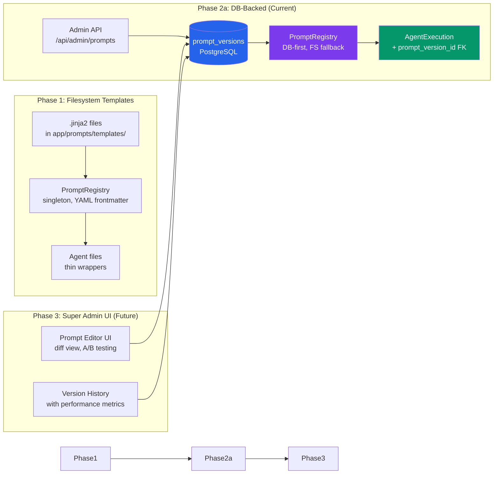
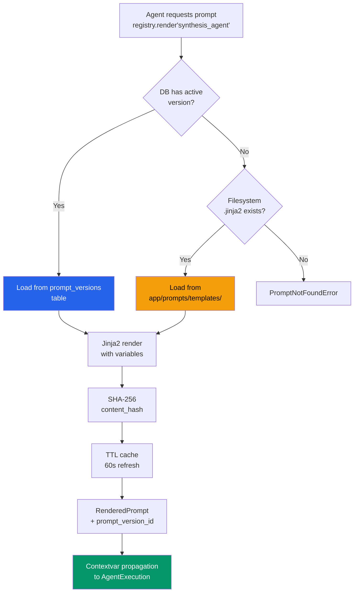
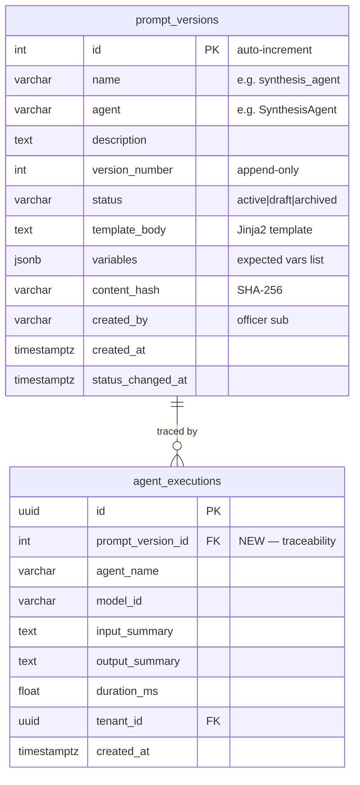
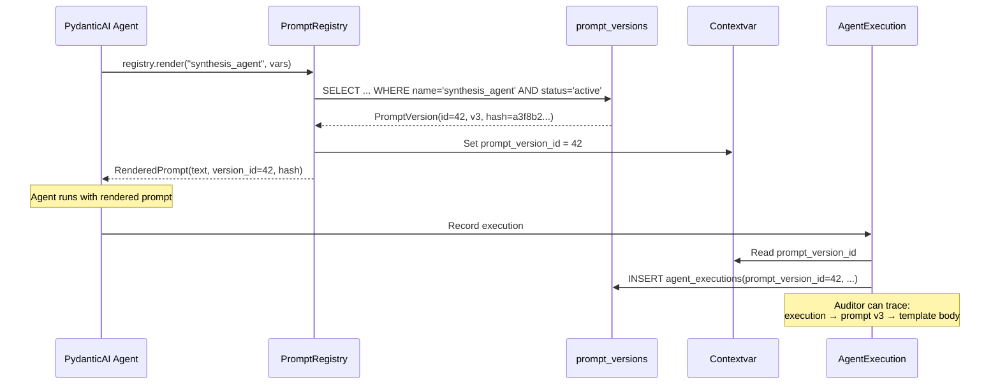

# Prompt Management

Atlas uses 20 AI agent prompts across 16 agent files. The Prompt Management system centralizes these prompts with **version control**, **DB-backed storage**, and **EU AI Act traceability** — every AI output is linked to the exact prompt version that produced it.

## Architecture Evolution



## Prompt Registry

The `PromptRegistry` singleton manages all 20 prompts with a layered loading strategy:



## Prompt Inventory (20 Prompts)

| # | Prompt Name | Agent | Domain |
|---|---|---|---|
| 1 | `synthesis_agent` | SynthesisAgent | Investigation analysis |
| 2 | `portal_investigation` | PortalInvestigationAgent | Customer portal scan |
| 3 | `scan_agent` | ScanAgent | Document scanning |
| 4 | `task_generator` | TaskGeneratorAgent | Follow-up task creation |
| 5 | `document_validation` | DocumentValidationAgent | Doc quality check |
| 6 | `mcc_classifier` | MccClassificationAgent | Merchant categorization |
| 7 | `inhoudingsplicht` | InhoudingspichtAgent | Belgian tax/social debt |
| 8 | `company_profile` | CompanyProfileAgent | Entity profiling |
| 9 | `financial_health` | FinancialHealthAgent | Financial analysis |
| 10 | `belgian_evidence` | BelgianEvidenceAgent | BE data collection |
| 11 | `risk_assessment` | RiskAssessmentAgent | Risk scoring |
| 12 | `finding_debugger` | FindingDebuggerAgent | Signal analysis |
| 13 | `case_intelligence` | CaseIntelligenceAgent | Decision support |
| 14 | `copilot_system` | CopilotRuntime | Copilot behavior |
| 15 | `copilot_case_analysis` | CopilotRuntime | Case-specific tools |
| 16 | `copilot_regulatory` | CopilotRuntime | Regulatory domain |
| 17 | `copilot_memory` | CopilotRuntime | Memory domain |
| 18 | `copilot_entity` | CopilotRuntime | Entity intelligence |
| 19 | `report_generator` | ReportService | KYB report |
| 20 | `regulatory_knowledge` | RegulatoryKnowledgeTool | Lex queries |

## Database Model



**Key constraints:**
- `UNIQUE(name, version_number)` — no duplicate versions
- Partial unique index: only one `active` version per prompt name
- `status IN ('active', 'draft', 'archived')` — check constraint
- **Immutable rows** — once created, template_body never changes (append-only pattern)

## EU AI Act Traceability

Every AI agent execution now links to the exact prompt version that produced it:



This satisfies **EU AI Act Article 12** (automatic logging) — every AI output is traceable to the exact prompt text, model, and input that produced it.

## Admin API

```
GET    /api/admin/prompts                    # List all prompts with active versions
GET    /api/admin/prompts/{name}             # Get prompt with version history
GET    /api/admin/prompts/{name}/versions    # List all versions
POST   /api/admin/prompts/{name}/versions    # Create new version (draft)
PUT    /api/admin/prompts/{name}/activate    # Activate a version (deactivates previous)
PUT    /api/admin/prompts/{name}/archive     # Archive a version
```

**Authorization:** `admin` or `compliance_manager` roles only.

## Jinja2 Template Format

Templates use Jinja2 with YAML frontmatter:

```jinja2
---
name: synthesis_agent
version: 3
agent: SynthesisAgent
description: Main synthesis prompt for investigation analysis
variables:
  - company_name
  - country
  - risk_context
  - regulatory_context
---
You are a compliance investigation analyst for {{ company_name }}.
Country: {{ country }}


Risk context from prior investigations:
{{ risk_context }}



Applicable regulations:
{{ regulatory_context | truncate_items(5) }}

```

**Custom Jinja2 filters:** `truncate_items(n)`, `format_date`, `join_bullets` — domain-specific formatting for compliance prompts.

## Parity Testing

Every prompt migration from inline strings to templates includes a **parity test** that proves zero behavioral change:

```python
def test_synthesis_agent_prompt_parity():
    """Template renders identically to the original inline prompt."""
    original = _get_original_inline_prompt()
    rendered = registry.render("synthesis_agent", test_vars)
    assert rendered.text.strip() == original.strip()
```

20 parity tests — one per prompt — ensure the migration is invisible to the AI agents.
