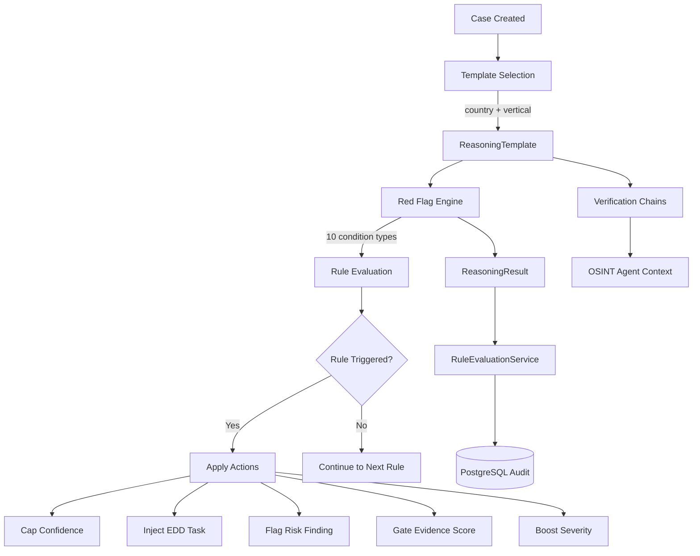

# Compliance Reasoning Templates (Pillar 2 -- Red Flag Engine)

Jurisdiction-specific compliance playbooks with deterministic red flag detection. No LLM involved in rule evaluation -- every triggered rule is traceable to a specific regulatory article and reproducible with the same inputs.

## Business Value

Different business types and jurisdictions require different compliance checks. A Belgian PSP onboarding a merchant must verify KBO registration, NBB financial accounts, and inhoudingsplicht status. A Czech bank onboarding a corporate client must check ARES/ICO, the Justice.cz insolvency register, and CNB licensing. Reasoning Templates codify this expert knowledge into reusable, auditable playbooks that:

- **Drive investigation depth** -- verification chains tell OSINT agents which registries to query
- **Flag specific risks** -- red flag rules fire deterministically against investigation findings
- **Ensure regulatory coverage** -- every rule references its regulatory basis (AMLD-VI Art. 30, GwG s. 15, WWFT Art. 8, etc.)
- **Inject EDD tasks** -- triggered rules generate mandatory or recommended Enhanced Due Diligence tasks
- **Cap confidence scores** -- when a critical red flag fires, the confidence score is capped regardless of other positive signals

This is Pillar 2 of the compliance architecture: deterministic rules that complement Pillar 1's AI-driven confidence scoring.

## Architecture



## How It Works

The red flag engine operates at two points in the investigation pipeline:

1. **During confidence scoring** (`compute_confidence_score` activity) -- after OSINT agents complete and before the officer review, the engine evaluates all rules in the selected template against the accumulated findings and discrepancies. Triggered rules produce confidence caps and evidence gates that constrain the final confidence score.

2. **During task generation** -- EDD tasks from triggered rules are injected alongside AI-generated follow-up tasks, ensuring mandatory compliance requirements are never omitted.

### Evaluation Flow

```
Investigation Complete
    |
    v
get_reasoning_template_for_case(country, workflow_template_id)
    |
    v
evaluate_template(template, findings, discrepancies, metadata)
    |
    +--> For each RedFlagRule:
    |       evaluate_rule(rule, findings, discrepancies, sources, docs, metadata)
    |           +--> For each RuleCondition (AND logic):
    |           |       _evaluate_condition(type, value, ...)
    |           |       -> (matched: bool, description: str)
    |           |
    |           +--> If ALL conditions match:
    |                   Execute all RuleActions
    |
    +--> Aggregate results into ReasoningResult:
            - confidence_cap: min of all CAP_CONFIDENCE actions
            - evidence_gate: min of all GATE_EVIDENCE actions
            - edd_tasks: all FORCE_EDD_TASK actions
            - additional_findings: all FLAG actions
```

### Determinism Guarantee

The engine is fully deterministic -- no LLM calls, no randomness, no external API calls during evaluation. Given identical inputs (findings, discrepancies, metadata), the engine always produces identical outputs. This is critical for:

- **Regulatory audits** -- evaluators can reproduce any past evaluation
- **EU AI Act compliance** -- Art. 14 human oversight requires explainable automated decisions
- **Regression testing** -- rule changes can be validated against known test cases

## Template Structure

### ReasoningTemplate

The top-level model that encapsulates all compliance logic for a specific country and vertical.

| Field | Type | Description |
|-------|------|-------------|
| `id` | `str` | Unique template identifier (e.g., `be_psp_merchant_reasoning`) |
| `name` | `str` | Human-readable name (e.g., "Belgian PSP Merchant Onboarding") |
| `country` | `str` | ISO 3166-1 alpha-2 code (`BE`, `FR`, `CZ`, `DE`, `NL`, `EU`) |
| `vertical` | `str` | Business vertical (e.g., `psp_merchant`, `fiscal_rep`, `hvg_dealer`, `banking_kyb`, `kyc`) |
| `version` | `int` | Template version (default: 1) |
| `workflow_template_id` | `str` | Links to the corresponding WorkflowTemplate |
| `regulatory_framework` | `list[str]` | Applicable regulations (e.g., `["AMLD-VI", "Belgian AML Law"]`) |
| `verification_chain` | `list[VerificationStep]` | Ordered steps the investigation must complete |
| `red_flag_rules` | `list[RedFlagRule]` | Deterministic rules evaluated against findings |
| `confidence_adjustments` | `list[ConfidenceAdjustment]` | Template-specific score adjustments |

### VerificationStep

Defines a single step in the investigation verification chain.

| Field | Type | Description |
|-------|------|-------------|
| `order` | `int` | Execution order in the chain |
| `name` | `str` | Step name (e.g., "KBO Registry Lookup") |
| `description` | `str` | What this step verifies |
| `source` | `str` | Data source to check (`kbo`, `nbb`, `ares`, `justice_cz`, etc.) |
| `required` | `bool` | If true, investigation is incomplete without this step |
| `auto_verifiable` | `bool` | Can be checked automatically vs. needs officer review |

### RedFlagRule

A single red flag with conditions and actions.

| Field | Type | Description |
|-------|------|-------------|
| `id` | `str` | Rule identifier (e.g., `be_psp_ubo_mismatch`) |
| `name` | `str` | Human-readable name |
| `description` | `str` | Explanation of what the rule detects |
| `severity` | `RuleSeverity` | `CRITICAL`, `HIGH`, `MEDIUM`, or `LOW` |
| `conditions` | `list[RuleCondition]` | ALL must match (AND logic) |
| `actions` | `list[RuleAction]` | ALL are executed when the rule fires |
| `edd_level` | `EDDLevel \| None` | `MANDATORY` or `RECOMMENDED` (if set, triggers EDD) |
| `edd_task_template` | `str` | Task description template for EDD |
| `regulatory_basis` | `str` | Specific regulation reference (e.g., "AMLD-VI Art. 30") |
| `enabled` | `bool` | Can be disabled without removing (default: true) |
| `service_scope` | `list[str]` | Service-scoped rules only fire for matching selected services |

### Condition Types (10)

| Condition Type | Evaluates | Example |
|---------------|-----------|---------|
| `FINDING_CATEGORY` | Finding's category matches value | `sanctions_hit`, `pep_match`, `nominee_director` |
| `FINDING_SOURCE` | Finding's source matches value | `kbo`, `nbb`, `sanctions_list` |
| `SEVERITY_GTE` | Any finding has severity >= threshold | `high`, `critical` |
| `RISK_SCORE_GTE` | Case risk score >= threshold | `75.0` |
| `DISCREPANCY_FIELD` | Discrepancy exists on specified field | `ubo_ownership` |
| `SOURCE_MISSING` | Expected source absent from findings | `nbb`, `inpi_accounts` |
| `DOC_MISSING` | Required document not uploaded | `kbis_extract`, `source_of_goods` |
| `FIELD_VALUE_MATCH` | `finding.details[field]` matches pattern | `identity_verified: false` |
| `NACE_CODE_MISMATCH` | NACE codes don't include expected values | `46.72,47.77` |
| `COMPANY_AGE_LT` | Company registered less than N months ago | `6`, `12` |

### Action Types (5)

| Action Type | Effect | Example |
|-------------|--------|---------|
| `FLAG` | Inject a finding with the rule's severity | Adds `red_flag:be_psp_ubo_mismatch` finding |
| `CAP_CONFIDENCE` | Cap total confidence at a maximum value | Cap at `40` for UBO mismatch |
| `FORCE_EDD_TASK` | Generate a mandatory follow-up task | "Request ITAA membership certificate" |
| `BOOST_SEVERITY` | Increase finding severity to rule's level | Escalate to `critical` |
| `GATE_EVIDENCE` | Without this doc, evidence dimension capped | Evidence capped at `15/25` without insurance |

### EDD Levels

| Level | Behavior |
|-------|----------|
| `MANDATORY` | Task must be generated; cannot proceed without completion |
| `RECOMMENDED` | Task is suggested; officer can override and proceed |

## Available Templates

Trust Relay ships with **9 reasoning templates** covering 6 jurisdictions:

| Template ID | Country | Vertical | Rules | Verification Steps | Regulatory Framework |
|------------|---------|----------|-------|--------------------|---------------------|
| `be_psp_merchant_reasoning` | BE | PSP Merchant | 8 | 9 | AMLD-VI, Belgian AML Law, PSD2 |
| `be_fiscal_rep_reasoning` | BE | Fiscal Rep | 4 | 7 | AMLD-VI, Belgian AML Law, ITAA Regulations |
| `be_hvg_dealer_reasoning` | BE | HVG Dealer | 7 | 11 | AMLR, Belgian AML Law, EU Conflict Minerals Reg. 2017/821 |
| `be_kyc_natural_person` | BE | KYC (Natural Person) | 9 | 6 | AMLD-VI, Belgian AML Law, eIDAS Regulation |
| `fr_psp_merchant_reasoning` | FR | PSP Merchant | 10 | 10 | AMLR, CMF Art. L561-1 et seq., PSD2 |
| `cz_banking_kyb_reasoning` | CZ | Banking KYB | 10 | 10 | AMLR, Czech AML Act 253/2008, CNB Decree 67/2018 |
| `de_psp_merchant_reasoning` | DE | PSP Merchant | 10 | 9 | AMLR, GwG, PSD2, BaFin AuA |
| `nl_psp_merchant_reasoning` | NL | PSP Merchant | 10 | 10 | AMLR, WWFT, PSD2, DNB Guidance |
| `eu_generic_cdd_reasoning` | EU | Generic CDD | 10 | 8 | AMLR 2024/1624, 6AMLD, EU Funds Transfer Reg. |

## Per-Country Detail

### Belgium (BE) -- 4 Templates

Belgium is the home jurisdiction with the deepest template coverage, spanning four distinct verticals.

#### BE PSP Merchant (8 rules, 9 verification steps)

**Verification chain:** KBO Registry -> NBB CBSO Financial Health -> PEPPOL Registration -> UBO Register Cross-Reference -> Inhoudingsplicht Check -> Gazette Review -> Sanctions/PEP Screening -> Adverse Media Scan -> Document Cross-Reference

| Rule ID | Severity | Condition | Action | Regulatory Basis |
|---------|----------|-----------|--------|-----------------|
| `be_psp_young_company` | HIGH | Company age < 6 months | Flag high risk | Belgian AML Law Art. 19 |
| `be_psp_nominee_director` | MEDIUM | `nominee_director` finding | Flag medium risk | AMLD-VI Art. 13 |
| `be_psp_ubo_mismatch` | CRITICAL | UBO discrepancy detected | Flag + cap confidence at 40 + mandatory EDD | AMLD-VI Art. 30 |
| `be_psp_missing_accounts` | HIGH | NBB source missing | Flag + recommended EDD for financial data | Belgian AML Law |
| `be_psp_social_tax_debt` | HIGH | `social_debt` finding | Flag + cap confidence at 55 | Belgian AML Law |
| `be_psp_fatf_ubo` | HIGH | `high_risk_country_ubo` finding | Flag + mandatory EDD (senior management + source of funds) | AMLD-VI Art. 18 |
| `be_psp_pep_match` | HIGH | `pep_match` finding | Flag + mandatory EDD (source of wealth + source of funds) | AMLD-VI Art. 20-22 |
| `be_psp_sanctions_hit` | CRITICAL | `sanctions_hit` finding | Flag + cap confidence at 15 | EU Sanctions Regulations |

**Confidence adjustments:** Full Belgian source coverage (KBO + NBB + PEPPOL + Gazette + UBO Register) boosts source diversity by +25.

#### BE Fiscal Representative (4 rules, 7 verification steps)

**Verification chain:** KBO Registry -> ITAA Registration -> NBB CBSO Financial Health -> Professional Liability Insurance -> UBO Register Cross-Reference -> Sanctions/PEP Screening -> Adverse Media Scan

| Rule ID | Severity | Condition | Action | Regulatory Basis |
|---------|----------|-----------|--------|-----------------|
| `be_fiscal_no_itaa` | CRITICAL | ITAA source missing | Flag + cap confidence at 35 + mandatory EDD | ITAA Regulations |
| `be_fiscal_insurance_expired` | HIGH | Professional liability insurance missing | Flag + gate evidence at 15/25 | Belgian Professional Requirements |
| `be_fiscal_high_risk_clients` | MEDIUM | `high_risk_jurisdiction_clients` finding | Flag medium risk | AMLD-VI Art. 18 |
| `be_fiscal_disciplinary` | CRITICAL | `disciplinary_action` finding | Flag + cap confidence at 30 | ITAA Regulations |

**Confidence adjustments:** ITAA verification is gating (confidence capped at 35 without it). Professional liability insurance is gating for the evidence dimension (capped at 15/25 without it).

#### BE High-Value Goods Dealer (7 rules, 11 verification steps)

**Verification chain:** KBO Registry -> NBB CBSO -> Gazette Corporate Governance -> PEPPOL Trade Verification -> UBO Register -> eID UBO Verification -> Source-of-Goods Verification -> Inhoudingsplicht Check -> Sanctions/PEP Screening -> Adverse Media Investigation -> Document Cross-Reference

| Rule ID | Severity | Condition | Action | Regulatory Basis |
|---------|----------|-----------|--------|-----------------|
| `be_hvg_nace_mismatch` | HIGH | NACE codes exclude 46.72/47.77 | Flag + cap confidence at 30 | Sector risk assessment |
| `be_hvg_young_company` | HIGH | Company age < 12 months | Flag high risk | Sector risk assessment |
| `be_hvg_source_of_goods_missing` | HIGH | Source-of-goods doc missing | Flag + mandatory EDD (LBMA, supply chain) | EU Reg. 2017/821 Art. 4-7 |
| `be_hvg_sanctions_hit` | CRITICAL | `sanctions_hit` finding | Flag + cap confidence at 15 | EU Sanctions Regulations |
| `be_hvg_pep_match` | HIGH | `pep_match` finding | Flag + mandatory EDD | AMLD-VI Art. 20-22 |
| `be_hvg_fatf_ubo` | HIGH | `high_risk_country_ubo` finding | Flag + mandatory EDD | AMLD-VI Art. 18 |
| `be_hvg_adverse_media` | HIGH | `adverse_media_hit` finding | Flag + recommended EDD (media assessment) | AMLD-VI Art. 18 |

**Confidence adjustments:** NACE code verification is gating (confidence capped at 30 for wrong NACE). Source-of-goods documentation is weighted 2x in evidence completeness.

#### BE KYC Natural Person (9 rules, 6 verification steps)

The only template that routes through the KYC activity fork in the workflow (not the KYB path). Used for natural persons: consumers, HVG customers, and beneficial owners undergoing Enhanced Due Diligence.

**Verification chain:** Identity Verification (eID/itsme) -> National Register Validation (NRN mod97 / BSN 11-proof) -> IBAN + Verification of Payee -> Sanctions Screening -> PEP Screening -> Adverse Media Check

| Rule ID | Severity | Condition | Action | Regulatory Basis |
|---------|----------|-----------|--------|-----------------|
| `kyc_sanctions_match` | CRITICAL | `sanctions_hit` finding | Cap confidence at 15 + mandatory EDD | AMLD-VI Art. 18 |
| `kyc_identity_failed` | CRITICAL | `identity_verified` = false | Cap confidence at 20 + mandatory EDD (in-person verification) | Belgian AML Law Art. 27 |
| `kyc_pep_match` | HIGH | `pep_match` finding | Flag + mandatory EDD (source-of-wealth) | AMLD-VI Art. 20-23 |
| `kyc_adverse_media` | HIGH | `adverse_media` finding | Flag + recommended EDD | AMLD-VI Art. 18 |
| `kyc_high_volume` | HIGH | Expected volume > 100k | Force EDD (source-of-funds) | Belgian AML Law Art. 21 |
| `kyc_vop_mismatch` | HIGH | VoP name does not match | Force EDD (account verification) | AMLD-VI Art. 13 |
| `kyc_non_eu` | MEDIUM | Non-EU nationality | Flag medium risk | -- |
| `kyc_residence_mismatch` | MEDIUM | Residence != nationality | Flag medium risk | -- |
| `kyc_nrn_invalid` | MEDIUM | NRN/BSN checksum failed | Flag + cap confidence at 50 | -- |

**Confidence adjustments:** Full verification suite passed (eID + IBAN + screening clean) boosts evidence by +25. Complete screening coverage (sanctions + PEP + adverse media all clean) boosts source diversity by +20. NRN validation passed boosts consistency by +10. Volume > 50k without source-of-funds caps total confidence at 55.

**Note:** `populate_knowledge_graph` and `assign_automation_tier` are skipped for KYC cases. Natural persons do not produce company graph data.

### France (FR) -- 1 Template

#### FR PSP Merchant (10 rules, 10 verification steps)

**Verification chain:** SIREN/SIRET Verification (INSEE SIRENE) -> INPI/RNE Registry Lookup -> BODACC Publication Monitoring -> RBE Beneficial Ownership (Greffe) -> Kbis Extract Verification -> VIES VAT Validation -> Financial Accounts Review (INPI) -> Sanctions/PEP Screening -> Adverse Media Scan -> Document Cross-Reference

| Rule ID | Severity | Condition | Action | Regulatory Basis |
|---------|----------|-----------|--------|-----------------|
| `fr_psp_young_company` | HIGH | Company age < 6 months | Flag high risk | CMF Art. L561-10-2 |
| `fr_psp_siren_inactive` | CRITICAL | `siren_inactive` finding | Flag + cap confidence at 15 | CMF Art. L561-5 |
| `fr_psp_ubo_mismatch` | CRITICAL | UBO discrepancy (RBE vs. declared) | Flag + cap confidence at 40 + mandatory EDD (RBE extract) | CMF Art. L561-46 |
| `fr_psp_bodacc_judicial` | CRITICAL | `judicial_proceedings` finding | Flag + cap confidence at 25 + mandatory EDD (Tribunal judgment) | Code de commerce Art. L631-1 |
| `fr_psp_kbis_missing` | HIGH | Kbis extract not provided | Flag + recommended EDD (Kbis < 3 months) | CMF Art. L561-5 |
| `fr_psp_nominee_director` | MEDIUM | `nominee_director` finding | Flag medium risk | CMF Art. L561-10-2 |
| `fr_psp_fatf_ubo` | HIGH | `high_risk_country_ubo` finding | Flag + mandatory EDD (incl. TRACFIN declaration) | CMF Art. L561-10-2 |
| `fr_psp_pep_match` | HIGH | `pep_match` finding | Flag + mandatory EDD (CMF Art. L561-10) | CMF Art. L561-10 |
| `fr_psp_sanctions_hit` | CRITICAL | `sanctions_hit` finding | Flag + cap confidence at 15 | CMF Art. L562-1 (gel des avoirs) |
| `fr_psp_missing_accounts` | HIGH | INPI accounts source missing | Flag + recommended EDD (liasse fiscale) | Code de commerce Art. L232-21 |

**Confidence adjustments:** Full French source coverage (SIREN + INPI + BODACC + RBE + VIES) boosts source diversity by +25. Verified Kbis extract (< 3 months, matching INPI data) boosts evidence by +15.

### Czech Republic (CZ) -- 1 Template

#### CZ Banking KYB (10 rules, 10 verification steps)

**Verification chain:** ARES/ICO Registry Lookup -> Justice.cz Commercial Register -> ISIR Insolvency Register -> Beneficial Ownership Register (Evidence skutecnych majitelu) -> VIES VAT Validation -> Financial Statements Review (Sbirka listin) -> CNB License Verification -> Sanctions/PEP Screening -> Adverse Media Scan -> Document Cross-Reference

| Rule ID | Severity | Condition | Action | Regulatory Basis |
|---------|----------|-----------|--------|-----------------|
| `cz_bank_young_company` | HIGH | Company age < 12 months | Flag high risk | Czech AML Act s. 9(2)(b) |
| `cz_bank_isir_insolvency` | CRITICAL | `insolvency_proceedings` finding | Flag + cap confidence at 20 + mandatory EDD | Czech AML Act s. 9(2) |
| `cz_bank_ubo_mismatch` | CRITICAL | UBO discrepancy (register vs. declared) | Flag + cap confidence at 40 + mandatory EDD | Czech AML Act s. 29 |
| `cz_bank_justice_mismatch` | HIGH | `registry_data_mismatch` finding | Flag + recommended EDD (Vypis z obchodniho rejstriku) | Czech AML Act s. 8 |
| `cz_bank_missing_accounts` | HIGH | Justice.cz accounts source missing | Flag + recommended EDD (ucelni zaverka) | Czech AML Act s. 9(2) |
| `cz_bank_nominee_director` | MEDIUM | `nominee_director` finding | Flag medium risk | Czech AML Act s. 9(2)(d) |
| `cz_bank_fatf_ubo` | HIGH | `high_risk_country_ubo` finding | Flag + mandatory EDD | Czech AML Act s. 9(2)(a) |
| `cz_bank_pep_match` | HIGH | `pep_match` finding | Flag + mandatory EDD (Czech AML Act s. 10) | Czech AML Act s. 10 |
| `cz_bank_sanctions_hit` | CRITICAL | `sanctions_hit` finding | Flag + cap confidence at 15 | Czech AML Act s. 18 |
| `cz_bank_high_capital_turnover` | MEDIUM | `capital_turnover_discrepancy` finding | Flag medium risk (shell company indicator) | CNB Decree 67/2018 |

**Confidence adjustments:** Full Czech source coverage (ARES + Justice.cz + ISIR + UBO register) boosts source diversity by +25. All Czech registries corroborating each other boosts consistency by +15.

**Note:** The CZ template uses a 12-month young company threshold (vs. 6 months for PSP templates) because banking KYB requires heightened scrutiny for recently incorporated entities per CNB Decree 67/2018.

### Germany (DE) -- 1 Template

#### DE PSP Merchant (10 rules, 9 verification steps)

**Verification chain:** Handelsregister Lookup -> Unternehmensregister/Bundesanzeiger Financial Data -> Transparenzregister UBO Verification -> VIES VAT Validation -> Gewerbeanmeldung Verification -> GLEIF/LEI Verification -> Sanctions/PEP Screening -> Adverse Media Scan -> Document Cross-Reference

| Rule ID | Severity | Condition | Action | Regulatory Basis |
|---------|----------|-----------|--------|-----------------|
| `de_psp_young_company` | HIGH | Company age < 6 months | Flag high risk | GwG s. 15(3) Nr. 1 |
| `de_psp_hr_deleted` | CRITICAL | `hr_deleted_liquidation` finding | Flag + cap confidence at 15 | GwG s. 10(1) Nr. 1 |
| `de_psp_ubo_mismatch` | CRITICAL | UBO discrepancy (Transparenzregister) | Flag + cap confidence at 40 + mandatory EDD | GwG s. 20 |
| `de_psp_missing_accounts` | HIGH | Bundesanzeiger source missing | Flag + recommended EDD (Jahresabschluss) | HGB s. 325 |
| `de_psp_bafin_threshold` | MEDIUM | `bafin_threshold_exceeded` finding | Flag medium risk (enhanced monitoring) | GwG s. 10(3) Nr. 2 |
| `de_psp_nominee_director` | MEDIUM | `nominee_director` finding | Flag medium risk | GwG s. 15(3) Nr. 3(b) |
| `de_psp_fatf_ubo` | HIGH | `high_risk_country_ubo` finding | Flag + mandatory EDD (GwG s. 15(2)) | GwG s. 15(2) |
| `de_psp_pep_match` | HIGH | `pep_match` finding | Flag + mandatory EDD (GwG s. 15(4)) | GwG s. 15(4) |
| `de_psp_sanctions_hit` | CRITICAL | `sanctions_hit` finding | Flag + cap confidence at 15 | AWG s. 4 (Aussenwirtschaftsgesetz) |
| `de_psp_gwg_suspicious` | HIGH | `gwg_suspicious_indicators` finding | Flag + recommended EDD (Verdachtsmeldung assessment) | GwG s. 43 (Meldepflicht) |

**Confidence adjustments:** Full German source coverage (Handelsregister + Bundesanzeiger + Transparenzregister + VIES) boosts source diversity by +25. All German registries corroborating each other boosts consistency by +15.

### Netherlands (NL) -- 1 Template

#### NL PSP Merchant (10 rules, 10 verification steps)

**Verification chain:** KvK Extract Verification -> KvK UBO Register -> Annual Accounts (KvK Jaarrekeningen) -> VIES VAT Validation -> GLEIF/LEI Verification -> Staatscourant Monitoring -> Faillissementsverslag Check (CIR) -> Sanctions/PEP Screening -> Adverse Media Scan -> Document Cross-Reference

| Rule ID | Severity | Condition | Action | Regulatory Basis |
|---------|----------|-----------|--------|-----------------|
| `nl_psp_young_company` | HIGH | Company age < 6 months | Flag high risk | WWFT Art. 8(6)(a) |
| `nl_psp_kvk_inactive` | CRITICAL | `kvk_inactive` finding | Flag + cap confidence at 15 | WWFT Art. 3(1) |
| `nl_psp_ubo_mismatch` | CRITICAL | UBO discrepancy (KvK UBO) | Flag + cap confidence at 40 + mandatory EDD | WWFT Art. 3(1)(b) + Implementatiewet UBO-register |
| `nl_psp_bankruptcy` | CRITICAL | `bankruptcy_proceedings` finding | Flag + cap confidence at 20 + mandatory EDD (CIR ruling) | WWFT Art. 8(6) |
| `nl_psp_missing_accounts` | HIGH | KvK jaarrekeningen source missing | Flag + recommended EDD (jaarrekening) | BW2 Titel 9 (Dutch Civil Code) |
| `nl_psp_wwft_indicators` | HIGH | `wwft_unusual_indicators` finding | Flag + recommended EDD (FIU-Nederland assessment) | WWFT Art. 16 (meldingsplicht) |
| `nl_psp_nominee_director` | MEDIUM | `nominee_director` finding | Flag medium risk | WWFT Art. 8(6)(c) |
| `nl_psp_fatf_ubo` | HIGH | `high_risk_country_ubo` finding | Flag + mandatory EDD (WWFT Art. 8(5)) | WWFT Art. 8(5) |
| `nl_psp_pep_match` | HIGH | `pep_match` finding | Flag + mandatory EDD (WWFT Art. 8(5)) | WWFT Art. 8(5)(a)-(c) |
| `nl_psp_sanctions_hit` | CRITICAL | `sanctions_hit` finding | Flag + cap confidence at 15 | Sanctiewet 1977 |

**Confidence adjustments:** Full Dutch source coverage (KvK + KvK UBO + KvK Jaarrekeningen + VIES) boosts source diversity by +25. All Dutch registries corroborating each other (KvK active + UBO matched + Jaarrekeningen filed + CIR clean) boosts consistency by +15.

### EU Generic Fallback (10 rules, 8 verification steps)

The fallback template for any EU/EEA country without a country-specific template. Provides baseline CDD coverage per AMLR 2024/1624.

**Verification chain:** National Commercial Register -> VIES VAT Validation -> GLEIF/LEI Verification -> UBO Verification -> Sanctions/PEP Screening -> PEP Database Check -> Adverse Media Scan -> Document Cross-Reference

| Rule ID | Severity | Condition | Action | Regulatory Basis |
|---------|----------|-----------|--------|-----------------|
| `eu_generic_young_company` | HIGH | Company age < 6 months | Flag high risk | AMLR Art. 28(4)(a) |
| `eu_generic_ubo_mismatch` | CRITICAL | UBO discrepancy | Flag + cap confidence at 40 + mandatory EDD | AMLR Art. 45 |
| `eu_generic_vies_invalid` | MEDIUM | VIES source missing | Flag medium risk | AMLR Art. 28 |
| `eu_generic_gleif_no_lei` | LOW | GLEIF source missing | Flag low risk (reduced transparency) | AMLR Art. 28 |
| `eu_generic_nominee_director` | MEDIUM | `nominee_director` finding | Flag medium risk | AMLR Art. 28(4)(a) |
| `eu_generic_fatf_ubo` | HIGH | `high_risk_country_ubo` finding | Flag + mandatory EDD (AMLR Art. 32) | AMLR Art. 32 |
| `eu_generic_pep_match` | HIGH | `pep_match` finding | Flag + mandatory EDD (AMLR Art. 35) | AMLR Art. 35-37 |
| `eu_generic_sanctions_hit` | CRITICAL | `sanctions_hit` finding | Flag + cap confidence at 15 | EU Council Regulations |
| `eu_generic_adverse_media` | HIGH | `adverse_media_hit` finding | Flag + recommended EDD | AMLR Art. 28(4)(c) |
| `eu_generic_missing_registry` | HIGH | National registry source missing | Flag + mandatory EDD (certified extract) | AMLR Art. 28(1) |

**Confidence adjustments:** VIES validated + GLEIF/LEI found + UBO register matched boosts source diversity by +20. National registry unavailable caps total confidence at 60 (cannot go higher without the primary registry).

## Fallback Logic

`get_reasoning_template_for_case(country, workflow_template_id)` resolves the template in three steps:

```
1. Exact match: country + workflow_template_id
   -> Found? Return template.

2. EU generic match: EU country + same workflow_template_id
   -> Found? Return EU template with that workflow.

3. Last resort: EU generic CDD baseline
   -> Always returns eu_generic_cdd_reasoning.
```

This ensures every case gets at least the EU CDD baseline, even for countries without a dedicated template (e.g., a Spanish or Italian entity would receive the EU generic rules).

A DB-first variant (`get_reasoning_template_for_case_from_db`) checks the `workflow_templates` table first for tenant-specific or system templates stored in PostgreSQL, falling back to the in-memory registry on DB failure. This guard-and-swallow pattern ensures a database outage never blocks the compliance engine.

## Source Alias Normalization

The engine normalizes source names to handle variations in how OSINT agents report their data source:

| Canonical | Aliases |
|-----------|---------|
| `nbb` | `nbb cbso`, `nbb annual`, `nationale bank` |
| `kbo` | `kbo/bce`, `kbo bce`, `kruispuntbank`, `crossroads` |
| `gazette` | `belgian gazette`, `staatsblad`, `moniteur belge` |
| `inhoudingsplicht` | `withholding obligation` |

This prevents `SOURCE_MISSING` rules from firing incorrectly when an agent reports the source as "KBO/BCE Public Search" instead of "kbo".

## Adding a New Template

To add a new country template (e.g., Spain):

### Step 1: Research regulatory requirements

Identify the country's AML law, commercial register, UBO register, insolvency register, and FIU reporting requirements. Map each to specific regulatory articles.

### Step 2: Define the verification chain

List the data sources the investigation must check, in order. Mark each as `required` (investigation incomplete without it) and `auto_verifiable` (can be checked via API vs. needs manual review).

### Step 3: Define red flag rules

For each risk scenario, create a `RedFlagRule` with:
- Conditions using the 10 available `ConditionType` values
- Actions using the 5 available `ActionType` values
- A specific `regulatory_basis` citation
- An `edd_level` if the rule should generate follow-up tasks

### Step 4: Add to the registry

Add the template constant to `backend/app/services/reasoning_template_registry.py`:

```python
ES_PSP_TEMPLATE = ReasoningTemplate(
    id="es_psp_merchant_reasoning",
    name="Spanish PSP Merchant Onboarding",
    country="ES",
    vertical="psp_merchant",
    workflow_template_id="psp_merchant_onboarding",
    regulatory_framework=["AMLR", "Ley 10/2010 de prevenci\u00f3n del blanqueo de capitales"],
    verification_chain=[...],
    red_flag_rules=[...],
    confidence_adjustments=[...],
)
```

Register it in `REASONING_TEMPLATE_REGISTRY`:

```python
REASONING_TEMPLATE_REGISTRY: dict[str, ReasoningTemplate] = {
    # ... existing templates ...
    # Spain
    ES_PSP_TEMPLATE.id: ES_PSP_TEMPLATE,
}
```

### Step 5: Write tests

Add test cases to verify:
- Template is returned by `get_reasoning_template_for_case("ES", "psp_merchant_onboarding")`
- Each rule fires when its conditions are met
- Confidence caps are applied correctly
- EDD tasks are generated for mandatory rules

### Step 6: Update documentation

Update this page with the new country section and add a row to the Available Templates table.

## Relationship to Other Pillars

### Pillar 1: Confidence Scoring (AI-driven)

Pillar 1 computes a 4-dimension confidence score (evidence, source diversity, consistency, calibration). Pillar 2 constrains that score: when a critical red flag fires, it caps the confidence regardless of how positive the other signals are. A UBO mismatch (Pillar 2, cap at 40) overrides a high source diversity score (Pillar 1) -- this ensures the system **never suppresses risk signals**.

### Pillar 3: Cross-Case Patterns

Pillar 3 (compliance memory) learns patterns across cases. Pillar 2 rules are static per template; Pillar 3 extends them with learned patterns like "companies with this NACE code in this region have a 40% rejection rate." Future: Pillar 3 findings could feed into Pillar 2 as dynamic rule generation.

### EBA Risk Matrix (ADR-0020)

The EBA risk matrix scores risk across 5 dimensions (customer, geographic, product, channel, delivery). Reasoning template rules produce findings that feed into EBA dimension scoring -- for example, a `high_risk_country_ubo` finding increases the Geographic risk dimension.

### Regulatory Segments (ADR-0031)

Regulatory segment profiles compile country+vertical YAML definitions into workflow configurations. Reasoning templates are the runtime enforcement mechanism for these segment definitions -- the YAML compiler generates the verification chain and red flag rules that become a reasoning template.

## Key Components

| File | Role |
|------|------|
| `app/models/reasoning_template.py` | Pydantic models: `ReasoningTemplate`, `RedFlagRule`, `RuleCondition`, `RuleAction`, `VerificationStep`, `ConfidenceAdjustment`, `ReasoningResult` |
| `app/services/reasoning_template_registry.py` | In-memory registry with 9 seed templates, lookup functions (`get_reasoning_template_for_case`, DB-first variant) |
| `app/services/red_flag_engine.py` | Deterministic rule evaluation: `evaluate_rule()`, `evaluate_template()`, source alias normalization |
| `app/services/rule_evaluation_service.py` | PostgreSQL persistence of evaluation results for audit trail |
| `frontend/src/components/dashboard/RulesAppliedCard.tsx` | Visual display of triggered rules in the Compliance tab |

## API Endpoints

| Method | Path | Description |
|--------|------|-------------|
| GET | `/api/reasoning/templates` | List available templates (optionally filtered by country) |
| GET | `/api/reasoning/templates/{id}` | Get template details including all rules and verification steps |
| GET | `/api/reasoning/evaluations/{case_id}` | Get rule evaluation results for a case |

## Configuration

- Alembic migration: `007_reasoning_templates` (reasoning template storage)
- Rule evaluations stored in `rule_evaluations` table for audit trail
- DB-first lookup queries `workflow_templates` table, falls back to in-memory registry
