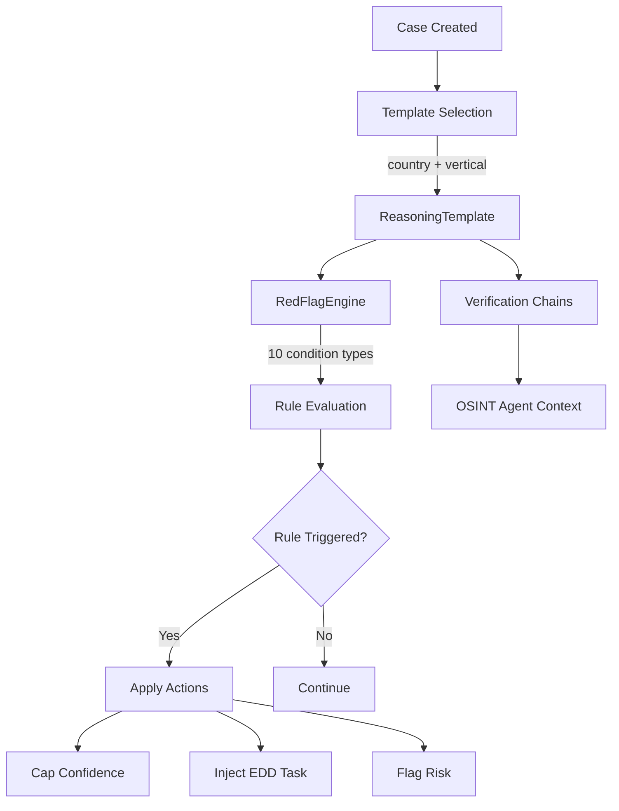

# Compliance Reasoning Templates (Pillar 2)

Jurisdiction-specific compliance playbooks with deterministic red flag detection — no LLM hallucination.

## Business Value

Different business types and jurisdictions require different compliance checks. Reasoning Templates codify expert knowledge into reusable playbooks that drive investigation depth, flag specific risks, and ensure regulatory coverage.

## Architecture

## Red Flag Engine

Fully deterministic — no LLM involved in rule evaluation.

**10 Condition Types:** `field_equals`, `field_contains`, `field_missing`, `field_above_threshold`, `field_below_threshold`, `age_above`, `age_below`, `country_in_list`, `entity_type_equals`, `pattern_match`

**5 Action Types:** `cap_confidence`, `inject_edd_task`, `flag_risk`, `require_document`, `escalate`

## Belgian Templates

| Template | Vertical | Key Red Flags |
|----------|----------|---------------|
| PSP Merchant | `psp_merchant` | High-risk MCCs, missing UBO, sanctions proximity |
| Fiscal Representative | `fiscal_rep` | Solo practitioner, cross-border patterns |
| HVG Dealer | `hvg_dealer` | Cash-intensive, conflict mineral exposure |

## Key Components

- **`reasoning_template.py`** — Template data model with rules and verification chains
- **`red_flag_engine.py`** — Deterministic rule evaluation engine
- **`reasoning_template_registry.py`** — In-memory registry of Belgian templates
- **`rule_evaluation_service.py`** — Pipeline integration for rule evaluation
- **`RulesAppliedCard.tsx`** — Visual display in Compliance tab

## API Endpoints

| Method | Path | Description |
|--------|------|-------------|
| GET | `/api/reasoning/templates` | List available templates |
| GET | `/api/reasoning/templates/{id}` | Get template details |
| GET | `/api/reasoning/evaluations/{case_id}` | Get rule evaluation results |

## Configuration

- Alembic migration: `007_reasoning_templates`
