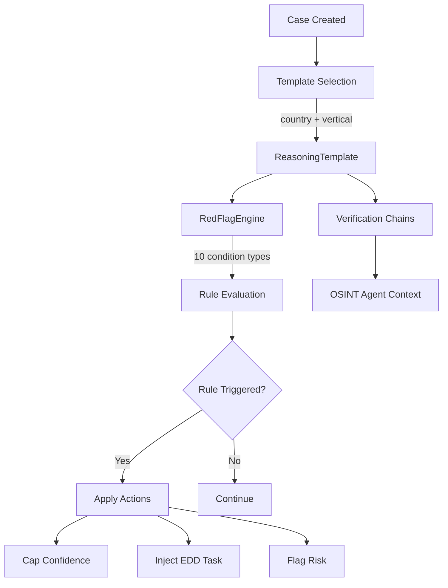

# Compliance Reasoning Templates (Pillar 2)

Jurisdiction-specific compliance playbooks with deterministic red flag detection — no LLM hallucination.

## Business Value

Different business types and jurisdictions require different compliance checks. Reasoning Templates codify expert knowledge into reusable playbooks that drive investigation depth, flag specific risks, and ensure regulatory coverage.

## Architecture

## Red Flag Engine

Fully deterministic — no LLM involved in rule evaluation.

**10 Condition Types:** `field_equals`, `field_contains`, `field_missing`, `field_above_threshold`, `field_below_threshold`, `age_above`, `age_below`, `country_in_list`, `entity_type_equals`, `pattern_match`

**5 Action Types:** `cap_confidence`, `inject_edd_task`, `flag_risk`, `require_document`, `escalate`

## Belgian Templates

| Template | Vertical | Key Red Flags |
|----------|----------|---------------|
| PSP Merchant | `psp_merchant` | High-risk MCCs, missing UBO, sanctions proximity |
| Fiscal Representative | `fiscal_rep` | Solo practitioner, cross-border patterns |
| HVG Dealer | `hvg_dealer` | Cash-intensive, conflict mineral exposure |
| KYC Natural Person | `kyc_natural_person` | Identity mismatch, field validation failures, PEP match, sanctions hit, adverse media |

### BE_KYC_TEMPLATE — Natural Person Onboarding

The `BE_KYC_TEMPLATE` (template ID: `kyc_natural_person`) drives the KYC investigation pipeline for natural persons (consumers, HVG customers, beneficial owners undergoing EDD). It is the only template that routes through the KYC activity fork in the workflow.

**Verification chain:**

1. **Identity verification** — itsme / eIDAS credential simulation (PoC mode). Extracts verified name, date of birth, and national register number. Production integration with itsme Belgium planned.
2. **Field validation** — deterministic checks with no LLM:
   - Belgian NRN (Rijksregisternummer): mod97 structural validation
   - Dutch BSN: 11-proof algorithm
   - IBAN: ISO 13616 check digit verification
3. **KYC screening** — sanctions lists, PEP (Politically Exposed Person) registries, adverse media. Finding categories: `sanctions_hit`, `pep_match`, `adverse_media`.

**Red flag rules:**

| Condition | Action | Description |
|-----------|--------|-------------|
| `identity_verification_failed` | `flag_risk` + `cap_confidence` (max 30) | Identity document could not be verified |
| `field_missing: national_register_number` | `require_document` | NRN is mandatory for Belgian residents |
| `sanctions_hit` | `escalate` + `cap_confidence` (max 10) | Name match on EU/UN sanctions list |
| `pep_match` | `inject_edd_task` + `cap_confidence` (max 50) | Subject is a Politically Exposed Person |
| `field_invalid: iban` | `flag_risk` | IBAN failed ISO 13616 check digit |

**Confidence adjustments**: A clean identity verification adds +10 to Evidence Completeness. A PEP match caps the overall confidence at 50 regardless of other dimensions, forcing Enhanced Due Diligence.

**Note on KYB-only activities**: `populate_knowledge_graph` and `assign_automation_tier` are skipped for KYC cases (`if not is_kyc:` guard). Natural persons do not produce company graph data and do not participate in the automation tier system. This prevents spurious Neo4j nodes and incorrect tier assignments for natural person investigations.

## Key Components

- **`reasoning_template.py`** — Template data model with rules and verification chains
- **`red_flag_engine.py`** — Deterministic rule evaluation engine
- **`reasoning_template_registry.py`** — In-memory registry of Belgian templates
- **`rule_evaluation_service.py`** — Pipeline integration for rule evaluation
- **`RulesAppliedCard.tsx`** — Visual display in Compliance tab

## API Endpoints

| Method | Path | Description |
|--------|------|-------------|
| GET | `/api/reasoning/templates` | List available templates |
| GET | `/api/reasoning/templates/{id}` | Get template details |
| GET | `/api/reasoning/evaluations/{case_id}` | Get rule evaluation results |

## Configuration

- Alembic migration: `007_reasoning_templates`
