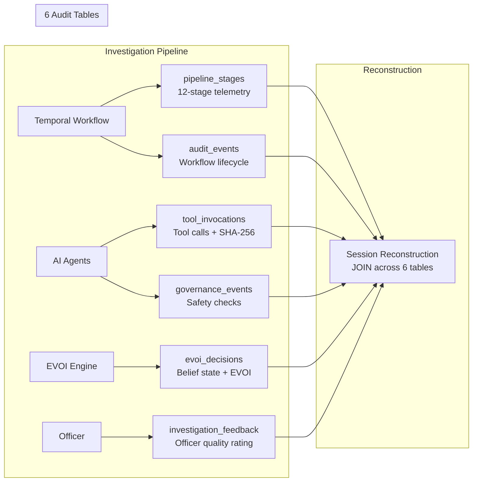
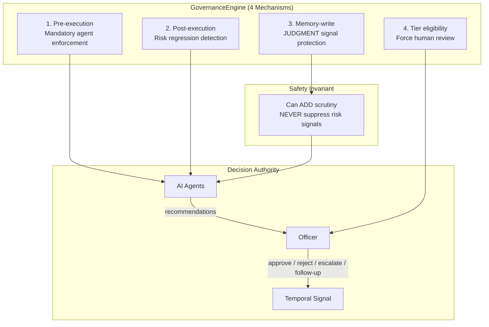
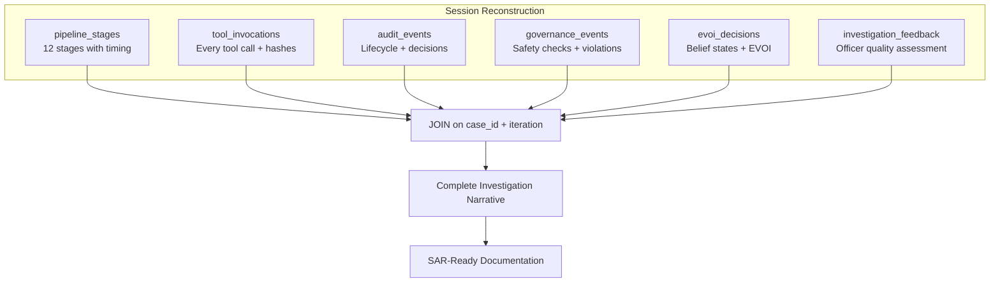
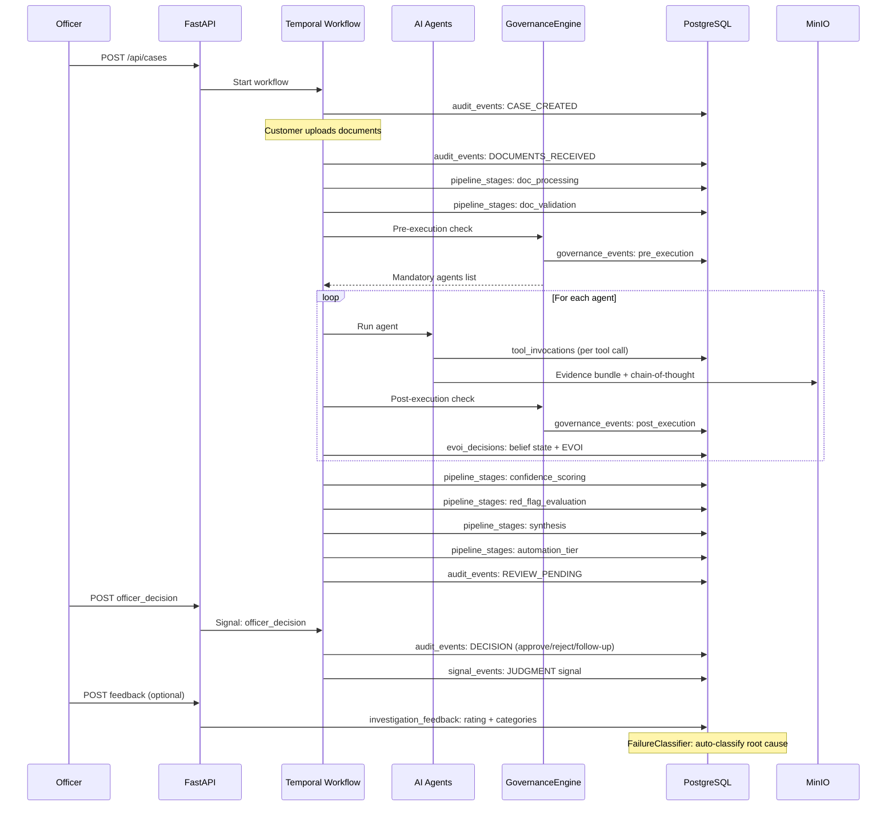

# Regulatory Compliance Architecture

Trust Relay is designed as a high-risk AI system under EU AI Act Annex III from day one. Compliance is not a feature -- it is an architectural constraint that shapes every design decision. No component is added without considering its regulatory implications, no data path exists without an audit trail, and no AI recommendation reaches an officer without governance checks.

This page maps each regulatory requirement to the specific architectural component that satisfies it. Where other documentation pages explain individual subsystems in isolation, this page shows how they work together as a unified compliance architecture.

---

## Regulatory Landscape

Trust Relay operates at the intersection of three regulatory frameworks:

```mermaid
graph TD
    subgraph "EU AI Act"
        A11["Art. 11 — Technical Documentation"]
        A12["Art. 12 — Automatic Logging"]
        A13["Art. 13 — Transparency"]
        A14["Art. 14 — Human Oversight"]
        A15["Art. 15 — Accuracy & Robustness"]
    end

    subgraph "GDPR"
        G22["Art. 22 — Human Review"]
        G25["Art. 25 — Privacy by Design"]
        G30["Art. 30 — Processing Records"]
        G35["Art. 35 — DPIA"]
    end

    subgraph "AML (6AMLD / AMLR)"
        AML1["5-Year Retention"]
        AML2["SAR Audit Trail"]
        AML3["Risk-Based Methodology"]
    end

    subgraph "Trust Relay Architecture"
        ADR["17 ADRs + Agent Manifests"]
        AUDIT["6 Audit Tables"]
        CONF["Confidence Scoring"]
        GOV["GovernanceEngine"]
        EVOI["EVOI Engine"]
        RFE["Red Flag Engine"]
        RLS["PostgreSQL RLS"]
        DIAG["Session Diagnostics"]
    end

    A11 --> ADR
    A12 --> AUDIT
    A13 --> CONF
    A13 --> RFE
    A14 --> GOV
    A15 --> EVOI
    A15 --> DIAG
    G22 --> GOV
    G25 --> RLS
    G30 --> AUDIT
    AML2 --> AUDIT
    AML2 --> DIAG
    AML3 --> CONF
    AML3 --> RFE
    AML3 --> EVOI
```



---

## 1. EU AI Act Compliance

The EU AI Act classifies AI systems used in creditworthiness assessment and risk evaluation of legal persons as high-risk (Annex III, Category 5b). Trust Relay's compliance investigation pipeline -- where AI agents assess entity risk and generate recommendations for officers -- falls squarely within this classification.

Articles 11 through 15 impose specific requirements on high-risk AI system providers. The following sections map each article to the Trust Relay components that satisfy it.

### Article 11 -- Technical Documentation

**Requirement:** High-risk AI systems must be accompanied by technical documentation demonstrating compliance, drawn up before the system is placed on the market or put into service, and kept up to date.

| Documentation Artifact | Location | Purpose |
|------------------------|----------|---------|
| 17 Architecture Decision Records | `docs/adr/ADR-0001` through `ADR-0017` | Every significant design choice is documented with context, decision, rationale, and consequences. Includes AI framework selection (ADR-0001), orchestration engine (ADR-0002), data access patterns (ADR-0008), and memory architecture (ADR-0017). |
| 14 Agent Manifests | `backend/app/services/agent_manifests.py` | Formal capability declarations for every AI agent: name, description, `information_gain_domains`, estimated cost, input/output schemas, and governance constraints. These manifests are the machine-readable technical documentation of the AI layer. |
| Reasoning Template Rule Sets | `backend/app/services/reasoning_template_registry.py` | Version-controlled compliance playbooks with SHA-256 hashed rule versions. Each template declares required documents, verification chains, red flag rules, and regulatory article mappings per jurisdiction. |
| System Documentation | Docusaurus site (26+ architecture pages) | Full architectural documentation covering data flow, state machine, AI agents, confidence scoring, governance, EVOI, session diagnostics, and deployment. |

**Source files:** `docs/adr/`, `backend/app/services/agent_manifests.py`, `backend/app/models/agent_manifest.py`

### Article 12 -- Automatic Logging

**Requirement:** High-risk AI systems must be designed and developed with capabilities enabling the automatic recording of events (logs) while the system is operating. The logging capabilities must ensure a level of traceability of the AI system's functioning throughout its lifecycle.

Trust Relay implements automatic logging across six dedicated audit tables, each capturing a distinct aspect of system operation:



| Table | ORM Model | What It Records | Key Columns |
|-------|-----------|-----------------|-------------|
| `audit_events` | `AuditEvent` | Every workflow state transition, officer decision, case lifecycle event | `case_id`, `event_type`, `details` (JSONB), `created_at`, `tenant_id` |
| `tool_invocations` | `ToolInvocation` | Every external tool call by every AI agent, with SHA-256 input/output hashes (PII-safe), duration, cost, success/failure | `case_id`, `agent_name`, `tool_name`, `input_hash`, `output_hash`, `duration_ms`, `cost_eur`, `success`, `error_type` |
| `governance_events` | `GovernanceEvent` | Every governance check across all 4 mechanisms (pre-execution, post-execution, memory-write, tier), with full JSON input/output, approval status, and violations | `case_id`, `mechanism`, `agent_name`, `check_input` (JSONB), `check_result` (JSONB), `approved`, `violations` (JSONB) |
| `evoi_decisions` | `EvOIDecision` | Every EVOI computation with complete belief state (p_clean, p_risky, p_critical), domain uncertainties, EVOI value components, and decision outcome | `case_id`, `belief_p_clean/p_risky/p_critical`, `domain_uncertainties` (JSONB), `evoi_value`, `decision`, `governance_override` |
| `pipeline_stages` | `PipelineStage` | 12 pipeline stages timed and status-tracked per iteration, with sub-stage nesting support | `case_id`, `iteration`, `stage`, `sequence`, `status`, `duration_ms`, `details` (JSONB), `error_type` |
| `investigation_feedback` | `InvestigationFeedback` | Officer quality ratings with category classifications, auto-classified root causes, and suggested remediation | `case_id`, `iteration`, `officer_id`, `rating`, `categories`, `root_cause`, `severity`, `suggested_action` |

Additionally, PydanticAI's `all_messages()` captures the full chain of thought for every AI agent run. These message traces are stored as evidence bundles in MinIO at `{case_id}/iteration-{n}/evidence/`, providing the raw reasoning behind every AI output.

All six tables include `tenant_id` for multi-tenant isolation and `created_at` for temporal ordering. All are append-only by design -- the application layer contains no UPDATE or DELETE operations against audit data.

**Source files:** `backend/app/db/models.py` (ORM definitions), `backend/app/services/tool_audit_service.py` (`@audited_tool` decorator), `backend/app/services/governance_engine.py` (governance event logging), `backend/app/services/diagnostics_service.py` (pipeline stage recording)

### Article 13 -- Transparency

**Requirement:** High-risk AI systems must be designed and developed in such a way as to ensure that their operation is sufficiently transparent to enable users to interpret the system's output and use it appropriately.

Trust Relay implements transparency through four complementary mechanisms:

**4-Dimension Confidence Scoring.** Every investigation produces a 0-100 confidence score decomposed into four independently measurable dimensions:

| Dimension | Range | What It Tells the Officer |
|-----------|-------|---------------------------|
| Evidence Completeness | 0-25 | How many required document categories have been covered |
| Source Diversity | 0-25 | How many independent sources corroborate the findings |
| Consistency | 0-25 | Whether sources agree on key facts |
| Historical Calibration | 0-25 | How accurately similar past scores predicted outcomes |

Officers see not just *what* the AI found, but *how certain* it is and *why* -- decomposed into actionable dimensions. A score of 72 with low Source Diversity tells the officer to seek additional sources; a score of 72 with low Consistency tells the officer to investigate discrepancies.

**Deterministic Red Flag Engine.** The Red Flag Engine evaluates 10 condition types against 5 action types with zero LLM involvement. Rule evaluation is fully deterministic: same input always produces the same output. Rule sets are SHA-256 hashed for version tracking, so regulators can verify which exact rules were applied to any historical case.

| Condition Types (10) | Action Types (5) |
|----------------------|------------------|
| `field_equals`, `field_contains`, `field_missing`, `field_above_threshold`, `field_below_threshold`, `age_above`, `age_below`, `country_in_list`, `entity_type_equals`, `pattern_match` | `cap_confidence`, `inject_edd_task`, `flag_risk`, `require_document`, `escalate` |

**Full Reasoning Chain Capture.** PydanticAI's `all_messages()` captures the complete chain of thought for every agent run -- the system prompt, tool calls, intermediate reasoning, and final output. These are persisted as evidence bundles in MinIO, providing the raw material for any post-hoc audit of AI reasoning.

**Mandatory Dismiss Reasons.** When officers override AI findings (dismiss a suggested task, override a risk level), the signal capture system requires a reason. These overrides are classified as `JUDGMENT` signals with `non_suppressible` safety class, ensuring they are permanently recorded and can never be weakened by subsequent AI processing.

**Source files:** `backend/app/services/confidence_engine.py`, `backend/app/services/red_flag_engine.py`, `backend/app/agents/synthesis_agent.py`, `backend/app/services/signal_capture_service.py`

### Article 14 -- Human Oversight

**Requirement:** High-risk AI systems must be designed and developed in such a way as to allow natural persons to effectively oversee the AI system during the period in which it is in use, and to enable them to decide to override the system in any particular situation.

This is the architectural centerpiece of Trust Relay. The "AI suggests, officer decides" principle is not policy -- it is structurally enforced across four mechanisms:



**Mechanism 1 -- Pre-execution.** Before any investigation runs, the GovernanceEngine determines which agents are mandatory based on the current risk state. Sanctions screening is always mandatory. If sanctions hits already exist, adverse media and sanctions resolver agents become mandatory. Pre-execution never blocks -- it only adds requirements.

**Mechanism 2 -- Post-execution.** After each agent completes, the GovernanceEngine validates that no risk signals were suppressed. Two critical checks:
- **Sanctions loss prevention** (ZERO tolerance): if sanctions hits existed before an agent ran and are absent afterward, the agent output is rejected.
- **Risk regression detection**: if the overall risk level decreased without new evidence justifying the reduction, a governance violation is logged.
- **Red flag suppression detection**: if red flags present in previous iterations disappear without documented resolution.

**Mechanism 3 -- Memory-write guard.** When the compliance memory system attempts to write learned officer behavior back into the AI context, the memory-write guard ensures that `JUDGMENT`-class signals (compliance decisions like case approvals, risk overrides) cannot be weakened or deleted. The system can learn from officer judgments but can never use them to suppress future risk signals.

**Mechanism 4 -- Tier eligibility override.** Even when a case qualifies for Express Approval (the lightest review tier), the GovernanceEngine forces full human review when:
- Active sanctions proximity is detected
- CRITICAL-severity red flags are present
- `p_critical > 0.15` in the EVOI belief state
- HIGH risk level combined with Express tier triggers downgrade to Guided Review

**PydanticAI Output Validator.** The synthesis agent -- which produces the final investigation report -- has a registered output validator (`validate_no_risk_suppression`) that checks every LLM generation against the raw OSINT findings. If any HIGH or CRITICAL severity finding is absent from the synthesis output, the validator raises `ModelRetry`, forcing the LLM to regenerate with all risk signals included. This validator runs unconditionally, regardless of feature flags.

**Supervised Autonomy.** Automation tiers (Full Review, Guided Review, Express Approval) are earned through demonstrated competence per (officer, template, country) composite key. No configuration setting can grant Express Approval -- it requires 50+ cases with >92% agreement rate. The GovernanceEngine can always override tier assignments downward, but never upward.

**Source files:** `backend/app/services/governance_engine.py`, `backend/app/agents/synthesis_agent.py` (`validate_no_risk_suppression`), `backend/app/services/automation_tier_service.py`

### Article 15 -- Accuracy, Robustness, and Cybersecurity

**Requirement:** High-risk AI systems must achieve an appropriate level of accuracy, robustness, and cybersecurity, and perform consistently in those respects throughout their lifecycle.

**Accuracy monitoring.** The Historical Calibration dimension (0-25) in confidence scoring tracks how well past confidence scores predicted actual outcomes. When an officer approves a case that was scored HIGH confidence, or rejects one scored LOW, these data points feed back into the CalibrationService. Systematic miscalibration surfaces as declining Historical Calibration scores across new cases, alerting the team to model drift.

**Robustness via EVOI.** The Expected Value of Investigation engine uses Bayesian belief states (`p_clean`, `p_risky`, `p_critical`) with a 50x cost asymmetry between false negatives and false positives. This mathematical framework ensures that the system errs strongly on the side of deeper investigation: approve is only optimal when `p_clean >= ~0.99`. The system can never be gamed by feeding it borderline-clean data that masks moderate risk.

**Rolling window monitoring.** Supervised autonomy tiers are subject to rolling window evaluation. If an officer's decision quality degrades (agreement rate drops below the threshold), their automation tier is automatically downgraded. This prevents stale trust from persisting when performance changes.

**Cross-case pattern detection.** Entity overlap detection, phoenix company identification, and temporal clustering surface systemic risks that single-case analysis would miss. These patterns trigger `DIAGNOSTIC_FINDING` alerts that feed back into individual case assessments.

**Session diagnostics.** The 12-stage pipeline telemetry system records timing, status, and details for every stage of every investigation. The `FailureClassifier` -- a deterministic, rule-based engine with 15 priority-ordered rules and zero LLM dependency -- automatically classifies negative officer feedback into root causes (hallucination, extraction failure, source timeout, etc.) with severity levels and suggested actions.

**Source files:** `backend/app/services/calibration_service.py`, `backend/app/services/evoi_engine.py`, `backend/app/services/automation_tier_service.py`, `backend/app/services/diagnostics_service.py`

---

## 2. GDPR Compliance

### Article 22 -- Right to Human Review of Automated Decisions

**Requirement:** Data subjects have the right not to be subject to a decision based solely on automated processing which produces legal effects or significantly affects them.

Trust Relay's architecture makes this requirement trivially satisfiable: **no compliance decision is ever made automatically.** Every investigation produces recommendations -- findings, risk assessments, confidence scores, suggested follow-up tasks -- but the officer makes all approve/reject/escalate/follow-up decisions via explicit Temporal signals (`officer_decision`). The workflow blocks at `REVIEW_PENDING` until a human acts.

Even in Express Approval mode (the lightest review tier), the officer must actively click to approve. There is no auto-approve path. The GovernanceEngine further guarantees this by forcing FULL_REVIEW when any safety-critical signals are present.

### Article 25 -- Data Protection by Design and by Default

**Requirement:** The controller must implement appropriate technical and organizational measures designed to implement data-protection principles, such as data minimization, and to integrate the necessary safeguards into the processing.

**Row-Level Security (RLS).** All 22 tenant-scoped tables in PostgreSQL have `FORCE ROW LEVEL SECURITY` enabled with the policy:

```sql
tenant_id = current_setting('app.current_tenant')::uuid
```

Every database session sets the tenant context before any query executes. `get_tenant_session(tid)` provides explicit tenant-scoped access; `get_admin_session()` bypasses RLS only for administrative operations with explicit audit logging. This ensures data isolation at the database engine level, not just the application level.

**SHA-256 hashing for PII safety.** The `@audited_tool` decorator in the tool audit layer hashes all inputs and outputs using SHA-256 before persisting to the `tool_invocations` table. This means the audit trail captures *what* was processed and *that* it was processed, but not the raw PII content. Investigators can verify tamper-evidence by comparing hashes, but the audit table itself contains no personal data.

```python
# From backend/app/services/tool_audit_service.py
input_hash = hashlib.sha256(
    json.dumps(input_data, sort_keys=True).encode()
).hexdigest()
```

**Self-hosted deployment.** Trust Relay is designed for on-premises or private-cloud deployment. All processing -- AI inference, document conversion (IBM Docling, MIT license), OSINT investigation, knowledge graph analysis -- runs within the customer's infrastructure. No data is transmitted to external AI providers unless explicitly configured. The compliance memory system (Letta) runs self-hosted. Evidence bundles are stored in the customer's MinIO instance. There is no phone-home telemetry.

**Source files:** `backend/app/db/database.py` (RLS session management), `backend/app/services/tool_audit_service.py` (SHA-256 hashing), `backend/alembic/versions/017_rls_policies.py` (RLS migration)

### Article 30 -- Records of Processing Activities

**Requirement:** Each controller must maintain a record of processing activities under its responsibility.

The six audit tables described under Article 12 collectively constitute a comprehensive record of processing activities. Each record includes:

- **What** was processed (`case_id`, `event_type`, `tool_name`, `agent_name`)
- **When** it was processed (`created_at` timestamp, timezone-aware)
- **By whom** it was processed (`officer_id`, `tenant_id`)
- **The outcome** (`details` JSONB, `decision`, `approved`, `violations`)
- **Duration** (`duration_ms` on tool invocations and pipeline stages)

All records are append-only and include `tenant_id` for per-tenant isolation. This provides the per-controller record-keeping that Article 30 requires.

### Article 35 -- Data Protection Impact Assessment

**Requirement:** Where a type of processing is likely to result in a high risk to the rights and freedoms of natural persons, the controller must carry out a DPIA prior to the processing.

Trust Relay's technical documentation provides the foundation for DPIA review:

- **17 ADRs** documenting every significant technical decision with rationale
- **Data flow documentation** showing exactly how documents and personal data move through the system (see [Data Flow](/docs/architecture/data-flow))
- **Agent manifests** declaring what data each AI agent accesses and what it produces
- **RLS architecture** demonstrating tenant isolation guarantees
- **Audit tables** enabling post-hoc verification of actual processing against documented intent

The system architecture is designed to make DPIA review straightforward: each component has documented inputs, outputs, and retention characteristics.

---

## 3. AML Compliance (6AMLD / AMLR)

### 5-Year Record Retention

**Requirement:** All KYB/KYC records, transaction monitoring data, and investigation documentation must be retained for a minimum of five years after the end of the business relationship or the date of an occasional transaction.

Trust Relay's retention architecture:

| Data Type | Storage | Retention Mechanism |
|-----------|---------|---------------------|
| Audit events (6 tables) | PostgreSQL | Append-only, immutable timestamps, no application-layer DELETE |
| Evidence bundles | MinIO (S3-compatible) | Object-level SHA-256 hashing, versioned storage |
| Investigation reports | MinIO | Per-case directory structure: `{case_id}/iteration-{n}/` |
| Uploaded documents | MinIO | Original + Docling-converted Markdown |
| Agent chain-of-thought | MinIO | PydanticAI `all_messages()` serialized as JSON |
| Red flag rule versions | PostgreSQL | SHA-256 hashed rule sets with version tracking |

No component in the system deletes investigation data. The compliance memory system's Letta archival memory is additive -- signal passages are written but never programmatically removed. The Memory Admin UI exposes a delete capability for passages, but this action is itself audited.

### Audit Trail Supporting SAR Generation

**Requirement:** The audit trail must support the generation of Suspicious Activity Reports by providing a complete, reconstructable narrative of each investigation.

The session reconstruction endpoint (`GET /diagnostics/{case_id}/iterations/{n}`) joins across all 6 audit tables to produce a complete investigation session view:



For any case, this reconstruction answers:

1. **What documents were submitted** -- portal upload events in `audit_events`
2. **How documents were processed** -- `doc_processing` and `doc_validation` pipeline stages with timing and results
3. **What OSINT sources were consulted** -- `tool_invocations` with agent name, tool name, duration, success/failure, and cost
4. **What each agent found** -- evidence bundles in MinIO with full chain-of-thought
5. **What governance checks ran** -- `governance_events` with mechanism, input, result, and violations
6. **How the AI assessed risk** -- `evoi_decisions` with belief state, domain uncertainties, and EVOI computation
7. **What the officer decided** -- `officer_decision` signal in `audit_events` with decision type and rationale
8. **Whether the officer agreed with the AI** -- `investigation_feedback` with rating, categories, and auto-classified root cause

**Evidence capsules (Trust Capsules).** The Belgian evidence service implements a SHA-256 hashing chain for tamper detection. Each data source response (KBO, Gazette, NBB, Inhoudingsplicht) is hashed individually, then individual hashes are combined into a bundle hash. Both raw data and hashes are stored in PostgreSQL and MinIO, providing dual-persistence tamper evidence suitable for regulatory submission.

```python
# Per-source hash
hash = sha256(json.dumps(data, sort_keys=True).encode()).hexdigest()
# Bundle hash (combines all source hashes)
bundle = sha256(json.dumps(source_hashes, sort_keys=True).encode()).hexdigest()
```

**Source files:** `backend/app/services/diagnostics_service.py` (session reconstruction), `backend/app/services/belgian_evidence_service.py` (evidence capsules)

### Documented Risk-Based Methodology

**Requirement:** Risk assessments must follow a documented, consistent methodology rather than ad hoc judgment.

Trust Relay's risk methodology is documented, versioned, and auditable across four layers:

**Layer 1 -- Confidence Scoring.** The 4-dimension framework (Evidence Completeness, Source Diversity, Consistency, Historical Calibration) provides a documented, reproducible methodology for assessing investigation quality. Each dimension has a defined computation method, a 0-25 range, and documented thresholds for classification (HIGH/MEDIUM/LOW/INSUFFICIENT).

**Layer 2 -- Red Flag Engine.** Deterministic rule evaluation with version-controlled rule sets. No LLM is involved in rule evaluation -- same input always produces the same output. Rule sets are SHA-256 hashed, so any historical case can be re-evaluated against the exact rules that were applied.

**Layer 3 -- EVOI.** The Expected Value of Investigation framework documents a formal cost asymmetry: false negatives (approving a risky entity) cost 50x more than false positives (rejecting a clean entity). This is not a tunable parameter for individual cases -- it is an architectural constant that ensures the system always errs toward deeper investigation. The full utility function, belief state computation, and posterior simulation are documented and deterministic.

**Layer 4 -- Reasoning Templates.** Jurisdiction-specific compliance playbooks map regulatory articles to verification chains. Belgian templates (PSP Merchant, Fiscal Representative, HVG Dealer) define required documents, applicable regulations, red flag rules, and verification steps per vertical. Templates are version-tracked and tenant-customizable through the admin UI.

---

## 4. The Audit Trail in Practice

The following diagram traces a single investigation from case creation to officer decision, showing every point where audit data is captured:



Every arrow to `DB` or `S3` represents an immutable, timestamped record. No step in this flow can execute without producing an audit trail entry.

---

## 5. Architectural Guarantees

The following seven constraints are non-negotiable. They are enforced structurally -- by the code architecture, not by policy documents. Violating any of them requires changing the system's foundational components.

### Guarantee 1 -- Append-Only Audit

Six dedicated audit tables. The application layer contains no `UPDATE` or `DELETE` statements against audit data. Every record includes `created_at` (timezone-aware) and `tenant_id`. The `audit_events` table has been append-only since the system's first commit.

**Tables:** `audit_events`, `tool_invocations`, `governance_events`, `evoi_decisions`, `pipeline_stages`, `investigation_feedback`

### Guarantee 2 -- SHA-256 Tamper Evidence

Tool inputs and outputs are hashed before storage (`@audited_tool` decorator). Evidence bundles from Belgian data sources are individually hashed and combined into bundle hashes. Red flag rule set versions are SHA-256 hashed. This provides three tamper-evidence layers: tool-level, evidence-level, and rule-level.

### Guarantee 3 -- Can ADD, Never Suppress

The safety invariant is enforced at three independent levels:

1. **PydanticAI output validator** on the synthesis agent (`validate_no_risk_suppression`): checks every LLM generation against raw OSINT findings, forces `ModelRetry` if HIGH/CRITICAL signals are missing
2. **GovernanceEngine post-execution check**: detects risk regression and sanctions signal loss (ZERO tolerance)
3. **Memory-write guard**: prevents JUDGMENT-class signals from being weakened or deleted in the compliance memory system

These three mechanisms are independent. Disabling one does not affect the others. The output validator is unconditional -- it runs regardless of all feature flags.

### Guarantee 4 -- Human Final Authority

Structurally enforced, not just policy. The Temporal workflow blocks at `REVIEW_PENDING` until it receives an `officer_decision` signal. There is no code path that transitions a case from `REVIEW_PENDING` to `APPROVED` or `REJECTED` without a human signal. The GovernanceEngine's tier eligibility mechanism further guarantees that safety-critical cases always receive full human review, regardless of automation tier.

### Guarantee 5 -- Deterministic Safety Layer

The Red Flag Engine and GovernanceEngine use zero LLM inference. All rule evaluation, mandatory agent enforcement, risk regression detection, sanctions loss prevention, and tier eligibility checks are pure computation -- deterministic functions of their inputs. This eliminates hallucination risk for every safety-critical decision in the system.

### Guarantee 6 -- Self-Hosted Data Sovereignty

All data remains within the customer's infrastructure:
- PostgreSQL for structured data (cases, audit events, governance events)
- MinIO for object storage (documents, evidence bundles, chain-of-thought)
- Letta for compliance memory (self-hosted in docker-compose)
- Neo4j for knowledge graph (optional, self-hosted)
- IBM Docling for document conversion (MIT license, runs locally)

No phone-home telemetry. No external data transmission unless explicitly configured (e.g., OSINT API calls, which are themselves audited in `tool_invocations`).

### Guarantee 7 -- Per-Tenant Isolation

Row-Level Security on all 22 tenant-scoped tables with `FORCE ROW LEVEL SECURITY`. Branding per tenant (logo, colors, company name). Workflow templates per tenant (clone and customize). Audit trails per tenant. There is no application-level query that can access another tenant's data without explicitly using `get_admin_session()`, which is restricted to `super_admin` role.

---

## 6. Regulatory Mapping Summary

The following table provides a complete mapping from regulatory requirement to Trust Relay component:

| Regulation | Article/Requirement | Trust Relay Component | Source File |
|------------|---------------------|----------------------|-------------|
| EU AI Act | Art. 11 -- Technical Documentation | 17 ADRs, 14 agent manifests, Docusaurus docs | `docs/adr/`, `backend/app/services/agent_manifests.py` |
| EU AI Act | Art. 12 -- Automatic Logging | 6 audit tables, `@audited_tool` decorator | `backend/app/db/models.py`, `backend/app/services/tool_audit_service.py` |
| EU AI Act | Art. 13 -- Transparency | 4-dimension confidence, Red Flag Engine, chain-of-thought capture | `backend/app/services/confidence_engine.py`, `backend/app/services/red_flag_engine.py` |
| EU AI Act | Art. 14 -- Human Oversight | GovernanceEngine (4 mechanisms), output validator, supervised autonomy | `backend/app/services/governance_engine.py`, `backend/app/agents/synthesis_agent.py` |
| EU AI Act | Art. 15 -- Accuracy & Robustness | Calibration service, EVOI, rolling window monitoring, session diagnostics | `backend/app/services/calibration_service.py`, `backend/app/services/evoi_engine.py` |
| GDPR | Art. 22 -- Human Review | Temporal workflow blocks at REVIEW_PENDING, no auto-approve path | `backend/app/workflows/compliance_case.py` |
| GDPR | Art. 25 -- Privacy by Design | PostgreSQL RLS (22 tables), SHA-256 hashing, self-hosted deployment | `backend/app/db/database.py`, `backend/alembic/versions/017_rls_policies.py` |
| GDPR | Art. 30 -- Processing Records | Per-tenant audit trails across 6 tables | `backend/app/db/models.py` |
| GDPR | Art. 35 -- DPIA Foundation | Technical documentation, data flow docs, agent manifests | `docs/adr/`, Docusaurus architecture pages |
| 6AMLD/AMLR | 5-Year Retention | Append-only audit tables, MinIO evidence, no programmatic deletion | All audit table models in `backend/app/db/models.py` |
| 6AMLD/AMLR | SAR Audit Trail | Session reconstruction (6-table JOIN), evidence capsules | `backend/app/services/diagnostics_service.py`, `backend/app/services/belgian_evidence_service.py` |
| 6AMLD/AMLR | Risk-Based Methodology | Confidence scoring, Red Flag Engine, EVOI, reasoning templates | `backend/app/services/confidence_engine.py`, `backend/app/services/evoi_engine.py` |

---

## ISO Certification Alignment

Trust Relay's architecture is designed with three ISO certification targets in mind:

| Standard | Relevance | Trust Relay Alignment |
|----------|-----------|----------------------|
| **ISO 27001** (Information Security Management) | Enterprise sales requirement for compliance platforms | RLS tenant isolation, JWT/JWKS authentication, rate limiting, CORS configuration, SHA-256 evidence integrity, self-hosted deployment option |
| **ISO 42001** (AI Management System) | First-mover advantage; published 2023, few certified systems exist | Agent manifests as AI component inventory, GovernanceEngine as AI risk management, confidence scoring as performance monitoring, audit tables as AI lifecycle documentation |
| **ISO 27701** (Privacy Information Management) | GDPR alignment certification | RLS data isolation, SHA-256 PII hashing, per-tenant processing records, consent-free architecture (legitimate interest basis), self-hosted data sovereignty |

---

## Further Reading

- [Architecture Overview](/docs/architecture/overview) -- High-level system architecture
- [Confidence Scoring](/docs/architecture/confidence-scoring) -- Detailed confidence dimension documentation
- [Reasoning Templates](/docs/architecture/reasoning-templates) -- Red Flag Engine and rule evaluation
- [Agentic OS Foundation](/docs/architecture/agentic-os) -- Tool audit, governance, and EVOI
- [EVOI Engine](/docs/architecture/evoi-engine) -- Decision-theoretic investigation depth
- [Supervised Autonomy](/docs/architecture/supervised-autonomy) -- Tier model and safety net
- [Session Diagnostics](/docs/architecture/session-diagnostics) -- Pipeline telemetry and failure classification
- [Compliance Memory](/docs/architecture/compliance-memory) -- Signal capture and safety invariant
- [Platform Foundation](/docs/architecture/platform-foundation) -- Multi-tenancy and RLS
- [Security](/docs/architecture/security) -- Authentication, rate limiting, evidence integrity
- [Regulatory Radar](/docs/architecture/regulatory-radar) -- Living regulatory knowledge base
