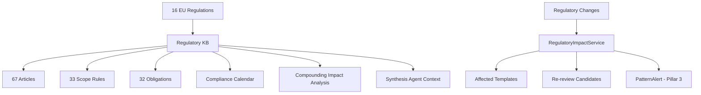

# Regulatory Radar (Pillar 5)

Living regulatory knowledge base with change tracking, impact analysis, and compliance calendar — covering 16 EU regulations.

## Business Value

Regulatory landscape changes constantly. Regulatory Radar provides a structured knowledge base of applicable regulations, tracks changes with retroactive impact analysis, and surfaces upcoming deadlines via a compliance calendar.

## Architecture

## Regulatory Coverage

16 EU regulations seeded: AMLR, AMLA, AMLD IV/V/VI, DSA, CRD, Omnibus, PSD2, SEPA/IPR, VAT/VIES, NIS2, DORA, MiFID II, eIDAS 2.0, BE-PEPPOL.

## Data Model

| Table | Records | Purpose |
|-------|---------|---------|
| `regulations` | 16 | Core regulation metadata |
| `regulatory_articles` | 67 | Individual articles with scope rules |
| `regulatory_obligations` | 32 | Specific compliance obligations |
| `scope_rules` | 33 | Vertical/country applicability rules |
| `regulatory_changes` | 0+ | Change tracking with impact assessment |

## Key Services

- **`regulatory_knowledge_service.py`** — 9 query methods: timeline, calendar, compounding impact, search
- **`regulatory_impact_service.py`** — Change registration, impact analysis, alert pipeline integration
- **`seed_regulatory_kb.py`** — Idempotent seeding of regulations, articles, scope rules, obligations

## Frontend

3-tab Regulatory Radar page at `/dashboard/regulatory`:
- **Timeline** — Chronological regulation overview
- **Calendar** — Upcoming deadlines with countdown
- **Coverage** — Per-regulation compliance coverage

## API Endpoints

| Method | Path | Description |
|--------|------|-------------|
| GET | `/api/regulatory/regulations` | List all regulations |
| GET | `/api/regulatory/articles` | Search/filter articles |
| GET | `/api/regulatory/timeline` | Regulation timeline |
| GET | `/api/regulatory/calendar` | Compliance calendar |
| GET | `/api/regulatory/compounding-impact` | Impact analysis |
| GET | `/api/regulatory/stats` | Knowledge base statistics |
| POST | `/api/regulatory/changes` | Register a change |
| GET | `/api/regulatory/changes` | List changes |
| POST | `/api/regulatory/impact/{change_id}` | Analyze change impact |

## Configuration

- `regulatory_radar_enabled` — Feature flag (default: `true`)
- Alembic migration: `014_regulatory_radar`
