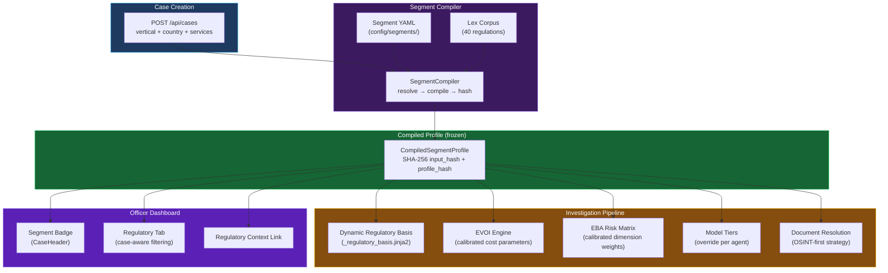
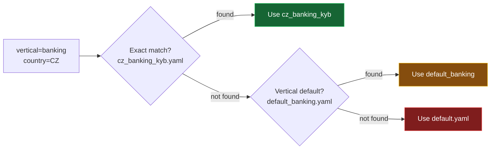

# Regulatory Segments

Regulatory Segments connect three previously isolated layers of Trust Relay into a coherent pipeline: **service catalog** (verticals and services) → **Lex corpus** (regulations and articles) → **investigation pipeline** (prompts, agents, risk calibration, EVOI, document resolution).

Each segment is a declarative YAML profile compiled at case creation time into a frozen, SHA-256 hashed `CompiledSegmentProfile` that tailors every aspect of the investigation to the case's vertical, country, and selected services.

---

## Architecture Overview



---

## Service Catalog — 6 Verticals

The `MASTER_SERVICE_CATALOG` in `app/models/service_catalog.py` defines 6 verticals with 27 services:

| Vertical | Services | Template | Key Regulations |
|----------|----------|----------|----------------|
| **Banking** | Corporate KYB, Correspondent Banking, Trade Finance, Private Banking, Institutional Lending | `banking_kyb_onboarding` | AMLR, CRD IV, AMLD6 |
| **Payments (PSP)** | Payment Processing, Acquiring, AIS, PIS, E-Money | `psp_merchant_onboarding` | AMLR, PSD2 |
| **High-Value Goods** | Precious Metals, Precious Stones, Art & Antiques, Luxury Goods | `hvg_dealer_onboarding` | AMLR Art. 2(1)(f) |
| **Customs** | Direct/Indirect Customs, Fiscal VAT, Warehousing, Excise | `customs_fiscal_representative` | UCC, AMLR, VAT Directive |
| **Professional Services** | Tax Advisory, Accounting, Legal, Audit | `legal_representative_onboarding` | AMLR Art. 3 |
| **Precious Metals Trading** | Retail PM Sales, Legal Entity, Tax Capsule, IBAN VoP | `precious_metals_dealer` | AMLR, Belgian WitWas |

Each service carries a `risk_weight` (0.5–2.0) and `regulatory_refs` (freeform article references).

---

## Segment Profiles — YAML Declaration

Each segment is a YAML file in `config/segments/`. Resolution order when a case is created:



### Profile Library

| Profile | Vertical | Country | EVOI FN Cost | Key Feature |
|---------|----------|---------|-------------|-------------|
| `default.yaml` | general | all | 10,000 (global) | Static regulatory basis fallback |
| `default_banking.yaml` | banking | all | 15,000 | CRD IV governance, financial health enhanced |
| `default_psp.yaml` | payments | all | 12,000 | MCC classification, PSD2 obligations |
| `default_hvg.yaml` | high_value_goods | all | 15,000 | Cash transaction monitoring, source of wealth |
| `default_customs.yaml` | customs | all | 12,000 | UCC establishment, VAT verification |
| `default_professional.yaml` | professional_services | all | 10,000 (global) | Professional body registration |
| `cz_banking_kyb.yaml` | banking | CZ | 20,000 | CZ-AML source of funds, 10-year retention |
| `be_precious_metals.yaml` | precious_metals_trading | BE | 18,000 | WitWas Art. 5/8/26, CTIF-CFI reporting |

---

## Compiled Profile — Audit Trail

The `CompiledSegmentProfile` is frozen (immutable) and carries two SHA-256 hashes:

- **`input_hash`** — SHA-256 of the canonical JSON representation of the source YAML profile
- **`profile_hash`** — SHA-256 of the compiled output (excluding the hash itself)

These satisfy EU AI Act Article 12 (record-keeping): an auditor can verify that a stored compiled profile was produced from a specific YAML input without re-running the compiler.

| EU AI Act Article | Requirement | How Segment Profile Satisfies It |
|-------------------|-------------|----------------------------------|
| Art. 11 | Technical documentation | Profile documents which regulations were applied and why |
| Art. 12 | Record-keeping | `input_hash` + `profile_hash` enable reproducibility |
| Art. 13 | Transparency | Officers see which regulations govern their investigation |
| Art. 14 | Human oversight | `decision_labels` are segment-specific, not generic |

---

## Pipeline Integration

### Dynamic Regulatory Basis

The `_regulatory_basis.jinja2` template renders the segment's regulatory basis table when present:

```

| Verification Task | Regulation | Article | Requirement |

| {{ row.task }} | {{ row.regulation }} | {{ row.article }} | {{ row.requirement }} |


{# Static fallback for cases without segments #}

```

### EVOI Calibration

The `UtilityFunction.with_calibration()` method overrides cost parameters per segment:

- **Default:** `cost_false_negative = 10,000` (50x asymmetry)
- **Banking:** `cost_false_negative = 15,000–20,000` (higher regulatory penalty)
- **Correspondent Banking:** `cost_false_negative = 50,000` (extreme caution)

Higher false-negative costs make the EVOI engine recommend more investigation agents, because the cost of missing a risky entity is higher.

### EBA Risk Calibration

The `apply_risk_calibration()` function multiplies dimension weights by segment-specific factors:

- **CZ Banking:** `geographic_weight_multiplier = 1.2` (Czech jurisdictional risk elevated)
- **HVG Dealers:** `customer_weight_multiplier = 1.3, transaction_weight_multiplier = 1.4` (cash-heavy business model)
- **Customs:** `geographic_weight_multiplier = 1.2` (cross-border risk)

Weights are re-normalized to sum to 1.0 after applying multipliers.

### OSINT-First Document Resolution

When `document_resolution.strategy = "osint_first"`:
1. Check which documents are auto-retrievable for this country (e.g., CZ: incorporation_cert, ubo_declaration)
2. After OSINT investigation, check confidence per document
3. Only request documents where OSINT confidence < threshold (default 0.8)
4. Always request `always_required_docs` (e.g., director_id)

This implements Cedric Neve's feedback: "only request documents OSINT can't find."

---

## Frontend Integration

### Segment Badge (CaseHeader)

The case header displays the segment's vertical and primary regulations as a violet badge:

**Banking · CZ** — AMLR · CZ-AML · CRD IV

### Case-Aware Regulatory Tab

When navigating from a case to `/dashboard/regulatory?vertical=banking&country=CZ`, the regulatory tab auto-filters to show applicable regulations. A context banner indicates the active filter.

### Case Creation

The `CreateCaseDialog` passes the template's `vertical` in `additional_data`, enabling the backend segment compiler to resolve the correct profile.

---

## Key Files

| File | Responsibility |
|------|---------------|
| `app/models/segment_profile.py` | 13 Pydantic models (YAML input + compiled output) |
| `app/services/segment_compiler.py` | YAML loading, segment resolution, Lex resolution, SHA-256 hashing |
| `app/models/service_catalog.py` | 6 verticals, 27 services in `MASTER_SERVICE_CATALOG` |
| `config/segments/*.yaml` | 8 segment profiles (3 defaults + 5 vertical-specific) |
| `app/prompts/templates/_regulatory_basis.jinja2` | Dynamic regulatory basis with static fallback |
| `app/models/evoi.py` | `UtilityFunction.with_calibration()` |
| `app/services/eba_risk_matrix.py` | `apply_risk_calibration()` |
| `app/services/model_tiers.py` | `get_model_for_agent(override_tier=)` |
| `app/services/document_gap_analyzer.py` | `filter_by_osint_coverage()` |

---

## Testing — 45 Tests

| Test File | Tests | What It Verifies |
|-----------|-------|-----------------|
| `test_segment_compiler.py` | 25 | Model parsing, YAML loading, compiler resolution, Lex resolution, hashing |
| `test_segment_deep.py` | 12 | EVOI behavioral impact, risk calibration math, prompt rendering per segment |
| `test_segment_pipeline.py` | 6 | Risk calibration in reassessment, EVOI caution shift, OSINT-first filtering |
| `test_segment_integration.py` | 2 | End-to-end compilation, JSON serialization |
