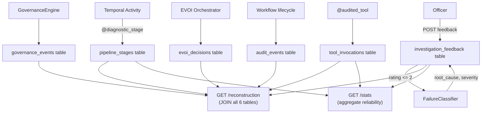
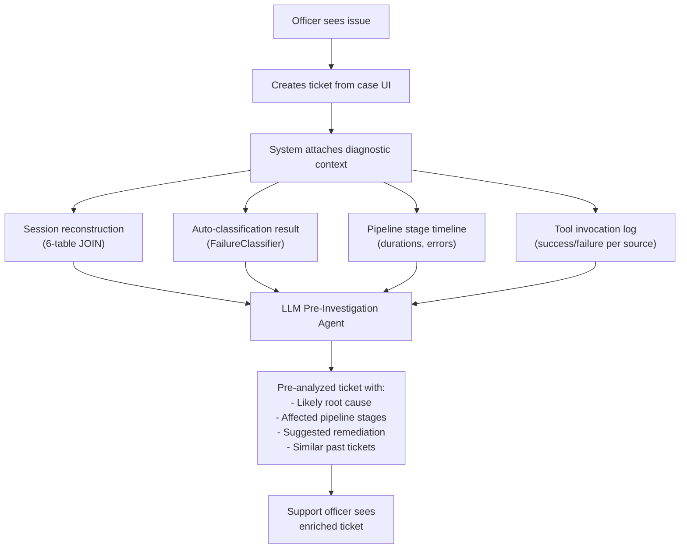

# Session-Based Investigation Diagnostics

Pipeline-level telemetry, officer quality feedback, and automated failure classification -- making every compliance investigation iteration fully reconstructable and diagnosable.

## Business Value

When an investigation produces poor results -- a hallucinated finding, a missing data source, or an incomplete analysis -- the compliance officer currently has no way to understand *why* without digging through logs. Session diagnostics solves this by recording structured telemetry at every pipeline stage and joining it into a single reconstruction view per iteration. Officers can instantly see which stage failed, how long each step took, which OSINT tools were invoked, and what governance checks ran.

Beyond individual case troubleshooting, aggregated diagnostics reveal systemic patterns: a data source that times out 40% of the time, a document type that consistently fails conversion, or an agent that produces low-quality results for a specific country. The automated failure classifier categorizes negative feedback into root causes without LLM calls, enabling proactive infrastructure and configuration fixes.

## Architecture

## Pipeline Stages

The `@diagnostic_stage` decorator automatically records timing, status, and details for each stage. All 12 stages map to the investigation pipeline:

| Seq | Stage Name | Temporal Activity | Details Captured |
|-----|-----------|-------------------|-----------------|
| 1 | `portal_upload` | Document upload signal | File count, total size |
| 2 | `doc_processing` | `process_documents` | Docling conversion results |
| 3 | `doc_validation` | `validate_documents` | Required vs. uploaded docs |
| 4 | `osint_investigation` | `run_osint_investigation` | Agent results, sources consulted |
| 5 | `mcc_classification` | `classify_mcc` | MCC code, confidence |
| 6 | `risk_assessment` | `assess_risk` | Risk score, red flags |
| 7 | `task_generation` | `generate_follow_up_tasks` | Task count, categories |
| 8 | `confidence_scoring` | `score_confidence` | 4-dimension scores |
| 9 | `red_flag_evaluation` | `evaluate_red_flags` | Flags triggered, actions |
| 10 | `synthesis` | `synthesize_report` | Report length, key findings |
| 11 | `automation_tier` | `assign_automation_tier` | Tier assigned, reason |
| 12 | `officer_review` | Officer decision signal | Decision, follow-up tasks |

Each stage record includes: `status` (success/failed), `duration_ms`, `details` (JSONB), `error_type` (on failure), and `parent_stage_id` (for sub-stage nesting).

## Failure Taxonomy

The `FailureClassifier` is a deterministic, rule-based engine (no LLM calls) that classifies negative feedback (rating 1-2) into root causes. Priority-ordered evaluation -- first match wins:

| Priority | Root Cause | Severity | Trigger | Suggested Action |
|----------|-----------|----------|---------|-----------------|
| 1 | `llm_hallucination` | high | Officer selects "hallucination" category | Review evidence bundles for ungrounded claims |
| 1 | `extraction_failure` | high | Officer selects "wrong_entity" category | Check entity extraction and registration number matching |
| 1 | `investigation_incomplete` | medium | Officer selects "missing_source" or "incomplete" | Review template requirements vs. sources consulted |
| 1 | `data_staleness` | medium | Officer selects "outdated_data" category | Check cache TTLs and data freshness policies |
| 2 | `document_unreadable` | medium | `doc_processing` stage failed | Check document format; verify Docling compatibility |
| 2 | `missing_document` | medium | `doc_validation` stage failed | Verify required documents list in template |
| 3 | `source_timeout` | low | Tool invocation failed with timeout error | Retry investigation; check source response times |
| 3 | `source_unavailable` | low | Tool invocation failed with connection/HTTP error | Check endpoint availability and API credentials |
| 4 | `investigation_incomplete` | medium | Fewer than 3 OSINT sources succeeded | Review agent configuration and source availability |
| 5 | `unknown` | low | No rule matched | Manual review required |

## Session Reconstruction

The reconstruction endpoint (`GET /diagnostics/{case_id}/iterations/{n}`) joins across all 6 telemetry tables to produce a complete investigation session view:

| Table | Key Columns | Join Key |
|-------|------------|----------|
| `pipeline_stages` | stage, sequence, status, duration_ms, details, error_type | case_id (UUID) + iteration |
| `tool_invocations` | agent_name, tool_name, cost_category, duration_ms, success, cost_eur | case_id (VARCHAR) + iteration |
| `audit_events` | event_type, details | case_id (VARCHAR), case-level |
| `governance_events` | event_type, mechanism, agent_name, approved, violations | case_id (VARCHAR) + iteration |
| `evoi_decisions` | step_number, decision_type, candidate_agent, evoi_value, decision | case_id (VARCHAR) + iteration |
| `investigation_feedback` | officer_id, rating, categories, root_cause, severity | case_id (UUID) + iteration |

The response includes `total_duration_ms` computed as the sum of all stage durations.

## Integration Points

- **Pillar 1 (Confidence Scoring)** -- Stage 8 (`confidence_scoring`) records the 4-dimension confidence breakdown. Low confidence scores correlate with negative feedback, enabling calibration via `CalibrationService`.
- **Pillar 3 (Cross-Case Patterns)** -- Aggregated failure patterns from `GET /stats` feed into `PatternEngine` to detect systemic issues (e.g., a source failing across multiple cases).
- **Pillar 4 (Supervised Autonomy)** -- Stage 11 (`automation_tier`) records the tier assignment. Negative feedback on auto-processed cases triggers tier downgrade via rolling window analysis.
- **Audit compliance** -- All telemetry tables include `tenant_id` and `created_at` for multi-tenant isolation and retention compliance.

## Configuration

| Setting | Type | Default | Description |
|---------|------|---------|-------------|
| `diagnostics_enabled` | bool | `true` | Master feature flag. When false, all recording and API endpoints are disabled. |
| `diagnostics_auto_classify` | bool | `true` | Automatically run `FailureClassifier` when an officer submits feedback with rating 1-2. |
| `diagnostics_feedback_prompt` | bool | `true` | Prompt officers to provide quality feedback after reviewing investigation results. |

All three flags are set via environment variables or `.env` file, managed by `pydantic-settings` in `app/config.py`.

## Planned: Context-Enriched Support Tickets

The session diagnostics system captures the richest investigation context in the platform — 12 pipeline stages, tool invocations, governance checks, EVOI decisions, and officer feedback, all joinable into a single reconstruction. This context is the foundation for a support ticket system where issues are pre-investigated before a support officer ever sees them.

### The Vision

When an officer encounters a problem — a hallucinated finding, a missing data source, a failed document conversion — they should be able to create a support ticket directly from the case interface. The ticket automatically inherits the full diagnostic context for that iteration:

### Why This Matters

Traditional support systems require the user to describe the problem, the support engineer to reproduce it, and both to spend time on context that the system already has. With session diagnostics, the platform knows:

- **What failed** — which pipeline stage, which tool invocation, which data source
- **Why it likely failed** — the FailureClassifier's deterministic root cause analysis
- **What the officer saw** — the investigation results, confidence scores, and red flags at the time of the issue
- **What the system was doing** — EVOI decisions, governance checks, agent execution order

An LLM pre-investigation agent can analyze this context and produce a structured summary: "The adverse media agent timed out after 45s on the BrightData source, causing incomplete OSINT results. This matches 3 similar incidents in the past 7 days, all involving Belgian entities with gazette lookups. Suggested action: check BrightData API status and increase timeout from 30s to 60s for gazette queries."

The support officer sees a pre-analyzed ticket with context, root cause hypothesis, and suggested remediation — not a blank form with "investigation results were wrong."

### What Exists Today

- **Session reconstruction** — full 6-table JOIN producing complete iteration context
- **Auto-classification** — deterministic root cause analysis on negative feedback (rating 1-2)
- **Alert generation** — significant classifications create `DIAGNOSTIC_FINDING` pattern alerts
- **Officer feedback UI** — star rating + category chips + free-text comment

### What Remains to Build

- **Ticket creation UI** — button in case detail view to create a support ticket with pre-attached context
- **Support ticket data model** — `support_tickets` table with priority, assignee, SLA tracking, resolution workflow
- **LLM pre-investigation agent** — PydanticAI agent that analyzes the diagnostic reconstruction and produces structured root cause analysis with remediation suggestions
- **Support dashboard** — queue view for support officers with pre-analyzed tickets, filtered by severity and root cause category
- **Cross-ticket pattern detection** — aggregate analysis of support tickets to surface systemic infrastructure issues (e.g., "BrightData timeout rate increased 300% this week")

---

## Design Principles

- **Guard-and-swallow** -- Diagnostic failures never break application code. Every recording function catches exceptions at the boundary and logs at DEBUG level.
- **Fire-and-forget** -- Stage recording happens in the `finally` block of the `@diagnostic_stage` decorator, ensuring timing is captured even on failure.
- **No LLM dependency** -- The `FailureClassifier` is purely rule-based, avoiding cost and latency for a system-health concern. The planned LLM pre-investigation runs asynchronously on the ticket, not in the investigation pipeline.
- **Cumulative telemetry** -- Reconstruction joins across tables from different subsystems (Pillar 3.5 tool audit, Pillar 4 governance, EVOI) without requiring those systems to know about diagnostics.
