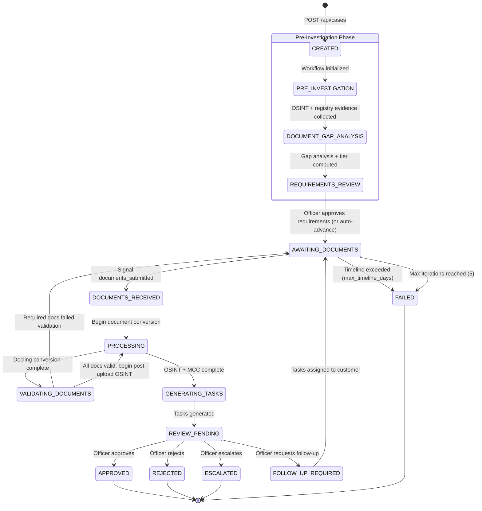

# Case Status State Machine

Every compliance case follows a deterministic state machine managed by the Temporal workflow. The workflow enforces valid transitions and logs every state change to the audit trail.

## State Diagram



## State Definitions

| Status | Description | Triggered By |
|--------|-------------|-------------|
| `CREATED` | Case record exists in PostgreSQL, Temporal workflow starting | `POST /api/cases` |
| `PRE_INVESTIGATION` | OSINT investigation runs before document collection -- registry agents fetch official documents (KBO, NBB, INPI, ARES), OSINT sources are queried, evidence is gathered and cross-referenced | Workflow initialization |
| `DOCUMENT_GAP_ANALYSIS` | System computes which documents the customer actually needs to provide by analyzing what was auto-retrieved from registries, what OSINT found, and what gaps remain against the template requirements. Risk-adaptive automation tier is computed. | After pre-investigation completes |
| `REQUIREMENTS_REVIEW` | Officer reviews computed document requirements before the portal opens. Behavior depends on the automation tier (see [Requirements Review Gate](#requirements-review-gate) below). | After gap analysis completes |
| `AWAITING_DOCUMENTS` | Waiting for customer to upload documents via portal. Portal shows only the documents that could not be auto-retrieved. | Requirements approved (or auto-advanced), or follow-up loop |
| `DOCUMENTS_RECEIVED` | Customer submitted documents, processing about to begin | `documents_submitted` signal from portal |
| `PROCESSING` | Active processing -- Docling conversion or post-upload OSINT investigation running | Internal workflow transition |
| `VALIDATING_DOCUMENTS` | AI agent validating uploaded documents against requirements | After Docling conversion |
| `GENERATING_TASKS` | AI agent analyzing investigation results to suggest follow-up tasks | After OSINT + MCC classification |
| `REVIEW_PENDING` | All automated processing complete, waiting for officer decision | After task generation |
| `FOLLOW_UP_REQUIRED` | Officer requested additional information from customer | Officer `follow_up` decision |
| `APPROVED` | Case approved by compliance officer (terminal) | Officer `approve` decision |
| `REJECTED` | Case rejected by compliance officer (terminal) | Officer `reject` decision |
| `ESCALATED` | Case escalated for senior review (terminal) | Officer `escalate` decision |
| `FAILED` | Case failed due to timeout or max iterations (terminal) | Timeline exceeded or iteration limit |

## Terminal States

Four states are terminal -- the workflow completes and no further transitions occur:

- **APPROVED** -- Compliance requirements met, customer cleared
- **REJECTED** -- Compliance requirements not met, customer denied
- **ESCALATED** -- Case requires senior compliance officer review
- **FAILED** -- Administrative failure (timeout or iteration limit reached)

## Pre-Investigation Phase

The pre-investigation phase is the key architectural change introduced in [ADR-0018](/docs/adr/0018-dynamic-document-requirements) (Dynamic Document Requirements). Instead of opening the portal with a static list of required documents, the system first runs an OSINT investigation to determine what it can already retrieve automatically from government registries and public sources.

```
CREATED -> PRE_INVESTIGATION -> DOCUMENT_GAP_ANALYSIS -> REQUIREMENTS_REVIEW -> AWAITING_DOCUMENTS
```

### PRE_INVESTIGATION

During this state, the system:

1. Runs all applicable registry agents (KBO, NBB, INPI, ARES, etc.) based on the company's country
2. Downloads official documents (PDFs, financial statements) directly from registries and stores them in MinIO
3. Runs OSINT data collection (sanctions, PEP, adverse media, web presence)
4. Cross-references all gathered data points (addresses, directors, legal form, capital) to detect discrepancies

### DOCUMENT_GAP_ANALYSIS

After evidence collection, the system:

1. Compares auto-retrieved evidence against the template's document requirements
2. Identifies which requirements are already satisfied by registry data
3. Computes which documents the customer must still provide (typically just Director ID)
4. Classifies discrepancies by severity (LOW, MEDIUM, HIGH)
5. Computes the automation tier for the requirements review gate

### Requirements Review Gate

The `REQUIREMENTS_REVIEW` state implements a risk-adaptive gate controlled by the automation tier. The tier is computed per-case based on risk signals detected during pre-investigation:

| Condition | Tier | Gate Behavior |
|-----------|------|---------------|
| No HIGH discrepancies, EBA risk LOW/MEDIUM, no PEP, no adverse events | **AUTONOMOUS** | Portal opens immediately -- no officer wait |
| Minor discrepancies OR EBA risk MEDIUM-HIGH | **ASSISTED** | Portal opens after 15-minute auto-release if officer does not act |
| ANY: PEP detected, adverse events, complex ownership, EBA HIGH/VERY_HIGH | **FULL_REVIEW** | Workflow waits indefinitely for officer signal |
| Tenant-level override set to FULL_REVIEW | **FULL_REVIEW** | Always -- for regulated clients |

The tier is computed upward only: a per-case computation can escalate above the tenant default but never relax below it. If risk assessment or gap analysis fails, the system defaults to `FULL_REVIEW` (fail-safe).

At the `FULL_REVIEW` gate, the officer sees:

- All pre-gathered evidence and registry documents
- Cross-reference results with discrepancy highlights
- The proposed document list for the customer
- Risk assessment summary

The officer can add, remove, or modify requirements and add custom notes for the customer before the portal opens.

## The Iteration Loop

The core compliance loop operates between `AWAITING_DOCUMENTS` and `REVIEW_PENDING`:

```
AWAITING_DOCUMENTS -> DOCUMENTS_RECEIVED -> PROCESSING -> VALIDATING_DOCUMENTS
    -> PROCESSING -> GENERATING_TASKS -> REVIEW_PENDING -> [decision]
```

If the officer selects "Follow-up", the workflow transitions through `FOLLOW_UP_REQUIRED` back to `AWAITING_DOCUMENTS` with a new set of tasks for the customer. This loop can repeat up to `max_iterations` times (default: 5).

### Validation Bounce-Back

A special sub-loop exists within the iteration: if document validation fails (e.g., the customer uploaded a bank statement instead of a certificate of incorporation), the workflow automatically generates re-upload tasks and returns to `AWAITING_DOCUMENTS` without reaching the officer. This is tracked in the audit log as a `validation_bounce_back` event.

## Guards and Timeouts

| Guard | Default | Behavior |
|-------|---------|----------|
| `max_iterations` | 5 | Workflow transitions to FAILED after 5 complete iterations |
| `max_timeline_days` | 60 | If no documents submitted within the timeline, workflow fails |
| Document validation | per-template | Required documents must pass AI validation to proceed |
| Requirements review | per-case tier | AUTONOMOUS: immediate, ASSISTED: 15min auto-release, FULL_REVIEW: indefinite wait |

## Audit Trail

Every state transition generates an audit event with:

```json
{
  "event_type": "status_changed",
  "details": { "to": "PRE_INVESTIGATION" },
  "timestamp": "2026-04-02T10:30:00Z"
}
```

Additional audit events are logged for:

- `case_created` -- Initial case creation
- `pre_investigation_started` -- OSINT and registry collection began
- `pre_investigation_completed` -- All pre-investigation evidence gathered
- `gap_analysis_completed` -- Document requirements computed with automation tier
- `requirements_approved` -- Officer approved requirements (FULL_REVIEW) or auto-advanced (AUTONOMOUS/ASSISTED)
- `documents_received` -- Customer submitted documents
- `investigation_completed` -- OSINT pipeline finished
- `mcc_classified` -- MCC code assigned
- `tasks_generated` -- Follow-up tasks created
- `officer_decision` -- Officer action with decision type and reason
- `validation_bounce_back` -- Documents failed validation, auto-looping
- `mcc_reclassified` -- Officer manually changed MCC code
- `timeline_exceeded` -- Case timed out
- `max_iterations_reached` -- Iteration limit hit
- `follow_up_requested` -- Officer sent case back to customer

## Implementation

The state machine is implemented directly in the Temporal workflow class (`ComplianceCaseWorkflow`). States are stored as a string enum value in `self.status`. The workflow uses Temporal's `wait_condition` for blocking waits (document submission, officer decision, requirements review) and standard control flow (`while`, `if/elif`) for state transitions.

The pre-investigation phase is implemented via three activities:

- `run_pre_investigation` -- orchestrates registry agents and OSINT collection
- `run_document_gap_analysis` -- computes coverage, gaps, and automation tier
- `wait_for_requirements_approval` -- implements the tier-based gate logic

See [ADR-0018](/docs/adr/0018-dynamic-document-requirements) for the architectural rationale and [Temporal Workflows](/docs/architecture/temporal-workflows) for implementation details.
