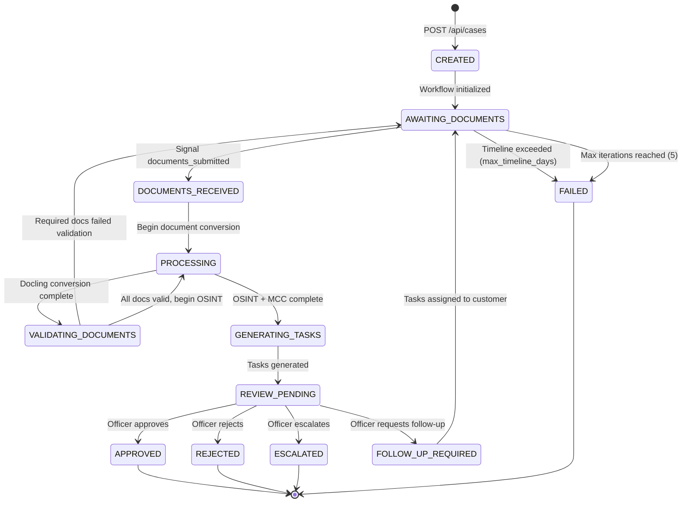

# Case Status State Machine

Every compliance case follows a deterministic state machine managed by the Temporal workflow. The workflow enforces valid transitions and logs every state change to the audit trail.

## State Diagram



## State Definitions

| Status | Description | Triggered By |
|--------|-------------|-------------|
| `CREATED` | Case record exists in PostgreSQL, Temporal workflow starting | `POST /api/cases` |
| `AWAITING_DOCUMENTS` | Waiting for customer to upload documents via portal | Workflow initialization, or follow-up loop |
| `DOCUMENTS_RECEIVED` | Customer submitted documents, processing about to begin | `documents_submitted` signal from portal |
| `PROCESSING` | Active processing -- Docling conversion or OSINT investigation running | Internal workflow transition |
| `VALIDATING_DOCUMENTS` | AI agent validating uploaded documents against requirements | After Docling conversion |
| `GENERATING_TASKS` | AI agent analyzing investigation results to suggest follow-up tasks | After OSINT + MCC classification |
| `REVIEW_PENDING` | All automated processing complete, waiting for officer decision | After task generation |
| `FOLLOW_UP_REQUIRED` | Officer requested additional information from customer | Officer `follow_up` decision |
| `APPROVED` | Case approved by compliance officer (terminal) | Officer `approve` decision |
| `REJECTED` | Case rejected by compliance officer (terminal) | Officer `reject` decision |
| `ESCALATED` | Case escalated for senior review (terminal) | Officer `escalate` decision |
| `FAILED` | Case failed due to timeout or max iterations (terminal) | Timeline exceeded or iteration limit |

## Terminal States

Four states are terminal -- the workflow completes and no further transitions occur:

- **APPROVED** -- Compliance requirements met, customer cleared
- **REJECTED** -- Compliance requirements not met, customer denied
- **ESCALATED** -- Case requires senior compliance officer review
- **FAILED** -- Administrative failure (timeout or iteration limit reached)

## The Iteration Loop

The core compliance loop operates between `AWAITING_DOCUMENTS` and `REVIEW_PENDING`:

```
AWAITING_DOCUMENTS -> DOCUMENTS_RECEIVED -> PROCESSING -> VALIDATING_DOCUMENTS
    -> PROCESSING -> GENERATING_TASKS -> REVIEW_PENDING -> [decision]
```

If the officer selects "Follow-up", the workflow transitions through `FOLLOW_UP_REQUIRED` back to `AWAITING_DOCUMENTS` with a new set of tasks for the customer. This loop can repeat up to `max_iterations` times (default: 5).

### Validation Bounce-Back

A special sub-loop exists within the iteration: if document validation fails (e.g., the customer uploaded a bank statement instead of a certificate of incorporation), the workflow automatically generates re-upload tasks and returns to `AWAITING_DOCUMENTS` without reaching the officer. This is tracked in the audit log as a `validation_bounce_back` event.

## Guards and Timeouts

| Guard | Default | Behavior |
|-------|---------|----------|
| `max_iterations` | 5 | Workflow transitions to FAILED after 5 complete iterations |
| `max_timeline_days` | 60 | If no documents submitted within the timeline, workflow fails |
| Document validation | per-template | Required documents must pass AI validation to proceed |

## Audit Trail

Every state transition generates an audit event with:

```json
{
  "event_type": "status_changed",
  "details": { "to": "PROCESSING" },
  "timestamp": "2026-02-24T10:30:00Z"
}
```

Additional audit events are logged for:

- `case_created` -- Initial case creation
- `documents_received` -- Customer submitted documents
- `investigation_completed` -- OSINT pipeline finished
- `mcc_classified` -- MCC code assigned
- `tasks_generated` -- Follow-up tasks created
- `officer_decision` -- Officer action with decision type and reason
- `validation_bounce_back` -- Documents failed validation, auto-looping
- `mcc_reclassified` -- Officer manually changed MCC code
- `timeline_exceeded` -- Case timed out
- `max_iterations_reached` -- Iteration limit hit
- `follow_up_requested` -- Officer sent case back to customer

## Implementation

The state machine is implemented directly in the Temporal workflow class (`ComplianceCaseWorkflow`). States are stored as a string enum value in `self.status`. The workflow uses Temporal's `wait_condition` for blocking waits (document submission, officer decision) and standard control flow (`while`, `if/elif`) for state transitions.

See [Temporal Workflows](/docs/architecture/temporal-workflows) for implementation details.
