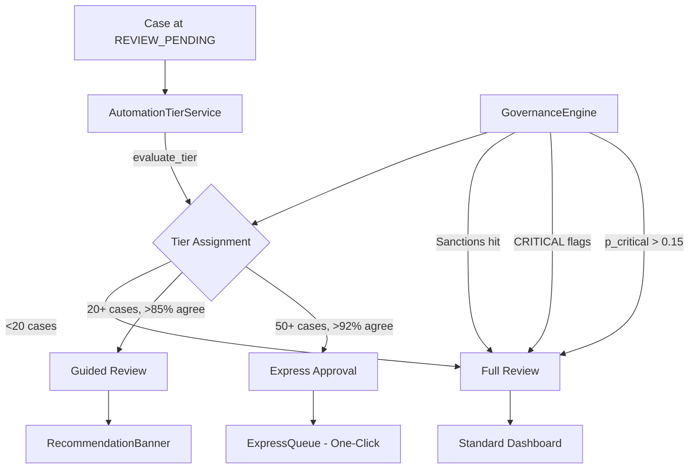

# Supervised Autonomy (Pillar 4)

Earned trust through demonstrated competence — 3-tier automation that adapts review depth based on officer track record.

## Business Value

Experienced officers shouldn't review every case identically. Supervised Autonomy earns automation tiers per (officer, template, country) based on calibration history, reducing review time for predictable cases while maintaining full scrutiny for novel risks.

## Architecture

## 3-Tier Model

| Tier | Requirements | UX |
|------|-------------|-----|
| Full Review | Default (< 20 cases) | Standard case detail |
| Guided Review | 20+ cases, > 85% agreement rate | RecommendationBanner with AI suggestion |
| Express Approval | 50+ cases, > 92% agreement rate | One-click approval in ExpressQueue |

Tiers are earned per **(officer_id, template_id, country)** composite key — granular trust.

## Safety Net

GovernanceEngine can **override** any tier:
- Sanctions proximity → always FULL_REVIEW
- CRITICAL risk flags → always FULL_REVIEW
- p_critical > 0.15 → always FULL_REVIEW
- HIGH risk + Express → downgrade to GUIDED

Compliance Manager can force/release tiers via API.

## Key Components

- **`automation_tier_service.py`** — Tier computation, assignment, rolling window downgrade
- **`automation_tier.py`** — Data models
- **`automation.py`** — 5 API endpoints
- **`ExpressQueue.tsx`** — One-click approval cards
- **`TierBadge.tsx`** — Colored tier indicators
- **`RecommendationBanner.tsx`** — AI recommendation display

## API Endpoints

| Method | Path | Description |
|--------|------|-------------|
| GET | `/api/automation/tiers` | List all tiers |
| GET | `/api/automation/tiers/{template}/{country}` | Get specific tier |
| POST | `/api/automation/override` | Force tier (Compliance Manager) |
| DELETE | `/api/automation/override/{template}/{country}` | Release override |
| GET | `/api/automation/stats` | Automation statistics |

## Configuration

- `automation_audit_mode` — When true, logs tier decisions but doesn't automate
- Alembic migrations: `012_automation_tiers`, `013_signal_events_nullable_case_id`
