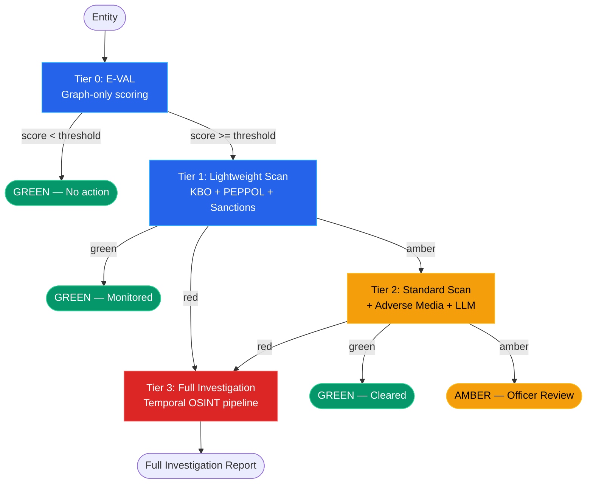
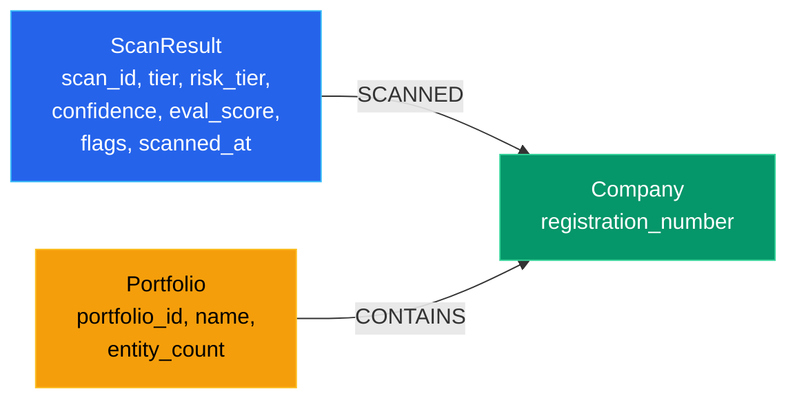
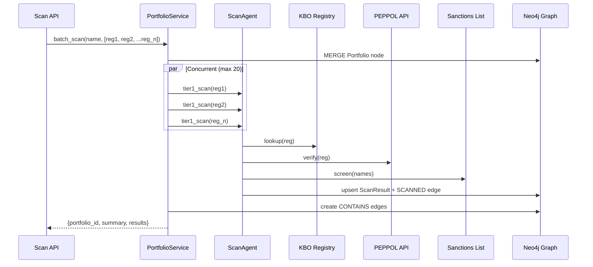
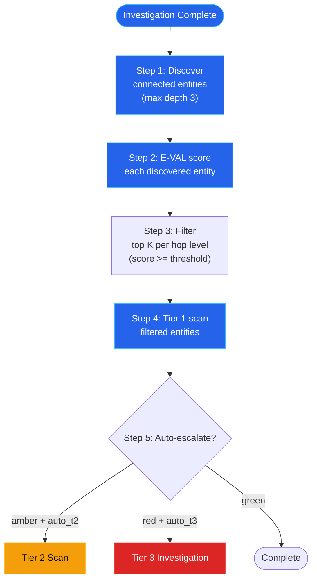
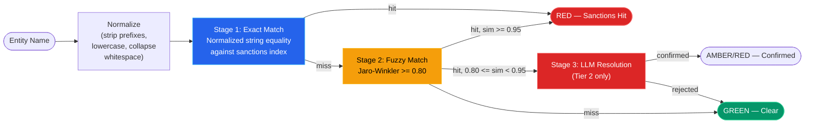

# Tiered Scanning Architecture

TrustRelay implements a **four-tier scanning model** that balances investigation depth against cost, latency, and LLM usage. Each tier builds on the previous one, and entities can be escalated from lighter tiers to deeper tiers based on risk signals. The architecture is designed for three entry points: investigation-time discovery, portfolio batch scanning, and continuous monitoring (deferred).

---

## Four-Tier Model

| Tier | Name | Data Sources | LLM Calls | Latency | Cost/Entity | Risk Output |
|------|------|-------------|-----------|---------|-------------|-------------|
| **0** | E-VAL | Neo4j graph only | 0 | < 100ms | $0.00 | `eval_score` (0.0--1.0) |
| **1** | Lightweight Scan | KBO + PEPPOL + sanctions list | 0 | 2--8s | ~$0.01 | green / amber / red + flags |
| **2** | Standard Scan | Tier 1 + adverse media + LLM synthesis | 1--2 | 10--20s | ~$0.05 | green / amber / red + narrative |
| **3** | Full Investigation | Existing OSINT pipeline via Temporal | 5+ | 60--160s | ~$0.50 | Full investigation report |

### Tier 0: E-VAL (Graph-Only Risk Scoring)

Pure graph traversal. Answers the question: *"How suspicious is this entity based on what we already know?"* Computes a score from six weighted signals without any external API calls or LLM invocations. Designed for bulk screening of thousands of entities in seconds.

**Source:** `app/services/graph_service.py` -- `compute_eval_score()`

### Tier 1: Lightweight Scan

Queries three external data sources with zero LLM involvement:

1. **KBO/BCE Registry** -- company status, legal name, NACE codes, directors, establishments
2. **PEPPOL Verification** -- directory registration, inhoudingsplicht (tax/social debt)
3. **Sanctions Screening** -- exact match (normalized string equality) + fuzzy match (Jaro-Winkler similarity >= 0.80)

Produces a `ScanResult` with structured flags (`SANCTIONS_HIT`, `WITHHOLDING_OBLIGATIONS`, `COMPANY_INACTIVE`, etc.) and a risk tier determination. Results are persisted as `ScanResult` nodes in the knowledge graph.

**Source:** `app/agents/scan_agent.py` -- `ScanAgent.tier1_scan()`

### Tier 2: Standard Scan

Extends Tier 1 with two additional capabilities:

1. **Adverse Media Search** -- searches news and media sources for negative coverage of the entity
2. **LLM Synthesis** -- a PydanticAI agent produces a human-readable risk narrative from the combined Tier 1 + adverse media data
3. **Sanctions LLM Resolution** -- ambiguous fuzzy matches (similarity 0.80--0.95) are sent to an LLM resolver agent to confirm or reject

The LLM synthesis call is the primary cost driver. Adverse media hits that return results add ~$0.03 to the per-entity cost.

**Source:** `app/agents/scan_agent.py` -- `ScanAgent.tier2_scan()`, `app/agents/scan_synthesis_agent.py`

### Tier 3: Full Investigation

Delegates to the existing Temporal-based OSINT investigation pipeline. Creates a compliance case, starts a `ComplianceCaseWorkflow`, and runs the full agent DAG (document validation, registry agent, person validation, adverse media, synthesis, MCC classification, task generation). This is the same pipeline used for case-driven investigations.

Tier 3 is triggered via the scan API but executes as a standard compliance workflow. The scan endpoint creates the case in PostgreSQL, starts the Temporal workflow, and returns the `workflow_id` for status tracking.

**Source:** `app/api/scan.py` -- `_create_tier3_case()`

---

## Tier Escalation Flow



Escalation can be automatic (via `RecursiveDiscoveryService` configuration) or manual (officer triggers escalation through the API).

---

## E-VAL Formula

The Entity Valuation and Assessment Layer (E-VAL) computes a risk score from six graph-derived signals, each with a configurable weight:

```
E-VAL = w_shared * shared_connections_score
      + w_degree * graph_degree_score
      + w_inv    * cross_investigation_score
      + w_risk   * country_risk_score
      + w_rel    * relationship_type_score
      - w_prior  * prior_clean_scan_score
```

### Default Weights

| Signal | Weight | Description | Normalization |
|--------|--------|-------------|---------------|
| `shared_connections` | 0.25 | Number of shared graph neighbors with the target entity | `min(count / max(count, 1), 1.0)` |
| `cross_investigations` | 0.25 | Number of prior investigations targeting this entity | `min(count / 5, 1.0)` |
| `country_risk` | 0.20 | Country-level risk score stored on the entity node | Raw value (0.0--1.0) |
| `graph_degree` | 0.15 | Total relationship count in the graph | `min(degree / 10, 1.0)` |
| `relationship_type` | 0.10 | Weight based on the type of relationship to the target | Fixed 0.5 (placeholder for future per-type weights) |
| `prior_scan_recency` | 0.05 | **Subtractive** -- reduces score if a recent clean scan exists | 1.0 if prior green scan, else 0.0 |

The final score is clamped to `[0.0, 1.0]`. An E-VAL score at or above the configurable threshold (default `0.3`) triggers a Tier 1 scan in the recursive discovery flow.

### Weight Overrides

Weights can be overridden per-call via the `weights` parameter:

```python
eval_result = await scan_agent.tier0_eval(
    registration_number="0123456789",
    target_reg="0987654321",
    weights={
        "shared_connections": 0.40,
        "country_risk": 0.30,
        "graph_degree": 0.10,
        "cross_investigations": 0.10,
        "relationship_type": 0.05,
        "prior_scan_recency": 0.05,
    },
)
```

**Source:** `app/services/graph_service.py` -- `_DEFAULT_EVAL_WEIGHTS`, `compute_eval_score()`

---

## ScanResult Data Model

The `ScanResult` model captures the output of Tier 1 and Tier 2 scans. All fields are populated progressively -- Tier 1 fills the registry and sanctions fields, Tier 2 adds adverse media and synthesis.

```python
class ScanResult(BaseModel):
    # Identity
    scan_id: str                        # e.g. "scan-0123456789-t1-20260227143000"
    registration_number: str            # Belgian enterprise number
    tier: int                           # 0, 1, 2, or 3
    risk_tier: str = "green"            # "green" | "amber" | "red"
    confidence: float                   # 0.0-1.0 (0.8 with KBO data, 0.3 without)

    # Tier 0
    eval_score: float = 0.0             # E-VAL graph-based risk score

    # Tier 1: Registry data
    company_status: str = ""            # e.g. "active", "ceased", "bankrupt"
    legal_name: str = ""                # Official company name from KBO
    nace_codes: list[str] = []          # NACE activity codes
    director_count: int = 0             # Number of directors found
    ubo_count: int = 0                  # Number of UBOs found
    sanctions_exact_matches: int = 0    # Normalized string equality matches
    sanctions_fuzzy_matches: int = 0    # Jaro-Winkler >= 0.80 matches
    peppol_registered: bool = False     # In PEPPOL e-invoicing directory
    withholding_obligations: bool = False  # Tax or social debt detected
    tax_debt_detected: bool = False     # Belgian tax authority debt
    social_debt_detected: bool = False  # Belgian social security debt

    # Tier 2: Media + synthesis
    adverse_media_hits: int = 0         # Count of adverse signals
    adverse_media_summary: str = ""     # Human-readable summary
    synthesis_summary: str = ""         # LLM-generated risk narrative

    # Metadata
    flags: list[str] = []               # Machine-readable flags
    scan_cost_cents: int = 0            # Actual cost in cents
    scanned_at: datetime | None = None  # Scan timestamp (UTC)
    cached: bool = False                # True if served from graph cache
```

### Possible Flags

| Flag | Trigger | Tier |
|------|---------|------|
| `SANCTIONS_HIT` | Exact sanctions match found | 1+ |
| `SANCTIONS_FUZZY` | Fuzzy sanctions match (no exact) | 1+ |
| `WITHHOLDING_OBLIGATIONS` | Tax or social debt via PEPPOL inhoudingsplicht | 1+ |
| `COMPANY_INACTIVE` | Company status is ceased/dissolved/bankrupt | 1+ |
| `KBO_UNAVAILABLE` | KBO lookup failed or returned null | 1+ |
| `PEPPOL_UNAVAILABLE` | PEPPOL verification failed | 1+ |
| `ADVERSE_MEDIA_FOUND` | Adverse media hits > 0 | 2 |
| `ADVERSE_MEDIA_UNAVAILABLE` | Adverse media search failed | 2 |

**Source:** `app/models/scan.py`

---

## Graph Integration

Scan results are stored as nodes in the Neo4j knowledge graph, creating a persistent, queryable record of every scan ever performed.

### Graph Schema



**Node types:**

| Node | Primary Key | Created By |
|------|-------------|------------|
| `ScanResult` | `scan_id` | `ScanAgent.tier0_eval()`, `tier1_scan()`, `tier2_scan()` |
| `Company` | `registration_number` | `MERGE` on first scan |
| `Portfolio` | `portfolio_id` | `PortfolioService.batch_scan()` |

**Relationship types:**

| Relationship | From | To | Meaning |
|-------------|------|-----|---------|
| `SCANNED` | `ScanResult` | `Company` | This scan result assessed this company |
| `CONTAINS` | `Portfolio` | `Company` | This company is in this portfolio |

### Cache via Graph

Tier 1 scans check the graph for a recent, non-stale `ScanResult` before performing a fresh scan. The cache check queries:

```cypher
MATCH (s:ScanResult)-[:SCANNED]->(c:Company {registration_number: $reg})
WHERE s.tier >= $min_tier
  AND (s.stale_after IS NULL OR s.stale_after > datetime())
RETURN properties(s)
ORDER BY s.scanned_at DESC LIMIT 1
```

A cache hit returns `cached: true` in the result. The `force` parameter on `tier1_scan()` bypasses the cache.

**Source:** `app/services/graph_service.py` -- `upsert_scan_result()`, `get_latest_scan_result()`, `get_scan_results()`

---

## Portfolio Batch Scanning

The `PortfolioService` orchestrates batch Tier 1 scans across a portfolio of entities with rate-limited concurrency.

### Architecture



### Concurrency Control

The service uses an `asyncio.Semaphore` with a configurable limit (default 20) to prevent overwhelming external APIs:

```python
self._semaphore = asyncio.Semaphore(max_concurrent)

async def _scan_one(self, registration_number: str) -> dict | None:
    async with self._semaphore:
        result = await self._scan_agent.tier1_scan(registration_number)
        return result.model_dump()
```

All scans run via `asyncio.gather()`, so a portfolio of 100 entities with `max_concurrent=20` processes in 5 waves.

### Response Format

```json
{
    "portfolio_id": "portfolio-a1b2c3d4e5f6",
    "portfolio_name": "Q1 2026 Merchant Portfolio",
    "total_entities": 100,
    "scanned": 97,
    "failed": 3,
    "summary": {"green": 82, "amber": 12, "red": 3},
    "results": [...]
}
```

**Source:** `app/services/portfolio_service.py`, `app/api/scan.py` -- `POST /scan/portfolio`

---

## Recursive Discovery

After a full OSINT investigation completes (Tier 3), the `RecursiveDiscoveryService` traverses the knowledge graph to find connected entities, scores them with E-VAL, and auto-scans the highest-risk ones.



### Configuration

| Parameter | Default | Description |
|-----------|---------|-------------|
| `max_depth` | 3 | Maximum graph traversal depth |
| `max_entities_per_level` | 10 | Top K entities scanned per hop distance |
| `eval_threshold` | 0.3 | Minimum E-VAL score to trigger Tier 1 scan |
| `auto_escalate_to_tier2` | `False` | Auto-escalate amber results to Tier 2 |
| `auto_escalate_to_tier3` | `False` | Auto-escalate red results to Tier 3 |

**Source:** `app/services/recursive_discovery_service.py`

---

## Three Entry Points

### 1. Investigation-Time Discovery

Triggered after a Tier 3 full investigation completes. The recursive discovery engine finds connected entities in the graph and scans the highest-risk ones automatically.

**Flow:** Investigation completes --> graph populated with entities/relationships --> `RecursiveDiscoveryService.discover_and_scan()` --> Tier 1 scans + optional auto-escalation

### 2. Portfolio Batch Scanning

Triggered by a compliance officer uploading a list of entity registration numbers. The portfolio service runs rate-limited parallel Tier 1 scans and produces an aggregate risk summary.

**Flow:** Officer submits portfolio --> `POST /scan/portfolio` --> `PortfolioService.batch_scan()` --> per-entity Tier 1 scans --> aggregate results

### 3. Continuous Monitoring (Deferred)

Planned but not yet implemented. Will periodically re-scan entities in the graph to detect changes in registry data, new sanctions hits, or adverse media. Expected implementation via a Temporal scheduled workflow that iterates over entities with stale scan results.

---

## Sanctions Matching Tiers

Sanctions screening uses a three-stage matching pipeline that progressively increases confidence:



### Stage Details

| Stage | Method | When | LLM? | Confidence |
|-------|--------|------|------|------------|
| **Exact** | Normalized string equality lookup against an in-memory index | Tier 1+ | No | 1.0 (definitive) |
| **Fuzzy** | Jaro-Winkler similarity >= 0.80 threshold | Tier 1+ | No | 0.80--1.0 (similarity score) |
| **LLM Resolution** | PydanticAI agent analyzes ambiguous matches (similarity 0.80--0.95) | Tier 2 only | Yes | Agent confidence score |

The LLM resolver is intentionally deferred to Tier 2. Tier 1 scans report fuzzy matches as `SANCTIONS_FUZZY` flags (amber risk tier) without LLM confirmation, keeping Tier 1 at zero LLM calls. When an entity is escalated to Tier 2, the resolver agent re-evaluates each ambiguous match and either confirms (`llm_confirmed`) or rejects it.

**Source:** `app/services/sanctions_matcher_service.py`

---

## API Endpoints

| Method | Path | Description |
|--------|------|-------------|
| `POST` | `/scan/entity/{reg_number}` | Scan entity at specified tier (0--3) |
| `GET` | `/scan/entity/{reg_number}/results` | Get scan history for an entity |
| `POST` | `/scan/entity/{reg_number}/escalate` | Escalate entity to a higher tier |
| `POST` | `/scan/portfolio` | Batch scan a portfolio of entities |
| `GET` | `/scan/portfolio/{portfolio_id}/results` | Get results for a portfolio scan |

**Source:** `app/api/scan.py`
