# Atlas — API Reference

Atlas exposes a comprehensive REST API with **300+ endpoints** organized across **28 routers**. The API is built on FastAPI with OpenAPI documentation, Keycloak JWT authentication, and tiered rate limiting.

## Overview

```mermaid
flowchart LR
    subgraph Main["main.py"]
        App[FastAPI App]
    end

    subgraph Routers["28 Routers"]
        direction TB
        R1[health_router]
        R2[investigation_router]
        R3[report_router]
        R4[evidence_router]
        R5[company_router]
        R6[risk_router]
        R7[graph_router]
        R8[settings_router]
        R9[data_providers_router]
        R10[ontology_router]
        R11[ontology_entities_router]
        R12[ontology_reconciliation_router]
        R13[ontology_company_router]
        R14[ontology_export_router]
        R15[ontology_resolution_router]
        R16[investigation_ontology_router]
        R17[entity_preview_router]
        R18[lineage_router]
        R19[pipeline_router]
        R20[temporal_router]
        R21[debug_router]
        R22[metrics_router]
        R23[auth_router]
        R24[workflow_router]
        R25[builder_router]
        R26[document_router]
        R27[reference_data_router]
        R28[risk_matrix_router]
    end

    subgraph Extra["Additional Routers"]
        R29[ontology_schema_router]
        R30[source_contracts_router]
        R31[mutation_router]
    end

    App --> Routers
    App --> Extra

    style Main fill:#2d3436,color:#dfe6e9
    style Routers fill:#0984e3,color:#fff
    style Extra fill:#6c5ce7,color:#fff
```

## Authentication

All endpoints (except `/health` and `/public/*`) require a valid **Keycloak JWT** in the `Authorization: Bearer <token>` header. The `PlatformAuthMiddleware` validates tokens and extracts `AuthContext` with `user_id`, `tenant_id`, and roles.

Three platform roles gate access:
- **atlas-viewer**: Read-only access to investigations, companies, risk data
- **atlas-editor**: Create/modify investigations, manage companies, submit decisions
- **atlas-admin**: Full access including settings, MCP servers, role management

## Rate Limiting

Rate limiting uses **SlowAPI** with Redis-backed distributed storage (falls back to in-memory if Redis is unavailable):

| Tier | Limit | Applied To |
|------|-------|-----------|
| **Default** | 60/minute | All read endpoints |
| **Write** | 30/minute | POST/PUT/DELETE mutations |
| **Expensive** | 10/minute | AI-powered operations (investigations, evaluations) |
| **Status** | 120/minute | Health checks, status polling |

Rate limit responses include `Retry-After` header with seconds until the limit resets.

---

## Investigation Endpoints

Prefix: `/investigations`

| Method | Endpoint | Description | Auth |
|--------|----------|-------------|------|
| POST | `/investigations` | Start a new investigation | Yes |
| POST | `/investigations/focused` | Start a focused single-module investigation | Yes |
| GET | `/investigations` | List investigations (paginated, filterable) | Yes |
| GET | `/investigations/{id}` | Get investigation detail | Yes |
| POST | `/investigations/{id}/rerun` | Re-run a completed investigation | Yes |
| POST | `/investigations/{id}/cancel` | Cancel a running investigation | Yes |
| DELETE | `/investigations/{id}` | Delete an investigation | Yes |
| GET | `/investigations/{id}/transcripts` | Get all module transcripts | Yes |
| GET | `/investigations/{id}/transcripts/{module}` | Get transcript for a specific module | Yes |
| GET | `/investigations/{id}/ontology` | Get extracted ontology entities | Yes |
| GET | `/investigations/{id}/logs` | Get investigation execution logs | Yes |
| GET | `/investigations/{id}/logs/summary` | Get log summary statistics | Yes |
| GET | `/investigations/{id}/crew-activity` | Get per-crew activity timeline | Yes |
| GET | `/investigations/{id}/temporal-activity` | Get Temporal workflow activity | Yes |

## Report Endpoints

| Method | Endpoint | Description | Auth |
|--------|----------|-------------|------|
| GET | `/investigations/{id}/report` | Get generated investigation report | Yes |
| GET | `/investigations/{id}/report/preview` | Get report preview data | Yes |
| GET | `/investigations/{id}/export/pdf` | Export investigation as PDF | Yes |

## Evidence Endpoints

| Method | Endpoint | Description | Auth |
|--------|----------|-------------|------|
| GET | `/investigations/{id}/evidence` | List evidence for investigation | Yes |
| GET | `/investigations/{id}/evidence/stats` | Get evidence statistics | Yes |
| GET | `/investigations/{id}/evidence/{evidence_id}` | Get specific evidence item | Yes |
| GET | `/findings/{finding_id}/evidence` | Get evidence for a finding | Yes |
| GET | `/evidence/sources` | List all evidence sources | Yes |

## Risk Endpoints

Prefix: `/risk`

| Method | Endpoint | Description | Auth |
|--------|----------|-------------|------|
| GET | `/risk/overview` | Aggregate risk overview statistics | Yes |
| GET | `/risk/indicators` | Paginated risk indicator list | Yes |
| GET | `/risk/by-category` | Risk breakdown by category | Yes |
| GET | `/risk/by-jurisdiction` | Risk breakdown by jurisdiction | Yes |
| GET | `/risk/timeline` | Risk score timeline | Yes |
| GET | `/risk/export` | Export risk data | Yes |
| GET | `/risk/portfolio` | Portfolio-level risk summary | Yes |
| GET | `/risk/portfolio/category-comparison` | Cross-company category comparison | Yes |
| GET | `/risk/network/{company_id}` | Risk network graph for a company | Yes |
| GET | `/risk/propagation/{entity_id}` | Risk propagation analysis for entity | Yes |

## Company Endpoints

Prefix: `/companies`

| Method | Endpoint | Description | Auth |
|--------|----------|-------------|------|
| GET | `/companies/stats/summary` | Portfolio summary statistics | Yes |
| GET | `/companies` | List companies in portfolio | Yes |
| POST | `/companies` | Add company to portfolio | Yes |
| GET | `/companies/{id}` | Get company detail | Yes |
| GET | `/companies/{id}/ontology` | Get company ontology entities | Yes |
| GET | `/companies/{id}/timeline` | Get company event timeline | Yes |
| GET | `/companies/{id}/ownership-chain` | Get ownership chain | Yes |

## Graph Endpoints

Prefix: `/graph`

| Method | Endpoint | Description | Auth |
|--------|----------|-------------|------|
| GET | `/graph/companies` | List companies in graph | Yes |
| GET | `/graph/schema/entity-types` | Get entity type schema | Yes |
| GET | `/graph/visualization/{entity_id}` | Get graph visualization data | Yes |
| GET | `/graph/ownership-chain/{entity_id}` | Get ownership chain from graph | Yes |
| GET | `/graph/path/{source_id}/{target_id}` | Find path between entities | Yes |
| GET | `/graph/common-connections/{id1}/{id2}` | Find common connections | Yes |
| GET | `/graph/analytics/centrality` | Graph centrality analysis | Yes |
| GET | `/graph/sync/status` | Graph sync status | Yes |
| POST | `/graph/sync/full` | Trigger full graph sync | Yes |
| POST | `/graph/sync/investigation/{id}` | Sync investigation to graph | Yes |
| GET | `/graph/parity` | Check PostgreSQL-Neo4j parity | Yes |
| GET | `/graph/parity/by-type` | Parity breakdown by entity type | Yes |
| GET | `/graph/sync/candidates` | List entities pending sync | Yes |
| GET | `/graph/investigations/{id}/graph/parity` | Per-investigation parity check | Yes |
| POST | `/graph/graph/sync/{id}` | Sync specific investigation | Yes |

### Neo4j Direct Endpoints

| Method | Endpoint | Description | Auth |
|--------|----------|-------------|------|
| GET | `/graph/neo4j/health` | Neo4j health check | Yes |
| POST | `/graph/neo4j/sync` | Trigger Neo4j sync | Yes |
| POST | `/graph/neo4j/sync/investigation/{id}` | Sync investigation to Neo4j | Yes |
| POST | `/graph/neo4j/sync/company/{id}` | Sync company to Neo4j | Yes |
| POST | `/graph/neo4j/sync/clean-all` | Clean and rebuild graph | Yes |
| GET | `/graph/neo4j/entity/{id}/connections` | Get entity connections | Yes |
| GET | `/graph/neo4j/entity/{id}/ownership-chain` | Get ownership chain | Yes |
| GET | `/graph/neo4j/entity/{id}/ubos` | Get ultimate beneficial owners | Yes |
| GET | `/graph/neo4j/entity/{id}/full` | Get full entity subgraph | Yes |
| GET | `/graph/neo4j/entity/{id}/risk-network` | Get risk propagation network | Yes |
| GET | `/graph/neo4j/shared-addresses` | Find shared addresses | Yes |
| GET | `/graph/neo4j/shared-directors` | Find shared directors | Yes |
| GET | `/graph/neo4j/proximity/{address_id}` | Geographic proximity search | Yes |
| GET | `/graph/neo4j/common-connections` | Find common connections | Yes |
| GET | `/graph/neo4j/company/{id}/stats` | Company graph statistics | Yes |
| POST | `/graph/neo4j/cleanup-and-verify` | Clean up and verify graph | Yes |
| GET | `/graph/neo4j/retry-queue/stats` | Retry queue statistics | Yes |
| POST | `/graph/neo4j/retry-queue/process` | Process retry queue | Yes |

## Ontology Endpoints

Prefix: `/ontology`

### Explorer

| Method | Endpoint | Description | Auth |
|--------|----------|-------------|------|
| GET | `/ontology/graph` | Get ontology graph visualization | Yes |
| GET | `/ontology/stats` | Get ontology statistics | Yes |
| GET | `/ontology/search` | Full-text entity search | Yes |
| GET | `/ontology/schema` | Get schema metadata | Yes |
| GET | `/ontology/companies/{id}/export/pdf` | Export company ontology as PDF | Yes |

### Entities

| Method | Endpoint | Description | Auth |
|--------|----------|-------------|------|
| GET | `/ontology/entities` | List entities (paginated, filterable) | Yes |
| GET | `/ontology/entities/{id}` | Get entity detail | Yes |
| GET | `/ontology/entities/{id}/timeline` | Get entity timeline | Yes |
| GET | `/ontology/conflicts` | List entity conflicts | Yes |
| POST | `/ontology/conflicts/{id}/resolve` | Resolve entity conflict | Yes |
| GET | `/ontology/raw-outputs` | List raw pipeline outputs | Yes |
| GET | `/ontology/raw-outputs/{id}` | Get raw output detail | Yes |
| POST | `/ontology/companies/{id}/reconcile-addresses` | Reconcile company addresses | Yes |
| POST | `/ontology/reconcile/addresses` | Global address reconciliation | Yes |
| GET | `/ontology/addresses/{id}/geocode` | Geocode an address | Yes |
| POST | `/ontology/companies/{id}/enrich-entities` | Enrich company entities | Yes |

### Reconciliation

| Method | Endpoint | Description | Auth |
|--------|----------|-------------|------|
| POST | `/ontology/resolution/find-duplicates` | Find duplicate entities | Yes |
| POST | `/ontology/resolution/compare` | Compare two entities for match | Yes |
| GET | `/ontology/resolution/cross-investigation` | Cross-investigation entity resolution | Yes |
| POST | `/ontology/reconcile/company` | Reconcile company entities | Yes |
| POST | `/ontology/reconcile/all` | Reconcile all entities | Yes |
| GET | `/ontology/reconcile/preview/{id}` | Preview reconciliation results | Yes |
| POST | `/ontology/reextract/investigation/{id}` | Re-extract entities from investigation | Yes |
| POST | `/ontology/companies/{id}/reprocess-persons` | Deduplicate person entities | Yes |

## Settings Endpoints

Prefix: `/settings`

### LLM Configuration

| Method | Endpoint | Description | Auth |
|--------|----------|-------------|------|
| GET | `/settings/langchain` | Get LangChain LLM config | Yes |
| PUT | `/settings/langchain` | Update LLM config | Yes |
| POST | `/settings/langchain/reset` | Reset to defaults | Yes |
| GET | `/settings/langchain-config` | Get raw langchain config | Yes |
| GET | `/settings/llm/models/popular` | List popular models | Yes |
| GET | `/settings/llm/models` | List all available models | Yes |
| GET | `/settings/llm-models` | List LLM models with metadata | Yes |
| POST | `/settings/llm-models/sync` | Sync models from providers | Yes |
| GET | `/settings/local-models/{provider_id}` | List local models for provider | Yes |
| GET | `/settings/model-providers` | List model providers | Yes |
| GET | `/settings/available-models` | List all available models | Yes |

### MCP Servers

| Method | Endpoint | Description | Auth |
|--------|----------|-------------|------|
| GET | `/settings/mcp/servers` | List MCP servers | Yes |
| GET | `/settings/mcp/health` | Check MCP server health | Yes |
| GET | `/settings/mcp/servers/{name}` | Get server details | Yes |
| POST | `/settings/mcp/servers` | Create MCP server | Yes |
| PUT | `/settings/mcp/servers/{name}` | Update MCP server | Yes |
| DELETE | `/settings/mcp/servers/{name}` | Delete MCP server | Yes |
| PATCH | `/settings/mcp/servers/{name}/toggle` | Enable/disable server | Yes |

### Agent Configuration

| Method | Endpoint | Description | Auth |
|--------|----------|-------------|------|
| GET | `/settings/agent-config` | List all agent configs | Yes |
| GET | `/settings/agent-config/crew/{crew}` | Get crew-level config | Yes |
| GET | `/settings/agent-config/crew/{crew}/agent/{agent}` | Get agent config | Yes |
| PUT | `/settings/agent-config/crew/{crew}/agent/{agent}` | Update agent config | Yes |
| DELETE | `/settings/agent-config/crew/{crew}/agent/{agent}` | Delete agent config | Yes |
| GET | `/settings/agent-config/available-tools` | List available tools | Yes |
| GET | `/settings/agent-model-configs` | List model configs | Yes |
| GET | `/settings/agent-model-config/{crew}/{agent}` | Get model config | Yes |
| PUT | `/settings/agent-model-config/{crew}/{agent}` | Update model config | Yes |
| DELETE | `/settings/agent-model-config/{crew}/{agent}` | Delete model config | Yes |

### Agent Prompts

| Method | Endpoint | Description | Auth |
|--------|----------|-------------|------|
| GET | `/settings/agent-prompts` | List all prompts | Yes |
| GET | `/settings/agent-prompts/crew/{crew}` | List prompts for crew | Yes |
| GET | `/settings/agent-prompts/crew/{crew}/agent/{agent}` | Get agent prompt | Yes |
| GET | `/settings/agent-prompts/{id}` | Get prompt by ID | Yes |
| POST | `/settings/agent-prompts` | Create prompt | Yes |
| PUT | `/settings/agent-prompts/{id}` | Update prompt | Yes |
| DELETE | `/settings/agent-prompts/{id}` | Delete prompt | Yes |
| POST | `/settings/agent-prompts/{id}/toggle` | Enable/disable prompt | Yes |
| POST | `/settings/agent-prompts/{id}/preview` | Preview rendered prompt | Yes |

### Ontology Schemas

| Method | Endpoint | Description | Auth |
|--------|----------|-------------|------|
| GET | `/settings/ontology/schemas` | List ontology schemas | Yes |
| GET | `/settings/ontology/schemas/active` | Get active schema | Yes |
| GET | `/settings/ontology/schemas/active/parsed` | Get parsed active schema | Yes |
| GET | `/settings/ontology/schemas/{id}` | Get schema by ID | Yes |
| POST | `/settings/ontology/schemas` | Create schema | Yes |
| PUT | `/settings/ontology/schemas/{id}` | Update schema | Yes |
| POST | `/settings/ontology/schemas/{id}/activate` | Activate schema | Yes |
| DELETE | `/settings/ontology/schemas/{id}` | Delete schema | Yes |
| POST | `/settings/ontology/schemas/validate` | Validate schema | Yes |
| GET | `/settings/ontology/agent-output-format` | Get agent output format | Yes |
| GET | `/settings/ontology/crew-schema/{crew}` | Get crew-specific schema | Yes |
| GET | `/settings/ontology/simplified-schema` | Get simplified schema | Yes |

### Segments

| Method | Endpoint | Description | Auth |
|--------|----------|-------------|------|
| GET | `/settings/segments` | List segments | Yes |
| GET | `/settings/segments/{code}` | Get segment by code | Yes |
| POST | `/settings/segments` | Create segment | Yes |
| PUT | `/settings/segments/{code}` | Update segment | Yes |
| DELETE | `/settings/segments/{code}` | Delete segment | Yes |
| PATCH | `/settings/segments/{code}/toggle` | Toggle segment | Yes |
| POST | `/settings/segments/{code}/activate` | Activate segment | Yes |
| POST | `/settings/segments/deactivate-all` | Deactivate all segments | Yes |
| GET | `/settings/segments/active` | Get active segment | Yes |

### Crew & Pipeline Config

| Method | Endpoint | Description | Auth |
|--------|----------|-------------|------|
| GET | `/settings/crew-config` | Get crew configuration | Yes |
| GET | `/settings/crew-config/defaults` | Get crew config defaults | Yes |
| PUT | `/settings/crew-config` | Update crew config | Yes |
| POST | `/settings/crew-config/reset` | Reset crew config | Yes |
| GET | `/settings/pipeline-config` | Get pipeline configuration | Yes |
| POST | `/settings/pipeline-config/reset` | Reset pipeline config | Yes |
| GET | `/settings/prompts/crews` | List crew prompt metadata | Yes |

### Builtin Tools

| Method | Endpoint | Description | Auth |
|--------|----------|-------------|------|
| GET | `/settings/builtin-tools` | List builtin tools | Yes |
| GET | `/settings/builtin-tools/{name}` | Get tool details | Yes |
| PATCH | `/settings/builtin-tools/{name}` | Update tool config | Yes |
| POST | `/settings/builtin-tools/{name}/test` | Test tool execution | Yes |

### Generic Settings

| Method | Endpoint | Description | Auth |
|--------|----------|-------------|------|
| GET | `/settings/overview` | Get settings overview | Yes |
| GET | `/settings/all` | Get all settings | Yes |
| GET | `/settings/{key}` | Get setting by key | Yes |
| PUT | `/settings/{key}` | Update setting by key | Yes |

## Data Provider Endpoints

Prefix: `/settings/data-providers`

| Method | Endpoint | Description | Auth |
|--------|----------|-------------|------|
| GET | `/settings/data-providers` | List all providers | Yes |
| POST | `/settings/data-providers` | Create provider | Yes |
| GET | `/settings/data-providers/{name}` | Get provider details | Yes |
| PUT | `/settings/data-providers/{name}` | Update provider | Yes |
| DELETE | `/settings/data-providers/{name}` | Delete provider | Yes |
| POST | `/settings/data-providers/{name}/toggle` | Enable/disable provider | Yes |
| PUT | `/settings/data-providers/{name}/credentials` | Update credentials | Yes |
| POST | `/settings/data-providers/{name}/test` | Test provider connectivity | Yes |
| GET | `/settings/data-providers/{name}/countries` | List provider country coverage | Yes |
| POST | `/settings/data-providers/{name}/countries` | Add country coverage | Yes |
| PATCH | `/settings/data-providers/{name}/countries/{code}/tier` | Update country tier | Yes |
| PUT | `/settings/data-providers/{name}/countries/{code}` | Update country config | Yes |
| DELETE | `/settings/data-providers/{name}/countries/{code}` | Remove country coverage | Yes |
| GET | `/settings/data-providers/coverage/countries` | Coverage by country | Yes |
| GET | `/settings/data-providers/coverage/summary` | Coverage summary | Yes |
| GET | `/settings/data-providers/coverage/{code}` | Providers for country | Yes |
| GET | `/settings/data-providers/coverage/{code}/best` | Best provider for country | Yes |
| GET | `/settings/data-providers/responses/{company_id}` | Provider responses for company | Yes |
| GET | `/settings/data-providers/responses/{company_id}/latest` | Latest response | Yes |
| GET | `/settings/data-providers/freshness/{company_id}` | Data freshness check | Yes |
| POST | `/settings/data-providers/refresh/{company_id}` | Refresh company data | Yes |
| GET | `/settings/data-providers/refresh/{company_id}/status` | Refresh status | Yes |
| GET | `/settings/data-providers/enriched/{company_id}` | Get enriched company data | Yes |
| GET | `/settings/data-providers/debug/entities/{company_id}` | Debug entity extraction | Yes |

## Workflow Endpoints

See [Workflow Studio](./workflow-studio.md) for detailed workflow API documentation.

### Schema Management

| Method | Endpoint | Description | Auth |
|--------|----------|-------------|------|
| POST | `/workflows/schemas` | Create and compile schema | Yes |
| POST | `/workflows/schemas/import` | Import schema from YAML | Yes |
| GET | `/workflows/schemas` | List schemas | Yes |
| GET | `/workflows/schemas/{id}` | Get schema detail | Yes |
| PUT | `/workflows/schemas/{id}` | Update schema | Yes |
| POST | `/workflows/schemas/{id}/activate` | Activate schema | Yes |
| POST | `/workflows/schemas/{id}/deactivate` | Deactivate schema | Yes |
| POST | `/workflows/schemas/{id}/validate` | Validate schema | Yes |

### Execution

| Method | Endpoint | Description | Auth |
|--------|----------|-------------|------|
| POST | `/workflows/` | Start workflow execution | Yes |
| GET | `/workflows/{id}` | Get execution status | Yes |
| POST | `/workflows/{id}/phases/{phase}/decision` | Submit decision | Yes |
| POST | `/workflows/{id}/phases/{phase}/data` | Submit form data | Yes |
| GET | `/workflows/{id}/audit` | Get audit trail | Yes |
| GET | `/workflows/tasks` | Get user's tasks | Yes |

### Builder

| Method | Endpoint | Description | Auth |
|--------|----------|-------------|------|
| POST | `/workflows/builder/sessions` | Create builder session | Yes |
| POST | `/workflows/builder/sessions/upload` | Upload document | Yes |
| GET | `/workflows/builder/sessions` | List sessions | Yes |
| GET | `/workflows/builder/sessions/{id}` | Get session status | Yes |
| POST | `/workflows/builder/sessions/{id}/clarification` | Submit clarification | Yes |
| POST | `/workflows/builder/sessions/{id}/approval` | Submit approval | Yes |

### Documents

| Method | Endpoint | Description | Auth |
|--------|----------|-------------|------|
| POST | `/workflows/documents/upload-url` | Generate presigned upload URL | Yes |
| POST | `/workflows/documents/{id}/confirm` | Confirm upload (SHA-256) | Yes |
| GET | `/workflows/documents/{id}/download-url` | Generate download URL | Yes |
| GET | `/workflows/documents` | List documents | Yes |

### Drafts

| Method | Endpoint | Description | Auth |
|--------|----------|-------------|------|
| GET | `/workflows/{id}/phases/{phase}/draft` | Get draft | Yes |
| PUT | `/workflows/{id}/phases/{phase}/draft` | Save draft | Yes |
| DELETE | `/workflows/{id}/phases/{phase}/draft` | Delete draft | Yes |

## Risk Matrix Endpoints

Prefix: `/risk-matrix`

| Method | Endpoint | Description | Auth |
|--------|----------|-------------|------|
| GET | `/risk-matrix/schemas` | List matrix schemas | Yes |
| GET | `/risk-matrix/ontology-metadata` | Get ontology metadata for matrices | Yes |
| POST | `/risk-matrix/schemas` | Create matrix schema | Yes |
| GET | `/risk-matrix/schemas/{id}` | Get matrix schema | Yes |
| PUT | `/risk-matrix/schemas/{id}` | Update matrix schema | Yes |
| POST | `/risk-matrix/schemas/{id}/publish` | Publish schema version | Yes |
| POST | `/risk-matrix/schemas/{id}/validate` | Validate schema | Yes |
| POST | `/risk-matrix/schemas/{id}/archive` | Archive schema | Yes |
| POST | `/risk-matrix/schemas/{id}/new-version` | Create new version | Yes |
| GET | `/risk-matrix/schemas/by-name/{id}/versions` | List schema versions | Yes |
| GET | `/risk-matrix/schemas/diff/{id1}/{id2}` | Diff two schema versions | Yes |
| POST | `/risk-matrix/evaluate` | Run evaluation | Yes |
| GET | `/risk-matrix/evaluations/{id}` | Get evaluation result | Yes |
| GET | `/risk-matrix/evaluations/company/{id}` | Get evaluations for company | Yes |
| GET | `/risk-matrix/evaluations/schema/{id}` | Get evaluations for schema | Yes |
| POST | `/risk-matrix/evaluations/{id}/override` | Override evaluation score | Yes |
| GET | `/risk-matrix/evaluations/{id}/verify` | Verify evaluation integrity | Yes |
| GET | `/risk-matrix/assignments/company/{id}` | Get company schema assignment | Yes |
| POST | `/risk-matrix/assignments/company/{id}/upgrade` | Upgrade company schema | Yes |
| GET | `/risk-matrix/assignments/schema/{id}` | Get schema assignments | Yes |
| POST | `/risk-matrix/batch/re-evaluate` | Batch re-evaluate portfolio | Yes |

## Reference Data Endpoints

Prefix: `/reference-data`

| Method | Endpoint | Description | Auth |
|--------|----------|-------------|------|
| GET | `/reference-data/types` | List dataset types | Yes |
| GET | `/reference-data/types/{id}` | Get dataset type | Yes |
| GET | `/reference-data/datasets` | List datasets (filterable) | Yes |
| POST | `/reference-data/datasets` | Create dataset | Yes |
| GET | `/reference-data/datasets/{id}` | Get dataset | Yes |
| PUT | `/reference-data/datasets/{id}` | Update dataset | Yes |
| POST | `/reference-data/datasets/{id}/activate` | Activate dataset | Yes |
| POST | `/reference-data/datasets/{id}/archive` | Archive dataset | Yes |
| DELETE | `/reference-data/datasets/{id}` | Delete dataset | Yes |
| POST | `/reference-data/import` | Bulk import datasets | Yes |

## Temporal Endpoints

| Method | Endpoint | Description | Auth |
|--------|----------|-------------|------|
| POST | `/investigations` | Start Temporal investigation | Yes |
| GET | `/investigations/{id}/status` | Get Temporal workflow status | Yes |
| GET | `/investigations/{id}/result` | Get workflow result | Yes |
| POST | `/investigations/{id}/cancel` | Cancel Temporal workflow | Yes |
| POST | `/investigations/{id}/wait` | Wait for workflow completion | Yes |
| GET | `/health` | Temporal health check | Yes |

## Lineage Endpoints

| Method | Endpoint | Description | Auth |
|--------|----------|-------------|------|
| GET | `/investigations/{id}/lineage` | Get data lineage for investigation | Yes |
| GET | `/investigations/{id}/sources` | Get data sources used | Yes |
| GET | `/entities/{id}/lineage` | Get entity provenance chain | Yes |

## Pipeline Endpoints

| Method | Endpoint | Description | Auth |
|--------|----------|-------------|------|
| GET | `/pipeline/status` | Get pipeline system status | Yes |
| POST | `/pipeline/cir` | Run CIR module | Yes |
| POST | `/pipeline/roa` | Run ROA module | Yes |
| POST | `/pipeline/mebo` | Run MEBO module | Yes |
| POST | `/pipeline/spepws` | Run SPEPWS module | Yes |
| POST | `/pipeline/amlrr` | Run AMLRR module | Yes |
| POST | `/pipeline/dfwo` | Run DFWO module | Yes |
| POST | `/pipeline/frls` | Run FRLS module | Yes |

## Metrics Endpoints

| Method | Endpoint | Description | Auth |
|--------|----------|-------------|------|
| GET | `/reconciliation` | Get reconciliation metrics | Yes |
| GET | `/reconciliation/summary` | Get reconciliation summary | Yes |
| GET | `/cost/{investigation_id}` | Get investigation cost breakdown | Yes |

## Health & Debug Endpoints

| Method | Endpoint | Description | Auth |
|--------|----------|-------------|------|
| GET | `/health` | Liveness probe | **No** |
| GET | `/health/ready` | Readiness probe (DB, Neo4j, MCP) | **No** |
| GET | `/debug/mcp-servers` | MCP server diagnostics | Yes |
| GET | `/debug/pipeline-config` | Pipeline configuration dump | Yes |
| GET | `/investigations/{id}/workflow` | Workflow internals debug | Yes |
| GET | `/investigations/{id}/workflow/timeline` | Workflow execution timeline | Yes |

## Auth Endpoints

| Method | Endpoint | Description | Auth |
|--------|----------|-------------|------|
| GET | `/public/health` | Auth service health | **No** |
| GET | `/me` | Get current user info | Yes |
| GET | `/session` | Get current session | Yes |
| POST | `/public/forgot-password` | Request password reset | **No** |
| PATCH | `/profile` | Update user profile | Yes |
| POST | `/logout` | Log out (invalidate session) | Yes |
| GET | `/workflow-roles` | Get user's workflow roles | Yes |

## How Trust Relay Compares

Atlas has **300+ endpoints** across 28+ routers. Trust Relay has **150+ endpoints** across 20+ routers. The two systems emphasize different domains:

| Domain | Atlas | Trust Relay |
|--------|-------|-------------|
| **Investigation** | 14 endpoints (crew transcripts, temporal activity) | Integrated into case workflow (pre-investigation, OSINT) |
| **Risk** | 10 endpoints (portfolio, network, propagation) | EBA risk matrix + confidence scoring |
| **Graph/Neo4j** | 30+ endpoints (sync, parity, retry queue, cleanup) | 32 endpoints (similar scope) |
| **Ontology** | 25+ endpoints (resolution, reconciliation, enrichment) | Entity matching via survivorship service |
| **Settings** | 80+ endpoints (MCP, prompts, agents, tools, models) | Settings via config files and DB |
| **Workflow** | 25+ endpoints (schemas, execution, builder, documents) | Temporal workflow with 12-step state machine |
| **Risk Matrix** | 20+ endpoints (schemas, evaluations, assignments, batch) | Inline EBA service |
| **Data Providers** | 25+ endpoints (CRUD, coverage, freshness, enrichment) | Built-in OSINT agents |
| **Portal** | Within workflow phases | Standalone branded portal (5+ endpoints) |
| **CopilotKit** | None | AG-UI + CopilotKit endpoints |
| **Diagnostics** | Debug endpoints | Session diagnostics + confidence scoring |
| **Lex** | None | Regulatory corpus endpoints |
| **goAML** | None | SAR export endpoints |
| **Branding** | None | White-label branding endpoints |
