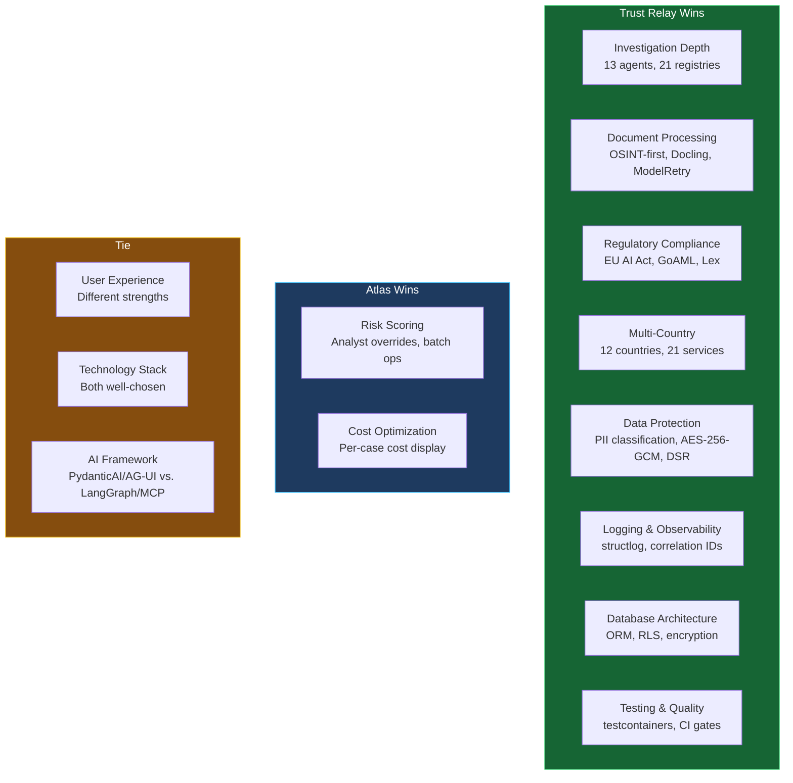

# Atlas vs Trust Relay -- Architecture Comparison

This page provides an honest, dimension-by-dimension comparison between Trust Relay and Atlas from the perspective of a compliance officer who needs to investigate companies, assess risk, and make defensible decisions. Both systems are under active development within the same organization. The goal is to understand where each system excels and where the gaps are.

All assessments are based on codebase analysis as of April 2026.

---

## 1. Investigation Pipeline

### Trust Relay

Trust Relay runs a 13-agent OSINT pipeline with country-routed agents:

```mermaid
flowchart LR
    subgraph PreInvestigation["Pre-Investigation"]
        VIES["VIES"]
        ND["NorthData"]
        GLEIF["GLEIF"]
        WEB["Website Discovery"]
    end

    subgraph CorePipeline["Core Pipeline"]
        REG["Registry Agent"]
        PV["Person Validation"]
        AM["Adverse Media"]
        SI["Social Intelligence"]
        SYN["Synthesis"]
    end

    subgraph PostPipeline["Post-Processing"]
        MCC["MCC Classifier"]
        RISK["Risk Reassessment"]
        VC["Verification Checks"]
        QS["Quality Scorer"]
        TG["Task Generator"]
        GE["Graph ETL"]
    end

    PreInvestigation --> CorePipeline --> PostPipeline

    style PreInvestigation fill:#2d4a3e,stroke:#34d399,color:#fff
    style CorePipeline fill:#3b1a5f,stroke:#a78bfa,color:#fff
    style PostPipeline fill:#5f3a1e,stroke:#f59e0b,color:#fff
```

- **13 agents** with sequential phase execution (registry must complete before person validation)
- **Country routing**: 12 countries, 21 registry services (KBO, NBB, INPI, NorthData, ANAF, etc.)
- **Social intelligence**: BrightData MCP with 3-minute timeout for LinkedIn, reviews, and social media
- **Quality gates**: PydanticAI `ModelRetry` on synthesis and document validation -- if the LLM misclassifies verified items as unverified, it gets corrective feedback and retries
- **EVOI budget management**: Economic Value of Information scoring controls which network entities get scanned
- **Pre-enrichment**: VIES, NorthData, GLEIF, and Crunchbase data fetched at case creation, before any investigation runs
- **Post-document re-synthesis**: After customer uploads, the investigation summary is refreshed with verified-document findings
- **Pipeline observability**: Per-agent status tracking (pending/running/success/failed) with duration, model, findings count, and token usage in `agent_executions` table

### Atlas

Atlas runs a 7-module parallel pipeline:

- **7 modules** all executing simultaneously (CIR, ROA, MEBO, FRLS, AMLRR, SPEPWS, DFWO)
- **Parallel execution**: No inter-module dependencies -- all 7 run concurrently
- **MCP tool ecosystem**: Web search, sanctions screening, registry lookups, VAT validation, WHOIS, DNS, SSL -- all via MCP server adapters
- **Ontology validation**: LLM outputs are validated against a versioned entity schema with feedback loops for correction
- **Entity reconciliation**: Dedicated reconciliation module (1,292 lines) merges duplicate entities discovered by different modules
- **Cancellation handling**: Graceful cancellation support -- cancelled workflows clean up all running activities
- **Focused investigations**: Run any subset of modules (e.g., only SPEPWS for sanctions screening)

### Verdict

| Aspect | Winner | Why |
|--------|--------|-----|
| Investigation depth | Trust Relay | 13 agents with country-specific routing vs. 7 generic modules. Country-specific agents hit authoritative registries (KBO, NBB, INPI) directly rather than relying on web search to find registry data |
| Investigation speed | Atlas | Full parallelism (all 7 modules run simultaneously) vs. sequential phases in Trust Relay. Atlas completes a full investigation in the time it takes Trust Relay to finish the registry agent |
| Data source coverage | Trust Relay | 21 direct registry integrations + BrightData social intelligence + PEPPOL + crawl4ai gazette scraping. Atlas relies on MCP tools (Tavily, OpenSanctions, OpenCorporates) which are powerful but less authoritative than direct registry APIs |
| Quality control | Trust Relay | ModelRetry quality gates catch LLM errors at generation time. Atlas validates against ontology schemas but does not retry on quality issues |
| Re-investigation | Atlas | Focused investigations (run any module subset) and investigation rerun are both production-ready. Trust Relay has follow-up loops but not focused re-investigation |
| Entity resolution | Atlas | Dedicated 1,028-line entity resolution module with blocking keys and fuzzy matching vs. Trust Relay's simpler entity matcher |

**Overall winner for compliance officers: Trust Relay** -- the country-specific registry integrations produce higher-fidelity data than generic web search. A Belgian compliance officer investigating a Belgian company gets KBO registry data, NBB financial filings, and gazette publications directly from official sources. Atlas would find the same information via web search but with lower confidence and more noise.

---

## 2. Risk Scoring

### Trust Relay

- **EBA 5-dimension matrix** with weighted-max aggregation (ADR-0020)
- **Segment calibration**: Risk factor weights are overridable per regulatory segment (banking sector applies 1.5x weight to regulatory_status)
- **One-way ratchet**: Risk scores can only increase during an investigation, never decrease. This prevents OSINT agents from inadvertently whitewashing risk
- **Config-driven**: 9 REST endpoints for versioned risk configuration management with diff, audit trail, and recalculation API
- **MCC-aware license verification**: MCC code determines which regulatory licenses are required; missing licenses elevate product/service risk
- **SHA-256 determinism proof**: `input_hash` and `output_hash` on every evaluation for audit trail

### Atlas

- **EBA 5-dimension matrix** with identical weighted-max formula
- **4 SHA-256 audit hashes** per evaluation (input_hash, override_hash, evaluation_fingerprint, output_hash) -- more granular than Trust Relay's 2 hashes
- **Analyst overrides**: Officers can override individual factor scores with justification, tracked via override_hash
- **Portfolio batch re-evaluation**: Temporal workflow for re-scoring up to 100 companies when risk config changes
- **Schema lifecycle**: Draft, published, archived states with reference data snapshot freezing at publish time
- **Ontology mapper**: Automatically maps investigation entities to risk factor inputs
- **Risk propagation**: Risk signals propagate through the Neo4j knowledge graph along ownership chains (up to 10 levels deep)

### Verdict

| Aspect | Winner | Why |
|--------|--------|-----|
| Scoring methodology | Tie | Both implement the same EBA/GL/2021/02 framework with identical dimensions and aggregation methods |
| Audit trail | Atlas | 4 SHA-256 hashes vs. 2. The evaluation_fingerprint enables unique identification of any scoring scenario |
| Analyst overrides | Atlas | Built-in factor-level overrides with audit trail. Trust Relay does not have per-factor officer overrides yet |
| Portfolio operations | Atlas | Batch re-evaluation workflow is production-ready. Trust Relay has per-case recalculation but no portfolio-wide operation |
| Dynamic calibration | Trust Relay | Segment calibration adjusts weights based on business vertical. Atlas has static weights per matrix schema |
| Ratchet protection | Trust Relay | One-way ratchet prevents score reduction during investigation. Atlas can reduce scores if new evidence is favorable |
| Configuration UX | Trust Relay | Admin UI with 3 tabs (Scoring Model, Reference Datasets, Versions) + stale config detection + recalculate button. Atlas has API endpoints but less UI polish |

**Overall winner for compliance officers: Atlas** -- the analyst override capability is critical for production. Compliance officers need to adjust scores when they have context the AI does not (e.g., knowing that a company's shell company structure is a legitimate tax optimization). Trust Relay's ratchet protection and segment calibration are valuable but less immediately useful than per-factor overrides.

---

## 3. Document Processing

### Trust Relay

- **OSINT-first approach** (ADR-0018): Run full investigation before requesting any customer documents. Only ask for what OSINT cannot determine
- **Gap analysis engine**: Compares OSINT findings against template requirements to determine exactly which documents the customer must provide
- **Automation tiers**: AUTONOMOUS (auto-approve when OSINT covers everything), ASSISTED (15-minute review timeout), FULL_REVIEW (manual officer review of requirements)
- **IBM Docling conversion**: PDF, DOCX, and images converted to Markdown for LLM processing
- **Post-document re-synthesis**: After customer uploads, the investigation summary is refreshed with verified-document findings
- **ModelRetry document validation**: LLM validates each uploaded document against its requirement with quality gates
- **Iterative loops**: Up to 5 follow-up iterations if documents are insufficient

### Atlas

- **No document processing**: Atlas is investigation-focused. It does not process customer-uploaded documents
- **Portal phase in Workflow Studio**: The generic workflow engine supports portal phases for data collection, but this is a form-based system (text fields, dropdowns) rather than document upload and AI validation
- **No OSINT-first approach**: Atlas always runs all 7 investigation modules regardless of what documents are available

### Verdict

**Winner: Trust Relay** -- document processing is a foundational requirement for KYB compliance. The OSINT-first approach (only request what OSINT cannot determine) reduces customer friction and accelerates onboarding. Atlas does not address this dimension at all.

This is the most significant architectural gap between the two systems. A compliance officer using Atlas still needs a separate system to manage document collection, conversion, and validation.

---

## 4. Regulatory Compliance

### Trust Relay

- **EU AI Act Art. 12**: Evidence bundles with SHA-256 hashes capture every AI decision input, model identification, reasoning, and output
- **Audit trail**: 5 dedicated PostgreSQL tables (AuditEvent, ToolInvocation, SignalEvent, FindingAnalysis, RiskConfigAudit) + workflow audit events
- **Regulatory segments**: Declarative YAML compiler (ADR-0031) defines per-vertical compliance requirements. Banking segment includes EBA capital requirements; PSP segment includes PSD2 licensing checks
- **Lex corpus**: Regulatory knowledge base with structured legislation ingestion pipeline
- **GoAML export**: Three-layer pipeline for Suspicious Activity Report generation with country profiles (CZ, RO, SK)
- **AMLD retention**: 5-year retention built into schema design, all investigation data timestamped and immutable
- **One-way ratchet**: AI cannot suppress risk signals

### Atlas

- **SHA-256 determinism proofs**: 4 hashes per risk evaluation for independent audit verification
- **Langfuse tracing**: All LLM calls traced with cost, latency, and quality scoring -- always-on, not behind a profile flag
- **Ontology provenance**: Field-level lineage tracking records which source, confidence, and mutation history for every entity field
- **Evidence repository**: Dedicated repository class for persisting evidence IDs and linking them to modules
- **Configurable risk rules**: Risk factors defined per module with weighted scoring and regulatory basis references
- **Workflow audit**: Decisions and task completions are hashed and persisted via audit activities

### Verdict

| Aspect | Winner | Why |
|--------|--------|-----|
| EU AI Act compliance | Trust Relay | Evidence bundles explicitly target Art. 11 (documentation), Art. 12 (logging), Art. 13 (transparency), Art. 14 (human oversight). Atlas has the underlying data but not the structured compliance framing |
| LLM observability | Atlas | Langfuse is always-on with ClickHouse analytics backend. Trust Relay has Langfuse behind a Docker profile flag and relies more on custom audit tables |
| Data provenance | Atlas | Field-level lineage per entity field is more granular than Trust Relay's source-level provenance |
| SAR generation | Trust Relay | GoAML export with country profiles is production-ready. Atlas has no SAR/STR generation capability |
| Regulatory knowledge | Trust Relay | Lex corpus provides structured regulatory knowledge. Atlas references regulations in risk factor definitions but has no knowledge base |
| Audit immutability | Tie | Both use append-only audit patterns with SHA-256 integrity. Trust Relay has more audit table diversity; Atlas has more structured hashing |

**Overall winner for compliance officers: Trust Relay** -- the regulatory segment system, GoAML export, and EU AI Act evidence bundles directly address production compliance requirements. Atlas has strong foundational auditability but has not built the regulatory compliance layer on top of it.

---

## 5. User Experience (Compliance Officer)

### Trust Relay

- **Pipeline DAG visualization**: Real-time progress strip showing 8 stages with per-agent status (pending/running/success/failed), duration, and model used
- **Risk spider chart**: 5-dimension radar chart visualizing EBA risk scores
- **Structured summary**: 5-section investigation report (Executive Summary, Key Risk Signals, Verification Status, Recommendation, Next Steps) with severity badges per finding
- **Inline document upload**: Officers can upload documents directly from the case detail page at REQUIREMENTS_REVIEW stage
- **Investigation rerun**: Re-run the full OSINT pipeline from the case detail page
- **Focused investigation**: Re-investigate specific aspects (not yet fully wired but API exists)
- **CopilotKit chatbot**: Inline AI assistant with 23 read/write tools for discrepancy resolution, note-taking, and finding feedback
- **Network Intelligence Hub**: Three-perspective visualization (Network Graph, Ownership Tree, Investigation Flow) with ReactFlow
- **Customer portal**: Branded portal with token authentication for document upload and question responses

### Atlas

- **Investigation detail**: Tabbed view with Overview, Transcripts, Ontology, Evidence, Logs, and Crew Activity tabs
- **Transcript viewer**: Full LLM conversation history for each module -- the officer can see exactly what the AI asked, what tools it used, and what it concluded
- **Ontology explorer**: Visual entity browser with field-level provenance (click any field to see its source, confidence, and mutation history)
- **Cytoscape.js graph explorer**: Entity relationship visualization with 3 layout engines (force-directed, hierarchical, breadthfirst)
- **Risk center**: 5-view risk analysis dashboard (portfolio pie chart, spider chart, risk table, network graph, timeline)
- **Workflow Studio**: Visual workflow builder with drag-and-drop, YAML schema editing via CodeMirror, and AI-powered schema generation from documents
- **Company portfolio**: Entity registry with timeline, ownership chain, investigation history, and freshness indicators

### Verdict

| Aspect | Winner | Why |
|--------|--------|-----|
| Investigation transparency | Atlas | The transcript viewer shows the full LLM reasoning chain per module. Trust Relay shows findings and summaries but not the underlying tool calls and reasoning |
| Real-time progress | Trust Relay | Pipeline DAG with per-agent status, duration, and model tracking. Atlas shows overall investigation status but less granular progress |
| Data provenance UX | Atlas | Click any entity field to see its source, confidence, and history. Trust Relay has source attribution on findings but not field-level provenance browsing |
| Customer interaction | Trust Relay | Branded portal with token auth, document upload, and question responses. Atlas has no customer-facing interface |
| Workflow configuration | Atlas | Visual workflow builder is significantly more powerful than Trust Relay's template-based approach |
| AI assistance | Trust Relay | CopilotKit chatbot with 23 tools vs. no AI assistant in Atlas |
| Risk visualization | Tie | Both have spider charts and risk breakdowns. Atlas has more portfolio-level views; Trust Relay has more case-level detail |

**Overall winner for compliance officers: Tie** -- Atlas provides better investigation transparency (transcripts, ontology browser) while Trust Relay provides a better end-to-end workflow experience (portal, chatbot, pipeline visualization). The choice depends on whether the officer's primary task is deep investigation analysis (Atlas wins) or case lifecycle management (Trust Relay wins).

---

## 6. Technology Stack

### Trust Relay

| Layer | Technology |
|-------|-----------|
| AI Framework | PydanticAI (native Pydantic, typed outputs, ModelRetry) |
| Frontend | Next.js 16, React 19, Tailwind CSS v4, shadcn/ui |
| State Management | React useState/useEffect (ADR-0010) |
| Build | Next.js built-in (Turbopack) |
| Backend | FastAPI, Pydantic v2, SQLAlchemy 2.0 ORM + Repository pattern |
| Migrations | Alembic (39 migrations) |
| Workflow | Temporal (single worker) |
| Document Processing | IBM Docling (local, MIT) |
| Object Storage | MinIO |
| Auth | Keycloak (JWT/JWKS, RBAC, 4 roles, JIT provisioning) |

### Atlas

| Layer | Technology |
|-------|-----------|
| AI Framework | LangChain 1.2.10 + LangGraph 1.0.10 (broad tool ecosystem, MCP adapters) |
| Frontend | React 18.2, Blueprint.js v5, Vite |
| State Management | Zustand + TanStack React Query v5 |
| Build | Vite |
| Backend | FastAPI, Pydantic v2, asyncpg + SQLAlchemy |
| Migrations | Flyway (SQL-based) |
| Workflow | Temporal (two workers: investigation + workflow engine) |
| Document Processing | None |
| Object Storage | MinIO |
| Auth | Keycloak (implemented, 3 platform roles + workflow roles) |

### Verdict

| Aspect | Winner | Why |
|--------|--------|-----|
| AI framework maturity | Atlas | LangChain has a broader ecosystem and more model/tool adapters. PydanticAI is newer but offers tighter type safety |
| Frontend framework | Trust Relay | Next.js 16 with React 19 and server components vs. React 18.2 SPA. Server-side rendering enables faster initial page loads and better SEO |
| State management | Atlas | Zustand + React Query is more scalable than useState/useEffect for complex UIs with server state synchronization |
| UI component library | Tie | Blueprint.js is better for data-dense enterprise UIs out of the box. shadcn/ui gives more design flexibility but requires more assembly |
| Database access | Trust Relay | Repository pattern with ORM models provides type safety and testability vs. asyncpg direct access |
| Migration tooling | Tie | Alembic is Python-native and integrates with SQLAlchemy models. Flyway is database-native and works with any language |

**Overall winner: Tie** -- both stacks are well-chosen for their respective architectures. The key difference is AI framework: LangChain for broad ecosystem vs. PydanticAI for type safety. Neither is clearly superior.

---

## 7. Multi-Country Support

### Trust Relay

- **12 countries**: BE, CH, CZ, DE, DK, EE, FI, FR, NL, NO, RO, SK
- **21 registry services**: Direct integrations with national registries (KBO, NBB, INPI, KVK, NorthData, ANAF, etc.)
- **Country-routed agents**: The registry agent dispatches to country-specific handlers with official data source access
- **GoAML country profiles**: SAR generation templates for CZ, RO, SK with country-specific field mappings
- **Regulatory segments**: Per-country compliance requirements defined in YAML (CZ banking segment exists)
- **PEPPOL verification**: Belgian-specific inhoudingsplicht check via PEPPOL network

### Atlas

- **Generic approach**: All countries go through the same 7-module pipeline
- **MCP tool routing**: Country-specific data found via web search (Tavily, OpenCorporates, Companies House MCP)
- **No country-specific agents**: No dedicated handlers for Belgian, Czech, or other national registries
- **No country-specific reporting**: No GoAML or country-specific SAR generation
- **Enrichment providers**: NorthData integration provides DACH + NL coverage; other countries rely on web search

### Verdict

**Winner: Trust Relay** -- 21 direct registry integrations vs. generic web search. When a Czech bank asks "is this company registered with the CNB?", Trust Relay queries the CNB JERRS register directly. Atlas would search the web for the answer. This is a significant differentiator for European compliance use cases.

---

## 8. Cost Optimization

### Trust Relay

- **Model tiers** (ADR-0029): 4 tiers (premium/mid/value/budget) mapping agents to models. Currently all set to GPT-5.2 for demo excellence, but the infrastructure supports cost optimization
- **EVOI budget management**: Economic Value of Information scoring determines whether scanning additional network entities is worth the cost
- **Circuit breakers** (ADR-0032): Fail-fast when external services are down instead of burning tokens on retries
- **Per-agent token tracking**: `agent_executions` table records input/output token counts per agent invocation
- **No cost aggregation API**: Token counts are tracked but not aggregated into per-case or per-investigation costs

### Atlas

- **OpenRouter gateway**: Routes to cheapest available model for each quality tier. Model factory supports OpenRouter, Anthropic direct, Ollama local, and vLLM
- **Langfuse cost tracking**: Per-investigation cost aggregation via Langfuse Metrics API. Dashboard shows "this investigation cost EUR X.XX"
- **Cost API**: Dedicated metrics router exposes per-investigation and portfolio-level cost data
- **Model factory**: Dynamic model selection based on quality requirements -- different models for different module types

### Verdict

| Aspect | Winner | Why |
|--------|--------|-----|
| Cost visibility | Atlas | Per-investigation cost display in the dashboard via Langfuse Metrics API. Trust Relay tracks tokens but does not aggregate costs |
| Model routing | Atlas | OpenRouter provides automatic cheapest-model routing with fallback. Trust Relay's model tiers are manually configured |
| Cost infrastructure | Tie | Both have the underlying data (token counts, model identification). Atlas presents it better |
| EVOI optimization | Trust Relay | Budget-aware investigation decisions based on expected information value. Atlas runs all modules regardless of expected value |

**Overall winner: Atlas** -- per-investigation cost visibility is a stronger feature for production deployment. Trust Relay has the token tracking infrastructure but has not built the aggregation and display layer. This is a straightforward import candidate.

---

## 9. Data Protection & PII Handling

### Trust Relay

Trust Relay implements a three-layer PII classification and encryption architecture (ADR-0036):

- **Field-level classification**: 20 PII fields across 5 tables annotated with `PIICategory` metadata (DIRECT_IDENTIFIER, QUASI_IDENTIFIER, SENSITIVE, FINANCIAL, CONTACT, DOCUMENT)
- **AES-256-GCM column encryption**: `EncryptedText` TypeDecorator transparently encrypts DIRECT_IDENTIFIER, FINANCIAL, and CONTACT fields. HMAC-SHA256 search hashes enable equality lookups on encrypted columns
- **JSONB PII encryption**: Application-level encryption for PII nested inside JSON arrays (identification documents, phone numbers, email addresses)
- **Vault-ready key management**: `KeyProvider` abstraction with `EnvKeyProvider` (PoC) and pluggable `VaultKeyProvider` / `AWSKMSKeyProvider` (production)
- **GDPR DSR endpoints**: Three API endpoints for Art. 15 (access), Art. 16 (rectification), Art. 17 (erasure) with AML 5-year retention handling
- **Person resolution index**: Cross-case person lookup via HMAC hashes -- a director appearing in 3 investigations can be found and anonymized across all of them
- **Machine-generated PII manifest**: `pii_manifest.json` serves as GDPR Art. 30 records of processing artifact for bank security questionnaires
- **AML/GDPR tension resolved**: Active cases refuse erasure; closed < 5 years get anonymized (`[REDACTED-{dsr_id}]`); closed > 5 years get fully deleted

### Atlas

Atlas does not implement field-level PII classification or column-level encryption. Data protection is handled through:

- **Multi-tenancy isolation**: Tenant-scoped data access (similar to Trust Relay's RLS approach)
- **No column encryption**: All data stored in plaintext PostgreSQL
- **No GDPR DSR endpoints**: No automated data subject access, erasure, or rectification
- **No PII manifest**: No machine-readable inventory of personal data fields
- **No retention policy enforcement**: Manual data lifecycle management

### Verdict

| Aspect | Winner | Why |
|--------|--------|-----|
| PII classification | **Trust Relay** | 20 fields classified with 6-category taxonomy; Atlas has no classification |
| Encryption at rest | **Trust Relay** | AES-256-GCM with key rotation support; Atlas stores all data in plaintext |
| GDPR Art. 15/16/17 | **Trust Relay** | Three DSR endpoints with AML retention rules; Atlas has none |
| Compliance artifacts | **Trust Relay** | Machine-generated pii_manifest.json for auditors; Atlas has no equivalent |
| Key management | **Trust Relay** | Vault-ready KeyProvider abstraction; Atlas has no key management |

---

## 10. Logging & Observability

### Trust Relay

- **structlog wrapping stdlib**: All 1,039 log statements emit structured JSON (production) or colorized console (development) output via a single logging configuration
- **Correlation ID middleware**: `X-Correlation-Id` header propagated across every HTTP request and Temporal activity -- any log line can be traced back to the originating request
- **Context enrichment**: Every log line carries `tenant_id`, `user_id`, `request_path`, `workflow_id`, and `case_id` when available -- filtering by any dimension in log aggregation tools
- **OpenTelemetry traces**: Optional Langfuse integration behind a Docker profile flag for LLM-specific tracing
- **Runtime configuration**: `LOG_LEVEL` and `LOG_FORMAT` environment variables control verbosity and output format without code changes
- **Neo4j notification suppression**: Clean startup logs with targeted suppression of Neo4j driver deprecation warnings

### Atlas

- **Langfuse v3**: Always-on LLM-specific tracing with per-call cost, latency, and quality scoring via ClickHouse analytics backend
- **LangfuseMetricsService**: 3.4K-line custom service for investigation cost aggregation -- per-investigation, per-module, and portfolio-level cost breakdowns
- **Standard Python logging**: Plain text output, no structured logging framework
- **No correlation IDs**: No request-scoped context propagation across services
- **No application-wide structured logging**: LLM calls are well-traced via Langfuse, but application-level operations (database queries, file operations, HTTP calls) are not structured

### Verdict

| Aspect | Winner | Why |
|--------|--------|-----|
| Application-wide observability | Trust Relay | structlog + correlation IDs provide full request tracing across all operations. Atlas only traces LLM calls |
| LLM cost tracking | Atlas | Langfuse with ClickHouse backend provides per-call cost and latency analytics. Trust Relay's Langfuse integration is optional |
| Production debugging | Trust Relay | Correlation ID lets you trace a single request from HTTP ingress through Temporal workflow to database. Atlas requires log timestamp correlation |
| Log aggregation readiness | Trust Relay | Structured JSON output is immediately compatible with ELK, Datadog, and CloudWatch. Atlas plain text requires parsing |

**Overall winner: Trust Relay** -- application-wide structured logging with correlation IDs is more valuable for production operations than LLM-specific tracing. Atlas's Langfuse integration is excellent for AI observability but does not help when debugging a database timeout or a MinIO upload failure.

---

## 11. Database Architecture

### Trust Relay

- **SQLAlchemy 2.0 ORM**: 36+ `Mapped[]` model classes as single source of truth for schema
- **Repository pattern**: `BaseRepository[T]` generic CRUD with `UserRepository` and `TenantRepository` specializations -- migrated from raw SQL (ADR-0008 superseded)
- **49 Alembic migrations**: Python-native, auto-generated from ORM model diffs
- **Row-Level Security**: 25+ tables with `FORCE ROW LEVEL SECURITY` -- tenant isolation enforced at the database level, not just the application layer
- **Session context managers**: `get_tenant_session()` sets `app.current_tenant` on the connection for RLS policy evaluation; `get_admin_session()` bypasses RLS for cross-tenant operations
- **EncryptedText TypeDecorator**: AES-256-GCM column encryption with HMAC-SHA256 search hashes -- transparent to application code
- **Async throughout**: asyncpg driver with SQLAlchemy async session factory

### Atlas

- **AsyncPG direct queries**: No ORM entity classes -- SQL queries written directly against the database
- **18 repository classes**: Each with hand-written SQL queries, parameter binding, and result mapping
- **100 Flyway migrations**: SQL-based, database-native migration tooling
- **Single-tenant**: No Row-Level Security, no tenant isolation at the database level
- **Event sourcing** (ADR-9): Entity mutations stored as an append-only event log with replay capability
- **No column-level encryption**: All data stored in plaintext PostgreSQL columns
- **Async throughout**: asyncpg with connection pooling

### Verdict

| Aspect | Winner | Why |
|--------|--------|-----|
| Schema management | Trust Relay | ORM models as single source of truth vs. hand-written SQL with no schema definition layer |
| Multi-tenancy | Trust Relay | RLS with FORCE at database level vs. single-tenant. This is a foundational SaaS requirement |
| Data encryption | Trust Relay | AES-256-GCM column encryption vs. plaintext storage. Required for GDPR and bank security questionnaires |
| Event sourcing | Atlas | Append-only event log with replay is architecturally superior for audit trails and temporal queries |
| Migration maturity | Atlas | 100 Flyway migrations indicate more schema evolution experience. Trust Relay's 49 Alembic migrations are newer |
| Query flexibility | Atlas | Direct SQL gives full PostgreSQL feature access without ORM translation overhead |

**Overall winner: Trust Relay** -- multi-tenancy with RLS and column-level encryption are non-negotiable for SaaS deployment. Atlas's event sourcing is architecturally elegant and worth adopting, but single-tenant plaintext storage is a deployment blocker for enterprise customers.

---

## 12. AI Framework

### Trust Relay

- **PydanticAI**: Native Pydantic integration with typed agent outputs, `ModelRetry` for self-correcting LLM responses, and structured dependency injection
- **AG-UI protocol**: Streaming AI agent events to the frontend via CopilotKit v2 (ADR-0001, ADR-0013)
- **CopilotKit v2**: Inline AI assistant with 23 read/write tools for officer-facing case analysis
- **Prompt centralization**: 20 Jinja2 templates in `PromptRegistry` with DB-first, filesystem-fallback resolution (ADR-0026)
- **Model tiers**: Cost-optimized model selection per agent via 4-tier classification (ADR-0029)
- **ModelRetry quality gates**: LLM outputs that fail validation get corrective feedback and automatic retries -- catches misclassifications at generation time

### Atlas

- **LangGraph 1.0.10**: Graph-based agent orchestration (migrated from CrewAI) with conditional edges, state management, and tool node execution
- **MCP tool ecosystem**: 50+ tools across 12+ MCP servers (web search, sanctions, registries, VAT, WHOIS, DNS, SSL, etc.)
- **Database-driven prompts**: Prompt templates seeded via Flyway migrations, versioned alongside schema changes
- **Multi-provider model selection**: OpenRouter + OpenAI + Anthropic with model factory pattern for dynamic routing
- **Langfuse per-call tracing**: Every LLM invocation traced with input/output tokens, cost, latency, and quality score
- **Ontology validation**: LLM outputs validated against versioned entity schemas with feedback loops

### Verdict

| Aspect | Winner | Why |
|--------|--------|-----|
| Agent orchestration | Atlas | LangGraph's graph-based execution with conditional edges is more flexible than PydanticAI's sequential pipeline |
| Tool ecosystem | Atlas | 50+ MCP tools vs. Trust Relay's direct service integrations. MCP provides a standardized tool interface |
| Frontend AI integration | Trust Relay | CopilotKit v2 with AG-UI protocol provides real-time AI streaming to the officer's browser. Atlas has no equivalent |
| Output quality control | Trust Relay | ModelRetry catches and corrects LLM errors at generation time. Atlas validates after generation but does not auto-retry |
| LLM observability | Atlas | Langfuse always-on tracing vs. Trust Relay's optional integration |
| Prompt management | Tie | Both centralize prompts with versioning. Trust Relay uses Jinja2 templates; Atlas uses migration-seeded SQL |

**Overall winner: Tie** -- the frameworks optimize for different strengths. PydanticAI + AG-UI delivers a superior officer-facing AI experience with real-time streaming and self-correcting outputs. LangGraph + MCP delivers a more flexible investigation engine with broader tool access and better LLM observability. A convergence strategy would use LangGraph for investigation orchestration while keeping PydanticAI + CopilotKit for the officer-facing layer.

---

## 13. Testing & Quality

### Trust Relay

- **278 test files**: Comprehensive coverage across workflow, API, services, and PII layers
- **85+ PII-specific tests**: Dedicated test suite for encryption, GDPR DSR endpoints, and person resolution
- **Testcontainer PostgreSQL**: Real database tests with macOS Docker Desktop support -- no mocking of database interactions
- **pytest asyncio_mode=auto**: No `@pytest.mark.asyncio` decorator boilerplate
- **Pre-commit quality gates**: `ruff check --select F` (fatal Python errors) + `tsc --noEmit` (TypeScript type checking) enforced before every commit
- **GitHub Actions CI**: Service containers for PostgreSQL, MinIO, and Redis in CI pipeline
- **Coverage targets**: 90% for workflow state machine, 70% for API and React components

### Atlas

- **89 test files**: ~70% unit tests, ~30% integration tests
- **Mock-based integration tests**: External dependencies (database, services) stubbed via dependency injection
- **pytest asyncio_mode=auto**: Same async test configuration
- **Dependency stub injection**: Clean test architecture with injectable mock implementations
- **No testcontainers**: Integration tests use in-memory stubs rather than real service containers
- **No pre-commit quality gates**: No automated lint or type checking enforcement before commits

### Verdict

| Aspect | Winner | Why |
|--------|--------|-----|
| Test volume | Trust Relay | 278 test files vs. 89. More than 3x the test surface area |
| Test fidelity | Trust Relay | Testcontainers run real PostgreSQL in tests. Mock-based tests can miss real database behavior (constraint violations, query plan issues) |
| Test architecture | Tie | Both use clean async patterns. Atlas's dependency injection is well-structured; Trust Relay's testcontainer approach is more realistic |
| Quality enforcement | Trust Relay | Pre-commit ruff + tsc gates prevent broken code from entering the repository. Atlas has no equivalent guardrails |
| CI pipeline | Trust Relay | GitHub Actions with service containers vs. no CI configuration found in Atlas |
| PII test coverage | Trust Relay | 85+ dedicated PII tests verify encryption, DSR, and person resolution. Atlas has no PII tests (no PII features to test) |

**Overall winner: Trust Relay** -- the combination of testcontainers (real database in tests), pre-commit quality gates (ruff + tsc), and CI pipeline (GitHub Actions) provides significantly more confidence in code correctness. Atlas's tests are well-structured but rely on mocks that can diverge from real service behavior.

---

## Summary Matrix

| Dimension | Winner | Margin |
|-----------|--------|--------|
| Investigation Pipeline | Trust Relay | Large -- country-specific vs. generic |
| Risk Scoring | Atlas | Moderate -- analyst overrides and batch ops |
| Document Processing | Trust Relay | Decisive -- Atlas has none |
| Regulatory Compliance | Trust Relay | Large -- EU AI Act + GoAML + Lex |
| User Experience | Tie | Atlas: transparency. TR: workflow |
| Technology Stack | Tie | Different tradeoffs |
| Multi-Country Support | Trust Relay | Large -- 21 registries vs. web search |
| Cost Optimization | Atlas | Moderate -- per-case visibility |
| Data Protection & PII | Trust Relay | Decisive -- AES-256-GCM + DSR vs. none |
| Logging & Observability | Trust Relay | Moderate -- structlog + correlation IDs vs. Langfuse LLM-only |
| Database Architecture | Trust Relay | Large -- ORM + RLS + encryption vs. raw SQL + single-tenant |
| AI Framework | Tie | Different strengths -- PydanticAI/AG-UI vs. LangGraph/MCP |
| Testing & Quality | Trust Relay | Moderate -- testcontainers + CI gates vs. mock-based |

### Strategic Takeaway

The two systems are genuinely complementary rather than competitive. Trust Relay excels at the end-to-end compliance workflow (investigation, document processing, officer review, customer portal, regulatory reporting), while Atlas excels at investigation infrastructure (parallel modules, entity resolution, cost tracking, analyst overrides, workflow studio).

The highest-value convergence path: adopt Atlas's analyst override capability and cost visibility into Trust Relay, while using Trust Relay's country-specific registry integrations and document processing as the authoritative investigation engine.

**Infrastructure divergence:** The most significant gap is in production readiness. Trust Relay has invested heavily in platform infrastructure (multi-tenancy, PII encryption, structured logging, quality gates) while Atlas has invested in investigation intelligence (LangGraph pipeline, MCP tools, event sourcing, cost tracking). A convergence strategy should adopt Atlas's investigation engine while wrapping it in Trust Relay's production infrastructure.

Key import priorities from Atlas:
1. **Per-factor analyst overrides** -- Critical for production compliance
2. **Per-investigation cost tracking API** -- Essential for commercial viability
3. **Batch risk re-evaluation** -- Required for portfolio management
4. **Transcript/reasoning viewer** -- Officers need to see the AI's reasoning chain
5. **Focused investigations** -- Cost optimization for re-investigations
