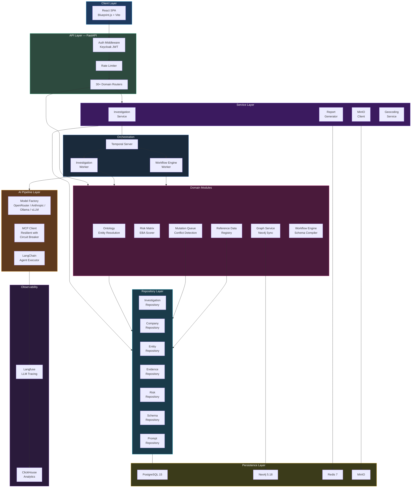
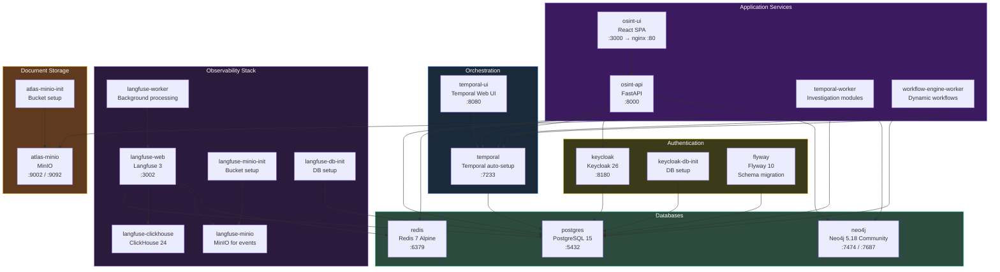
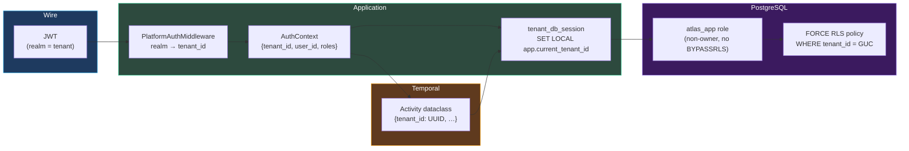
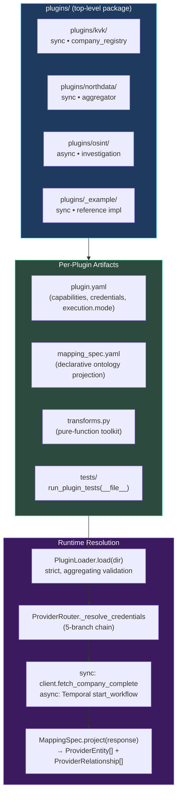

# Atlas — System Architecture

Atlas follows a **modular monolith** architecture with strict internal layering. The backend is a single Python package (`src/`) plus a sibling `plugins/` top-level package; the frontend is a React SPA using Blueprint.js, built with Vite. PostgreSQL is the system of record, Neo4j is a derived knowledge-graph view, Redis is cache and rate-limiter backend, Temporal is the durable workflow engine, and Keycloak is the identity provider — one realm per tenant.

This page documents the system from the ground up: request flow with tenant context, domain organization, the v5.1 plugin substrate, investigation lifecycle, deployment topology, and architectural decisions.

## Two Cross-Cutting Substrates

Two architectural substrates shape every layer of the system. Both were established in milestones v5.0 and v5.1 and are documented in detail on dedicated pages:

| Substrate | Established in | Effect on architecture |
|---|---|---|
| **[Multi-tenancy & Row-Level Security](./multi-tenancy)** | v5.0, phases 84–86.1.1 | Every tenant-owned table carries `tenant_id UUID NOT NULL` with FORCE ROW LEVEL SECURITY; the application connects as the unprivileged `atlas_app` role; every request flows through `tenant_db_session(tenant_id)` which sets `app.current_tenant_id` GUC; every Temporal payload carries `tenant_id`. |
| **[Plugin substrate](./plugin-architecture)** | v5.1, phases 91–110 | Data providers (KVK, NorthData) and the OSINT investigation engine all live under `plugins/<name>/` with a `plugin.yaml` capability/credential contract and a declarative `mapping_spec.yaml` — sync-mode plugins are HTTP clients, async-mode plugins delegate to a Temporal workflow. |

Read those two pages first if the rest of this document leaves you wondering "but how does it stay isolated under load" or "but how is OSINT not just a giant if-statement."

## Architecture Overview

Atlas uses a layered architecture: API routers handle HTTP concerns, delegate to service modules for business logic, which in turn use repository classes for database access. Temporal workflows run in separate worker processes for investigation orchestration and dynamic compliance workflows.

## C4 Context Diagram

The following diagram shows Atlas in its broader ecosystem -- the external systems it depends on and the actors that interact with it.

```mermaid
flowchart TD
    subgraph Actors["Actors"]
        Officer["Compliance Officer"]
        Admin["Admin / Config"]
    end

    subgraph Atlas["Atlas Platform"]
        FE["Frontend<br/>React + Blueprint.js"]
        BE["Backend<br/>FastAPI + Python"]
    end

    subgraph DataStores["Data Stores"]
        PG["PostgreSQL 15<br/>Primary datastore<br/>Investigations, entities,<br/>risk, workflows, config"]
        Neo4j["Neo4j 5.18<br/>Knowledge graph<br/>Entity relationships,<br/>ownership chains"]
        Redis["Redis 7<br/>Cache + rate limiting"]
        AtlasMinio["Atlas MinIO<br/>Document storage"]
    end

    subgraph Orchestration["Orchestration"]
        Temporal["Temporal Server<br/>Workflow execution<br/>Investigation + compliance"]
        TemporalUI["Temporal UI<br/>Workflow monitoring"]
    end

    subgraph Auth["Authentication"]
        Keycloak["Keycloak 26<br/>JWT / OIDC<br/>Role-based access"]
    end

    subgraph AI["AI / LLM"]
        OpenRouter["OpenRouter<br/>LLM gateway<br/>Multi-provider routing"]
        Anthropic["Anthropic API<br/>Direct access"]
        Ollama["Ollama<br/>Local models"]
    end

    subgraph Observability["Observability"]
        Langfuse["Langfuse 3<br/>LLM tracing, cost<br/>tracking, quality scoring"]
        LfMinio["Langfuse MinIO<br/>Event + export storage"]
        ClickHouse["ClickHouse 24<br/>Analytics backend"]
    end

    subgraph Tools["External Tools"]
        MCP["MCP Servers<br/>Web search, registries,<br/>sanctions, VAT"]
        NorthData["NorthData<br/>Company enrichment"]
        VIES["EU VIES<br/>VAT validation"]
    end

    Officer --> FE
    Admin --> FE
    FE --> BE
    BE --> PG
    BE --> Neo4j
    BE --> Redis
    BE --> AtlasMinio
    BE --> Temporal
    BE --> Keycloak
    BE --> OpenRouter
    BE --> Anthropic
    BE --> Ollama
    BE --> MCP
    BE --> NorthData
    BE --> VIES
    Temporal --> TemporalUI
    Langfuse --> PG
    Langfuse --> ClickHouse
    Langfuse --> LfMinio

    style Actors fill:#1e3a5f,stroke:#38bdf8,color:#fff
    style Atlas fill:#3b1a5f,stroke:#a78bfa,color:#fff
    style DataStores fill:#2d4a3e,stroke:#34d399,color:#fff
    style Orchestration fill:#1a2a3b,stroke:#60a5fa,color:#fff
    style Auth fill:#3b3b1a,stroke:#eab308,color:#fff
    style AI fill:#5f3a1e,stroke:#f59e0b,color:#fff
    style Observability fill:#2a1a3b,stroke:#c084fc,color:#fff
    style Tools fill:#4a1a3b,stroke:#ec4899,color:#fff
```

## Domain-Driven Organization

The Atlas backend is organized into 20+ domain packages under `src/`, each owning its models, repositories, and business logic. The primary domains are listed below; supporting packages include `api`, `database`, `models`, `tools`, `settings`, `events`, `observability`, `source_contracts`, and `services`.

### 1. Investigations (`src/temporal/`, `src/pipelines/`)

The core domain. Temporal workflows orchestrate 7 parallel investigation modules. Each module is driven by a `ModuleConfig` dataclass that parameterizes its prompts, result model, and template variables. The `execute_module` activity uses LangChain agents with MCP tools to perform research, then validates output against the active ontology schema.

Key components:
- `workflows.py` -- `InvestigationWorkflow` Temporal workflow definition
- `activities.py` -- generic `execute_module` activity (~900 lines)
- `module_config.py` -- 7 module configurations (CIR, ROA, MEBO, SPEPWS, AMLRR, DFWO, FRLS)
- `enrichment_activities.py` -- pre-investigation data provider enrichment
- `sync_activities.py` -- Neo4j sync as detached child workflow

### 2. Ontology (`src/ontology/`)

A versioned entity schema system that defines what entity types exist (Company, Person, Address), their attributes, and relationships. The ontology drives entity validation, population from LLM output, and reconciliation of duplicates across modules.

Key components:
- `entity_resolution.py` -- blocking-based entity matching and deduplication
- `survivorship.py` -- trust-weighted field resolution when sources conflict
- `reconciliation.py` -- post-investigation entity merge
- `schema_loader.py` -- loads and caches the active ontology version
- `populator.py` -- maps LLM structured output to ontology entities

### 3. Risk (`src/risk_matrix/`)

An EBA-aligned risk scoring engine with 5 dimensions, per-factor evaluation, configurable weights, and SHA-256 audit hashes for deterministic reproducibility. Risk matrices are stored in the database and resolved per-tenant.

Key components:
- `scorer.py` -- `RiskMatrixScorer` with `FactorResult`, `DimensionResult`, and `MatrixEvaluationResult`
- `eba_matrix.py` -- EBA dimension definitions and factor mappings
- `activities.py` -- risk scoring as a Temporal activity

### 4. Graph (`src/graph/`)

Neo4j integration for knowledge graph operations. Investigation entities are synced to Neo4j as a detached child workflow (so investigation completion is not blocked by graph sync). The graph layer supports entity traversal, ownership chain analysis, and Cypher-powered exploration.

Key components:
- `neo4j_client.py` -- connection pool and query execution
- `neo4j_sync.py` -- entity and relationship sync from PostgreSQL to Neo4j
- `cypher_queries.py` -- parameterized Cypher query library
- `projections.py` -- pre-built graph projections for analysis
- `parity_service.py` -- consistency checks between PostgreSQL and Neo4j

### 5. Mutation Queue (`src/mutation_queue/`)

A sophisticated data pipeline for entity field updates. When new data arrives (from investigations or external providers), mutations flow through evidence mapping, merge strategy resolution, conflict detection, and provenance tracking before being applied. Conflicts can trigger review tasks or freeze investigations.

Key components:
- `processor.py` -- `MutationProcessor` orchestrating the full pipeline
- `evidence_mapper.py` -- maps provider data to mutation records
- `merge_executor.py` -- applies merge strategies (latest_wins, highest_trust, manual_review)
- `conflict_detector.py` -- detects value conflicts between sources
- `conflict_handler.py` -- applies conflict response policies (accept_trusted, flag_review, freeze_investigate)

### 6. Workflows (`src/workflows/`)

A generic workflow engine separate from the investigation workflow. Compliance workflows are defined as YAML schemas, compiled into execution plans, and interpreted by a `DynamicComplianceWorkflow` Temporal workflow. Supports investigation phases, review gates with SLA timers, rule evaluation, conditional routing, and portal phases for customer data collection.

Key components:
- `schema/compiler.py` -- compiles YAML to parallel execution groups
- `engine/dynamic_workflow.py` -- generic Temporal workflow interpreter
- `engine/gate_evaluator.py` -- evaluates review gate conditions
- `builder/` -- visual workflow builder backend (schema generation, semantic validation)
- `rules/eba_matrix.py` -- rule engine integration with risk matrix

### 7. Integrations (`src/integrations/`)

External data provider connectors. Each integration implements a base provider interface and maps external data to the ontology schema. Includes stale data detection and provider health monitoring.

Key components:
- `base.py` -- `ProviderResponse` base class
- `northdata/` -- NorthData company enrichment
- `kvk/` -- Dutch KVK registry
- `keycloak_client.py` -- Keycloak administration
- `stale_check.py` -- data freshness detection

### 8. Reference Data (`src/reference_data/`)

A tenant-aware registry for compliance reference datasets (FATF country risk, industry risk classifications, sanctions list configurations). Supports versioning, system defaults vs. tenant overrides, and layered resolution.

Key components:
- `resolver.py` -- `ReferenceDataResolver` with tenant-aware layered lookup
- `repository.py` -- CRUD for reference datasets
- `seed.py` -- initial dataset seeding
- `validator.py` -- schema validation for dataset entries

## Investigation Lifecycle

The following diagram shows the complete lifecycle of an Atlas investigation, from API request through Temporal execution to final output.

```mermaid
flowchart TD
    A["POST /investigations"] --> B["Create DB Record<br/>status: pending"]
    B --> C["Start Temporal Workflow<br/>InvestigationWorkflow"]

    C --> D{"Has Registration<br/>Number?"}
    D -->|Yes| E["Fetch Enrichment Data<br/>NorthData / providers"]
    D -->|No| F["Skip Enrichment"]
    E --> G["Build Module Inputs<br/>with enrichment context"]
    F --> G

    G --> H["Start 7 Parallel Activities"]

    subgraph Parallel["Parallel Module Execution"]
        direction LR
        M1["CIR"]
        M2["ROA"]
        M3["MEBO"]
        M4["SPEPWS"]
        M5["AMLRR"]
        M6["DFWO"]
        M7["FRLS"]
    end

    H --> Parallel

    subgraph ModuleExecution["Per-Module Activity"]
        direction TB
        P1["Load Agent Config<br/>+ Prompts from DB"]
        P2["Create LLM<br/>via Model Factory"]
        P3["Load MCP Tools<br/>+ HTTP Tools"]
        P4["Execute LangChain Agent<br/>System + User Prompt"]
        P5["Validate Against<br/>Ontology Schema"]
        P6{"Schema<br/>Valid?"}
        P7["Extract Risk Indicators<br/>Apply Risk Rules"]
        P8["Persist to Ontology<br/>EntityPopulator"]
        P9["Persist Evidence<br/>EvidenceRepository"]
        P10["Return ModuleOutput"]
        P11["Retry with<br/>Validation Feedback"]

        P1 --> P2 --> P3 --> P4 --> P5 --> P6
        P6 -->|Yes| P7 --> P8 --> P9 --> P10
        P6 -->|No| P11 --> P4
    end

    Parallel --> ModuleExecution

    ModuleExecution --> I["Reconcile Entities<br/>Merge duplicates<br/>across modules"]
    I --> J["Calculate Overall Risk<br/>Aggregate module scores"]
    J --> K["Persist Investigation<br/>Result to DB"]
    K --> L["Start Neo4j Sync<br/>Child Workflow<br/>ParentClosePolicy.ABANDON"]
    L --> M["Return<br/>InvestigationOutput"]

    style Parallel fill:#3b1a5f,stroke:#a78bfa,color:#fff
    style ModuleExecution fill:#1e3a5f,stroke:#38bdf8,color:#fff
```

### Key Design Decisions in the Lifecycle

1. **All modules run in parallel** -- no inter-module dependencies. Each module discovers entities independently, and reconciliation happens after all complete.
2. **Enrichment is optional** -- if the company has a registration number, Atlas pre-fetches data from providers to give modules more context. If not, modules discover independently.
3. **Ontology validation with feedback loops** -- LLM output is validated against the active schema. If validation fails, the agent receives feedback and retries.
4. **Neo4j sync is non-blocking** -- graph sync runs as a detached child workflow with `ParentClosePolicy.ABANDON`, so the investigation completes immediately regardless of graph sync status.

## Deployment Architecture

Atlas runs as a Docker Compose stack with 16 containers organized into 6 categories.

### Service Inventory

| Service | Image | Port(s) | Purpose |
|---------|-------|---------|---------|
| `osint-api` | Custom Dockerfile | 8000 | FastAPI backend, 30+ routers |
| `osint-ui` | Custom Dockerfile | 3000 | React SPA served via nginx |
| `temporal-worker` | Custom Dockerfile | -- | Investigation module execution |
| `workflow-engine-worker` | Custom Dockerfile | -- | Dynamic compliance workflow execution |
| `postgres` | postgres:15-alpine | 5432 | Primary datastore for all services |
| `neo4j` | neo4j:5.18-community | 7474, 7687 | Knowledge graph (APOC plugin enabled) |
| `redis` | redis:7-alpine | 6379 | Caching and rate limiting |
| `temporal` | temporalio/auto-setup:1.24 | 7233 | Workflow orchestration server |
| `temporal-ui` | temporalio/ui:2.26.2 | 8080 | Temporal monitoring dashboard |
| `keycloak` | keycloak:26.0 | 8180 | Authentication and authorization |
| `flyway` | flyway/flyway:10-alpine | -- | Database schema migrations (run-once) |
| `langfuse-web` | langfuse/langfuse:3 | 3002 | LLM observability dashboard |
| `langfuse-worker` | langfuse/langfuse-worker:3 | -- | Background trace processing |
| `langfuse-clickhouse` | clickhouse/clickhouse-server:24.3 | -- | Analytics backend for Langfuse |
| `langfuse-minio` | minio/minio:latest | -- | Event and export storage for Langfuse |
| `atlas-minio` | minio/minio:latest | 9002, 9092 | Document storage for Atlas |

### Initialization Chain

Several services have initialization dependencies enforced by Docker Compose health checks:

1. **PostgreSQL** starts first (health check: `pg_isready`)
2. **Flyway** runs migrations after PostgreSQL is healthy (run-once, `service_completed_successfully`)
3. **Keycloak DB init** creates the Keycloak database after PostgreSQL is healthy
4. **Keycloak** starts after its DB init completes
5. **Temporal** starts after PostgreSQL is healthy (uses PostgreSQL as its backing store)
6. **API** starts after Flyway completes and Temporal is healthy
7. **Workers** start after Temporal is healthy and Flyway completes
8. **UI** starts after API is healthy
9. **Langfuse** starts after its DB init, ClickHouse, Redis, and MinIO are ready

## Tenant Context Overlay (v5.0)

Every request and every workflow carries `tenant_id` end-to-end. The middleware extracts it from the JWT, the request-scoped DB session binds it to a PostgreSQL GUC, the application connects as `atlas_app` (no RLS bypass), and Temporal payloads carry it as a required field on every dataclass.

The `app.current_tenant_id` GUC is set via `SET LOCAL` so it auto-clears at transaction boundary — eliminating "leaked tenant context" bugs by construction. The application has *no path* to bypass RLS in production because the only role that can is `osint` (the schema owner) and the application pool refuses to use it unless `ALLOW_OWNER_DB_FALLBACK=true` with a loud `WARNING`.

See **[Multi-Tenancy & Row-Level Security](./multi-tenancy)** for the full four-layer threat model, the `tenant_provider_grandfather` migration mechanism, and the verification surfaces.

## Plugin Substrate Overlay (v5.1)

`plugins/` is a top-level Python package (sibling to `src/`) containing one directory per data provider. Every plugin satisfies the same `plugin.yaml` contract regardless of whether it's a sync HTTP fetch or an async Temporal investigation:

Three properties distinguish this from the v3.3 first-pass plugin scaffolding:

1. **Disk-authoritative mappings.** `mapping_spec.yaml` is shipped in the plugin directory; it is *not* DB-overridable, *not* tenant-overridable. Two deployments at the same git SHA produce byte-identical projections.
2. **Three-layer test harness.** Contract (every mapped attribute exists in ontology with compatible type), mapping (DeepDiff vs golden file per fixture), coverage (declared mappings ⊆ produced fields).
3. **Two execution modes, one contract.** Sync plugins are HTTP-client-shaped; async plugins delegate to a Temporal workflow. The same `plugin.yaml` format describes both.

See **[Plugin Architecture](./plugin-architecture)** for the artifact-by-artifact contract, the loader's strictness guarantees, the harness's failure modes, and the migration template (KVK Phase 96 → NorthData Phases 97-99 → OSINT Phases 104-106).

## Key Architectural Decisions

### 1. Parallel Module Execution

All 7 investigation modules execute simultaneously with no inter-module dependencies. Each module discovers entities independently, and reconciliation merges duplicates after all modules complete. This maximizes throughput -- a full investigation completes in the time of its slowest module rather than the sum of all modules.

### 2. Temporal for Durable Execution

Both the investigation workflow and the dynamic compliance workflow engine use Temporal. Investigations use a single workflow with parallel activities. The workflow engine uses a generic interpreter (`DynamicComplianceWorkflow`) that can execute any compiled YAML schema. Temporal provides automatic retry, cancellation propagation, and persistent state across failures.

### 3. PostgreSQL + Neo4j Hybrid Storage

PostgreSQL is the system of record for all structured data (investigations, entities, risk scores, configurations). Neo4j is a derived view -- investigation entities are synced to the graph as a detached child workflow. This hybrid approach gives transactional consistency (PostgreSQL) plus relationship traversal performance (Neo4j) without requiring dual-write coordination.

### 4. OpenRouter as LLM Gateway

Atlas uses OpenRouter as its primary LLM gateway, allowing model selection per agent without managing multiple API keys. The `ModelFactory` supports fallback to direct Anthropic/OpenAI APIs and local providers (Ollama, vLLM, LM Studio). Agent-specific model overrides are stored in `agent_configurations` table and loaded per-module.

### 5. MCP Extensibility

Investigation tools are loaded dynamically from the `mcp_servers` table. MCP servers connect via SSE or stdio, with a resilient client layer that includes per-server circuit breakers, exponential backoff with jitter, and tool availability tracking for partial results. HTTP tools (non-MCP REST APIs) are loaded separately and merged into the agent's tool set.

### 6. Mutation Queue for Entity Updates

Field-level entity updates do not write directly to entities. Instead, they flow through a mutation pipeline: evidence mapping, merge strategy resolution (latest_wins, highest_trust, manual_review), conflict detection, and provenance tracking. When conflicts are detected, the per-field `conflict_response` configuration determines whether to accept the trusted source, flag for review, or freeze the investigation.

### 7. Reference Data Registry

Compliance reference datasets (FATF country risk lists, industry risk classifications, sanctions configurations) are stored as versioned JSON in a `reference_data` table with tenant-aware layered resolution. The resolver checks tenant-specific overrides first, then falls back to system defaults. This allows per-tenant customization of risk parameters without forking the data.

### 8. Keycloak Authentication

Atlas has Keycloak integrated with JWT validation middleware on every API request. The `PlatformAuthMiddleware` extracts tenant and user context from JWTs, enabling multi-tenant isolation. Role-based access control is enforced at the router level.

### 9. WeasyPrint PDF Generation

Investigation reports are generated as HTML from Jinja2 templates and converted to PDF using WeasyPrint. The report generator uses a two-stage process: Stage 1 extracts structured findings with a fast/cheap model (Haiku), Stage 2 synthesizes narrative prose with a quality model (Gemini Flash).

### 10. Ontology-Driven Risk Scoring

Risk scoring is not hardcoded. The ontology schema defines entity types and their risk-relevant attributes. Risk factors are evaluated per-dimension using the EBA 5-dimension framework, with per-factor weights stored in the database. The scorer produces 4 SHA-256 hashes (input, override, evaluation fingerprint, output) for full audit reproducibility.

### 11. FORCE Row-Level Security with `atlas_app` Role (v5.0)

Multi-tenancy is enforced at the database, not by application code remembering to filter. ~46 tables carry `tenant_id UUID NOT NULL` and `FORCE ROW LEVEL SECURITY` policies referencing `current_setting('app.current_tenant_id')::uuid`. The application connects as the unprivileged `atlas_app` role; the schema-owning `osint` role is used only for migrations and is gated by an explicit opt-in flag with a loud warning. Cross-tenant reads are cryptographically impossible — even if a query forgets a filter, the database refuses the row. See [Multi-Tenancy](./multi-tenancy).

### 12. Per-Tenant Credentials with Five-Branch Resolver (v5.1)

Tenants bring their own keys. `data_provider_credentials` stores AES-256-GCM ciphertext with HKDF-SHA256-derived per-tenant subkeys; the `EnvKeyEncryptor` is a Protocol seam for future KMS adoption. Every metered-provider call resolves through `ProviderRouter._resolve_credentials` — a five-branch precedence chain: emergency rollback flag, unmetered plugin, tenant credential row, active grandfather row, raise. `MissingTenantCredentialsError` maps to HTTP 424 with a remediation URL. See [Credential Vault](./credential-vault).

### 13. Plugin Architecture with Disk-Authoritative Mappings (v5.1)

Data providers and the OSINT investigation engine all live under `plugins/<name>/` with a `plugin.yaml` capability/credential contract and a declarative `mapping_spec.yaml`. Mapping specs are platform-wide and on-disk — not DB-overridable, not tenant-overridable — so two deployments at the same git SHA produce byte-identical ontology projections. A three-layer pytest harness (contract → mapping → coverage) gates every plugin merge. Sync plugins are HTTP clients; async plugins delegate to a Temporal workflow. See [Plugin Architecture](./plugin-architecture).

### 14. OSINT Immutability via Redeploy-Required Cycle (v5.1)

The OSINT plugin's prompts, agent configs, and MCP tool definitions are files on disk under `plugins/osint/`, primed into a read-only in-memory cache at process startup. There is no admin API to mutate them at runtime. Editing requires a file change, a `plugin.yaml` `version:` bump (CI-enforced), a PR, and a deploy. This trades hot-edit convenience for the reproducibility guarantee: every investigation run by a given deployment uses byte-identical agent configuration. See [OSINT Plugin](./osint-plugin).

### 15. Claim-Plus-Rank Entity Multiplicity (v5.1, Phase 109-110)

When KVK and NorthData disagree about a company's registered address, both claims are preserved. The `entity_claims` table (V126 migration) holds every provider's view of every field with its source, trust score, retrieval timestamp, and `is_preferred` flag. The seven `SurvivorshipStrategy` strategies are unchanged in semantics — they still pick the winner — but losing claims are no longer discarded. The pattern is borrowed from Wikidata's claim model and unlocks per-field provenance UX, multi-source Person dedup, and regulator-auditable evidence trails. See [Entity Claims](./entity-claims).

## Security Architecture

Atlas implements defense in depth across the API, data, and deployment layers.

### API Security

- **Network binding** -- The API server binds to `127.0.0.1` in production, accessible only through a reverse proxy (nginx). Direct external access to the FastAPI process is not possible.
- **Authentication** -- Every API request passes through `PlatformAuthMiddleware`, which validates Keycloak JWTs, extracts tenant and user context, and rejects unauthenticated requests. RBAC roles are enforced at the router level.
- **Rate limiting** -- Four tiers of rate limiting protect against abuse:

| Tier | Scope | Limit |
|------|-------|-------|
| **Global** | All requests per IP | 100 req/min |
| **Authentication** | Login/token endpoints | 10 req/min |
| **Investigation** | Investigation creation | 20 req/hour |
| **AI Pipeline** | LLM-backed endpoints | 30 req/min |

- **Input sanitization** -- All user-supplied HTML content is sanitized with `nh3` before storage, preventing XSS injection in investigation notes, report content, and workflow descriptions.

### Data Security

- **Tenant isolation** -- Multi-tenant data access is enforced through Keycloak JWT context. Every database query is scoped to the authenticated tenant.
- **Audit hashing** -- Risk evaluations produce 4 SHA-256 hashes (input, override, evaluation fingerprint, output) for tamper detection and deterministic reproducibility.
- **Evidence provenance** -- Every entity field carries source attribution, timestamp, and trust score metadata. The mutation queue maintains a full history of field-level changes with provenance chains.

### Deployment Security

- **No external dependencies at runtime** -- The platform runs entirely self-hosted. No data leaves the deployment environment. LLM providers are the only external calls, and these can be replaced with local models (Ollama, vLLM) for air-gapped deployments.
- **Secret management** -- All credentials are injected via environment variables or Docker secrets. No credentials are stored in code or configuration files.
- **Database migrations** -- Flyway manages schema migrations with versioned, idempotent SQL files. Migration state is tracked in a `flyway_schema_history` table, ensuring consistent schema across environments.
