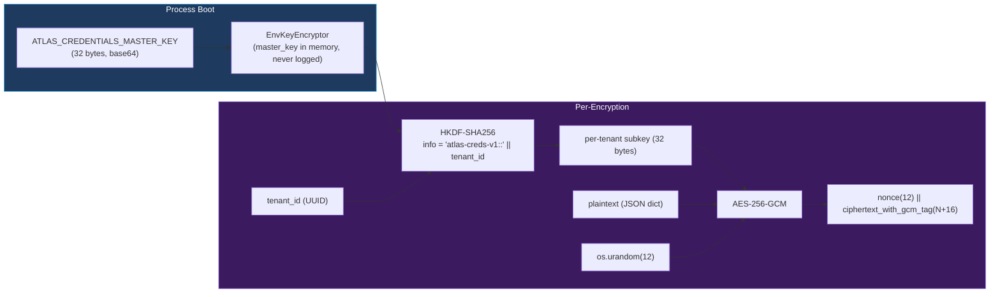
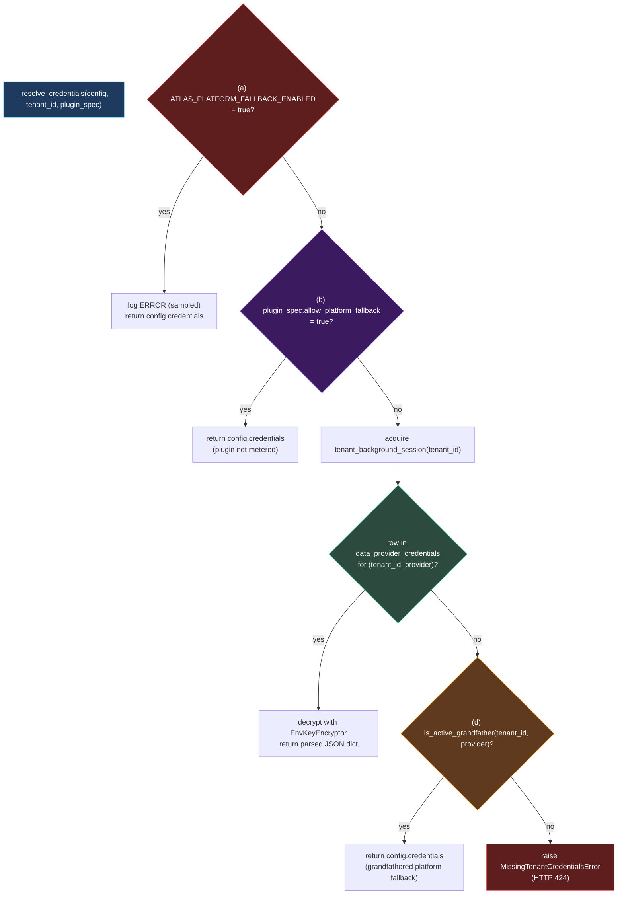

# Atlas — Credential Vault & Resolution

Atlas is a platform, not a data reseller. When a tenant uses the KVK plugin, they use **their** KVK API key — billed to them, rate-limited per their contract with the data provider, revocable by them. The credential vault is the architecture that makes this work without tenants ever seeing the platform-shared keys (when those exist) and without operators ever holding tenant secrets in plaintext.

This page documents the cryptographic construction of the vault, the five-branch precedence chain that resolves a credential at request time, and the deliberate operational levers (`ATLAS_PLATFORM_FALLBACK_ENABLED`, `tenant_provider_grandfather`) that make migrations recoverable.

The architecture was designed across phases **100 → 103** (data table → CRUD API → admin UI → cutover with grandfathering) and extended by phases **106.1, 106.2, 106.3** (OSINT runtime credentials, OpenRouter LLM credentials, per-tenant health probes). The Migration Runbook in `.planning/phases/103-credential-resolution-cutover-migration-grandfathering/MIGRATION.md` is the operator-facing companion document.

## Storage Layer — the `data_provider_credentials` Table

Phase 100 introduced one table:

```sql
CREATE TABLE data_provider_credentials (
    id                     UUID PRIMARY KEY DEFAULT gen_random_uuid(),
    tenant_id              UUID NOT NULL,
    provider_id            TEXT NOT NULL,                   -- matches plugin.yaml `plugin:` field
    credentials_encrypted  BYTEA NOT NULL,                  -- nonce(12) || ct_with_gcm_tag(N+16)
    encryption_key_id      TEXT NOT NULL DEFAULT 'v1',      -- versioned per derivation contract
    created_at             TIMESTAMPTZ NOT NULL DEFAULT now(),
    updated_at             TIMESTAMPTZ NOT NULL DEFAULT now(),
    last_test_status       TEXT,                            -- ok | error | unconfigured | decrypt_error
    last_tested_at         TIMESTAMPTZ,

    UNIQUE (tenant_id, provider_id),
    FOREIGN KEY (provider_id) REFERENCES data_providers(name) ON DELETE NO ACTION
);

ALTER TABLE data_provider_credentials FORCE ROW LEVEL SECURITY;
CREATE POLICY tenant_isolation_atlas_app ON data_provider_credentials
  FOR ALL TO atlas_app
  USING       (tenant_id = current_setting('app.current_tenant_id', true)::uuid)
  WITH CHECK  (tenant_id = current_setting('app.current_tenant_id', true)::uuid);
```

Three design choices in this DDL are load-bearing:

1. **`UNIQUE (tenant_id, provider_id)`** — exactly one credential row per (tenant, provider). Rotation is an `UPDATE`, not an `INSERT` of a new row. There is no concept of "credential history" in the vault itself; the audit trail lives in the `audit_events` log.
2. **`encryption_key_id` is a column, not a constant** — when the master key is rotated in a future hygiene phase, the rotation script reads rows `WHERE encryption_key_id = 'v1'`, decrypts under v1, re-encrypts under v2, and writes back with `encryption_key_id = 'v2'`. The decryption code refuses to decrypt a row whose `key_id` doesn't match its loaded key, which means a half-rotated table has loud failures rather than silent corruption.
3. **`ON DELETE NO ACTION`** — a tenant cannot accidentally delete a `data_providers` row that has live credentials referencing it. Operational hygiene over schema convenience.

## Cryptographic Construction



Three primitives compose the vault:

### Master Key

Loaded **once at startup** from the `ATLAS_CREDENTIALS_MASTER_KEY` environment variable. 32 bytes, base64-encoded on the wire, decoded to raw bytes in memory. Held inside the `EnvKeyEncryptor` instance for the process lifetime. The class explicitly overrides `__repr__` to emit `<EnvKeyEncryptor key_id=v1 master_key=***redacted***>` so a stack trace cannot leak it. The same key is shared by all processes in a deployment (API, workers).

### Per-Tenant Subkey via HKDF-SHA256

Each encryption operation derives a fresh per-tenant subkey:

```python
HKDF(
    algorithm=hashes.SHA256(),
    length=32,
    salt=None,
    info=b"atlas-creds-v1::" + str(tenant_id).encode("ascii"),
).derive(master_key)
```

Two properties this gives:

- **Cross-tenant decryption is cryptographically impossible.** A row encrypted for tenant A cannot be decrypted as tenant B because the AES-GCM authentication tag fails — `cryptography.exceptions.InvalidTag` rather than silent garbage. The Phase 100 contract test `tests/test_credential_encryption.py` asserts exactly this.
- **The `v1` prefix is intentional.** Any future change to the derivation contract — different KDF, different info encoding, different length — must bump to `v2` so existing rows remain decryptable. The version label is part of the persisted row (`encryption_key_id` column).

### AES-256-GCM with Random 12-Byte Nonce

Each encryption generates a fresh 12-byte nonce via `os.urandom`. The persisted layout is:

```
[nonce: 12 bytes] [ciphertext + GCM tag: N + 16 bytes]
```

The nonce is prepended (it's not secret); the GCM tag is appended by the AES-GCM construction itself. Decryption splits at byte 12.

### The Encryptor Protocol — a Future-Proof Seam

The cryptographic construction is wrapped in an `Encryptor` Protocol with one concrete implementation today (`EnvKeyEncryptor`). The seam exists so a future phase can add `KmsEncryptor` (AWS KMS, Azure Key Vault, HashiCorp Vault) without touching `CredentialRepo` callers. ADR-022 defers the KMS migration; the seam is the future-proofing.

## The Five-Branch Resolver Chain

Every metered-provider call — every KVK fetch, every NorthData fetch, every OpenRouter LLM construction, every per-tenant health probe — flows through `ProviderRouter._resolve_credentials(config, tenant_id, plugin_spec=...)`. The function returns a fresh `dict` (never the underlying reference, so plugin clients cannot poison the platform-shared `DataProviderConfig`).

The chain has five branches in strict precedence order:



| # | Branch | When it fires | Why it exists |
|---|---|---|---|
| (a) | **Emergency rollback flag** | `ATLAS_PLATFORM_FALLBACK_ENABLED=true` in the environment | A pre-cutover safety net. If Phase 103's resolver has a bug in production, an operator can flip this flag and every tenant immediately falls back to the platform credential. Sampled `ERROR` log per provider per minute prevents log floods while making the rollback impossible to forget. |
| (b) | **Unmetered plugin** | `plugin.yaml` declares `allow_platform_fallback: true` | Some plugins are not metered — for example, free public registries like the EU VIES VAT validator. The plugin author asserts at design time that platform-shared credentials are acceptable. KVK and NorthData are metered (`false`); only the example plugin is unmetered. |
| (c) | **Tenant credential row** | `data_provider_credentials` has a row for `(tenant_id, provider_id)` | The steady-state happy path. Decrypts with `EnvKeyEncryptor`, returns a copy of the parsed JSON dict. |
| (d) | **Active grandfather** | `tenant_provider_grandfather` has a non-expired row for `(tenant_id, provider_id)` | The migration accommodation. When Phase 103 flipped `allow_platform_fallback: false` for KVK and NorthData, tenants who hadn't yet onboarded their own keys would have been broken — the grandfather mechanism gave them a graceful window. Each row has an explicit expiry; operators clear them as tenants onboard. |
| (e) | **Raise** | None of the above | The resolver raises `MissingTenantCredentialsError`, which the FastAPI error handler maps to **HTTP 424 Failed Dependency** with a body pointing to `/settings/data-providers#<provider>` so the operator knows exactly where to remediate. |

The chain has three deliberate operational properties:

1. **Defensive copy.** Branches (a), (b), (d) all return `dict(config.credentials or {})` — never the underlying reference. A plugin client mutating its credentials dict cannot pollute the platform-shared object that other tenants will subsequently read.
2. **No swallowed exceptions.** If `tenant_background_session` cannot acquire a connection, the exception propagates. The system fails loud, not silent — a busted pool surfaces as a 500 immediately rather than as a wrong-data-by-stale-cache later.
3. **Lazy encryptor lookup.** The encryptor singleton is fetched only when branch (c) fires. Branches (d) and (e) do not depend on the encryptor; a background process whose encryptor singleton is `None` (e.g., a misconfigured worker) will still produce a useful error rather than crashing inside the cipher library. This bug actually surfaced on staging on 2026-05-01 and was fixed in plan 103-03.

## The Grandfather Mechanism

The `tenant_provider_grandfather` table (V125 migration) is the operator's hand on the wheel during a cutover:

```sql
CREATE TABLE tenant_provider_grandfather (
    tenant_id    UUID NOT NULL,
    provider_id  TEXT NOT NULL,
    granted_at   TIMESTAMPTZ NOT NULL DEFAULT now(),
    expires_at   TIMESTAMPTZ NOT NULL,
    note         TEXT,
    PRIMARY KEY (tenant_id, provider_id)
);
```

When Phase 103 cut KVK and NorthData over to per-tenant credentials, every existing tenant got a grandfather row with a 30-day expiry by default. The `is_active_grandfather(conn, tenant_id, provider)` helper checks `expires_at > now()`. Operators clear rows as tenants onboard:

```sql
DELETE FROM tenant_provider_grandfather WHERE tenant_id = $1 AND provider_id = 'kvk';
```

The post-milestone close gate (`tests/test_phase_103_grandfather_empty_at_close.py`) is a CI assertion that fires only at milestone-close: it expects the grandfather table to be empty when the milestone is signed off. Operators must remediate every tenant before v5.1 ships to GA.

## Per-Tenant LLM Credentials (Phase 106.2)

OpenRouter is the LLM gateway for every Atlas crew agent, every Compliance Studio AI feature, and every quality scorer. Phase 106.2 extended the per-tenant credential pattern from data providers to OpenRouter:

```python
# src/integrations/llm_credentials.py
async def get_tenant_llm_api_key(tenant_id: UUID) -> str:
    """Resolve the tenant's OpenRouter API key via the Phase 103 chain.

    Indexes the OSINT plugin's credentials row at `openrouter_api_key`.
    Raises MissingTenantCredentialsError if either the row is absent
    or the field is missing/empty.
    """
```

The key lives inside the OSINT plugin's credential row, indexed at the `openrouter_api_key` field. This is a deliberate choice: tenants configure one credential surface (OSINT), get LLM access automatically, and do not need a separate "Atlas LLM provider" concept. The eight LLM-construction call sites — three Temporal investigation activities, three Compliance Studio Builder sites, the deal-breaker consolidator, the quality scorer, and the financial-analysis route — all thread `tenant_id` through and resolve the key at activity entry.

A documented optimization deferred to a future phase: a short-TTL per-tenant key cache. Today, an investigation that builds seven LLMs (one per crew agent) racks up seven DB+KMS round-trips. Caching halves cold-start latency. The follow-up is captured in `106.2-HUMAN-UAT.md`.

## Per-Tenant Health Probes (Phase 106.3)

Before Phase 106.3, the platform's `HealthCheckWorkflow` ran one probe per provider — using the platform-shared key — and wrote the result to `data_providers.health_status`. After Phase 106.3, the workflow enumerates `(tenant_id, provider_id)` pairs and dispatches a per-pair probe through the same Phase 103 resolver chain. The result lands in `data_provider_credentials.last_test_status` with one of four values:

| `last_test_status` | Meaning |
|---|---|
| `ok` | Probe succeeded — credentials work, provider is reachable |
| `error` | Probe failed at the provider (HTTP 4xx/5xx, timeout) |
| `unconfigured` | Branch (e) of the resolver — tenant has no credentials |
| `decrypt_error` | Row exists but `EnvKeyEncryptor.decrypt` raised — likely a key-version mismatch |

`decrypt_error` is the canary that surfaces a half-rotated key migration. The Settings UI surfaces these states with distinct icons.

## What's Encrypted at Rest

| Surface | Encrypted? | Why |
|---|---|---|
| `data_provider_credentials.credentials_encrypted` | ✅ AES-256-GCM | Tenant secrets — the entire reason the table exists |
| `audit_events.payload` | ❌ Plaintext JSONB | Audit must be readable for regulator review without key escrow |
| `entities.entity_data` JSONB | ❌ Plaintext JSONB | Investigation findings, not credentials |
| Reports in MinIO | ❌ Plaintext PDF | Customer-facing deliverables; encryption is a deployment-layer concern |
| Temporal workflow payloads | ❌ Plaintext (within the cluster) | Tenant identity is in the payload; secrets are not |

The boundary is intentional: only **payloads explicitly given to Atlas as secrets** travel through the vault. Everything else is in plaintext at the application layer because the deployment-layer protections — disk encryption, network segmentation, role-based DB access — are the appropriate defenses.

## Verification Surfaces

- **`tests/unit/test_credential_encryption.py`** — round-trip, cross-tenant rejection, key-id mismatch.
- **`tests/unit/test_credential_repo.py`** — CRUD operations, RLS isolation, unique constraint.
- **`tests/unit/test_credentials_router_no_plaintext.py`** — the admin API never returns the decrypted secret in any response shape.
- **`tests/unit/test_provider_router_resolver.py`** — every branch of the five-branch chain, including the rollback flag and the grandfather happy path.
- **`tests/test_phase_103_no_platform_creds.py`** — 258-case static-grep guard catching `os.environ["KVK_API_KEY"]` regressions and `data_providers.credentials::jsonb` reads.
- **`tests/test_phase_106_2_no_llm_env_vars.py`** + **`tests/test_phase_106_2_dead_code_removed.py`** — fail-closed against `os.environ["OPENROUTER_API_KEY"]` regressions and against re-introducing `_configure_openrouter_env`.
- **CI integration job (Phase 100 T-100-01)** — runs cross-tenant RLS isolation against a live PostgreSQL with the `atlas_app` role.

## Reading Guide

- **[Multi-Tenancy](./multi-tenancy)** — how `tenant_id` flows from JWT to database.
- **[Plugin Architecture](./plugin-architecture)** — how `allow_platform_fallback` and `credentials.schema` are declared.
- **[OSINT Plugin](./osint-plugin)** — how the `openrouter_api_key` field hangs off the OSINT credential row.
- **Migration Runbook** — `.planning/phases/103-credential-resolution-cutover-migration-grandfathering/MIGRATION.md` (235 lines, six sections — operator-facing).
