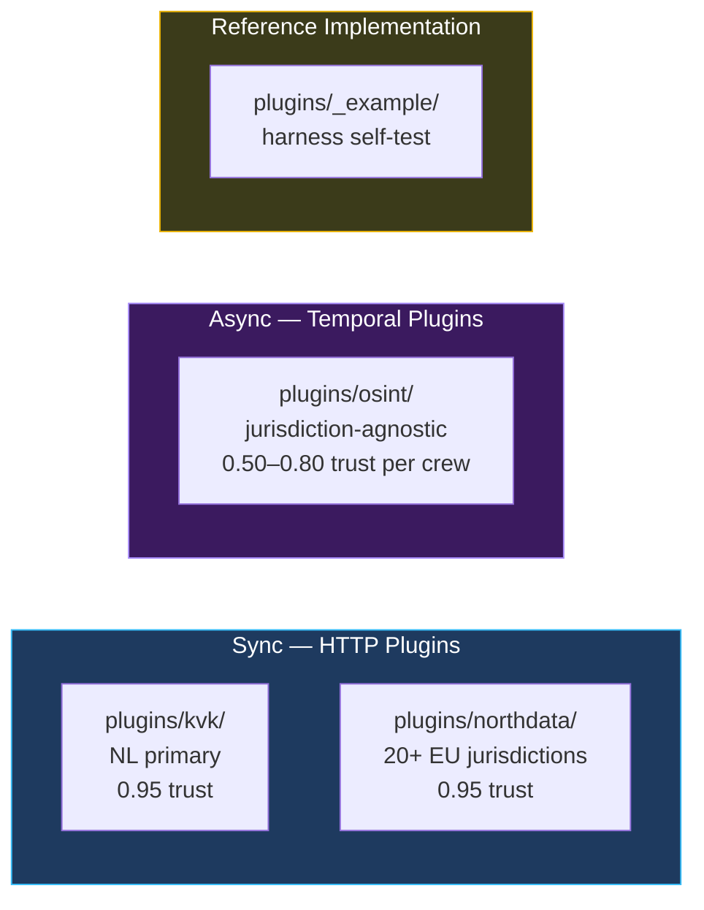
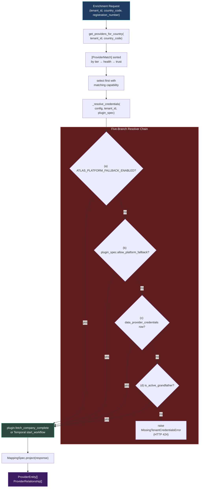
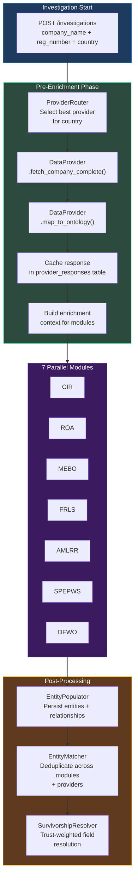

# Atlas — Data Providers

Atlas fetches structured company data from external registries and aggregators through the **plugin substrate** introduced in milestone v5.1. Each provider lives at `plugins/<name>/`, satisfies the formal `plugin.yaml` contract, declares its ontology projection in `mapping_spec.yaml`, and reports a trust level that feeds into entity survivorship and the [claim-plus-rank](./entity-claims) layer.

This page focuses on the *runtime* concerns of data providers: what plugins exist, how requests are routed by country and tier, how trust levels feed survivorship, and how the integration flow connects to the broader investigation pipeline. For the contract that every plugin satisfies — `plugin.yaml` shape, three-layer test harness, sync vs. async execution modes, the disk-authoritative mapping discipline — see **[Plugin Architecture](./plugin-architecture)**.

## Plugin Inventory



| Plugin | Mode | Provider type | Trust level | Tenant credential required |
|---|---|---|---|---|
| `plugins/kvk/` | sync | `company_registry` | 0.95 (official authority) | ✅ Phase 103 cutover; grandfather window during migration |
| `plugins/northdata/` | sync | `aggregator` | 0.95 (aggregated official sources) | ✅ Phase 103 cutover |
| `plugins/osint/` | async | `investigation` | 0.50–0.80 per crew | ✅ Phase 106.1; OpenRouter LLM key in same row |
| `plugins/_example/` | sync | `company_registry` | n/a (reference) | n/a |

### Backlog (deferred to v5.2+)

Two plugins are explicitly scoped for after v5.1 closes:

- **OpenCorporates plugin** — fallback coverage across 140+ jurisdictions. Adds a `fallback` tier in the country-routing matrix.
- **Companies House plugin** — UK primary authority (GB).

By the architecture's promise, both are plugin-only work — no router changes, no UI changes beyond the auto-generated credential form, no migration beyond seeding `data_providers` rows.

## The Two Execution Modes

Atlas's plugin contract treats two structurally different things — an HTTP-shaped registry call and a multi-step LLM-driven investigation — as the same kind of thing. They both produce normalized ontology entities with provenance; they just run on different substrates.

### Sync Plugins (`execution.mode: "sync"`)

A sync plugin is an HTTP client. The contract:

```python
class DataProvider(ABC):
    """Base class for sync-mode plugins. Runs inside the request handler
    or as part of pre-investigation enrichment."""

    @abstractmethod
    async def fetch_company_complete(
        self,
        registration_number: str,
        country_code: str,
        *,
        company_name: str | None = None,
    ) -> ProviderResponse:
        """Fetch complete company data in a single API call."""
        ...

    @abstractmethod
    def map_to_ontology(
        self,
        response: ProviderResponse,
    ) -> list[ProviderEntity | ProviderRelationship]:
        """Map raw provider response to normalized ontology entities.

        Sync plugins delegate this to MappingSpec.project(response)
        loaded from plugins/<name>/mapping_spec.yaml.
        """
        ...
```

**Single-call discipline.** `fetch_company_complete` retrieves all available data in one atomic call (sometimes composed of 2-3 underlying API calls in `client.py`, but always a single logical operation). This avoids multi-step fetch orchestration, rate-limit coordination across endpoints, and partial-data inconsistencies. The full response is cached and reused across investigation modules.

**Disk-authoritative mapping.** `map_to_ontology` no longer contains hand-written Python. It loads `plugins/<name>/mapping_spec.yaml`, validates it against the active ontology, and applies the declarative projection. This is what made the NorthData migration possible: 567 lines of `NorthDataMapper` Python were replaced with a YAML spec without behavioral change (Phase 99).

### Async Plugins (`execution.mode: "async"`)

An async plugin delegates to a Temporal workflow. There is no HTTP client; the `connection.base_url` is a self-documenting sentinel. The contract is satisfied through:

| Sync field | Async equivalent |
|---|---|
| `connection.base_url` | `async://temporal/<WorkflowName>` (sentinel) |
| `client.fetch_company_complete()` | `Temporal.start_workflow(execution.workflow_name, payload)` |
| `MappingSpec` against API response | `MappingSpec` against workflow output (e.g., the seven crew result models) |

The OSINT plugin is the only async plugin in production today. See **[OSINT-as-Plugin](./osint-plugin)** for the full mechanics — the seven crews, the file-loader cache, the redeploy-required immutability contract.

## Normalized Data Types

Provider responses are normalized into three standard types before entering the ontology pipeline. This decouples provider-specific response formats from the entity resolution system.

### ProviderEntity

Represents a single entity discovered by a provider -- a company, person, address, or other ontology type.

| Field | Type | Description |
|-------|------|-------------|
| `entity_type` | str | Ontology entity type (e.g., "LegalEntity", "Person", "Address") |
| `external_id` | str | Provider-specific unique identifier |
| `attributes` | dict | Key-value attribute map matching ontology field names |
| `trust_level` | float | Trust score for this specific entity (may override manifest default) |
| `source` | str | Provider name for provenance tracking |
| `fetched_at` | datetime | Timestamp of data retrieval |

### ProviderRelationship

Represents a relationship between two entities as discovered by a provider.

| Field | Type | Description |
|-------|------|-------------|
| `relationship_type` | str | Ontology relationship type (e.g., "Ownership", "Directorship") |
| `from_entity_id` | str | Source entity external ID |
| `to_entity_id` | str | Target entity external ID |
| `attributes` | dict | Relationship attributes (e.g., ownership percentage, role title) |
| `trust_level` | float | Trust score for this relationship |
| `source` | str | Provider name |

### ProviderResponse

The top-level response object returned by `fetch_company_complete()`.

| Field | Type | Description |
|-------|------|-------------|
| `provider_name` | str | Which provider produced this response |
| `registration_number` | str | The queried registration number |
| `country_code` | str | ISO country code of the queried jurisdiction |
| `raw_data` | dict | Complete unmodified API response (stored for audit) |
| `entities` | list[ProviderEntity] | Extracted entities |
| `relationships` | list[ProviderRelationship] | Extracted relationships |
| `fetched_at` | datetime | When the data was retrieved |
| `cache_ttl` | int | Recommended cache duration in seconds |

## Implemented Providers

### KVK (Dutch Chamber of Commerce) — Phase 96 migration template

The KVK provider was the first integration migrated onto the formal plugin contract. It established the migration template subsequent providers follow: `git mv` into `plugins/<name>/`, author `plugin.yaml` and `mapping_spec.yaml` alongside the existing mapper, add a wrapping adapter for FLAT→WRAPPED shape compatibility, wire the three-layer harness, then cut over.

| Property | Value |
|---|---|
| **Plugin path** | `plugins/kvk/` |
| **Plugin version** | `1.0.0` |
| **Country coverage** | NL (Netherlands — primary authority) |
| **Trust level** | 0.95 (official government registry) |
| **Entity types** | LegalEntity, Address |
| **Endpoints** | `basic_profile`, `establishment_profile`, `naming` (composed into one logical fetch) |
| **Credential field** | `api_key` (36-char `l7xx…` token from developers.kvk.nl) |
| **`allow_platform_fallback`** | `false` (Phase 103 cutover; grandfather window during migration) |
| **`execution.mode`** | `sync` |

The `KVKMapper.map_response` legacy function is preserved byte-unchanged for the parity contract; the wrapping adapter (`_wrap_ontology_mapping` in `client.py`) converts its FLAT output to the WRAPPED shape the harness expects. The `mapping_spec.yaml` targets `ontology_schema_v3_5` and uses `transforms.py` for KVK-specific normalization (legal-form lookups, postcode normalization, ISO date parsing).

### NorthData (European Aggregator) — Phase 97-99 migration

NorthData was the second provider migrated onto the formal contract. Its migration ran the canonical three-phase shadow pattern: skeleton (97) → parity (98) → cutover + delete (99). At cutover, the 567-line `NorthDataMapper` Python class, the entire shadow-plumbing scaffold (`shadow_diff.py`, `shadow_diff_repository.py`, V121 migration table, 5 shadow test files), and 2 operator scripts were deleted in a single revertable commit.

| Property | Value |
|---|---|
| **Plugin path** | `plugins/northdata/` |
| **Plugin version** | `1.0.0` (target ontology v3.5.1 per Phase 96.1) |
| **Country coverage** | 20+ European countries (DE, AT, CH, BE, FR, NL, LU, …) |
| **Trust level** | 0.95 (aggregated from official sources) |
| **Entity types** | LegalEntity, Person, Address, Document |
| **Rich attributes (v3.5.1)** | `financials`, `sheets`, `events`, `segment_codes`, `contact_info`, `capital_history` — promoted in Phase 96.1 to avoid silent drop at cutover |
| **`allow_platform_fallback`** | `false` (Phase 103 cutover) |
| **`execution.mode`** | `sync` |

The shadow-mode pattern that landed Phase 98 — running both old and new mappers in parallel and persisting divergences to `data_provider_shadow_diff` for review — is preserved in the codebase as historical decision provenance (`98.1-DRIFT-REGISTER.md`) but no longer runs in production. The `_wrap_ontology_mapping` adapter in `wrapper.py` mirrors the KVK pattern.

### OSINT (Investigation Engine) — Phase 104-106 migration

The OSINT investigation engine — seven CrewAI-based investigation modules, six MCP tools, OpenRouter LLM gateway — is the canonical async-mode plugin. It satisfies the same `plugin.yaml` contract as KVK and NorthData but executes through Temporal rather than HTTP.

| Property | Value |
|---|---|
| **Plugin path** | `plugins/osint/` |
| **Plugin version** | `0.2.0` |
| **Jurisdictions** | `["XX"]` (sentinel — jurisdiction-agnostic) |
| **Trust level** | 0.50–0.80 per crew (configured per-source in `MODULE_TRUST_SCORES`) |
| **Entity types** | LegalEntity, Person, Address |
| **Endpoints** | The seven crew names: `cir`, `roa`, `mebo`, `spepws`, `amlrr`, `dfwo`, `frls` |
| **Credentials** | `openrouter_api_key` (mandatory), four optional MCP tokens (Brightdata, Exa, Tavily, Google Maps) |
| **`allow_platform_fallback`** | `false` (Phase 106.1 — secure-by-default) |
| **`execution.mode`** | `async` (delegates to `InvestigationWorkflow`) |
| **Immutability** | Redeploy-required — file-loader cache primed at lifespan; CI version-bump gate fails closed on prompt/agent/tool changes without `version:` bump |

See the dedicated **[OSINT-as-Plugin](./osint-plugin)** page for the seven-crew architecture, the `projector.py` declarative ontology projector, the file-loader pattern, and the per-tenant LLM credential resolution.

## Provider Infrastructure

The provider infrastructure has three responsibilities: storing provider configuration, resolving the right provider for a request, and resolving the right *credential* for the (tenant, provider) pair. The first lives in `data_providers`; the second in `ProviderRouter`; the third in the [Credential Vault](./credential-vault).

### `data_providers` Table — Provider Configuration

The legacy "credentials column on data_providers" pattern was retired in Phase 103. `data_providers` now stores only static configuration: name, display name, provider type, default trust level, country tier mappings, enabled flag, health status. Tenant secrets live in the separate `data_provider_credentials` table with FORCE RLS and AES-256-GCM encryption — see [Credential Vault](./credential-vault).

| Column class | Purpose |
|---|---|
| Identity | `name` (matches `plugin.yaml` `plugin:` field), `display_name`, `provider_type` |
| Routing | `country_codes[]`, per-country tier (primary / secondary / fallback) |
| Trust | `default_trust_level` (overridable per-entity by the plugin's `mapping_spec.yaml`) |
| Health | `health_status` (legacy column; UI-only as of Phase 106.3 — backend reads `data_provider_credentials.last_test_status`) |
| Lifecycle | `enabled` flag (toggleable from Settings → Data Providers); `created_at`, `updated_at` |

The `update_credentials` mutation that pre-Phase-103 wrote tenant secrets to a JSONB column on this table is *deleted*. Static-grep guards in CI (`tests/test_phase_103_no_platform_creds.py`, 258 cases) fail closed on any reintroduction of the pattern.

### ProviderRouter — Routing + Credential Resolution

`ProviderRouter` is the coordination point for every metered-provider call. It does two things:

1. **Selects the right provider for a (tenant, country, capability) request.** Tier ranking (primary > secondary > fallback), enabled status, health status, trust level.
2. **Resolves credentials for the chosen provider through the five-branch chain** documented in [Credential Vault](./credential-vault).



`get_providers_for_country(tenant_id, country_code)` requires `tenant_id` (Phase 103 — no default, no sentinel). `_resolve_credentials` returns a fresh `dict` (defensive copy — plugin clients cannot poison the platform-shared `DataProviderConfig`).

### StaleCheck

The `StaleCheck` service monitors company data freshness. It compares the `fetched_at` timestamp of the latest `ProviderResponse` against a configurable staleness threshold (default: 30 days). Stale companies are flagged in the portfolio view, and compliance officers can trigger a manual refresh.

| Check | Threshold | Result |
|-------|-----------|--------|
| Fresh | < 30 days since last fetch | No action needed |
| Stale | 30-90 days since last fetch | Warning badge in UI, refresh recommended |
| Expired | > 90 days since last fetch | Alert badge in UI, refresh strongly recommended |

### Health Check Workflow

A Temporal health check workflow runs periodically to verify that all enabled providers are reachable and returning valid data. The workflow:

1. Iterates through all enabled providers
2. Sends a lightweight test request (minimal company lookup)
3. Records response time, HTTP status, and data completeness
4. Updates the provider's health status in the database
5. Generates alerts for providers that fail consecutively

## Provider Routing by Country

Providers are mapped to countries with tier assignments that control routing priority. The coverage matrix is managed through the Data Provider settings UI and API.

| Country | Primary Provider | Secondary Provider |
|---------|-----------------|-------------------|
| NL | KVK | NorthData |
| DE | NorthData | -- |
| BE | NorthData | -- |
| FR | NorthData | -- |
| AT | NorthData | -- |
| CH | NorthData | -- |

Additional countries can be added by configuring existing providers with new country coverage entries or by implementing new `DataProvider` plugins.

## Trust Levels and Survivorship

Provider trust levels are a critical input to the ontology's survivorship system. When multiple providers report conflicting values for the same entity field (e.g., different registered addresses), the `SurvivorshipResolver` uses trust levels as a primary signal for field resolution:

- **highest_trust** strategy -- the value from the provider with the highest trust level wins
- **latest_wins** strategy -- the most recently fetched value wins, regardless of trust
- **manual_review** strategy -- the conflict is flagged for human resolution

Trust levels are not binary. An official registry (KVK, trust 0.95) carries more weight than a web scraper (trust 0.60), but both contribute evidence to the entity's provenance chain. The full lineage of every field value -- which providers reported what, when, and with what trust level -- is preserved in the mutation queue for audit.

## API Endpoints

Provider management is exposed through approximately 25 API endpoints under the `/settings/data-providers` prefix. See the [API Reference](./api-reference#data-provider-endpoints) for the complete endpoint table. Key capabilities include:

| Capability | Endpoints |
|------------|-----------|
| Provider CRUD | Create, read, update, delete, toggle enabled |
| Credential management | Store and rotate API keys securely |
| Country coverage | Add/remove/update country mappings and tier assignments |
| Coverage analysis | Coverage by country, summary statistics, best provider per country |
| Data freshness | Check staleness per company, trigger manual refresh |
| Enriched data | Retrieve cached enrichment data for a company |
| Debug | Inspect raw entity extraction from provider responses |

## Integration Flow

The following diagram shows how data providers integrate into the broader investigation pipeline.



The enrichment context produced by data providers is distributed to all 7 investigation modules as seed data. Modules use this context to avoid redundant lookups and to validate LLM-discovered information against structured registry data. After all modules complete, the EntityMatcher deduplicates entities discovered by both providers and LLM agents, with the SurvivorshipResolver applying trust-weighted field resolution to produce canonical golden records.
