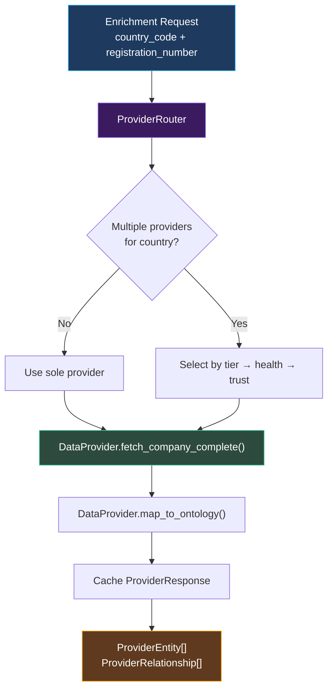
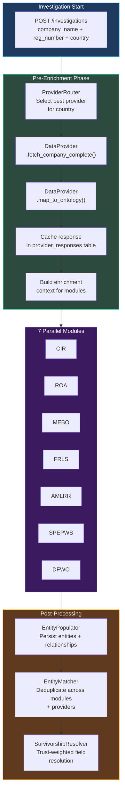

# Atlas — Data Providers

Atlas uses a plugin-based data provider architecture to fetch structured company data from external registries and aggregators. Each provider implements a standard interface, maps its response to the ontology schema, and reports a trust level that feeds into entity survivorship resolution. The system routes requests to the best available provider for each country and capability combination.

## Plugin Architecture

Every data provider implements the `DataProvider` abstract base class, which enforces a single-call contract: one API request fetches the complete company profile.

### Core Principle: Single API Call

Each provider's `fetch_company_complete()` method retrieves all available data in a single atomic API call. This avoids the complexity of multi-step fetch orchestration, rate limit coordination across endpoints, and partial-data inconsistencies. The full response is cached and reused across investigation modules.

### DataProvider ABC

```python
class DataProvider(ABC):
    """Base class for all data provider plugins."""

    @abstractmethod
    async def fetch_company_complete(
        self,
        registration_number: str,
        country_code: str,
        *,
        company_name: str | None = None,
    ) -> ProviderResponse:
        """Fetch complete company data in a single API call."""
        ...

    @abstractmethod
    def map_to_ontology(
        self,
        response: ProviderResponse,
    ) -> list[ProviderEntity | ProviderRelationship]:
        """Map raw provider response to normalized ontology entities."""
        ...

    @property
    @abstractmethod
    def manifest(self) -> PluginManifest:
        """Return plugin metadata and capabilities."""
        ...
```

### PluginManifest

Every provider declares its capabilities through a `PluginManifest` dataclass. The manifest includes semver versioning, supported country codes, entity types the provider can discover, and a default trust level.

```python
@dataclass
class PluginManifest:
    name: str                    # Unique provider identifier (e.g., "kvk", "northdata")
    version: str                 # Semver version string (e.g., "1.2.0")
    description: str             # Human-readable description
    countries: list[str]         # ISO 3166-1 alpha-2 country codes
    entity_types: list[str]      # Ontology entity types this provider discovers
    trust_level: float           # Default trust score (0.0 - 1.0)
    requires_api_key: bool       # Whether credentials are needed
    rate_limit: int | None       # Requests per minute (None = unlimited)
```

## Normalized Data Types

Provider responses are normalized into three standard types before entering the ontology pipeline. This decouples provider-specific response formats from the entity resolution system.

### ProviderEntity

Represents a single entity discovered by a provider -- a company, person, address, or other ontology type.

| Field | Type | Description |
|-------|------|-------------|
| `entity_type` | str | Ontology entity type (e.g., "LegalEntity", "Person", "Address") |
| `external_id` | str | Provider-specific unique identifier |
| `attributes` | dict | Key-value attribute map matching ontology field names |
| `trust_level` | float | Trust score for this specific entity (may override manifest default) |
| `source` | str | Provider name for provenance tracking |
| `fetched_at` | datetime | Timestamp of data retrieval |

### ProviderRelationship

Represents a relationship between two entities as discovered by a provider.

| Field | Type | Description |
|-------|------|-------------|
| `relationship_type` | str | Ontology relationship type (e.g., "Ownership", "Directorship") |
| `from_entity_id` | str | Source entity external ID |
| `to_entity_id` | str | Target entity external ID |
| `attributes` | dict | Relationship attributes (e.g., ownership percentage, role title) |
| `trust_level` | float | Trust score for this relationship |
| `source` | str | Provider name |

### ProviderResponse

The top-level response object returned by `fetch_company_complete()`.

| Field | Type | Description |
|-------|------|-------------|
| `provider_name` | str | Which provider produced this response |
| `registration_number` | str | The queried registration number |
| `country_code` | str | ISO country code of the queried jurisdiction |
| `raw_data` | dict | Complete unmodified API response (stored for audit) |
| `entities` | list[ProviderEntity] | Extracted entities |
| `relationships` | list[ProviderRelationship] | Extracted relationships |
| `fetched_at` | datetime | When the data was retrieved |
| `cache_ttl` | int | Recommended cache duration in seconds |

## Implemented Providers

### KVK (Dutch Chamber of Commerce)

The KVK provider fetches company data from the Dutch Kamer van Koophandel registry. It consists of two components: `KVKClient` for API communication and `KVKMapper` for ontology mapping.

| Property | Value |
|----------|-------|
| **Provider name** | `kvk` |
| **Country coverage** | NL (Netherlands) |
| **Trust level** | 0.95 (official government registry) |
| **Entity types** | LegalEntity, Person, Address |
| **API type** | REST (JSON) |
| **Authentication** | API key |

**KVKClient** handles authentication, request construction, and response parsing for the KVK API. It fetches the company profile, branch offices, and officer information in a single consolidated call.

**KVKMapper** transforms the raw KVK JSON response into `ProviderEntity` and `ProviderRelationship` objects using a YAML mapping specification. The mapping spec defines field-by-field correspondence between KVK response fields and ontology attributes, including data type conversions, value normalization, and conditional mapping rules.

### NorthData (European Company Data Aggregator)

NorthData provides aggregated company information across European jurisdictions. It serves as a high-quality enrichment source for countries where Atlas does not have a direct registry integration.

| Property | Value |
|----------|-------|
| **Provider name** | `northdata` |
| **Country coverage** | 20+ European countries (DE, NL, BE, FR, AT, CH, and more) |
| **Trust level** | 0.95 (aggregated from official sources) |
| **Entity types** | LegalEntity, Person, Address, Document |
| **API type** | REST (JSON) |
| **Authentication** | API key |

**NorthDataClient** communicates with the NorthData API to fetch company profiles, financial filings, officer lists, and corporate events. It includes response caching to avoid redundant API calls when multiple investigation modules request the same company.

**NorthDataMapper** maps the NorthData response format to ontology entities. NorthData returns deeply nested structures (company -> officers -> roles -> dates), which the mapper flattens into discrete Person entities with Directorship and Ownership relationships.

## Provider Infrastructure

### DataProviderRepository

Provider configurations are stored in the database, enabling runtime management without code deployment. The repository supports full CRUD operations for providers, their country coverage mappings, and encrypted credential storage.

| Operation | Description |
|-----------|-------------|
| List providers | Return all configured providers with enabled/disabled status |
| Create provider | Register a new provider with manifest and credentials |
| Update provider | Modify provider configuration (name, settings, trust level) |
| Delete provider | Remove provider and all associated country mappings |
| Toggle enabled | Enable or disable a provider without deleting it |
| Update credentials | Securely store or rotate API keys and secrets |
| Country coverage | CRUD operations for which countries a provider serves |

### ProviderRouter

The `ProviderRouter` routes data requests to the best available provider for a given country and capability combination. When multiple providers cover the same country, the router selects based on:

1. **Tier ranking** -- providers are assigned a tier (primary, secondary, fallback) per country
2. **Enabled status** -- disabled providers are skipped
3. **Health status** -- providers failing health checks are deprioritized
4. **Trust level** -- among equal-tier providers, higher trust wins



### StaleCheck

The `StaleCheck` service monitors company data freshness. It compares the `fetched_at` timestamp of the latest `ProviderResponse` against a configurable staleness threshold (default: 30 days). Stale companies are flagged in the portfolio view, and compliance officers can trigger a manual refresh.

| Check | Threshold | Result |
|-------|-----------|--------|
| Fresh | < 30 days since last fetch | No action needed |
| Stale | 30-90 days since last fetch | Warning badge in UI, refresh recommended |
| Expired | > 90 days since last fetch | Alert badge in UI, refresh strongly recommended |

### Health Check Workflow

A Temporal health check workflow runs periodically to verify that all enabled providers are reachable and returning valid data. The workflow:

1. Iterates through all enabled providers
2. Sends a lightweight test request (minimal company lookup)
3. Records response time, HTTP status, and data completeness
4. Updates the provider's health status in the database
5. Generates alerts for providers that fail consecutively

## Provider Routing by Country

Providers are mapped to countries with tier assignments that control routing priority. The coverage matrix is managed through the Data Provider settings UI and API.

| Country | Primary Provider | Secondary Provider |
|---------|-----------------|-------------------|
| NL | KVK | NorthData |
| DE | NorthData | -- |
| BE | NorthData | -- |
| FR | NorthData | -- |
| AT | NorthData | -- |
| CH | NorthData | -- |

Additional countries can be added by configuring existing providers with new country coverage entries or by implementing new `DataProvider` plugins.

## Trust Levels and Survivorship

Provider trust levels are a critical input to the ontology's survivorship system. When multiple providers report conflicting values for the same entity field (e.g., different registered addresses), the `SurvivorshipResolver` uses trust levels as a primary signal for field resolution:

- **highest_trust** strategy -- the value from the provider with the highest trust level wins
- **latest_wins** strategy -- the most recently fetched value wins, regardless of trust
- **manual_review** strategy -- the conflict is flagged for human resolution

Trust levels are not binary. An official registry (KVK, trust 0.95) carries more weight than a web scraper (trust 0.60), but both contribute evidence to the entity's provenance chain. The full lineage of every field value -- which providers reported what, when, and with what trust level -- is preserved in the mutation queue for audit.

## API Endpoints

Provider management is exposed through approximately 25 API endpoints under the `/settings/data-providers` prefix. See the [API Reference](./api-reference#data-provider-endpoints) for the complete endpoint table. Key capabilities include:

| Capability | Endpoints |
|------------|-----------|
| Provider CRUD | Create, read, update, delete, toggle enabled |
| Credential management | Store and rotate API keys securely |
| Country coverage | Add/remove/update country mappings and tier assignments |
| Coverage analysis | Coverage by country, summary statistics, best provider per country |
| Data freshness | Check staleness per company, trigger manual refresh |
| Enriched data | Retrieve cached enrichment data for a company |
| Debug | Inspect raw entity extraction from provider responses |

## Integration Flow

The following diagram shows how data providers integrate into the broader investigation pipeline.



The enrichment context produced by data providers is distributed to all 7 investigation modules as seed data. Modules use this context to avoid redundant lookups and to validate LLM-discovered information against structured registry data. After all modules complete, the EntityMatcher deduplicates entities discovered by both providers and LLM agents, with the SurvivorshipResolver applying trust-weighted field resolution to produce canonical golden records.
