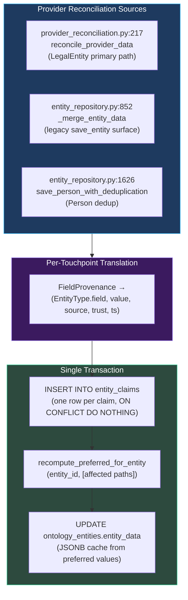
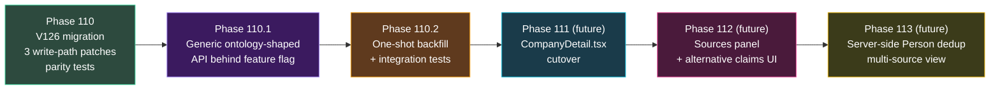

# Atlas — Entity Claims & Claim-Plus-Rank

When KVK says a Dutch company's registered address is `Herengracht 1, Amsterdam` and NorthData says it's `Herengracht 1A, Amsterdam`, what does Atlas show the analyst?

For the platform's first three years, the answer was: **the winner**. The merge layer applied a survivorship strategy (most-trusted, most-recent, most-complete) and wrote a single value into the entity. The losing claim was discarded.

As of milestone v5.1, the answer is: **the winner, by default, with the alternatives one click away**. Every claim from every provider is preserved, ranked, and surfaceable. This page documents the data model — `entity_claims` — that makes that possible, the Phase 109 decision that committed Atlas to this pattern, and the staged Phase 110 / 110.1 / 110.2 implementation that ships it without disrupting any read path.

## The Decision: Phase 109

Phase 109 was a one-week, code-free **research spike**. No code changes, no migrations, no PRs. The deliverable was a single signed-off document — `.planning/research/multiplicity-decision.md` — with a binary outcome.

The question:

> Does Atlas's golden-record / merge layer evolve to **preserve losing claims** (Pattern 2 from heterogeneous-source display research — claim-plus-rank, Wikidata-style) or stay with **winner-takes-all** (the current `SurvivorshipStrategy` model in `src/ontology/reconciliation.py`)?

The constraints on the answer were strict:

- **Binary platform-wide.** One pattern for all entity types (LegalEntity, Person, Address). No per-entity-type matrix. No per-attribute strategies in metadata.
- **No DDL spike.** The doc could include named tables and constraints in prose; SQL was a future phase's job.
- **No proof-of-concept.** Pure research.

The decision: **adopt claim-plus-rank, platform-wide, binary**. The seven `SurvivorshipStrategy` strategies (`MOST_RECENT`, `MOST_TRUSTED`, `MOST_COMPLETE`, `MOST_SPECIFIC`, `AGGREGATE`, `CANONICAL`, `FIRST_NON_NULL`) are unchanged in semantics — they still pick the winner. The only thing that changes is *when* losing claims are discarded: previously at write-time (lost forever); now never (preserved alongside, with the winner flagged `is_preferred=true`).

## The Wikidata Anchor

Atlas's claim-plus-rank pattern is the Wikidata claim model adapted for compliance. The vocabulary is borrowed deliberately:

| Wikidata concept | Atlas adaptation |
|---|---|
| **Item** | An ontology entity (LegalEntity, Person, Address) |
| **Property** | An ontology attribute (`legal_name`, `registration_number`) |
| **Claim** | One source's assertion about one (entity, property) pair |
| **Reference** | The provenance — which provider, which call, which timestamp |
| **Rank: preferred** | `is_preferred=true` on the survivorship-winning claim |
| **Rank: normal** | The default for every other claim |
| **Rank: deprecated** | Reserved — not yet used in Atlas; will surface manually-deprecated claims when the analyst override UI lands |

Borrowing the vocabulary means that anyone who has read about Wikidata data modeling has a mental scaffold for Atlas's behavior — and the inverse, anyone who internalizes Atlas's compliance use case can bring it to other knowledge-graph projects.

## The Data Model — `entity_claims` (V126)

Phase 110 migration `V126__entity_claims.sql` creates the table:

```sql
CREATE TABLE entity_claims (
    id                          UUID        PRIMARY KEY DEFAULT gen_random_uuid(),
    tenant_id                   UUID        NOT NULL,
    entity_id                   UUID        NOT NULL REFERENCES ontology_entities(id) ON DELETE CASCADE,
    attribute_path              TEXT        NOT NULL,      -- "{EntityType}.{field}"
    value                       JSONB       NOT NULL,      -- canonical projected value
    raw_value                   JSONB,                     -- pre-transform value, for audit
    source_module               TEXT        NOT NULL,      -- "kvk" | "northdata" | "osint:cir" | …
    source_trust                NUMERIC(3,2),              -- snapshot at write-time
    retrieved_at                TIMESTAMPTZ NOT NULL,      -- when the source produced this claim
    is_preferred                BOOLEAN     NOT NULL DEFAULT false,
    survivorship_strategy       TEXT,                      -- which strategy picked the preferred
    discovered_by_investigation_id  UUID,
    created_at                  TIMESTAMPTZ NOT NULL DEFAULT now()
);

-- exactly one preferred claim per (entity, attribute)
CREATE UNIQUE INDEX entity_claims_one_preferred
    ON entity_claims (entity_id, attribute_path)
    WHERE is_preferred = true;

-- read-path: get all claims for an entity, preferred first
CREATE INDEX entity_claims_lookup
    ON entity_claims (entity_id, attribute_path, is_preferred DESC, retrieved_at DESC);

-- tenant-scoped RLS scan
CREATE INDEX entity_claims_tenant ON entity_claims (tenant_id);

-- idempotency: same source + same timestamp = one row
CREATE UNIQUE INDEX entity_claims_idempotency
    ON entity_claims (entity_id, attribute_path, source_module, retrieved_at);

ALTER TABLE entity_claims FORCE ROW LEVEL SECURITY;
CREATE POLICY tenant_isolation_atlas_app ON entity_claims
    FOR ALL TO atlas_app
    USING       (tenant_id = current_setting('app.current_tenant_id', true)::uuid)
    WITH CHECK  (tenant_id = current_setting('app.current_tenant_id', true)::uuid);

GRANT SELECT, INSERT, UPDATE ON entity_claims TO atlas_app;
-- DELETE intentionally not granted: claims are never routinely deleted
```

Three constraints encode the contract:

| Constraint | Invariant it preserves |
|---|---|
| **Partial unique on `is_preferred=true`** | No more than one preferred claim per `(entity, attribute)` — the database refuses inconsistent state |
| **Idempotency unique on `(entity, attribute, source, retrieved_at)`** | Retried writes (e.g., Temporal activity retry after partial failure) are no-ops, not duplicates |
| **No `DELETE` grant** | Claims are immutable history; only `is_preferred` flips. The analyst-override UX (future phase) will use a `deprecated_at` flag, not a delete |

### Canonical Attribute Path Format

`attribute_path` is namespaced as `{EntityType}.{field}` — `LegalEntity.legal_name`, `LegalEntity.registration_number`, `Person.full_name`, `Address.street`. The format is platform-wide and self-describing: the path tells you both the entity type and the field, with no ambiguity when the same field name appears across entity types.

The internal namespacing used by `provider_reconciliation.py:_build_provenance` (`attributes.legal_name`, reflecting the JSONB sub-dict structure) is *translated* to the canonical form at write time. The translation table is small (one mapping per provider sub-dict) and lives next to the writer.

## The Write-Path

Three places in the codebase write entities. All three were patched in Phase 110 to also emit `entity_claims` rows:



### Step 1 — Insert Claims

For each `(attribute, value, source, trust, retrieved_at)` tuple from the provider, the writer emits an `INSERT … ON CONFLICT DO NOTHING` against `entity_claims`. The idempotency unique constraint catches duplicates from retry loops without raising.

### Step 2 — Recompute Preferred

The new helper `recompute_preferred_for_entity(entity_id, affected_attribute_paths)` lives next to `SurvivorshipResolver` so it can reuse the existing strategy logic:

```python
def recompute_preferred_for_entity(
    entity_id: UUID,
    attribute_paths: Iterable[str],
) -> None:
    """For each affected attribute, read all claims, apply the
    survivorship strategy, flip is_preferred flags atomically."""
    for path in attribute_paths:
        claims = fetch_claims_for(entity_id, path)
        winner = SurvivorshipResolver.resolve_field_value(claims)
        update_is_preferred(entity_id, path, winner.id)
```

The strategy choice is per-attribute, encoded in the ontology schema. `MOST_TRUSTED` for `LegalEntity.legal_name`; `MOST_RECENT` for `Address.last_seen_at`; `FIRST_NON_NULL` for fields where presence-vs-absence is what matters.

### Step 3 — Refresh the JSONB Cache

`ontology_entities.entity_data` is a JSONB column that mirrors the *current preferred* claims. Every existing reader — `CompanyDetail.tsx`, the `/api/companies/{id}` endpoint, the report generator, the Neo4j sync — reads from this cache. The Phase 110 contract is: **after the write-path swap, the cache is byte-equal to what the legacy `_merge_entity_data` produced**. No reader needs to change. The migration is transparent at the read-path until Phase 110.1 lands the new shape behind a feature flag.

The whole sequence — claims insert, preferred recompute, cache refresh — runs in **one PostgreSQL transaction** with a row-level lock on the parent `ontology_entities` row. Failure semantics are atomic: if any step aborts, no claims land, no preferred flag flips, no cache update happens. The system is consistent at every transaction boundary.

## The Parity Test Strategy

The risk in a write-path swap is the read path silently producing different output. Phase 110's parity tests close that risk:

| Layer | What it asserts |
|---|---|
| **Snapshot parity** | For each fixture entity, run the OLD write-path and the NEW write-path on the same input claim sequence; assert resulting `ontology_entities.entity_data` and `provenance` JSONB are byte-equal |
| **Property tests** | `apply_old_write_path(claims) == apply_new_write_path(claims).entity_data` over randomly generated claim sequences. Bounded run time — 50 cases per CI run via `hypothesis` |
| **RLS test** | A tenant cannot SELECT another tenant's `entity_claims` rows even with a valid `entity_id` |

The fixture corpus covers eight scenarios:

1. KVK-only LegalEntity (one provider, no merge contention)
2. NorthData-only LegalEntity (one provider, no merge contention)
3. KVK + NorthData merged LegalEntity (provider conflict — multiple values per field)
4. OSINT-only entity (sparse / partial claim set)
5. OSINT + KVK merged Person entity (the dedup path)
6. Each of the seven `SurvivorshipStrategy` strategies, exercised by at least one fixture
7. All-NULL fields (boundary)
8. All-fields-populated (boundary)

A property test failure does not necessarily mean the new write-path is wrong; it might mean a fixture with an unusual claim ordering exposes a pre-existing inconsistency in the legacy write-path. The Phase 110 plan explicitly notes: parity tests prove the cache is byte-unchanged, **not** that the cache is correct. Cache correctness is verified by Phase 110.2's integration tests.

## The Phased Rollout

Phase 110 ships **only** the data model and write-path. No reader consumes `entity_claims`. The phased rollout is:



| Phase | Status | What it ships | Reader impact |
|---|---|---|---|
| **110** | ✅ Shipped 2026-05-06 | V126 + 3 write-path patches + parity | Zero — `entity_claims` populates, nothing reads from it |
| **110.1** | ✅ Shipped 2026-05-06 | Canonical ontology-shaped API behind `?shape=canonical` feature flag | Zero — default `?shape=legacy` is byte-equivalent |
| **110.2** | 🟡 Planning | One-shot backfill of legacy `entity_data` into `entity_claims` + KVK+NorthData integration tests + operator runbook | Zero — backfill is read-only against `ontology_entities` |
| **111** (future) | ⏳ Not planned | Frontend cutover of `CompanyDetail.tsx` to consume `?shape=canonical` | Visible — sources & per-field provenance surface in UI |
| **112** (future) | ⏳ Not planned | Sources panel with alternative-claims-on-hover | Visible — analyst sees losing claims |
| **113** (future) | ⏳ Not planned | Server-side Person dedup with multi-source view | Visible — analyst sees "this person appeared in 3 sources, here's each source's view" |

The staging is deliberate. Each phase is independently revertable. Each phase ships without operational gating (no shadow-write, no live-traffic comparison). Each phase preserves the existing behavior at every commit boundary — until the very last phase makes the new behavior visible.

## What This Unlocks

The compliance UX consequences of claim-plus-rank are non-trivial. With it:

- **Auditability gains a new floor.** A regulator asking "where did this address come from?" can be answered with the claim row — provider, timestamp, raw value before transform.
- **Sources panel becomes possible.** Analysts can see, for any field, which sources contributed claims and what each source said. Hover to see the alternative; click to follow back to the source's full response.
- **Multi-source Person view becomes possible.** A director who appears in KVK, NorthData, and an OSINT investigation has three claim sets — three names with different spellings, three role descriptions, three retrieval dates — and the analyst sees all three with the dedup match score.
- **Discrepancy detection becomes data, not heuristics.** "KVK says A; NorthData says B" is a SQL query, not an ad-hoc service.

These features aren't shipped yet (they live in phases 111-113). The data foundation is what makes them feasible to build without re-engineering the merge layer.

## What This Does Not Change

- **Survivorship strategies are unchanged.** The seven enum members are byte-identical to pre-110. The only change is *what happens to losers*.
- **The mutation queue stays wired to Compliance Studio Schema Designer only.** Provider data ingestion does not connect to `ontology_mutations` / `field_provenance` / `conflict_records` — those remain Schema Designer concerns.
- **Trust-score calibration is not touched.** `MODULE_TRUST_SCORES` and `SchemaCache.get_provider_trust` keep their current values; `entity_claims.source_trust` is a write-time snapshot of whatever the resolver looks up.
- **Mappings are still platform-wide and on disk.** Plugin mapping_specs are not tenant-overridable; the per-tenant variance is in claim survivorship, not in the projection contract.

## Verification Surfaces

- **`tests/test_v126_entity_claims_migration.py`** — table shape, indexes, RLS posture.
- **`tests/test_entity_claims_parity.py`** — snapshot byte-equality for the 8-scenario fixture corpus.
- **`tests/test_entity_claims_property.py`** — `hypothesis`-driven property tests over randomized claim sequences.
- **`tests/test_entity_claims_rls.py`** — cross-tenant SELECT rejection.
- **`tests/test_save_person_with_deduplication_claims.py`** — Person path emits claims correctly.
- **byte-equivalence guard** — `.planning/phases/110-entity-claims-data-model-and-write-path/byte-equivalence-guard.sh` — operator-runnable script that asserts the legacy `?shape=legacy` API is byte-identical post-migration.

## Reading Guide

- **[Ontology System](./ontology-system)** — what an entity is, what survivorship strategies are, how reconciliation works.
- **[Data Providers](./data-providers)** — which providers feed claims and what trust levels they carry.
- **[Multi-Tenancy](./multi-tenancy)** — how `tenant_id` on every claim row is enforced by RLS.
- **Phase 109 decision document** — `.planning/research/multiplicity-decision.md` (the canonical record of why claim-plus-rank won).
