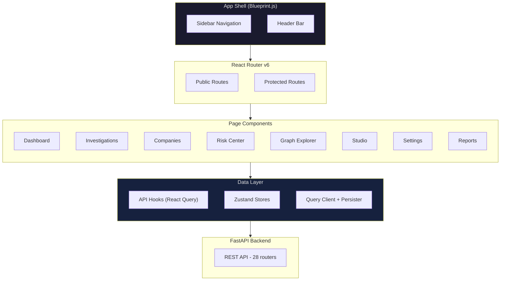
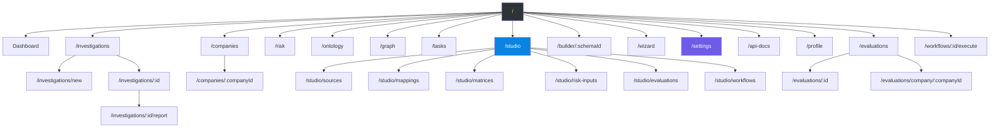

# Atlas — Frontend Architecture

Atlas ships a **React 18.2 single-page application** built with Blueprint.js v5, Vite, and TypeScript. The frontend covers investigation management, company portfolio oversight, risk analysis, graph exploration, workflow studio, and platform configuration -- roughly 35+ pages organized into 6 major domains.

## Tech Stack

| Layer | Technology | Version |
|-------|-----------|---------|
| **Framework** | React | 18.2 |
| **UI Library** | Blueprint.js | v5.10 |
| **Build Tool** | Vite | latest |
| **Language** | TypeScript | strict mode |
| **State Management** | Zustand | 4.5 |
| **Data Fetching** | TanStack React Query | v5.28 |
| **Forms** | React Hook Form + Zod | 7.72 / 3.24 |
| **Authentication** | Keycloak.js | v26 (OIDC) |
| **Routing** | React Router | v6.22 |
| **Graph Visualization** | Cytoscape.js | v3.28 |
| **Charts** | Recharts | v2.12 |
| **PDF Generation** | @react-pdf/renderer | v4.3 |
| **Code Editor** | CodeMirror | v6 (YAML editing) |
| **Drag & Drop** | @dnd-kit | v6.3 |
| **API Docs** | Swagger UI React | v5.32 |

## Application Architecture



## Authentication

Authentication uses **Keycloak.js v26** with standard OIDC authorization code flow:

- `AuthProvider` wraps the app, initializes Keycloak on mount
- `RequireAuth` component gates protected routes
- JWT tokens attached to all API requests via Axios interceptor
- Three platform roles: `atlas-viewer`, `atlas-editor`, `atlas-admin`
- Workflow roles (analyst, senior_officer, mlro, etc.) mapped from Keycloak groups

Pages include Login, Forgot Password, Reset Password, and Invite Sign-Up for team onboarding.

## State Management

### Zustand Stores

Atlas uses lightweight Zustand stores for UI state that doesn't belong in React Query's server cache:

| Store | Purpose |
|-------|---------|
| `evaluationStore` | Risk evaluation UI state (selected company, active matrix) |
| `mappingStore` | Source-to-ontology mapping designer state |
| `previewStore` | Entity preview panel state |

### React Query

All server data flows through **TanStack React Query v5** with:

- **Typed hooks**: `useInvestigations`, `useCompanies`, `useRiskCenter`, `useOntologyExplorer`, `useWorkflowTasks`, `usePortfolioEvaluation`, `useSchemaMetadata`
- **Offline persistence**: `QuerySyncStoragePersister` for offline-first data access
- **Stale-while-revalidate**: automatic background refetching
- **Optimistic updates**: for mutations like task completion and draft saves

### Forms

React Hook Form + Zod provides type-safe form handling:

- Schema-driven validation (Zod schemas mirror backend Pydantic models)
- Used in Settings, Schema Wizard, Investigation creation, and Company onboarding
- `@hookform/resolvers` bridges Zod schemas to React Hook Form

## Page Hierarchy



## Key Pages

### Dashboard

The main landing page with:
- Active investigation count and status breakdown
- Recent investigation activity feed
- Risk overview statistics
- Quick-start investigation form

### Investigations

| Page | Route | Description |
|------|-------|-------------|
| List | `/investigations` | Paginated table with status filters, search, and bulk actions |
| New | `/investigations/new` | Create investigation with company details and module selection |
| Detail | `/investigations/:id` | Tabbed view: Overview, Transcripts, Ontology, Evidence, Logs, Crew Activity |
| Report | `/investigations/:id/report` | Generated investigation report with PDF export |

### Companies

| Page | Route | Description |
|------|-------|-------------|
| Portfolio | `/companies` | Company list with jurisdiction badges, risk level tags, freshness indicators |
| Detail | `/companies/:companyId` | Company profile: timeline, ownership chain, entity graph, investigation history |

### Risk Center

A multi-view risk analysis dashboard:

| View | Components |
|------|-----------|
| Portfolio | `PortfolioRiskPieChart`, `PortfolioSpiderChart` -- aggregate risk across all companies |
| Dashboard | `RiskOverview`, `RiskByCategory`, `RiskBySeverity`, `RiskByJurisdiction` |
| Table | `RiskIndicatorTable` -- searchable, filterable risk indicator list |
| Network | `RiskNetworkGraph` -- entity-level risk propagation visualization |
| Timeline | `RiskTimeline` -- risk score evolution with configurable granularity |

### Graph Explorer

Entity relationship visualization powered by **Cytoscape.js v3.28** with 3 layout engines:

| Engine | Use Case |
|--------|----------|
| `cytoscape-fcose` | Force-directed layout for general exploration |
| `cytoscape-dagre` | Hierarchical layout for ownership chains |
| `cytoscape-cose-bilkent` | Compound layout for clustered entities |

Features: entity search, ownership chain drill-down, shared addresses/directors, common connections between entities, risk network overlay.

### Studio

The Studio is a unified workspace for compliance configuration:

| Page | Route | Purpose |
|------|-------|---------|
| Sources | `/studio/sources` | Data provider configuration and testing |
| Mappings | `/studio/mappings` | Source-to-ontology field mapping designer |
| Matrices | `/studio/matrices` | Risk matrix schema CRUD with versioning |
| Risk Inputs | `/studio/risk-inputs` | Configure risk scoring input fields |
| Evaluations | `/studio/evaluations` | Run and review risk evaluations |
| Workflows | `/studio/workflows` | Workflow schema management and builder |

The Workflow Builder (`/builder/:schemaId`) provides a CodeMirror YAML editor with live validation, compilation preview, and semantic checking.

The Schema Wizard (`/wizard`) offers a guided schema creation flow.

### Settings

A tabbed configuration interface covering:

| Tab | Contents |
|-----|----------|
| LLM Providers | Model selection, temperature, API keys, per-crew model config |
| MCP Servers | Add/remove/toggle MCP tool servers with health checks |
| Agent Prompts | Per-crew prompt templates with preview and toggle |
| Agent Config | Per-agent tool selection, model overrides |
| Ontology Schemas | Schema versioning, activation, tree view |
| Segments | Business segment configuration (active/inactive) |
| Data Providers | Provider CRUD, country coverage, credential management |
| Reference Data | Dataset types, versioned datasets, bulk import |
| Builtin Tools | Tool configuration and testing |
| Pipeline Config | Module-level pipeline configuration |

### Reports

- **Investigation Report**: AI-generated narrative with risk findings, evidence summary, and recommendations
- **Report Preview**: In-browser preview via React components
- **PDF Export**: Client-side PDF generation via `@react-pdf/renderer v4.3` and server-side PDF export

## Charts and Visualization

### Recharts v2.12

Used for risk analytics:
- `RiskTimeline` -- area/line charts for risk score evolution
- `RiskByCategory` -- bar charts for category-level breakdown
- `RiskBySeverity` -- severity distribution histograms
- `PortfolioRiskPieChart` -- aggregate portfolio risk
- `PortfolioSpiderChart` -- multi-dimensional risk radar

### Cytoscape.js v3.28

Powers the Graph Explorer and Risk Network views:
- Entity nodes with type-based styling (company, person, address)
- Relationship edges with labels (owns, directs, located_at)
- Interactive zoom, pan, and selection
- Layout switching between 3 engines
- Node detail panels on click

## Component Organization

```
src/
  components/
    auth/           -- Login form, password reset
    builder/        -- Workflow builder UI
    companies/      -- Company list, detail, timeline
    evaluation/     -- Risk evaluation dashboard, detail
    export/         -- PDF export components
    graph/          -- Cytoscape graph viewer
    investigation/  -- Investigation detail tabs
    investigations/ -- Investigation list
    layout/         -- AppShell, Sidebar, Header
    matrix/         -- Risk matrix editor
    report/         -- Report viewer, PDF preview
    risk/           -- Risk center components (9 sub-components)
    risk-inputs/    -- Risk input configuration
    settings/       -- Settings tabs (agent config, data providers, etc.)
    shared/         -- Reusable components
    studio/         -- Studio workspace components
    wizard/         -- Schema wizard steps
    workflow/       -- Workflow execution UI
```

## How Trust Relay Differs

Trust Relay's frontend takes a fundamentally different architectural approach, optimized for a customer-facing compliance workflow rather than an analyst investigation tool:

| Aspect | Atlas | Trust Relay |
|--------|-------|-------------|
| **Framework** | React 18.2 SPA (client-side only) | Next.js 16 with SSR/RSC (server components) |
| **UI Library** | Blueprint.js v5 (enterprise toolkit) | shadcn/ui + Tailwind CSS v4 (accessible, WCAG AA) |
| **Build** | Vite | Next.js built-in (Turbopack) |
| **State** | Zustand + React Query | React `useState`/`useEffect` + Axios |
| **Auth** | Keycloak.js (client-side OIDC) | Keycloak JWT/JWKS (server-side validation) |
| **Customer Portal** | No separate portal (analyst-only) | Branded portal with token-based access (`/portal/[token]`) |
| **AI Assistant** | None | CopilotKit v2 inline chat + suggestions |
| **Graph Viz** | Cytoscape.js (entity-centric) | ReactFlow (3 views: Network, Ownership Tree, Investigation Flow, 22 components) |
| **Charts** | Recharts | Recharts + custom Risk Spider Chart |
| **PDF** | @react-pdf/renderer (client-side) | Server-side PDF generation (WeasyPrint: Compliance Report, Audit Ledger, Belgian Evidence) |
| **Accessibility** | Blueprint.js defaults | WCAG AA enforced (4.5:1 contrast, 44px touch targets) |
| **Loading States** | Blueprint.js Spinner | Skeleton loaders (no spinners) |
| **Notifications** | Blueprint.js Toaster | Sonner toast (no alert boxes) |
| **Page Count** | ~35+ pages | ~25 pages (officer dashboard, customer portal, admin) |
| **Studio** | 6-tab unified workspace | Settings-based configuration |
