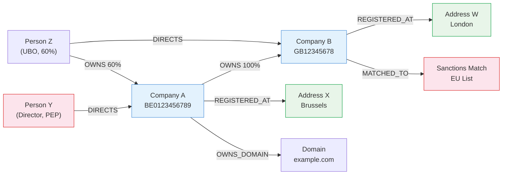
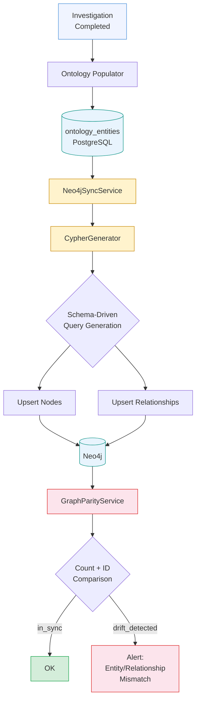

# Atlas — Graph Database & Network Analysis

Atlas uses PostgreSQL as the source of truth for all entity and relationship data. Neo4j serves as a read-optimized graph view, synchronized from PostgreSQL, that enables the complex traversal queries compliance officers need: ownership chain analysis, UBO identification, shared address/director detection, risk propagation, and geographic proximity search.

## Architecture

The graph layer spans 3,163 lines across eight modules:

| Module | Lines | Responsibility |
|---|---|---|
| `graph/neo4j_sync.py` | 1,144 | Schema-driven PostgreSQL-to-Neo4j synchronization. No hardcoded entity/relationship handlers. |
| `graph/cypher_generator.py` | 854 | Dynamic Cypher query generation from ontology schema. |
| `graph/cypher_queries.py` | 453 | Pre-defined Cypher query templates for common graph operations. |
| `graph/repository.py` | 365 | Entity repository with CRUD operations backed by the graph store. |
| `graph/parity_service.py` | 345 | PostgreSQL/Neo4j parity verification (count-based and ID-level audit). |
| `graph/projections.py` | 329 | Event projections -- builds the graph read model from domain events. |
| `graph/store.py` | 308 | RDF-backed graph store (rdflib) for ontology entity persistence. |
| `graph/sync_service.py` | 286 | Apache AGE graph sync (secondary graph backend). |
| `graph/neo4j_client.py` | 219 | Neo4j driver wrapper with health checks and singleton management. |

Atlas also has an Apache AGE sync path (`sync_service.py`, `age_client.py`) as a PostgreSQL-native graph alternative, but Neo4j is the primary graph backend for production queries.

## Schema-Driven Design (ADR-004)

The Neo4j integration follows Atlas's ADR-004 (Ontology-First Architecture). All entity and relationship syncing is driven by the ontology schema -- there are no hardcoded handlers for specific entity types. This means:

- When a new entity type is added to the YAML schema, it automatically syncs to Neo4j
- Constraints and indexes are generated from schema definitions at startup
- The `CypherGenerator` reads `neo4j_type` from each relationship definition to map schema types to Cypher relationship types
- Excluded fields (internal metadata like `provenance`, `matching_key_hash`, `version`) are configured once in `CypherGenerator.EXCLUDED_FIELDS`

## Node Types

Neo4j nodes correspond to ontology entity types. Each node carries the `:Entity` label plus its specific type label:

| Node Label | Key Properties | Source |
|---|---|---|
| `LegalEntity:Entity` | `id`, `legal_name`, `registration_number`, `jurisdiction`, `country_code`, `status`, `entity_type`, `incorporation_date`, `is_verified`, `risk_level` | CIR, ROA modules |
| `Person:Entity` | `id`, `full_name`, `first_name`, `last_name`, `date_of_birth`, `nationality`, `is_pep`, `is_sanctioned` | MEBO, SPEPWS modules |
| `Address:Entity` | `id`, `full_address`, `street_address`, `city`, `state_province`, `postal_code`, `country`, `country_code`, `address_type`, `latitude`, `longitude`, `location` (Neo4j point) | ROA module |
| `Investigation` | `id`, `company_name`, `status`, `created_at`, `completed_at` | Investigation lifecycle |
| `AdverseMedia:Entity` | `id`, `headline`, `source_url`, `source_name`, `published_date`, `sentiment`, `category`, `severity`, `summary` | AMLRR module |
| `Document:Entity` | `id`, `title`, `document_type`, `source_url`, `published_date`, `issuing_authority`, `document_number` | Document tracking |
| `Domain:Entity` | `id`, `domain_name`, `registrar`, `registration_date`, `expiry_date`, `is_active`, `ssl_valid` | DFWO module |

### Constraints and Indexes

Created at startup from the ontology schema:

```cypher
-- Uniqueness constraints
CREATE CONSTRAINT entity_id FOR (e:Entity) REQUIRE e.id IS UNIQUE;
CREATE CONSTRAINT legal_entity_id FOR (le:LegalEntity) REQUIRE le.id IS UNIQUE;
CREATE CONSTRAINT person_id FOR (p:Person) REQUIRE p.id IS UNIQUE;
CREATE CONSTRAINT address_id FOR (a:Address) REQUIRE a.id IS UNIQUE;
CREATE CONSTRAINT investigation_id FOR (i:Investigation) REQUIRE i.id IS UNIQUE;

-- Property indexes
CREATE INDEX legal_entity_name FOR (le:LegalEntity) ON (le.legal_name);
CREATE INDEX legal_entity_reg FOR (le:LegalEntity) ON (le.registration_number, le.jurisdiction);
CREATE INDEX person_name FOR (p:Person) ON (p.full_name);
CREATE INDEX address_country FOR (a:Address) ON (a.country);

-- Spatial index for geographic proximity queries
CREATE POINT INDEX address_location FOR (a:Address) ON (a.location);
```

## Relationship Types

Neo4j relationships are mapped from ontology schema `relationship_types` via the `neo4j_type` field:

| Neo4j Type | From | To | Key Properties | Schema Type |
|---|---|---|---|---|
| `OWNS` | Person, LegalEntity | LegalEntity | `percentage`, `is_ubo`, `ownership_type`, `is_current`, `start_date`, `end_date` | Ownership |
| `DIRECTS` | Person | LegalEntity | `position`, `directorship_type`, `is_current`, `appointed_date`, `resigned_date` | Directorship |
| `REGISTERED_AT` | LegalEntity | Address | `is_current`, `address_type` | RegisteredAt |
| `OPERATES_AT` | LegalEntity | Address | `is_current`, `address_type` | (Operational variant) |
| `ASSOCIATED_WITH` | Any | Any | `association_type`, `strength`, `description`, `is_current` | Association |
| `OWNS_DOMAIN` | LegalEntity | Domain | `is_primary`, `verified` | OwnsDomain |
| `MENTIONED_IN` | LegalEntity, Person | AdverseMedia | `sentiment`, `relevance` | MentionedIn |
| `DOCUMENTS` | Document | Any | `document_role` | DocumentsEntity |
| `INVESTIGATED_IN` | LegalEntity | Investigation | -- | (Internal link) |
| `TRUSTEE_OF` | Person, LegalEntity | Trust | `role`, `appointed_date`, `is_current` | Trusteeship |
| `SETTLOR_OF` | Person, LegalEntity | Trust | `contribution_date`, `retains_control` | Settlor |
| `BENEFICIARY_OF` | Person, LegalEntity | Trust | `beneficiary_type`, `vested`, `percentage` | Beneficiary |
| `PROTECTOR_OF` | Person | Trust | `appointed_date`, `powers` | Protector |
| `MATCHED_TO` | LegalEntity, Person | SanctionsMatch, PEPExposure | `match_confidence`, `screening_date` | MatchedTo |

## Example Entity Network



This example shows how graph queries discover hidden connections: Person Z manages both companies, Company A indirectly owns Company B, and Company B has a sanctions match -- propagating risk back through the ownership chain to Company A.

## Key Graph Queries

Atlas provides pre-defined Cypher queries for the most common compliance analysis patterns:

### UBO Identification

Traverses ownership chains up to 10 levels deep, calculating effective ownership percentage through each chain:

```cypher
MATCH path = (ubo:Person)-[:OWNS*1..10]->(company:LegalEntity {id: $company_id})
WHERE ALL(r IN relationships(path) WHERE r.is_current = true)
WITH ubo, path,
     reduce(pct = 100.0, r IN relationships(path) |
       pct * coalesce(r.percentage, 100) / 100) as effective_ownership
WHERE effective_ownership >= $min_percentage
RETURN ubo, effective_ownership, length(path) as chain_depth
```

### Ownership Chain

Returns the full ownership tree above a company with node details at each level:

```cypher
MATCH path = (owner)-[:OWNS*1..10]->(company:LegalEntity {id: $company_id})
WHERE ALL(r IN relationships(path) WHERE r.is_current = true)
RETURN path, nodes, relationships
ORDER BY length(path)
```

### Shared Addresses

Finds entities registered at or operating from the same address (mass registration detection):

```cypher
MATCH (e1)-[:REGISTERED_AT|OPERATES_AT]->(addr:Address)<-[:REGISTERED_AT|OPERATES_AT]-(e2)
WHERE e1 <> e2
WITH addr, collect(DISTINCT e1) + collect(DISTINCT e2) as entities
WHERE size(entities) >= $min_entities
RETURN addr, entities, size(entities) as entity_count
ORDER BY entity_count DESC
```

### Shared Directors

Identifies directors serving on multiple company boards (corporate governance red flag):

```cypher
MATCH (p:Person)-[d:DIRECTS]->(c:LegalEntity)
WHERE d.is_current = true
WITH p, collect(c) as companies
WHERE size(companies) >= $min_companies
RETURN p as director, companies, size(companies) as company_count
ORDER BY company_count DESC
```

### Entity Connections (Variable Depth)

Discovers all connected entities within N degrees of separation:

```cypher
MATCH path = (start {id: $entity_id})-[*1..N]-(connected)
WHERE start <> connected
RETURN connected, min(length(path)) as distance, relationship_types
ORDER BY distance
```

### Geographic Proximity

Uses Neo4j's spatial point index to find entities near a given address:

```cypher
MATCH (target:Address {id: $address_id})
WHERE target.location IS NOT NULL
MATCH (nearby:Address)
WHERE nearby.location IS NOT NULL
  AND point.distance(target.location, nearby.location) <= $radius_meters
MATCH (entity)-[:REGISTERED_AT|OPERATES_AT]->(nearby)
RETURN entity, nearby, distance_meters
ORDER BY distance_meters
```

### Common Connections

Finds entities that connect two specified entities (mutual relationships):

```cypher
MATCH (e1 {id: $entity1_id})-[r1]-(common)-[r2]-(e2 {id: $entity2_id})
WHERE e1 <> e2 AND e1 <> common AND e2 <> common
RETURN common, type(r1) as rel_to_e1, type(r2) as rel_to_e2
```

### High-Risk Network

Discovers PEP-connected, sanctioned, or high-risk entities within 3 degrees:

```cypher
MATCH path = (risky)-[*1..3]-(connected:LegalEntity {id: $company_id})
WHERE (risky:Person AND (risky.is_pep = true OR risky.is_sanctioned = true))
   OR (risky:LegalEntity AND risky.risk_level IN ['high', 'critical'])
RETURN risky as risk_source, length(path) as distance, path_names
ORDER BY distance
```

## Sync Pipeline



### Sync Modes

The `Neo4jSyncService` (1,144 lines) supports:

- **Full sync**: Syncs all entities and relationships from PostgreSQL to Neo4j. Initializes schema constraints/indexes first.
- **Investigation sync**: Syncs only entities belonging to a specific investigation.
- **Company sync**: Syncs all entities for a specific company.
- **Incremental sync**: Based on `updated_at` timestamps (entities modified since last sync).
- **Clean-all**: Drops all Neo4j data and performs a fresh full sync.

### Parity Verification

The `GraphParityService` (345 lines) verifies synchronization integrity:

| Check | Method | Speed |
|---|---|---|
| Count-based | Compare entity/relationship counts between PostgreSQL and Neo4j | Fast |
| ID-level audit | Compare individual entity IDs to find missing/orphan records | Thorough |
| Per-type parity | Break down counts by entity type | Diagnostic |

Parity results include:
- `status`: `in_sync`, `minor_drift`, `drift_detected`, or `error`
- `entity_diff` and `relationship_diff` with percentage calculations
- `missing_in_neo4j`: Entity IDs present in PostgreSQL but absent from Neo4j
- `orphans_in_neo4j`: Entity IDs present in Neo4j but absent from PostgreSQL

## Event Projections

The `EventProjector` (329 lines) builds the graph read model from domain events:

| Event | Handler | Graph Action |
|---|---|---|
| `entity.discovered` | `_handle_entity_discovered` | Create node |
| `entity.linked` | `_handle_entity_linked` | Create relationship |
| `entity.updated` | `_handle_entity_updated` | Update node properties |
| `finding.recorded` | `_handle_finding_recorded` | Add finding node |
| `risk.assessed` | `_handle_risk_assessed` | Update risk properties |
| `investigation.created` | `_handle_investigation_created` | Create investigation node |
| `investigation.completed` | `_handle_investigation_completed` | Update investigation status |

## Frontend Visualization

Atlas uses **Cytoscape.js** (`cytoscape@^3.28.0`) with `react-cytoscapejs` for browser-based graph rendering. Three layout engines are available:

| Layout | Package | Best For |
|---|---|---|
| **dagre** | `cytoscape-dagre@^2.5.0` | Hierarchical trees (ownership chains, org charts). Directed acyclic graphs with clear parent-child relationships. |
| **fcose** | `cytoscape-fcose@^2.2.0` | Force-directed layout. General-purpose network visualization where spatial clustering reveals community structure. |
| **cose-bilkent** | `cytoscape-cose-bilkent@^4.1.0` | Compound node layout. Handles grouped/nested subgraphs (e.g., entities within jurisdictions). |

The `CytoscapeGraph` component provides: pan/zoom, node selection, layout switching, custom stylesheets per entity type (colors from ontology schema), and event handling for click/hover interactions.

## API Endpoints

Atlas exposes graph operations via the `/graph` router (1,488 lines, no explicit prefix -- mounted at app level):

### Apache AGE Endpoints

| Method | Path | Description |
|---|---|---|
| `GET` | `/companies` | List companies with graph data |
| `GET` | `/schema/entity-types` | Get entity type schema definitions |
| `GET` | `/visualization/{entity_id}` | Get visualization data for an entity |
| `GET` | `/ownership-chain/{entity_id}` | Get ownership chain for an entity |
| `GET` | `/path/{source_id}/{target_id}` | Find path between two entities |
| `GET` | `/common-connections/{entity1_id}/{entity2_id}` | Find common connections |
| `GET` | `/analytics/centrality` | Graph centrality metrics |
| `GET` | `/sync/status` | Get sync status |
| `POST` | `/sync/full` | Trigger full graph sync |
| `POST` | `/sync/investigation/{investigation_id}` | Sync specific investigation |

### Neo4j Endpoints

| Method | Path | Description |
|---|---|---|
| `GET` | `/neo4j/health` | Neo4j connectivity health check |
| `POST` | `/neo4j/sync` | Trigger full Neo4j sync |
| `POST` | `/neo4j/sync/investigation/{investigation_id}` | Sync specific investigation |
| `POST` | `/neo4j/sync/company/{company_id}` | Sync specific company |
| `POST` | `/neo4j/sync/clean-all` | Drop all and re-sync |
| `GET` | `/neo4j/entity/{entity_id}/ubos` | Find UBOs for an entity |
| `GET` | `/neo4j/entity/{entity_id}/ownership-chain` | Get ownership chain |
| `GET` | `/neo4j/entity/{entity_id}/connections` | Get connected entities |
| `GET` | `/neo4j/entity/{entity_id}/full` | Get entity with all relationships |
| `GET` | `/neo4j/entity/{entity_id}/risk-network` | Get high-risk connections |
| `GET` | `/neo4j/shared-addresses` | Find shared addresses |
| `GET` | `/neo4j/shared-directors` | Find shared directors |
| `GET` | `/neo4j/proximity/{address_id}` | Geographic proximity search |
| `GET` | `/neo4j/common-connections` | Find common connections |
| `GET` | `/neo4j/company/{entity_id}/stats` | Company graph statistics |

### Parity & Sync Management

| Method | Path | Description |
|---|---|---|
| `GET` | `/parity` | Check overall parity |
| `GET` | `/parity/by-type` | Parity breakdown by entity type |
| `GET` | `/investigations/{id}/graph/parity` | Investigation-level parity |
| `POST` | `/graph/sync/{investigation_id}` | Sync investigation graph data |
| `GET` | `/sync/candidates` | Get entities needing sync |

## How Trust Relay Differs

Trust Relay built its graph layer independently, sharing some patterns but diverging significantly in scope:

| Aspect | Atlas | Trust Relay |
|---|---|---|
| Graph backend | Neo4j (primary) + Apache AGE (secondary) | Neo4j only |
| Sync service | 1,144 lines, schema-driven (ADR-004) | 20-step ETL pipeline |
| Graph methods | ~20 Cypher queries | 79 graph service methods |
| API surface | ~30 endpoints (AGE + Neo4j + parity) | 36 graph endpoints |
| Query generation | Schema-driven CypherGenerator (854 lines) | Direct Cypher queries |
| Parity checking | Dedicated ParityService with count + ID audit | Not implemented separately |
| Event projections | EventProjector builds graph from domain events | Direct sync after investigation |
| Frontend | Cytoscape.js (dagre, fcose, cose-bilkent) | ReactFlow-based Network Intelligence Hub |
| Visualization views | Single graph view with layout switching | Three perspectives: Network Graph, Ownership Tree, Investigation Flow |
| Frontend components | ~5 Cytoscape components | 22 React components |
| Spatial queries | Neo4j point index + geographic proximity | Not implemented |
| RDF layer | rdflib-based OntologyGraphStore with SPARQL | Not implemented |
