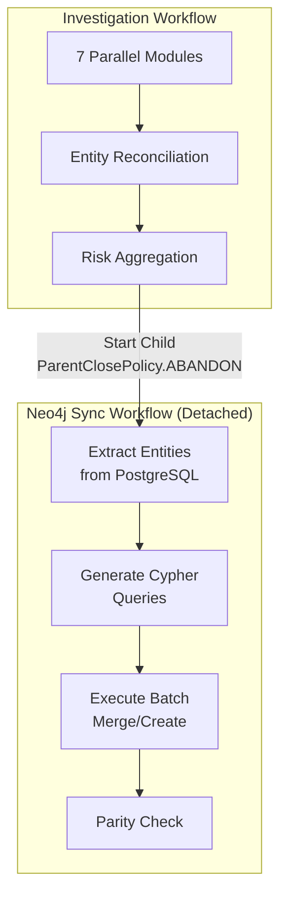

# Atlas — Knowledge Graph

Atlas uses **Neo4j 5.18 Community** as its knowledge graph database. PostgreSQL is the source of truth for all entity and relationship data; Neo4j serves as a read-optimized graph view that powers complex traversal queries: ownership chain analysis, UBO identification, shared address/director detection, risk network propagation, path finding, and centrality analytics.

## Architecture

The graph layer spans multiple backend modules:

| Module | Location | Responsibility |
|--------|----------|----------------|
| `neo4j_client.py` | `src/graph/` | Neo4j async driver wrapper |
| `neo4j_sync.py` | `src/graph/` | Schema-driven sync service (PostgreSQL → Neo4j) |
| `cypher_generator.py` | `src/graph/` | Dynamic Cypher query generation |
| `cypher_queries.py` | `src/graph/` | Static Cypher query templates |
| `sync_service.py` | `src/graph/` | Sync orchestration |
| `repository.py` | `src/graph/` | Graph data repository |
| `store.py` | `src/graph/` | OntologyGraphStore |
| `age_client.py` | `src/graph/` | Apache AGE (PostgreSQL graph extension) for PG-only deployments |
| `projections.py` | `src/graph/` | Graph projections |
| `parity_service.py` | `src/graph/` | PostgreSQL/Neo4j parity verification |
| `graph_router.py` | `src/api/` | ~35 REST endpoints for graph operations |

Apache AGE is available as a secondary graph engine for PostgreSQL-only deployments that cannot run Neo4j.

## Schema-Driven Sync

The Neo4j integration does not use hardcoded entity handlers. Node types, relationship types, constraints, and indexes are derived from the ontology schema. The sync service generates Cypher queries dynamically from the entity model.

### Entity Types

Atlas syncs the following node types to Neo4j, derived from the ontology schema (v3.3):

| Node Type | Source | Key Properties |
|-----------|--------|----------------|
| `LegalEntity` | Ontology entities | legal_name, registration_number, jurisdiction, status, is_sanctioned |
| `Person` | Ontology entities | full_name, nationality, is_pep, pep_position, is_sanctioned |
| `Address` | Ontology entities | street_address, city, country, postal_code, is_verified |
| `Trust` | Ontology entities | trust_type, settlor, trustee, beneficiary |
| `Document` | Ontology entities | document_type, filing_date, issuing_authority |
| `AdverseMedia` | Ontology entities | - |
| `Domain` | Ontology entities | - |
| `SanctionsMatch` | Ontology entities | - |
| `PEPExposure` | Ontology entities | - |
| `Investigation` | Investigations table | investigation_id, company_name, status, risk_level |
| `Company` | Companies table | company_id, name, country, status |

### Relationship Types

| Relationship | From → To | Properties |
|-------------|-----------|------------|
| `OWNS` | Person/LegalEntity → LegalEntity | ownership_percentage, share_type |
| `DIRECTS` | Person → LegalEntity | role, appointment_date |
| `REGISTERED_AT` | LegalEntity → Address | registration_date |
| `OPERATES_AT` | LegalEntity → Address | - |
| `ASSOCIATED_WITH` | Entity → Entity | relationship_type |
| `RELATED_TO` | Entity → Entity | - |
| `FILED_BY` | Document → LegalEntity | filing_date |
| `INVESTIGATED` | Investigation → Company | started_at, risk_level |

## Sync Architecture

Graph sync runs as a **detached child workflow** in Temporal, ensuring the sync survives even if the parent investigation workflow completes or is terminated:

### Sync Modes

| Mode | Trigger | Scope |
|------|---------|-------|
| **Investigation sync** | After investigation completes | Single investigation's entities |
| **Company sync** | Manual or on company update | All entities for one company |
| **Full sync** | Manual admin action | Complete PostgreSQL → Neo4j resync |
| **Clean all** | Admin action | Wipe Neo4j and resync from scratch |

### Retry Queue

Failed sync operations are persisted to a `sync_retry_queue` table in PostgreSQL. A background process retries failed syncs with exponential backoff, ensuring eventual consistency between PostgreSQL and Neo4j.

## Parity Verification

The `parity_service.py` module verifies consistency between PostgreSQL (source of truth) and Neo4j (derived view):

| Check Level | What It Verifies |
|------------|------------------|
| **Count parity** | Entity counts match between PG and Neo4j per type |
| **Relationship parity** | Relationship counts match per type |
| **Property parity** | Key properties (name, registration number) match for sampled entities |

Drift is classified by severity to help operators prioritize fixes.

## Graph Visualization

Atlas uses **Cytoscape.js 3.28** for all graph visualization, with three layout plugins for different use cases:

| Layout | Plugin | Best For |
|--------|--------|----------|
| **Hierarchical** | cytoscape-dagre | Ownership chains, directed acyclic graphs |
| **Force-directed** | cytoscape-fcose | General entity networks, risk graphs |
| **Compound** | cytoscape-cose-bilkent | Shared director/address clustering |

Additional layout modes: radial, breadthfirst, concentric.

### Six View Modes

The Graph Explorer page provides six specialized views, each backed by a dedicated API endpoint:

| View | Purpose | Key Feature |
|------|---------|-------------|
| **Entity Network** | All connections for a selected entity | Full relationship graph |
| **Ownership Chain** | Trace ownership hierarchy up/down | Directed tree layout |
| **UBO Analysis** | Ultimate beneficial owners (≥25%) | Ownership threshold filtering |
| **Risk Network** | PEPs and sanctioned entities within 3 hops | Risk propagation visualization |
| **Shared Directors** | Directors serving at multiple companies | Cross-company link detection |
| **Shared Addresses** | Entities registered at same location | Geographic co-location detection |

### Interactive Features

- **Click**: Select node, show detail in side panel (300px)
- **Double-click**: Expand node — loads connected entities via API
- **Right-click**: Context menu with entity actions
- **Background click**: Deselect all
- **Undo/Redo**: 20-entry history stack (managed by Zustand `useGraphStore`)
- **Export**: PNG at 2x scale, JSON graph data
- **Sync to Neo4j**: Button to trigger graph sync from explorer

### Node Styling

Nodes are colored by entity type, configured in `src/config/ontologyConfig.ts`. PEP and sanctioned entities receive special CSS classes for visual prominence. Selected nodes highlight in `#48AFF0`. The dark theme uses `#1e2732` as background color.

Hidden connections show a badge count on unexpanded nodes, indicating how many relationships exist beyond the current view.

## Graph API Endpoints

The graph router exposes ~35 endpoints organized by function:

### Visualization

| Method | Path | Purpose |
|--------|------|---------|
| GET | `/graph/company/{id}` | Company entity graph |
| GET | `/graph/schema/entity-types` | Available entity types |
| GET | `/graph/visualization/{entity_id}` | Entity network visualization |
| GET | `/graph/ownership-chain/{entity_id}` | Ownership hierarchy |

### Analytics

| Method | Path | Purpose |
|--------|------|---------|
| GET | `/graph/path/{from_id}/{to_id}` | Shortest path between entities |
| GET | `/graph/common-connections/{id1}/{id2}` | Shared connections |
| GET | `/graph/centrality/{entity_id}` | Node centrality metrics |
| GET | `/graph/stats` | Graph statistics |

### Neo4j Operations

| Method | Path | Purpose |
|--------|------|---------|
| POST | `/graph/sync/full` | Full PostgreSQL → Neo4j sync |
| POST | `/graph/sync/investigation/{id}` | Single investigation sync |
| POST | `/graph/sync/company/{id}` | Single company sync |
| DELETE | `/graph/sync/clean-all` | Wipe and resync |
| GET | `/graph/health` | Neo4j connection health |

### Entity CRUD

| Method | Path | Purpose |
|--------|------|---------|
| GET | `/graph/ubos/{company_id}` | Ultimate beneficial owners |
| GET | `/graph/ownership-chain/{company_id}` | Company ownership chain |
| GET | `/graph/connections/{entity_id}` | Entity connections |
| GET | `/graph/full-entity/{entity_id}` | Full entity with relationships |
| GET | `/graph/risk-network/{company_id}` | Risk-flagged entities |
| GET | `/graph/shared-addresses/{entity_id}` | Co-located entities |
| GET | `/graph/shared-directors/{company_id}` | Cross-company directors |
| GET | `/graph/proximity/{entity_id}` | Geographic proximity |

### Maintenance

| Method | Path | Purpose |
|--------|------|---------|
| GET | `/graph/parity` | PostgreSQL/Neo4j parity check |
| GET | `/graph/retry-queue` | Pending sync retries |
| POST | `/graph/cleanup/{investigation_id}` | Remove investigation from graph |
