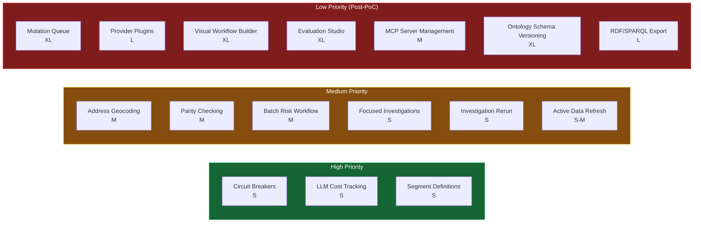

# Atlas — Import Candidates

After a comprehensive audit of both codebases (April 2026), this page catalogs every Atlas feature that Trust Relay does not yet have and could benefit from adopting. Each is assessed for complexity, architectural alignment, and priority.

Trust Relay already adopted 8 patterns from Atlas in March 2026 (see [Atlas Adoption](/docs/architecture/atlas-adoption)). This page covers the **remaining** importable features.

---

## Priority Summary

| Feature | Size | Priority | Why |
|---------|------|----------|-----|
| Circuit Breakers | S | **High** | Prevents cascading failures during demos; immediate resilience |
| LLM Cost Tracking API | S | **High** | Per-case cost visibility; supports ADR-0029 cost optimization |
| Segment Definitions | S | **High** | Regulatory framing per service type; supports DigiTeal use case |
| Address Geocoding | M | **Medium** | GPS-based address deduplication; improves investigation quality |
| Parity Checking | M | **Medium** | PostgreSQL/Neo4j sync verification; catches graph drift |
| Batch Risk Workflow | M | **Medium** | Portfolio re-evaluation when risk config changes |
| Focused Investigations | S | **Medium** | Re-run specific modules only; reduces cost and time |
| Investigation Rerun | S | **Medium** | Re-investigate company from existing case parameters |
| Active Data Refresh | S-M | **Medium** | Background refresh when company data is stale |
| Mutation Queue | XL | **Low** | Formal audit trail for entity data changes; post-Pillar 6 |
| Provider Plugin Architecture | L | **Low** | Formalized data source integration; supports country expansion |
| Visual Workflow Builder | XL | **Low** | Drag-drop workflow authoring; complete frontend rewrite needed |
| Evaluation Studio | XL | **Low** | Portfolio risk evaluation UI; depends on ontology schema system |
| MCP Server Management | M | **Low** | Database-backed MCP server configuration |
| Ontology Schema Versioning | XL | **Low** | Configurable entity schemas; fundamentally different approach |
| RDF/SPARQL Export | L | **Low** | W3C-standard data exchange; interoperability with external systems |

---

## High Priority — Import Now

### 1. Circuit Breakers

**What Atlas has:** Per-server circuit breakers (PyBreaker) preventing cascading failures when external services go down. Configuration: `fail_max=5`, `reset_timeout=30s`, excludes 4xx from failure count. Combined with exponential backoff retry (tenacity: 3 retries, 1s base, 2x multiplier, 60s cap).

**Atlas files:**
- `src/tools/circuit_registry.py` — global circuit breaker registry
- `src/tools/resilient_mcp.py` — ResilientMCPClient combining circuit breaker + retry + structured error

**What Trust Relay has:** No circuit breakers. OSINT agent failures are handled with try/except per source.

**Why import:** During demos, a single external service timeout (NorthData, OpenSanctions) can cascade and slow the entire investigation. Circuit breakers fail-fast after 5 failures and auto-recover after 30 seconds.

**Implementation:** `pip install pybreaker`, port `circuit_registry.py`, wrap existing OSINT HTTP calls. ~2 hours.

---

### 2. LLM Cost Tracking API

**What Atlas has:** Queries Langfuse Metrics API to aggregate per-investigation costs, token usage (input/output/total), and trace counts. Uses `investigation_id` as Langfuse `session_id`.

**Atlas files:**
- `src/observability/metrics_service.py` — LangfuseMetricsService
- `src/api/metrics_router.py` — cost endpoints

**What Trust Relay has:** Langfuse + OpenTelemetry integration sends traces, but no API to query per-case costs. ToolInvocation table tracks `cost_eur` and `tokens_used` per tool call, but no aggregation endpoint.

**Why import:** Enables "this investigation cost EUR 0.42" in the dashboard. Critical for demonstrating cost-effectiveness of tiered model assignments (ADR-0029). Directly supports VLAIO WP4 validation.

**Implementation:** Add metrics query service + 1 API router. No database changes (reads from Langfuse API or aggregates from ToolInvocation table). ~2 hours.

---

### 3. Segment Definitions

**What Atlas has:** Configurable investigation segments (e.g., "PSP", "fiscal_representative") that determine regulatory framework, screening priorities, address requirements, and decision framing per company type. Database-backed with activate/deactivate lifecycle and context table generation for agent prompts.

**Atlas files:**
- `src/database/segments_repository.py` — full CRUD + prompt context generation
- Settings router integration

**What Trust Relay has:** Workflow templates have `service_selected` concept but no formal regulatory framing per segment.

**Why import:** Directly enables Cedric Neve's feedback (DigiTeal): investigation scope should differ by service type. A PSP merchant onboarding needs different scrutiny than a regulated financial institution.

**Implementation:** One new table (`segments`), one repository, settings API endpoints. ~3 hours.

---

## Medium Priority — Import After Demos

### 4. Address Geocoding & Reconciliation

**What Atlas has:** Geocodes company addresses via Google Maps MCP with OpenStreetMap Nominatim fallback. Haversine distance calculation for proximity clustering. GPS-based address deduplication (merge duplicates within 500m per company). Romanian address simplification logic.

**Atlas files:**
- `src/services/geocoding.py` — GeocodingService
- `src/ontology/address_reconciler.py` — AddressReconciler with proximity clustering

**What Trust Relay has:** Textual address handling in graph ETL but no GPS coordinates or proximity deduplication.

**Why import:** Detects when two "different" addresses are actually the same building (different formatting). Adds a verification dimension: is the registered address a real office or a virtual mailbox? Important for shell company detection.

**Implementation:** Port GeocodingService, add geocoding step to graph ETL pipeline. Requires Google Maps API key or Nominatim reliance. ~4-6 hours.

---

### 5. Parity Checking (PostgreSQL vs Neo4j)

**What Atlas has:** Three-level sync validation: count-based (fast), ID-level audit (thorough), and type-breakdown comparison. Reports "in_sync", "minor_drift", or "drift_detected". Identifies sync candidates where `updated_at > neo4j_synced_at`.

**Atlas files:**
- `src/graph/parity_service.py` — GraphParityService

**What Trust Relay has:** Graph ETL syncs to Neo4j but no verification mechanism to detect drift.

**Why import:** During demos, graph drift causes confusing UI where dashboard and Network Intelligence Hub show different data. Parity checking catches this proactively.

**Implementation:** Adapt to Trust Relay's schema (cases/investigations/persons vs Neo4j labels). Add `neo4j_synced_at` tracking column. ~4-6 hours.

---

### 6. Batch Risk Workflow

**What Atlas has:** Temporal workflow for portfolio-wide risk re-evaluation. Iterates over company list, evaluates risk matrix per company, exposes progress via Temporal query, supports cancellation, handles partial failures.

**Atlas files:**
- `src/risk_matrix/batch_workflow.py` — BatchReEvaluationWorkflow
- `src/risk_matrix/activities.py` — evaluation activities

**What Trust Relay has:** EBA risk matrix + portfolio service but no batch re-evaluation workflow.

**Why import:** When risk config changes (e.g., new FATF grey list country), all companies need re-scoring. Currently requires manual per-case re-evaluation. Supports demo scenario: "change risk weight, see portfolio impact."

**Implementation:** New Temporal workflow + activity wrapping existing EBA risk matrix. ~4-6 hours.

---

### 7. Focused Investigations

**What Atlas has:** `POST /investigations/focused` — run a single module instead of the full 7-module pipeline.

**What Trust Relay has:** Always runs the full pipeline. No partial execution.

**Why import:** When only sanctions status needs refresh, re-running 15 agents is wasteful. Focused re-investigation reduces cost and time by ~85%.

**Implementation:** New API endpoint + workflow parameter for `selected_modules`. ~2-3 hours.

---

### 8. Investigation Rerun

**What Atlas has:** `POST /investigations/{id}/rerun` — creates new investigation from existing parameters, links via `rerun_of` metadata.

**What Trust Relay has:** Follow-up loops (officer decision → loop back) but not "re-investigate from scratch."

**Why import:** Supports "6 months later, re-investigate this company" use case. Preserves original case for audit trail while starting fresh.

**Implementation:** New API endpoint, clone case parameters, start new workflow. ~2 hours.

---

### 9. Active Data Refresh

**What Atlas has:** When company data is viewed, checks freshness against configurable threshold (default 30 days). If stale, triggers async background refresh from relevant provider, reconciles new data, syncs to Neo4j.

**Atlas files:**
- `src/integrations/stale_check.py` — StaleCheckService

**What Trust Relay has:** `source_ttl.py` with per-source TTL and `is_source_fresh()` — passive checking only, no active refresh trigger.

**Why import:** Extends existing TTL foundation with active refresh. When an officer revisits a case, stale data auto-refreshes in the background.

**Implementation:** Add background refresh trigger to existing `source_ttl.py`. ~3-4 hours.

---

## Low Priority — Post-PoC Roadmap

### 10. Mutation Queue

**What Atlas has:** Full async entity consolidation pipeline (12 components): evidence mapping, merge strategy execution, conflict detection with three responses (accept_trusted / flag_review / freeze_investigate), investigation triggering on frozen fields, field-level provenance tracking.

**Atlas files:** `src/mutation_queue/` — 10 files

**Why defer:** Trust Relay already has survivorship + entity matching. The mutation queue adds formal audit trail but requires 4+ new tables and deep integration. Better suited for post-Pillar 6 when multi-tenant data governance is needed. Effort: XL (20+ hours).

### 11. Data Provider Plugin Architecture

**What Atlas has:** Abstract DataProvider base class with PluginManifest (semver, rate limits, credentials), ProviderRouter (country-based routing with authority tiers), and trust-weighted multi-provider merge.

**Atlas files:** `src/integrations/` — base.py, plugin_manifest.py, provider_router.py

**Why defer:** Trust Relay's ad-hoc services work for PoC. The plugin pattern becomes valuable when adding the remaining European countries (IT, ES, PT, SE, IS). Effort: L (12+ hours refactoring existing services).

### 12. Visual Workflow Builder

**What Atlas has:** Three-panel drag-and-drop workflow authoring with phase-specific editors, live preview, and YAML editor. 12+ Blueprint.js components.

**Why defer:** Complete frontend rewrite needed (Blueprint.js → shadcn/ui). Trust Relay's current template editor works for compliance officers. Visual builder is a UX upgrade, not a compliance requirement. Effort: XL (20+ hours).

### 13. Evaluation Studio

**What Atlas has:** Portfolio-level risk evaluation UI with 15 components: matrix selector, entity subset picker, score histogram, comparison table, migration matrix, dimension breakdown.

**Why defer:** Deeply coupled to Atlas's ontology schema versioning system. Trust Relay has risk spider chart + EBA risk matrix but not portfolio-level evaluation UI. Effort: XL (20+ hours).

### 14. MCP Server Management

**What Atlas has:** Database-backed MCP server configuration with health checks, timeout/retry settings, and Settings UI.

**Why defer:** Trust Relay's hardcoded MCP configuration works for PoC. Dynamic management is a production concern when adding/removing data sources frequently. Effort: M (6-8 hours).

### 15. Ontology Schema Versioning

**What Atlas has:** Complete schema lifecycle: schema lines, versions (draft/published/archived), field-level merge strategies, source contracts, fork/inherit, composition.

**Why defer:** Fundamentally different approach from Trust Relay's fixed ontology. This is Atlas's core architectural differentiator — the configurable entity schema system. Would require rethinking how Trust Relay handles entity definitions. Effort: XL (40+ hours).

### 16. RDF/SPARQL Export

**What Atlas has:** Full RDF serialization (Turtle, N-Triples, JSON-LD, RDF/XML) with 7 SPARQL query templates for ownership chains, UBO identification, risk propagation.

**Why defer:** SPARQL runs against in-memory rdflib graph, not Neo4j. Trust Relay uses Cypher natively. JSON-LD export becomes valuable when integrating with other compliance systems, but that's a production concern. Effort: L (10+ hours).

---

## Recommended Import Strategy

### For Czech Bank Demos (~April 16)

Import the 3 high-priority features in this order:

1. **Circuit Breakers** (2 hours) — immediate resilience, zero risk
2. **LLM Cost Tracking** (2 hours) — "this investigation cost EUR 0.42" in dashboard
3. **Segments** (3 hours) — if time permits, adds service-type framing

### Post-Demo Sprint

4. **Focused Investigations** + **Investigation Rerun** (4 hours combined)
5. **Address Geocoding** (6 hours)
6. **Parity Checking** (6 hours)
7. **Batch Risk Workflow** (6 hours)
8. **Active Data Refresh** (4 hours)

### Production Roadmap

9. Data Provider Plugin Architecture
10. Mutation Queue
11. MCP Server Management
12. Visual Workflow Builder
13. Evaluation Studio
14. RDF/SPARQL Export
15. Ontology Schema Versioning
